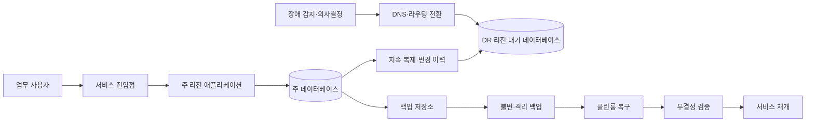
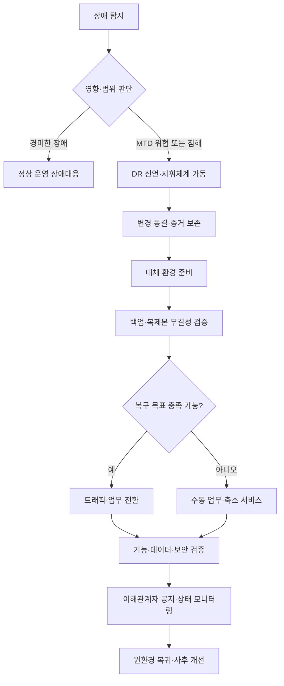

# RPO·RTO·MTTR 기반 재해복구(Disaster Recovery) 전략

## 1. 개요

> 재해복구(Disaster Recovery, DR)는 자연재해·장애·사이버 공격·인적 오류 등으로 정보시스템이 중단되거나 데이터가 훼손되었을 때, 사전에 정한 시간과 데이터 손실 한도 안에서 핵심 업무와 서비스를 복원하는 관리적·기술적 체계이다.

현대 기업의 업무는 애플리케이션, 데이터베이스, 네트워크, 인증, 외부 API, 클라우드 제어영역이 연결된 상태에서 수행된다.
따라서 하나의 서버를 다시 켜는 것만으로는 주문·결제·재고·고객지원 같은 업무가 정상화되지 않는다.
복구 대상에는 데이터의 최신성, 의존 서비스, 운영 인력, 절차와 의사결정 권한까지 포함된다.

재해는 지진이나 화재처럼 물리적인 사건만을 뜻하지 않는다.
스토리지 오작동, 잘못된 배포, 관리자 실수, 랜섬웨어, 리전 장애, 인증서 만료, 대규모 트래픽 폭증도 업무 관점에서는 재해가 될 수 있다.
특히 랜섬웨어는 운영 데이터와 온라인 백업을 동시에 암호화할 수 있으므로, 단순한 복제만으로는 안전한 복구를 보장하지 못한다.

재해복구의 목적은 “장애가 절대로 발생하지 않게 하는 것”이 아니다.
장애를 전제로 예방·탐지·대응·복구·학습을 반복하여, 허용 가능한 서비스 중단과 데이터 손실 안에서 업무를 지속하는 것이 목적이다.
고가용성(HA)은 장애 중에도 서비스를 계속 제공하는 능력에 가깝고, DR은 심각한 장애 뒤 대체 환경에서 업무를 재개하는 능력에 가깝다.
두 체계는 상호 보완하지만 동일한 개념으로 취급해서는 안 된다.

기술사 답안에서는 백업 종류를 나열하는 것보다 업무 요구사항을 복구 목표로 변환하는 논리를 먼저 제시해야 한다.
업무영향분석(Business Impact Analysis, BIA)으로 핵심 업무와 의존성을 식별하고, MTD·RTO·RPO를 정한 뒤, 비용과 복잡도에 맞는 복구 방식을 선택하는 순서가 설득력 있다.
마지막으로 복구훈련과 지표 검증을 통해 계획이 실제로 작동하는지 확인해야 한다.

### 가. 등장 배경과 필요성

첫째, 디지털 서비스 중단의 사업 손실이 커졌다.
온라인 주문이 한 시간 멈추면 매출 기회만 줄어드는 것이 아니라 결제 재처리, 고객 보상, 재고 불일치, 평판 저하가 연쇄적으로 발생한다.
금융·의료·공공 업무에서는 서비스 중단이 안전과 법적 의무의 문제로 확대될 수 있다.

둘째, 데이터는 시스템보다 복구가 어렵다.
새 서버를 준비하는 시간보다 최근 거래의 정합성을 확인하고, 중복 거래를 제거하며, 외부 기관과 상태를 맞추는 시간이 더 오래 걸릴 수 있다.
따라서 복구 목표는 서버 가동시간만이 아니라 어느 시점의 데이터를 되살릴 것인지까지 명시해야 한다.

셋째, 클라우드가 자동으로 DR을 완성해 주지는 않는다.
여러 가용영역에 배치해도 잘못된 권한·애플리케이션 버그·논리적 삭제는 동시에 전파될 수 있다.
다른 리전에 복제해도 복제 지연, DNS 전환, 키 관리, 외부 의존성, 운영자 권한을 별도로 설계해야 한다.

## 2. 업무 목표와 핵심 지표

재해복구 설계는 기술팀이 임의로 숫자를 정하는 방식으로 시작하면 안 된다.
업무 소유자와 함께 장애가 지속될 때의 영향과 허용 한계를 합의하고, 그 결과를 서비스 수준과 복구 절차로 번역해야 한다.
같은 조직 안에서도 결제 승인과 사내 게시판은 중단 허용시간이 다르므로, 업무별 목표를 하나의 값으로 뭉뚱그리면 과투자 또는 과소투자가 발생한다.

### 가. BIA와 업무 우선순위

BIA는 업무 프로세스가 중단되었을 때 재무·법규·고객·운영에 미치는 영향을 시간의 흐름에 따라 분석하는 활동이다.
분석자는 업무 기능, 담당 부서, 입력·출력 데이터, 상호 의존 시스템, 최소 운영수준, 수동 대체 가능성, 최대 허용 중단시간을 조사한다.
여기서 중요한 점은 시스템 목록이 아니라 업무 흐름을 기준으로 우선순위를 정하는 것이다.

예를 들어 쇼핑몰의 상품 추천은 일시적으로 없어도 주문 자체는 가능하지만, 결제 승인과 주문 원장 없이는 매출 처리와 배송이 진행되지 않는다.
따라서 추천 서비스와 주문 원장은 서로 다른 복구 등급을 가질 수 있다.
BIA 결과는 업무를 Tier 0·1·2처럼 분류하고, 각 등급에 필요한 복구 절차·인력·예산을 연결한다.

BIA에는 정량 영향과 정성 영향을 함께 기록한다.
정량 항목은 분당 매출, 미처리 거래 건수, SLA 위약금, 복구 비용 등이 될 수 있다.
정성 항목은 안전 위험, 개인정보 노출, 규제 위반, 신뢰도 하락처럼 금액만으로 표현하기 어려운 영향이다.
정량화가 어렵다는 이유로 정성 영향을 제외하면 핵심 공공·금융 업무의 우선순위가 왜곡된다.

### 나. MTD·RTO·RPO·MTTR의 관계

MTD(Maximum Tolerable Downtime)는 업무가 감내할 수 있는 최대 중단시간이다.
MTD를 넘으면 생존 가능한 대체 운영도 불가능하거나 손실이 비가역적으로 커진다고 판단한다.
RTO(Recovery Time Objective)는 장애 발생부터 서비스의 합의된 수준을 회복할 때까지의 목표시간이며, 일반적으로 RTO는 MTD보다 짧아야 한다.

RPO(Recovery Point Objective)는 복구 시점이 장애 발생 시점에서 얼마나 과거로 돌아가도 되는지를 나타내는 데이터 손실 허용량이다.
RPO가 15분이면 최악의 경우 최근 15분 동안 확정된 데이터가 유실될 수 있다는 뜻이다.
RPO는 단순 백업 주기와 같지 않으며, 백업 완료·전송·검증·복원 가능한 상태까지 포함해 측정해야 한다.

MTTR(Mean Time To Repair/Recover)은 실제 장애를 복구하는 평균시간을 나타내는 운영 지표다.
RTO가 목표라면 MTTR은 반복 장애에서 관찰되는 실적이며, MTTR이 RTO보다 계속 길면 설계·자동화·훈련이 목표를 충족하지 못한다는 의미다.
MTBF(Mean Time Between Failures)는 장애 사이의 평균시간으로, 복구뿐 아니라 예방 투자와 신뢰성 추세를 해석하는 데 사용한다.

| 지표 | 질문 | 설계·운영에서의 의미 |
|---|---|---|
| MTD | 업무가 최대 얼마 동안 멈출 수 있는가? | 업무 생존 한계와 최상위 제약 |
| RTO | 얼마 안에 어느 수준으로 서비스를 회복할 것인가? | 대체 환경·인력·절차·자동화 용량 |
| RPO | 데이터는 어느 시점까지 보존해야 하는가? | 백업·복제 주기와 정합성 설계 |
| MTTR | 실제 복구에는 평균 얼마가 걸리는가? | 운영 성숙도와 개선 추세 |
| MTBF | 장애 사이의 평균 간격은 얼마인가? | 예방·품질·신뢰성 투자 판단 |

RTO와 RPO는 서로 독립적인 축이다.
빠르게 서버를 켜도 데이터가 하루 전 상태라면 RPO를 만족하지 못할 수 있고, 최신 백업이 있어도 복원 절차가 수 시간 걸리면 RTO를 만족하지 못한다.
예를 들어 결제 원장은 RPO를 수 분 이내로 요구하면서 RTO도 수십 분 이내로 요구할 수 있지만, 분석용 데이터 마트는 수 시간의 RPO와 하루의 RTO를 허용할 수 있다.

### 다. 복구 목표의 등급화

모든 시스템에 무중단과 무손실을 적용하는 것은 현실적이지 않다.
목표가 엄격해질수록 이중화 설비, 전용 네트워크, 동기 복제, 상시 대기 인력, 정기 훈련 비용이 증가한다.
그러므로 업무 중요도·데이터 변경량·법적 요구·복구 비용을 함께 평가해 서비스 등급을 만든다.

| 등급 예시 | 업무 특성 | RTO 예시 | RPO 예시 | 적합한 방식 |
|---|---|---:|---:|---|
| Tier 0 | 생명·결제·핵심 제어 | 수분 이내 | 수초~수분 | 상시 대기, 다중화, 자동 전환 |
| Tier 1 | 고객 핵심 업무 | 수십 분~수시간 | 수분~수십 분 | 웜 대기, 지속 복제, 자동화 |
| Tier 2 | 내부·분석 업무 | 수시간~하루 | 수시간~하루 | 정기 백업, 수동 복구 |
| Tier 3 | 기록·참고 업무 | 수일 | 하루 이상 | 장기 보관 백업, 절차 중심 |

등급표의 숫자는 조직마다 달라지므로 절대 기준으로 제시하지 않는다.
중요한 것은 각 목표의 근거와 검증 방법을 함께 기록하는 것이다.
“RTO 1시간”이라고 정했다면 대체 리소스가 실제로 1시간 안에 준비되는지, DNS와 인증이 그 시간을 허용하는지, 담당자가 교대 중에도 실행할 수 있는지를 시험해야 한다.

## 3. 재해복구 아키텍처와 데이터 보호

DR 아키텍처는 장애 범위와 복구 목표에 따라 선택한다.
단일 서버 장애, 가용영역 장애, 리전 장애, 계정 탈취, 논리적 데이터 훼손은 서로 다른 대응을 요구한다.
하나의 복제 기술로 모든 시나리오를 해결하려 하지 말고, 장애 도메인별로 보호 계층을 조합해야 한다.

주 리전과 DR 리전 사이의 복제는 데이터 손실을 줄이지만, 논리적 오류까지 함께 복제할 수 있다.
예를 들어 운영자가 잘못된 DELETE를 실행하면 비동기 복제는 그 삭제를 정상 변경으로 전달할 수 있다.
그러므로 복제와 별도로 시점복구 가능한 백업, 삭제 지연, 변경 이력, 불변 보관을 마련해야 한다.

불변 백업(immutable backup)은 일정 보존기간 동안 백업 데이터를 수정·삭제하지 못하도록 잠그는 방식이다.
랜섬웨어 대응에서는 운영 계정과 백업 삭제 권한을 분리하고, 백업 저장소를 별도 계정·네트워크·자격증명으로 격리하는 것이 중요하다.
백업이 존재한다는 사실보다 공격자가 운영 권한만으로 백업을 지우거나 암호화할 수 없는지가 핵심이다.

### 가. 백업과 복제의 차이

백업은 특정 시점의 데이터를 별도 매체에 보존하여 과거 상태로 돌아갈 수 있게 한다.
복제는 변경 내용을 다른 시스템에 전달하여 최신 상태에 가까운 대기본을 유지한다.
복제는 RPO를 줄이고 전환을 빠르게 만들지만, 오염된 변경도 전파할 수 있어 백업을 대체하지 못한다.

전체 백업은 복구가 단순하지만 저장공간과 시간이 많이 필요하다.
증분 백업은 마지막 백업 이후 변경만 저장하므로 효율적이지만 복구 시 기준 전체 백업과 여러 증분 세트를 순서대로 읽어야 한다.
차등 백업은 마지막 전체 백업 이후 변경을 누적하므로 증분보다 저장공간은 크지만 복구 체인이 짧아질 수 있다.

| 방식 | 장점 | 약점 | 적합한 통제 |
|---|---|---|---|
| 전체 백업 | 복구 절차가 단순하고 독립적 | 시간·저장공간 부담 | 주기적 기준점, 장기 보관 |
| 증분 백업 | 변경량이 작아 전송 효율이 높음 | 복구 체인과 실패 지점 증가 | 빈번한 백업, 대규모 데이터 |
| 차등 백업 | 복구 시 필요한 세트가 비교적 적음 | 시간이 지날수록 백업 크기 증가 | 균형형 운영 |
| 스냅샷 | 빠른 시점 복구와 운영 편의 | 같은 저장소 장애·논리오류에 취약 | 단기 복구, 보조 수단 |
| 지속 복제 | 낮은 RPO와 빠른 전환 | 오염 전파와 복잡도 | 핵심 서비스, 대기 환경 |

실무에서는 전체 백업·증분 백업·복제·오프라인 또는 논리적으로 격리된 보관을 함께 사용한다.
보존기간은 운영 복구용 단기본, 사고 조사용 중기본, 법규·감사용 장기본으로 나누어야 한다.
개인정보와 암호키가 포함된 백업은 원본과 동일하거나 더 강한 접근통제·암호화·파기정책을 적용한다.

### 나. DR 사이트 유형

콜드 사이트는 전력·공간·기본 네트워크 같은 최소 기반만 준비하고 장애 시 장비와 데이터를 구성한다.
비용은 낮지만 조달·설치·검증 시간이 길어 긴 RTO를 감수할 수 있는 업무에 적합하다.
웜 사이트는 일부 서버·네트워크·데이터를 미리 준비해 복구시간을 줄이며, 핫 사이트는 운영과 거의 같은 환경을 상시 유지해 빠른 전환을 목표로 한다.

핫 사이트가 항상 최선은 아니다.
상시 대기 환경은 비용이 높고, 주 환경과 동일한 설정 오류나 취약점을 공유할 가능성이 있다.
또한 양쪽 환경의 데이터 정합성, 버전 차이, 라이선스, 키 관리, 패치 수준을 지속적으로 관리해야 한다.
업무별 RTO와 RPO가 실제로 요구하는 수준을 넘어서지 않는 범위에서 사이트 유형을 정해야 한다.

## 4. 복구 프로세스와 운영 체계

복구는 기술 명령어의 모음이 아니라 의사결정이 포함된 표준 절차다.
탐지부터 정상 운영 복귀까지 단계별 진입·종료 조건과 승인자를 정하지 않으면, 여러 팀이 서로 다른 판단을 내리고 복구가 지연된다.
복구계획서에는 담당자 연락망과 함께 시스템 의존성, 자격증명 절차, 데이터 검증 기준, 고객 공지 양식을 포함해야 한다.

### 가. 탐지와 선언

모니터링은 서버 생존 여부만 보지 말고 사용자 관점의 오류율·지연시간·거래 성공률·데이터 지연을 관찰해야 한다.
서버가 정상이어도 결제 승인이나 메시지 발행이 실패하면 업무는 이미 중단된 것이다.
탐지 신호는 온콜 담당자에게 전달되고, 정해진 시간 안에 영향도와 장애 범위를 분류해야 한다.

DR 선언은 과도하게 늦어도 문제이고 너무 빨라도 문제다.
선언이 늦으면 MTD를 소진하고, 잘못된 선언은 불필요한 데이터 전환과 고객 혼란을 일으킨다.
따라서 “핵심 거래 성공률이 일정 시간 기준 이하”, “주 리전 복구 예상시간이 RTO 초과”, “랜섬웨어 징후 확인”과 같은 선언 조건을 사전에 합의한다.

### 나. 전환과 복구 검증

대체 환경을 켜는 것과 업무를 복구하는 것은 다르다.
데이터베이스가 기동되어도 스키마 버전·권한·시퀀스·외부 연동·배치 기준일이 맞지 않으면 잘못된 거래가 발생한다.
전환 전에는 복구본의 체크섬, 레코드 수, 마지막 정상 시점, 핵심 업무 샘플 거래를 검증해야 한다.

트래픽 전환은 DNS, 글로벌 로드밸런서, 서비스 디스커버리, API 게이트웨이 정책을 함께 고려한다.
DNS TTL만 낮춘다고 이미 연결된 세션이 즉시 이동하지 않으며, 캐시와 모바일 네트워크의 잔존 시간도 존재한다.
전환 후에는 신규 요청뿐 아니라 중복 결제·메시지 재처리·순서 뒤바뀜·외부 시스템 콜백을 점검해야 한다.

복구 후에는 정상 운영 복귀(failback)도 별도 계획으로 다룬다.
DR 환경에서 발생한 신규 거래를 원환경에 역복제하고, 데이터 차이를 조정하며, 다시 전환할 창구를 정하지 않으면 DR 상태가 장기화된다.
failover와 failback 모두 리허설하고, 각 단계의 소요시간을 측정해 RTO 계산을 갱신한다.

## 5. 복구 전략 비교와 적용 사례

복구 방식의 선택은 비용과 복구 목표의 함수다.
수동 백업 복원은 저비용이지만 사람의 판단과 작업시간에 의존하고, 상시 이중화는 빠르지만 운영비와 구성 복잡도가 높다.
아키텍처를 비교할 때는 인프라 비용뿐 아니라 데이터 전환 오류, 훈련, 라이선스, 네트워크, 전문인력의 비용까지 포함해야 한다.

| 전략 | 개념 | 강점 | 주요 위험·비용 |
|---|---|---|---|
| 백업 복원 | 장애 후 백업으로 새 환경 구성 | 비용 효율, 과거 시점 복구 | 긴 RTO, 복구 절차 의존 |
| 파일럿 라이트 | 핵심 구성만 최소 대기 | 저비용과 빠른 확장 절충 | 기동·확장 자동화 필요 |
| 웜 스탠바이 | 축소된 대체 환경을 운영 | 수십 분~수시간 복구 | 용량·버전 동기화 |
| 핫 스탠바이 | 거의 동일한 환경을 상시 유지 | 짧은 RTO·낮은 RPO | 높은 비용, 복제·전환 복잡도 |
| 액티브-액티브 | 여러 환경이 동시에 서비스 | 중단 최소화, 용량 활용 | 분산 정합성·라우팅 난도 |

### 가. 전자상거래 사례

전자상거래 기업은 주문·결제·재고·배송·추천을 같은 등급으로 복구할 필요가 없다.
주문 원장은 짧은 RPO와 RTO가 필요하므로 다중 가용영역과 지속 복제, 멱등성 키, 결제사 재조회 절차를 우선한다.
추천 모델과 분석 대시보드는 과거 백업에서 복구하더라도 주문 처리에는 영향을 주지 않도록 분리한다.

리전 장애가 발생하면 먼저 신규 주문을 제한하거나 대기열에 넣고, 결제 승인 결과를 중복 처리하지 않도록 요청 식별자를 검증한다.
복구본의 재고가 최신이 아니면 재고를 보수적으로 예약하고, 고객에게 지연 또는 부분 취소를 안내하는 업무 규칙이 필요하다.
이 사례는 기술적 전환과 업무 정책이 함께 설계되어야 함을 보여준다.

### 나. 금융·공공 업무 사례

금융 업무는 데이터 무결성·감사 추적·규제 보고가 중요하므로 단순한 “서비스가 열렸다”는 기준으로 복구 완료를 선언할 수 없다.
거래 원장, 인증, 전문 송수신, 키 관리, 외부 기관 연계의 순서와 검증 책임을 명확히 해야 한다.
공공 서비스는 주민·민원·복지처럼 업무별 우선순위가 다르므로, 긴급 민원과 대체 채널을 포함한 단계적 서비스 재개를 설계한다.

이러한 환경에서는 복구계획서에 복구 데이터의 승인자와 감사 로그 보존 위치를 포함한다.
침해사고가 의심될 때는 편의상 최신 복제본을 즉시 사용하기보다 깨끗한 시점과 악성 행위의 범위를 확인해야 한다.
법적 보고와 개인정보 보호를 위해 사고 대응팀·법무·홍보·업무부서가 함께 의사결정하는 체계가 필요하다.

## 6. 심화: 클라우드·사이버 복구와 자동화

클라우드 DR의 핵심은 리소스를 복제하는 데서 “복구 가능한 코드와 검증 가능한 절차”로 이동하는 것이다.
IaC로 네트워크·컴퓨트·권한·모니터링을 선언하면 대체 환경을 반복적으로 만들 수 있지만, IaC 저장소 자체가 침해되면 악성 설정도 재생성된다.
따라서 코드 저장소 보호, 승인된 변경, 비밀 분리, 이미지 무결성, 실행 전 정책 검증을 함께 운영해야 한다.

다중 리전은 장애 범위를 넓게 격리할 수 있으나 데이터 주권·지연시간·비용·서비스 기능 차이를 검토해야 한다.
동기 복제는 RPO를 줄일 수 있지만 거리와 네트워크 지연의 제약을 받으며, 비동기 복제는 비용과 지연을 줄이는 대신 데이터 손실 가능성을 남긴다.
리전 간 복제만으로 논리적 삭제와 랜섬웨어를 해결할 수 없으므로 별도 계정의 불변 백업과 클린룸 복구를 둔다.

클린룸 복구는 침해되지 않은 격리 환경에서 운영체제·도구·데이터를 검증하면서 서비스를 재구성하는 접근이다.
복구 이미지를 정기적으로 검사하고, 복구 계정의 권한을 평소에는 잠그며, 승인된 시간에만 일시적으로 사용하도록 설계할 수 있다.
이 방식은 전통적인 가용성 DR보다 느릴 수 있지만 공격자가 남아 있을 가능성을 줄이고 신뢰 가능한 기준선을 재수립한다.

자동화는 RTO 단축에 기여하지만, 무조건 자동 전환하면 오탐과 데이터 오염을 확대할 수 있다.
영향 범위가 큰 전환에는 사람의 승인점을 남기고, 저위험 단계인 대체 리소스 준비·백업 목록 수집·검증 리포트 생성부터 자동화하는 것이 안전하다.
자동화 작업은 멱등적으로 설계하고, 실패 시 재시작·중단·수동 인계 방법을 제공해야 한다.

## 7. 복구훈련·감사·지표 운영

복구계획은 문서가 아니라 실행능력으로 평가해야 한다.
테이블탑 훈련은 의사결정과 연락체계를 점검하고, 시뮬레이션은 제한된 범위의 실제 전환을 검증하며, 전체 복구훈련은 업무 영향과 원복까지 확인한다.
훈련 난이도는 업무 중요도와 위험에 맞추고, 고객 영향이 우려되면 격리환경이나 부분 트래픽으로 시작한다.

훈련 시에는 계획된 RTO·RPO와 실제 측정값을 비교한다.
예를 들어 백업은 15분 주기였지만 마지막 백업 검증 실패로 2시간 전 데이터만 복구되었다면, 문서상의 RPO가 아니라 실제 RPO를 기록해야 한다.
복구 단계별 대기시간, 수동 작업 수, 오류 재시도, 담당자 교대 가능성도 측정한다.

사후 검토에서는 담당자를 탓하기보다 시스템적 원인을 찾는다.
연락망이 오래되었는지, 복구 권한이 만료되었는지, 백업은 성공했지만 복원 검증이 없었는지, 외부 사업자 계약의 지원시간이 RTO와 맞는지를 확인한다.
개선 항목에는 소유자·기한·완료 증거를 부여하고 다음 훈련에서 재검증한다.

| 운영 지표 | 측정 방법 | 개선 신호 |
|---|---|---|
| 실제 RTO | 선언부터 합의된 서비스 복구까지 측정 | 목표 대비 초과 원인 제거 |
| 실제 RPO | 복구본의 마지막 정상 데이터 시점 확인 | 복제 지연·백업 공백 축소 |
| 복원 성공률 | 백업 세트별 정기 복원 검증 | 실패한 백업 원인 개선 |
| 훈련 완료율 | 계획된 시나리오와 단계의 실행률 | 미실행 단계 보강 |
| 전환 오류율 | 전환 후 오류·중복·재처리 건수 | 멱등성·검증 보완 |
| 계획 최신성 | 시스템·담당자·의존성 변경 반영 여부 | 변경관리와 DR 연계 |

## 8. 고려사항 및 시사점

### 가. 업무 중심의 목표 설정

RPO와 RTO를 인프라팀의 표준값으로 일괄 적용하지 말고, 업무 소유자가 손실을 승인하는 구조를 만든다.
목표가 엄격해질 때 늘어나는 비용과 줄어드는 위험을 함께 제시해야 경영진의 투자 판단이 가능하다.
기술사는 서비스 카탈로그·BIA·SLA·예산을 연결해 목표의 근거를 남겨야 한다.

### 나. 복제와 백업의 분리

복제는 빠른 전환을 위한 수단이고 백업은 과거 상태와 논리적 오류에 대응하는 수단이다.
둘 중 하나만으로 DR을 완성했다고 설명하지 않으며, 최소 한 벌의 백업은 운영 장애 도메인과 분리하고 복원 가능성을 독립적으로 검증한다.
랜섬웨어를 고려하면 삭제 방지·키 분리·관리자 분리·오프라인 또는 논리적 격리가 필수적인 통제가 된다.

### 다. 의존성과 공급망 관리

애플리케이션을 복구해도 DNS·인증·인증서·외부 결제·메시지 브로커·관측성·지원사업자가 준비되지 않으면 업무는 재개되지 않는다.
서비스 의존성 목록과 복구 순서를 유지하고, 외부 사업자의 RTO·RPO·지원 연락망을 계약과 훈련에 반영한다.
클라우드 사업자의 장애 범위와 고객 책임 영역을 서비스별로 확인해야 한다.

### 라. 보안과 개인정보 보호

백업은 민감정보의 또 다른 복사본이므로 암호화·접근통제·키 수명·접속감사를 적용한다.
복구 과정에서 임시 파일과 테스트 계정이 남지 않도록 파기와 권한 회수를 절차에 넣는다.
침해사고 중에는 증거 보존과 서비스 재개가 충돌할 수 있으므로 보안 책임자의 승인과 감사 로그를 보장한다.

### 마. 자동화의 통제 가능성

자동화된 전환과 복원은 시간을 줄이지만 잘못된 조건에서 실행되면 장애를 확산할 수 있다.
실행 전 승인, 단계별 검증, 중단 스위치, 롤백, 수동 인계, 실행 로그를 설계하고 권한은 최소화한다.
IaC와 파이프라인을 사용하더라도 복구 결과를 업무 샘플과 데이터 무결성으로 확인해야 한다.

### 바. 지속적인 변화 관리

시스템·데이터·조직·규제·계약이 바뀌면 DR 계획도 바뀌어야 한다.
신규 서비스의 출시 승인에 복구 등급과 복구시험 계획을 포함하고, 중대한 아키텍처 변경 뒤에는 RTO·RPO를 재측정한다.
정기훈련을 행사로 끝내지 말고 오류 예산·신뢰성 투자·감사 개선 백로그와 연결하는 것이 기술사 관점의 지속가능한 운영이다.

## 참고자료

- NIST, “Contingency Planning Guide for Federal Information Systems (SP 800-34 Rev. 1)”: https://nvlpubs.nist.gov/nistpubs/Legacy/SP/nistspecialpublication800-34r1.pdf
- AWS Well-Architected Framework, “Disaster recovery”: https://docs.aws.amazon.com/wellarchitected/latest/reliability-pillar/disaster-recovery-dr.html
- Microsoft Azure Well-Architected Framework, “Disaster recovery”: https://learn.microsoft.com/en-us/azure/well-architected/reliability/disaster-recovery
- Google Cloud Architecture Framework, “Disaster recovery planning guide”: https://cloud.google.com/architecture/dr-scenarios-planning-guide

---

> **한 줄 요약**: 재해복구는 백업 제품을 도입하는 일이 아니라 BIA로 정한 업무 한계에 맞춰 RPO·RTO를 설계하고, 복제·불변 백업·대체 환경·복구훈련을 검증 가능한 운영체계로 묶어 실제 업무를 되살리는 전략이다.
