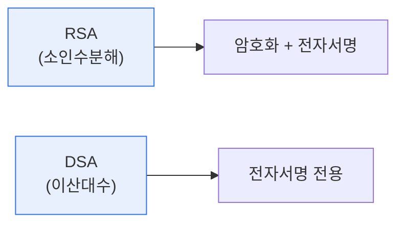

# RSA와 DSA 비교

## 1. 개요

### 가. 개념
> **RSA**는 큰 수의 **소인수분해가 어렵다는 점**에 기반한 공개키 암호 알고리즘으로 **암호화와 전자서명 모두** 가능하다. **DSA**(Digital Signature Algorithm)는 **이산대수 문제**에 기반해 **전자서명 전용**으로 설계된 알고리즘이다.

두 알고리즘을 비교하는 근본 이유는 '**같은 공개키 방식이지만, 목적과 수학적 기반이 다르다**'는 데 있다. 공개키 암호는 공개키와 개인키 한 쌍을 써서, 하나로 잠그면 다른 하나로만 풀 수 있게 한다. RSA는 이 원리를 소인수분해의 어려움 위에 세웠고, 특징은 **범용성**이다. 개인키로 서명하고 공개키로 검증하는 전자서명은 물론, 공개키로 암호화하고 개인키로 복호화하는 기밀성 확보에도 쓸 수 있다. 반면 DSA는 애초에 미국 표준(DSS)으로 **전자서명만을 위해** 이산대수 기반으로 설계됐다. 서명 생성은 빠르지만 검증은 상대적으로 느리고, 암호화는 하지 못한다. 즉 RSA는 '만능 도구', DSA는 '서명 전용 도구'다. 두 알고리즘은 각각 소인수분해·이산대수라는 다른 수학적 난제에 기대므로, 서명 생성·검증 속도, 활용 범위에서 뚜렷한 차이를 보인다. 오늘날에는 더 짧은 키로 같은 안전성을 주는 타원곡선 기반 ECDSA가 DSA를 대체해 가고 있다.

### 나. 기반 원리
| 알고리즘 | 수학적 기반 |
|---|---|
| **RSA** | 큰 수의 소인수분해 어려움 |
| **DSA** | 이산대수 문제(discrete logarithm) |

## 2. RSA vs DSA 비교

| 구분 | RSA | DSA |
|---|---|---|
| **기반 문제** | 소인수분해 | 이산대수 |
| **기능** | 암호화 + 전자서명 | 전자서명 전용 |
| **서명 생성** | 상대적으로 느림 | 빠름 |
| **서명 검증** | 빠름 | 상대적으로 느림 |
| **키 생성** | 느림 | 빠름 |
| **표준** | 사실상 표준(광범위 사용) | 미국 정부 표준(DSS) |

핵심 차이는 **기능 범위와 속도 프로파일**이다. RSA는 암호화까지 되는 범용 알고리즘으로 널리 쓰이고 검증이 빠르다. DSA는 서명 전용이며 서명 생성이 빠른 대신 검증이 느리다. 검증은 서명보다 자주 일어나므로(한 번 서명, 여러 번 검증), 이 속도 특성이 활용에 영향을 준다.

## 3. 전자서명 공통 원리와 안전성

두 알고리즘 모두 전자서명에서는 **메시지의 해시값을 개인키로 서명**하고, 수신자가 공개키로 검증한다. 이로써 무결성(변조 여부)·인증(서명자 확인)·부인방지를 제공한다. 안전성은 키 길이에 의존하며(RSA 2048비트 이상 권고), 양자컴퓨터가 실현되면 두 문제 모두 깨질 수 있어 양자내성암호(PQC)로의 전환이 논의된다. [[quantum-crypto]]

## 4. 고려사항 및 시사점

1. **용도에 맞는 선택**이 필요하다. 암호화와 서명이 모두 필요하면 RSA, 서명만 필요하고 서명 생성 속도가 중요하면 DSA(또는 ECDSA)가 적합하다.
2. **ECDSA로의 전환**이 대세다. 타원곡선 기반 ECDSA는 훨씬 짧은 키로 동등한 안전성을 제공해, 모바일·IoT 등 자원 제약 환경에서 DSA·RSA를 대체하고 있다.
3. **양자내성 대비**가 필요하다. RSA·DSA 모두 양자컴퓨터의 쇼어 알고리즘에 취약하므로, 장기적으로 양자내성암호(PQC)로의 전환 로드맵을 준비해야 한다.

---

> **한 줄 요약**: RSA는 *소인수분해 기반으로 암호화·서명 모두 가능한 범용 알고리즘*, DSA는 *이산대수 기반 서명 전용* 으로, 서명 생성·검증 속도와 활용 범위에서 차이가 있으며, 오늘날 ECDSA·양자내성암호로 진화하고 있다.
