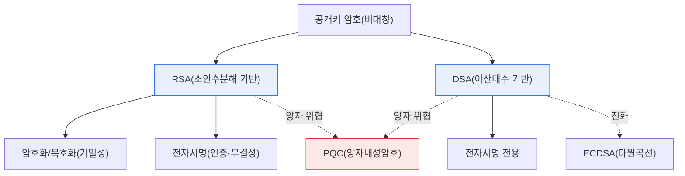
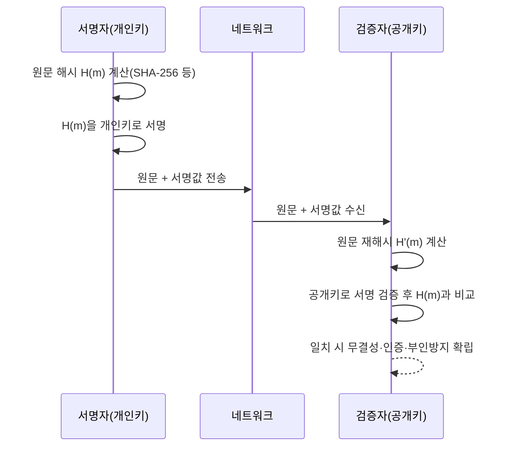

# RSA와 DSA 비교

## 1. 개요

### 가. 정의
> **RSA**(Rivest–Shamir–Adleman)는 **큰 수의 소인수분해가 계산적으로 어렵다는 점**에 기반한 공개키 암호 알고리즘으로, **암호화(기밀성)와 전자서명(인증·무결성·부인방지)을 모두** 수행할 수 있는 범용 알고리즘이다.
>
> **DSA**(Digital Signature Algorithm)는 유한체 위의 **이산대수 문제(Discrete Logarithm Problem)** 의 어려움에 기반해 미국 연방 표준(DSS, Digital Signature Standard)으로 채택된 **전자서명 전용** 알고리즘이다.

두 알고리즘을 함께 비교하는 근본 이유는, 둘 다 "공개키/개인키 한 쌍을 사용하는 비대칭 암호"라는 같은 범주에 속하면서도 **의존하는 수학적 난제와 설계 목적이 서로 다르기** 때문이다. 공개키 암호는 공개키와 개인키가 수학적으로 짝을 이루어, 한쪽으로 변환한 것을 오직 다른 한쪽으로만 되돌릴 수 있다는 성질을 이용한다. 이 성질을 어떤 "일방향 함수(one-way function)" 위에 세우느냐에 따라 알고리즘의 성격이 갈린다. RSA는 이 원리를 **소인수분해의 어려움** 위에 세웠고, DSA는 **이산대수의 어려움** 위에 세웠다.

### 나. 등장 배경과 필요성
RSA는 1977년 발표되어 사실상 최초로 실용화된 공개키 암호로, "암호화도 되고 서명도 되는" 범용성 덕분에 SSL/TLS, S/MIME, 코드 서명, 공인인증서 등 인터넷 신뢰 인프라의 표준이 되었다. 그러나 RSA는 특허·성능 논쟁과 함께 "서명 표준을 정부가 통제하기 어렵다"는 문제의식이 있었고, 이에 미국 NIST는 1991년 서명 전용 표준으로 **DSA**를 제안하여 1994년 FIPS 186(DSS)으로 확정했다. 즉 DSA는 처음부터 **국가 표준으로서 전자서명이라는 단일 목적**을 위해 설계되었으며, 암호화 기능은 의도적으로 배제되었다.

이 배경 차이는 실무 선택에 직접 영향을 준다. RSA는 "하나의 알고리즘으로 기밀성과 무결성을 모두 해결"하려는 범용 시스템에 적합하고, DSA는 "서명만 필요하되 표준 준수·서명 생성 속도가 중요한" 영역에 적합했다. 다만 후술하듯 오늘날 DSA는 타원곡선 기반 **ECDSA**와 **EdDSA**로 사실상 대체되었고, 최신 미국 표준(FIPS 186-5, 2023)에서는 DSA의 신규 서명 생성이 폐기(deprecated)되었다.

### 다. 두 알고리즘의 수학적 기반
| 알고리즘 | 기반 난제 | 안전성의 근거 |
|---|---|---|
| **RSA** | 큰 합성수 n의 소인수분해(Integer Factorization) | n=p·q를 알아도 p,q를 분해하기 어려움 |
| **DSA** | 유한체 곱셈군의 이산대수(DLP) | y=gˣ mod p에서 x를 구하기 어려움 |

두 난제 모두 "정방향 계산은 쉽지만 역방향은 지수적으로 어렵다"는 일방향성을 제공한다. 소인수분해는 곱셈은 쉬워도 인수분해가 어렵다는 성질에, 이산대수는 거듭제곱은 쉬워도 그 지수를 되찾는 것이 어렵다는 성질에 기댄다.

## 2. RSA·DSA 전체 구조 비교

아래 개념도는 두 알고리즘이 같은 "비대칭 암호"라는 뿌리에서 출발하되, 서로 다른 난제 위에서 각기 다른 기능 범위를 갖게 되는 전체 구도를 보여준다.

```mermaid
flowchart TB
  PKC["공개키 암호(비대칭)"] --> RSA["RSA(소인수분해 기반)"]
  PKC --> DSA["DSA(이산대수 기반)"]
  RSA --> RE["암호화/복호화(기밀성)"]
  RSA --> RS["전자서명(인증·무결성)"]
  DSA --> DS["전자서명 전용"]
  DSA -. 진화 .-> ECDSA["ECDSA(타원곡선)"]
  RSA -. 양자 위협 .-> PQC["PQC(양자내성암호)"]
  DSA -. 양자 위협 .-> PQC
  style RSA fill:#e8f0fe,stroke:#2f6fed
  style DSA fill:#e8f0fe,stroke:#2f6fed
  style PQC fill:#fde8e8,stroke:#d33
```

RSA는 하나의 알고리즘에서 두 갈래(암호화·서명)로 뻗어 나가는 반면, DSA는 서명이라는 단일 기능으로 수렴하고, 두 알고리즘 모두 궁극적으로 양자컴퓨터의 위협 아래 놓여 PQC로의 전환 압력을 받는다.

### 가. RSA의 동작 원리
RSA의 핵심은 **키 생성**에 있다. 두 개의 큰 소수 p, q를 선택하여 모듈러스 n=p·q를 만들고, 오일러 함수 φ(n)=(p−1)(q−1)을 계산한다. φ(n)과 서로소인 공개 지수 e를 고른 뒤, e·d≡1 (mod φ(n))을 만족하는 개인 지수 d를 구한다. 이렇게 만들어진 공개키는 (n, e), 개인키는 (n, d)이다. 여기서 안전성의 본질은, 공격자가 n을 알더라도 p·q로 분해하지 못하면 φ(n)을 계산할 수 없고, 따라서 d를 유도할 수 없다는 데 있다.

암호화는 평문 m에 대해 c=mᵉ mod n으로 수행하고, 복호화는 m=cᵈ mod n으로 되돌린다. 전자서명은 이 관계를 반대로 사용하여, 메시지 해시 H(m)을 개인키로 S=H(m)ᵈ mod n으로 서명하고, 수신자는 공개키로 Sᵉ mod n을 계산해 H(m)과 일치하는지 검증한다. 즉 "개인키로 잠근 것은 공개키로만 열린다"는 대칭적 구조 덕분에 하나의 알고리즘이 기밀성과 인증을 모두 감당한다. 실무에서는 안전성을 위해 원시 RSA를 그대로 쓰지 않고 **패딩(OAEP for 암호화, PSS for 서명)** 을 반드시 적용한다.

### 나. DSA의 동작 원리
DSA는 서명 생성 절차가 RSA와 근본적으로 다르다. 먼저 시스템 파라미터로 큰 소수 p, p−1을 나누는 소수 q, 위수(order) q를 갖는 생성원 g를 정한다. 개인키 x는 무작위로, 공개키는 y=gˣ mod p로 정의된다. 서명 시에는 **매 서명마다 새로운 임시 난수 k**를 뽑아 r=(gᵏ mod p) mod q, s=k⁻¹(H(m)+x·r) mod q를 계산하고, 서명값 (r, s)를 전송한다. 검증자는 w=s⁻¹ mod q, u₁=H(m)·w mod q, u₂=r·w mod q를 구해 v=((g^{u₁}·y^{u₂}) mod p) mod q가 r과 같은지 확인한다.

여기서 반드시 강조할 실무적 함정은 **임시 난수 k의 관리**다. k를 재사용하거나 예측 가능하게 생성하면 두 서명의 연립방정식에서 개인키 x가 그대로 복원된다. 실제로 2010년 소니 PlayStation 3의 코드 서명 키가 이 취약점으로 유출된 사건이 대표 사례이며, 동일한 위험이 타원곡선 서명(ECDSA)에도 그대로 적용된다. 이 때문에 오늘날에는 메시지와 개인키로부터 k를 결정론적으로 유도하는 **RFC 6979(Deterministic DSA/ECDSA)** 를 권장한다.

### 다. 전자서명의 공통 처리 절차
RSA든 DSA든 전자서명은 "원문 전체가 아니라 원문의 해시값에 서명한다"는 공통 절차를 따른다. 아래 시퀀스는 서명 생성부터 검증까지의 흐름을 보여준다.

```mermaid
sequenceDiagram
  participant S as 서명자(개인키)
  participant N as 네트워크
  participant V as 검증자(공개키)
  S->>S: 원문 해시 H(m) 계산(SHA-256 등)
  S->>S: H(m)을 개인키로 서명
  S->>N: 원문 + 서명값 전송
  N->>V: 원문 + 서명값 수신
  V->>V: 원문 재해시 H'(m) 계산
  V->>V: 공개키로 서명 검증 후 H(m)과 비교
  V-->>V: 일치 시 무결성·인증·부인방지 확립
```

이렇게 해시에 서명함으로써 (1) 임의 길이 문서를 고정 길이로 압축해 서명 연산량을 줄이고, (2) 원문이 한 비트라도 바뀌면 해시가 달라져 위변조를 즉시 탐지하며, (3) 개인키 보유자만 서명할 수 있으므로 서명자를 인증하고 부인방지를 제공한다.

## 3. 상세 비교와 실무적 함의

두 알고리즘의 차이는 단순한 기능 나열이 아니라 **"왜 그런 속도·용도 프로파일이 생기는가"** 로 이해해야 한다. RSA는 검증 시 작은 공개 지수(예: e=65537)로 거듭제곱하므로 검증이 매우 빠른 반면, 개인 지수 d가 커서 서명 생성은 느리다. DSA는 반대로 서명 생성이 빠르지만 검증에 두 번의 지수 연산이 필요해 상대적으로 느리다. 전자서명은 통상 "한 번 서명하고 여러 번 검증"되므로(예: 인증서 한 장을 수많은 클라이언트가 검증), 검증이 빠른 RSA가 TLS 서버 인증서에 널리 쓰이게 된 것은 이 속도 프로파일의 자연스러운 귀결이다.

| 구분 | RSA | DSA |
|---|---|---|
| **기반 문제** | 소인수분해 | 이산대수(DLP) |
| **기능 범위** | 암호화 + 전자서명 | 전자서명 전용 |
| **키 생성** | 느림(대형 소수 2개 탐색) | 빠름 |
| **서명 생성** | 상대적으로 느림 | 빠름 |
| **서명 검증** | 빠름(작은 e) | 상대적으로 느림 |
| **서명 길이** | 키 길이와 동일(2048비트 등) | 짧음(2·q, 예: 512비트) |
| **난수 의존성** | 서명에 난수 불필요(RSA-PSS는 솔트) | 매 서명마다 안전한 k 필수 |
| **표준화** | 사실상 산업 표준(PKCS#1) | 미국 정부 표준(FIPS 186) |

키 길이와 안전성의 관계도 실무 판단의 핵심이다. NIST SP 800-57에 따르면 **112비트 보안 수준**은 RSA 2048비트에, **128비트 보안 수준**은 RSA 3072비트에 대응한다. 반면 같은 128비트 보안을 타원곡선(ECDSA)은 **256비트 키**만으로 달성한다. 즉 RSA는 안전성을 높일수록 키·서명·연산 비용이 급격히 증가(3072→7680→15360비트)하는 반면, 타원곡선은 키가 완만히 커진다. 이 확장성 격차가 모바일·IoT처럼 자원이 제한된 환경에서 ECDSA·EdDSA로의 전환을 가속한 결정적 이유다.

**구체 사례 세 가지**로 차이를 정리하면 다음과 같다. 첫째, 웹서버 TLS 인증서는 검증 빈도가 압도적으로 높아 검증이 빠른 RSA-2048/3072 또는 ECDSA-P256이 표준으로 쓰인다. 둘째, 비트코인·이더리움 등 블록체인은 서명 크기와 검증 성능이 중요해 DSA가 아니라 ECDSA(secp256k1)를 사용한다. 셋째, 정부·공공 문서의 장기 전자서명은 표준 준수가 중요하여 과거 DSA가 쓰였으나, 현재는 RSA-PSS나 ECDSA로 이전되고 있다.

## 4. 심화 — 최신 표준 동향과 양자내성암호 전환

전자서명 알고리즘 선택은 최근 두 개의 표준 변화로 크게 재편되고 있어, 기술사 관점에서 반드시 짚어야 한다.

첫째, **FIPS 186-5(2023년 개정)** 에서 미국 NIST는 순수 DSA를 **신규 서명 생성에 대해 폐기(deprecated)** 하고, 승인 서명 알고리즘을 RSA·ECDSA·EdDSA(Ed25519/Ed448)로 정리했다. 즉 DSA는 이제 "레거시 서명의 검증"에만 제한적으로 허용되며, 신규 시스템에서는 사용하지 않는 것이 표준 권고다. 이는 DSA를 학습 주제로 다루되 실무 신규 채택 대상에서는 제외해야 함을 의미한다.

둘째, **양자컴퓨터 위협과 PQC 전환**이다. 쇼어(Shor) 알고리즘은 충분히 큰 양자컴퓨터가 있으면 소인수분해와 이산대수를 모두 다항 시간에 풀 수 있으므로, **RSA·DSA·ECDSA가 원리적으로 모두 무력화**된다. 이에 NIST는 2024년 8월 최초의 표준 양자내성암호를 확정했는데, 서명 분야에서는 격자 기반 **ML-DSA(FIPS 204, CRYSTALS-Dilithium)** 와 해시 기반 **SLH-DSA(FIPS 205, SPHINCS+)** 가, 키 교환에는 **ML-KEM(FIPS 203, Kyber)** 이 선정되었다. 특히 "지금 수집해 나중에 복호화(Harvest Now, Decrypt Later)"하는 공격 모델 때문에, 장기 보존이 필요한 서명·기밀 데이터는 **하이브리드 방식(기존+PQC 병용)** 으로 선제적 전환을 시작하는 것이 권고된다.

## 5. 고려사항 및 시사점 (기술사 관점)

1. **용도 기반 선택 전략**: 기밀성과 서명이 모두 필요하면 RSA(단, OAEP·PSS 패딩 필수), 서명만 필요하고 성능·서명 크기가 중요하면 ECDSA/EdDSA를 선택한다. 순수 DSA는 신규 채택을 피하고 레거시 호환 목적에 한정한다.

2. **구현 안전성의 트레이드오프**: DSA·ECDSA는 임시 난수 k의 품질에 안전성이 결정적으로 의존하므로, 반드시 검증된 CSPRNG 또는 RFC 6979 결정론적 서명을 사용해야 한다. RSA는 난수 의존이 낮은 대신 패딩 오라클 공격에 취약할 수 있어 구현 검증(FIPS 140-3 모듈)이 중요하다.

3. **키 길이·수명 관리(Crypto-agility)**: NIST 권고에 따라 2030년 이후를 겨냥하면 RSA는 3072비트 이상을 확보하되, 확장 비용을 고려해 신규 시스템은 타원곡선 기반으로 설계하고, 알고리즘을 손쉽게 교체할 수 있는 **암호 민첩성(crypto-agility)** 아키텍처를 갖추어야 한다.

4. **양자내성 전환 로드맵 수립**: RSA·DSA·ECDSA 전부 쇼어 알고리즘에 취약하므로, 자산 인벤토리(어디에 어떤 암호가 쓰이는지 식별)→우선순위 산정(장기 보존 데이터 우선)→하이브리드 도입→전면 전환의 단계적 PQC 마이그레이션 계획을 지금부터 준비해야 한다.

5. **연계 기술 통합**: 전자서명은 PKI(인증서 신뢰 체인), 타임스탬프(TSA), 장기검증(LTV) 등과 결합되어야 실효성을 가지므로, 알고리즘 자체뿐 아니라 신뢰 인프라 전반의 운영·갱신 정책을 함께 설계해야 한다.

## 참고자료
- NIST, FIPS 186-5 Digital Signature Standard (2023): https://csrc.nist.gov/pubs/fips/186-5/final
- NIST, SP 800-57 Part 1 Rev.5 Key Management: https://csrc.nist.gov/pubs/sp/800/57/pt1/r5/final
- NIST, Post-Quantum Cryptography Standards (FIPS 203/204/205, 2024): https://csrc.nist.gov/news/2024/postquantum-cryptography-fips-approved
- IETF, RFC 6979 Deterministic DSA/ECDSA: https://datatracker.ietf.org/doc/html/rfc6979

---

> **한 줄 요약**: RSA는 *소인수분해 기반으로 암호화·서명이 모두 가능한 범용 알고리즘*, DSA는 *이산대수 기반 서명 전용* 으로 서명 생성·검증 속도와 활용 범위가 다르며, DSA는 FIPS 186-5에서 신규 서명 생성이 폐기되어 ECDSA·EdDSA로 대체되고, 두 알고리즘 모두 쇼어 알고리즘에 취약해 ML-DSA 등 양자내성암호(PQC)로의 전환이 요구된다.
