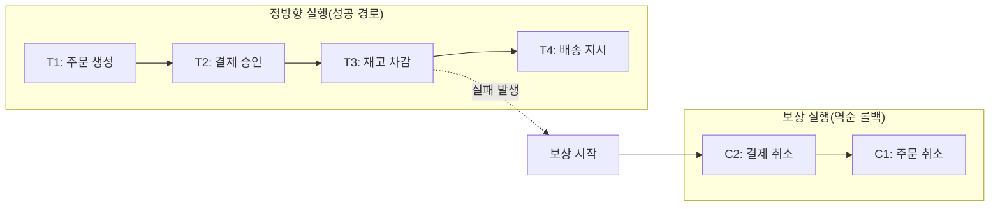
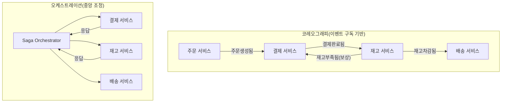

# 사가 패턴(Saga Pattern)과 분산 트랜잭션

## 1. 개요

### 가. 정의

> **사가 패턴(Saga Pattern)**은 여러 서비스에 걸친 하나의 비즈니스 트랜잭션을, 각 서비스의 로컬 트랜잭션들의 연쇄로 나누어 실행하고, 중간에 실패가 발생하면 이미 성공한 단계들을 **보상 트랜잭션(Compensating Transaction)**으로 역순 취소하여 시스템 전체의 일관성을 유지하는 분산 트랜잭션 처리 방식이다.

사가는 1987년 헥터 가르시아-몰리나(Hector Garcia-Molina)가 장기 실행 트랜잭션(long-lived transaction)의 락 점유 문제를 완화하기 위해 제안한 개념으로, 오늘날에는 마이크로서비스 아키텍처(MSA)에서 서비스 경계를 넘는 데이터 일관성을 확보하는 대표 패턴으로 재조명되고 있다. 사가는 전통적 트랜잭션이 보장하던 **원자성(All-or-Nothing)**을 데이터베이스 락이 아니라 **애플리케이션 수준의 보상 로직**으로 대체한다는 점이 핵심이다.

### 나. 등장 배경과 필요성

모놀리식 시스템에서는 하나의 데이터베이스가 모든 테이블을 소유하므로, 주문·결제·재고 갱신을 단일 트랜잭션으로 묶어 `COMMIT` 한 번에 원자적으로 처리하고 실패 시 `ROLLBACK`으로 되돌릴 수 있었다. 그러나 MSA에서는 서비스마다 데이터베이스를 독립적으로 소유하는 **DB per Service** 원칙을 따르기 때문에, 단일 트랜잭션 경계가 여러 서비스와 여러 물리 DB로 쪼개진다. 이때 하나의 업무(예: 여행 예약 = 항공+호텔+렌터카)를 성공 또는 실패로 **원자적**으로 처리하려면 서비스 간 협력이 필요하다.

과거의 표준 해법인 **2단계 커밋(2PC, Two-Phase Commit)**은 조정자(Coordinator)가 모든 참여자에게 준비(prepare)와 커밋(commit)을 지시하는 강한 일관성 기법이지만, 커밋이 끝날 때까지 자원 락을 유지해 가용성과 확장성을 크게 떨어뜨린다. 특히 참여자가 많거나 응답이 느린 서비스가 섞이면 전체가 대기하며, 조정자 장애 시 **블로킹(blocking)** 상태에 빠진다. 이는 CAP 정리에서 가용성(A)을 희생하는 선택이며, 대규모 인터넷 서비스의 요구와 맞지 않는다.

사가는 이 문제를 다른 관점에서 푼다. 전체를 하나의 잠금 구간으로 묶는 대신, 각 단계를 **즉시 커밋되는 짧은 로컬 트랜잭션**으로 처리하고 실패는 사후에 보상으로 정정한다. 그 결과 락 점유 시간이 짧아 처리량과 가용성이 높아지지만, 대신 **결과적 일관성(Eventual Consistency)**을 수용해야 하며, 중간 상태가 외부에 노출될 수 있는 새로운 설계 과제를 낳는다. 즉 사가는 "강한 일관성 대신 가용성과 자율성을 얻는" 트레이드오프의 산물이다.

## 2. 사가의 기본 원리와 전체 구조

사가는 정상 흐름을 이루는 **정방향 트랜잭션(T1, T2, … Tn)**과, 각 정방향 트랜잭션을 되돌리는 **보상 트랜잭션(C1, C2, … Cn-1)**의 쌍으로 구성된다. 정상적으로 모든 단계가 성공하면 T1→Tn이 순차 실행되고, k단계에서 실패하면 이미 성공한 T1…Tk-1을 Ck-1…C1 순서로 역보상한다.

위 그림에서 재고 차감(T3)이 실패하면, 시스템은 앞서 성공한 결제 승인과 주문 생성을 각각 **결제 취소(C2)**, **주문 취소(C1)** 순으로 보상한다. 여기서 중요한 점은 보상이 물리적 `ROLLBACK`이 아니라 **의미적 취소(semantic undo)**라는 것이다. 예컨대 이미 승인된 결제는 되돌릴 수 없으므로 "환불"이라는 새로운 정방향 거래로 상쇄한다. 따라서 보상 트랜잭션은 원거래의 흔적을 남기면서 효과만 무력화하는 업무 로직으로 설계되어야 한다.

보상 설계에서 자주 등장하는 개념이 **되돌릴 수 없는 단계(pivot transaction)**다. 예를 들어 항공권 발권처럼 취소 수수료가 크거나 물리적으로 되돌리기 어려운 단계는 사가의 후반부, 즉 앞선 단계가 모두 성공한 뒤에 배치하여 보상 비용을 최소화한다. 이처럼 사가 설계는 단계의 순서 자체가 리스크 관리 수단이 된다.

## 3. 실행 방식 — 코레오그래피 vs 오케스트레이션

사가의 단계 전이를 누가 조율하느냐에 따라 두 가지 구현 방식으로 나뉜다. 이 선택은 결합도·가시성·복잡도에 직접 영향을 주므로 사가 설계의 가장 중요한 의사결정이다.

**코레오그래피(Choreography)** 방식은 중앙 조정자 없이, 각 서비스가 이벤트를 발행하고 다른 서비스가 그 이벤트를 구독하여 자신의 다음 단계를 스스로 수행한다. 주문 서비스가 `주문생성됨` 이벤트를 발행하면 결제 서비스가 이를 받아 결제하고 `결제완료됨`을 발행하며, 재고 서비스가 다시 이를 구독하는 식으로 흐름이 이어진다. 서비스 간 직접 의존이 없어 결합도가 낮고 자율성이 높지만, 전체 흐름이 이벤트 사슬에 흩어져 **한눈에 파악하기 어렵고 순환 의존이나 이벤트 폭주 위험**이 있다.

**오케스트레이션(Orchestration)** 방식은 **사가 오케스트레이터**라는 중앙 조정자가 상태 기계(state machine)를 들고 각 서비스에 명령을 보내고 응답을 받아 다음 단계를 결정한다. 흐름이 한 곳에 모여 있어 가시성과 디버깅·모니터링이 쉽고 복잡한 분기·보상 로직을 관리하기 좋지만, 오케스트레이터가 단일 장애점이자 로직 집중 지점이 될 수 있어 그 자체의 고가용성 설계가 필요하다. 실무에서는 단순한 흐름은 코레오그래피로, 참여 서비스가 많고 보상 규칙이 복잡한 흐름은 오케스트레이션으로 가는 혼합 전략이 흔하다.

| 구분 | 코레오그래피 | 오케스트레이션 |
|------|-------------|----------------|
| 조정 주체 | 없음(이벤트 발행/구독) | 중앙 오케스트레이터 |
| 결합도 | 낮음(느슨) | 오케스트레이터에 집중 |
| 흐름 가시성 | 낮음(분산) | 높음(한 곳 집중) |
| 적합 상황 | 참여 서비스 2~4개, 단순 흐름 | 다수 서비스, 복잡한 보상/분기 |
| 위험 | 순환 의존·추적 곤란 | 단일 장애점, 로직 비대화 |

## 4. 구현 시 핵심 기술 요소

사가를 실제로 신뢰성 있게 동작시키려면 몇 가지 보조 메커니즘이 반드시 뒷받침되어야 한다. 첫째, **멱등성(Idempotency)**이다. 네트워크 재시도로 동일 메시지가 중복 도착할 수 있으므로, 각 단계와 보상은 여러 번 실행되어도 결과가 동일해야 한다. 보통 트랜잭션 ID나 메시지 ID를 저장해 중복 처리를 걸러낸다.

둘째, **원자적 이벤트 발행**이다. 로컬 DB 갱신과 이벤트 발행이 별도 시스템(DB와 메시지 브로커)에 걸쳐 있으면, DB는 커밋됐는데 이벤트 발행이 실패하는 이중 쓰기(dual write) 문제가 생긴다. 이를 막기 위해 같은 트랜잭션에서 이벤트를 DB의 아웃박스 테이블에 기록하고 별도 릴레이가 이를 읽어 발행하는 **트랜잭셔널 아웃박스(Transactional Outbox)** 패턴을 함께 쓴다. 이렇게 하면 "상태 변경과 이벤트 발행"이 같은 로컬 트랜잭션으로 원자적으로 묶인다.

셋째, **상태 추적과 타임아웃**이다. 오케스트레이터형은 각 사가 인스턴스의 진행 상태를 영속화하여 장애 후 재기동 시 이어서 진행하거나 보상할 수 있어야 한다. 응답이 오지 않는 단계에 대해서는 타임아웃과 재시도, 그리고 최종적으로 보상 또는 수동 개입(예: 데드레터·운영자 알림)으로 전환하는 규칙이 필요하다.

## 5. 다른 방식과의 비교 — 왜 사가인가

사가를 2PC 및 단순 이벤트 방식과 비교하면 선택의 맥락이 분명해진다. 2PC는 강한 일관성을 즉시 보장하지만 락과 블로킹으로 확장성이 낮아, 참여자가 많고 지연이 큰 MSA 환경에서는 병목이 된다. 반면 사가는 각 단계를 즉시 커밋해 락을 오래 잡지 않으므로 처리량과 가용성이 높지만, 정정이 사후에 이뤄지는 만큼 **중간에 불일치가 관측되는 시간 창**이 존재한다.

| 항목 | 2PC | 사가 |
|------|-----|------|
| 일관성 | 강한 일관성(즉시) | 결과적 일관성 |
| 락 점유 | 커밋까지 장시간 | 로컬 단계 동안만 |
| 가용성/확장성 | 낮음(블로킹) | 높음 |
| 롤백 방식 | DB ROLLBACK | 보상 트랜잭션(의미적 취소) |
| 격리성 | 보장 | 미보장(별도 대책 필요) |

여기서 실무적으로 가장 까다로운 문제가 **격리성 부재**다. 사가 진행 중에는 다른 트랜잭션이 아직 확정되지 않은 중간 상태를 읽을 수 있어(dirty read 유사), 예약이 곧 취소될 좌석을 다른 사용자가 조회하는 등의 이상 현상이 생길 수 있다. 이를 완화하기 위해 상태 필드로 "처리중/확정" 같은 **의미적 락(semantic lock)**을 두거나, 재확인(reread) 후 커밋, 교환 가능한 업데이트(commutative update) 같은 대응책을 함께 설계한다.

구체 사례로, 대형 전자상거래의 주문 처리는 주문·결제·재고·포인트·배송이 각기 다른 팀과 DB로 나뉘는데, 초당 수천 건의 주문을 2PC로 묶으면 결제 게이트웨이 응답 지연이 전체를 마비시킨다. 실제로 이런 플랫폼들은 사가+아웃박스+메시지 브로커(Kafka 등) 조합으로 각 단계를 비동기 처리하고, 결제 실패 시 자동 환불·주문 취소 보상으로 정합을 맞춘다. 그 결과 평시 처리량은 크게 늘지만, 사용자에게는 "결제 확인 중"과 같은 중간 상태를 UX로 명시해 결과적 일관성을 자연스럽게 흡수시킨다.

## 6. 고려사항 및 시사점

기술사 관점에서 사가 도입은 단순한 패턴 선택이 아니라 **일관성 모델에 대한 아키텍처 의사결정**으로 다뤄야 한다.

- **적용 판단 기준**: 강한 일관성이 법적·금전적으로 필수인 핵심 정산은 단일 서비스 내 로컬 트랜잭션으로 응집시키고, 서비스 경계를 넘는 장기 흐름에만 사가를 선택적으로 적용한다. 모든 것을 사가로 만들면 오히려 복잡도가 폭증하므로 **서비스 경계 설계(DDD의 Bounded Context)와 함께 결정**해야 한다.
- **보상 가능성 우선 설계**: 되돌릴 수 없는 단계(발권·출고·외부 정산)는 사가 후반부에 배치하고, 취소 수수료·환불 정책 같은 업무 규칙을 보상 로직에 반영한다. 보상 자체도 실패할 수 있으므로 재시도·데드레터·운영자 개입 경로를 마련한다.
- **관측성과 운영**: 흐름이 여러 서비스로 흩어지므로 분산 추적(Distributed Tracing), 사가 상태 대시보드, 미완결 사가 탐지·알림이 없으면 장애 원인 파악이 매우 어렵다. 오케스트레이션 방식이 이 점에서 유리하며, 상관관계 ID(correlation ID)로 전 구간을 연결한다.
- **트레이드오프 수용과 UX 설계**: 사가는 격리성과 즉시 일관성을 희생하는 대신 가용성·자율성·확장성을 얻는다. 따라서 "처리중" 상태 노출, 중복 방지(멱등성), 최종 결과 통지 등 사용자 경험 차원의 보정 설계가 기술 설계와 짝을 이뤄야 한다.
- **전망**: 상태 기반 오케스트레이션을 코드로 관리하는 워크플로 엔진(예: Temporal, Camunda류)과 이벤트 스트리밍 플랫폼의 성숙으로, 사가는 손수 구현하기보다 **워크플로/오케스트레이션 프레임워크로 표준화**되는 방향으로 발전하고 있다. CQRS·이벤트 소싱과 결합하면 사가 진행 이력 자체를 감사 자산으로 활용할 수 있다.

---

> **한 줄 요약**: 사가 패턴은 서비스별 로컬 트랜잭션의 연쇄와 실패 시의 보상 트랜잭션으로 분산 트랜잭션의 원자성을 애플리케이션 수준에서 구현하는 기법으로, 2PC의 강한 일관성 대신 가용성과 확장성을 얻는 결과적 일관성 전략이며 코레오그래피·오케스트레이션 선택과 멱등성·아웃박스·보상 설계가 성패를 좌우한다.
