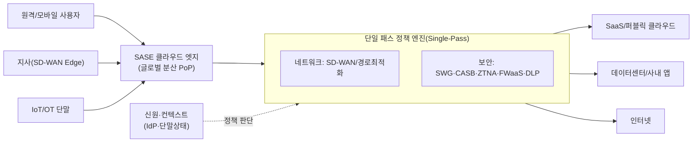
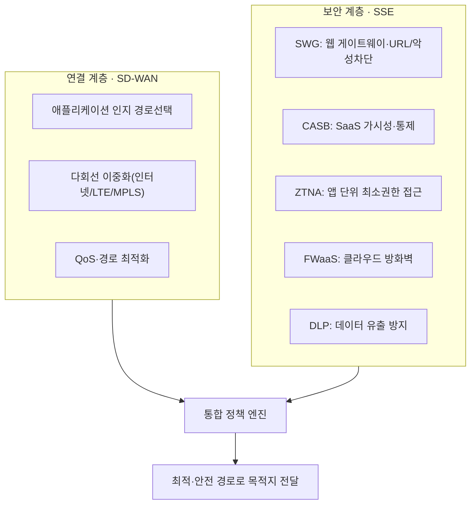

# SASE(Secure Access Service Edge, 보안 접근 서비스 엣지)

## 1. 개요

> **SASE**는 광역 네트워크(WAN) 연결 기능인 SD-WAN과 SWG·CASB·ZTNA·FWaaS 등 네트워크 보안 기능을 하나의 클라우드 네이티브 서비스로 통합해, 전 세계에 분산된 엣지(PoP, Point of Presence)에서 신원(Identity) 기반으로 제공하는 아키텍처다. 2019년 Gartner가 「The Future of Network Security Is in the Cloud」 보고서에서 처음 제시한 개념으로 통용된다.

SASE가 등장한 근본 배경은 **기업 IT 자원의 무게중심이 데이터센터에서 클라우드로 이동**한 데 있다. 과거에는 사용자·업무·데이터가 대부분 본사 데이터센터 안에 있었으므로, 지사나 원격 사용자의 트래픽을 MPLS 전용회선으로 본사에 모아(백홀, backhaul) 경계 방화벽을 한 번 통과시키는 '허브 앤 스포크(hub-and-spoke)' 모델이 합리적이었다. 그러나 업무용 애플리케이션이 SaaS(Microsoft 365·Salesforce 등)와 퍼블릭 클라우드로 옮겨가면서, 인터넷으로 나가면 될 트래픽을 굳이 본사로 우회시켰다가 다시 클라우드로 보내는 '트롬본(trombone) 현상'이 생겼다. 이는 지연(latency)을 키우고 회선 비용을 늘리며 사용자 경험을 악화시킨다.

여기에 **재택·원격근무의 상시화, 모바일·IoT 단말의 폭증, 클라우드 워크로드의 분산**이 더해지면서 '보호해야 할 경계(perimeter)' 자체가 사라졌다. 사용자는 어디서든 접속하고 데이터는 어디에나 있다. 이런 환경에서 전통적 경계 보안(장비 중심·본사 집중)은 확장성·민첩성·보안성 모두에서 한계를 드러낸다. SASE는 "**네트워크와 보안을 분리된 장비 스택이 아니라, 사용자·단말과 가까운 클라우드 엣지에서 하나로 융합된 서비스로 제공한다**"는 발상으로 이 문제를 해결하려는 것이다. 즉 보안 검사 지점을 '본사 경계'가 아니라 '사용자가 접속하는 가장 가까운 PoP'로 옮기고, 접근 허용 여부를 IP·위치가 아니라 **검증된 신원과 컨텍스트(단말 상태·시간·행위)**로 판단한다.

## 2. SASE 개념 구조와 핵심 특성

SASE는 크게 **네트워크(연결) 계층과 보안(SSE) 계층**이 클라우드 엣지에서 융합된 형태로 이해할 수 있다. 아래 개념도는 사용자·지사·클라우드가 어떻게 분산 PoP를 매개로 연결·보호되는지를 보여준다.

SASE 아키텍처의 특성은 네 가지 축으로 정리된다. 첫째, **신원 중심(Identity-driven)**이다. 접근 판단의 기준이 네트워크 위치가 아니라 '누가, 어떤 단말로, 어떤 상태에서' 접근하는가라는 신원·컨텍스트다. 이는 제로 트러스트 원칙("절대 신뢰하지 말고 항상 검증하라")을 실현하는 핵심 메커니즘으로, ZTNA를 통해 애플리케이션 단위의 최소권한 접근을 강제한다.

둘째, **클라우드 네이티브(Cloud-native)**다. 보안·네트워크 기능이 물리 장비(appliance)가 아니라 멀티테넌트 클라우드 서비스로 구현되어, 탄력적 확장·자동 업데이트·소비 기반 과금이 가능하다. 새로운 위협 시그니처나 정책이 모든 PoP에 즉시 전파되므로 패치 지연으로 인한 보안 공백이 줄어든다.

셋째, **글로벌 분산 엣지(Distributed edge)**다. 전 세계 수십~수백 개의 PoP를 두어 사용자와 물리적으로 가까운 곳에서 트래픽을 검사·전달한다. 이로써 백홀을 제거하고 지연을 줄인다. 예컨대 서울의 원격 사용자가 미국 리전의 SaaS에 접속할 때, 본사 데이터센터를 경유하지 않고 가까운 PoP에서 보안 검사를 마친 뒤 최적 경로로 나가므로 왕복 지연이 크게 개선된다.

넷째, **단일 패스 검사(Single-pass inspection)**다. 여러 보안 기능(복호화·SWG·DLP·안티멀웨어 등)을 각각의 장비에서 반복 수행하지 않고, 트래픽을 한 번 복호화·파싱한 상태에서 모든 정책을 병렬 적용한다. 장비를 직렬로 늘릴 때 누적되던 지연과 관리 복잡성을 줄이는 것이 핵심 설계 목표다.

## 3. 구성요소 — 네트워크(SD-WAN)와 보안(SSE)

SASE의 절반은 연결을 담당하는 **SD-WAN**이고, 나머지 절반은 Gartner가 2021년 별도로 명명한 **SSE(Security Service Edge)**, 즉 보안 기능 묶음이다. 아래 상세 아키텍처도는 SSE를 구성하는 주요 보안 기능과 네트워크 기능의 관계를 나타낸다.

**SD-WAN(Software-Defined WAN)**은 애플리케이션의 종류·중요도를 인지해 여러 회선(전용선·인터넷·LTE/5G) 중 최적 경로를 동적으로 선택하고, 장애 시 자동 절체하며, 실시간 트래픽(화상회의 등)에 QoS를 보장한다. SASE에서 SD-WAN은 지사·단말을 가장 가까운 PoP에 안전하게 연결하는 '온램프(on-ramp)' 역할을 한다.

**SWG(Secure Web Gateway)**는 사용자의 웹 트래픽을 중계하며 악성 URL·피싱·멀웨어를 차단하고 웹 사용 정책을 강제한다. **CASB(Cloud Access Security Broker)**는 조직이 사용하는 SaaS에 대한 가시성을 제공하고, 섀도 IT(비인가 클라우드 사용)를 탐지하며 데이터 공유·권한을 통제한다. **ZTNA(Zero Trust Network Access)**는 VPN과 달리 네트워크 전체가 아닌 '특정 애플리케이션'에 대해서만, 신원·단말 상태 검증을 통과한 세션에 최소권한으로 접근을 허용해 공격 표면(측면 이동, lateral movement)을 줄인다. **FWaaS(Firewall as a Service)**는 방화벽 기능을 클라우드에서 서비스로 제공하며, **DLP(Data Loss Prevention)**는 민감정보(개인정보·기밀문서)의 외부 유출을 콘텐츠 검사로 차단한다.

이 구성요소들은 개별적으로도 존재하던 보안 기능이지만, SASE의 가치는 이들을 **하나의 정책 프레임·단일 콘솔·단일 데이터 경로로 융합**한 데 있다. 예를 들어 "재무팀 직원이 관리되지 않는 개인 단말로 외부 SaaS에 회계 파일을 업로드"하는 행위를, CASB가 SaaS를 식별하고 ZTNA가 단말 상태를 확인하며 DLP가 콘텐츠를 검사해 하나의 정책 판단으로 차단할 수 있다. 기능이 분리된 전통 스택에서는 각 장비의 정책을 따로 맞춰야 했다.

## 4. 전통 경계 보안·VPN과의 비교

SASE의 차별성은 기존 방식과 비교할 때 분명해진다. 아래 표는 핵심 축을 정리한 것이며, 각 차이가 '왜' 생기는지는 이어서 서술한다.

| 구분 | 전통 경계 보안(허브앤스포크+VPN) | SASE |
|------|------------------------------|------|
| 검사 지점 | 본사 데이터센터 경계 | 사용자와 가까운 클라우드 PoP |
| 접근 신뢰 | 네트워크 위치(내부=신뢰) | 신원·컨텍스트 기반(무신뢰) |
| 접근 범위 | 네트워크 전체(VPN) | 애플리케이션 단위(ZTNA) |
| 구현 형태 | 물리 장비 스택 | 클라우드 서비스 |
| 확장성 | 장비 증설·용량 한계 | 탄력적 확장 |
| 관리 | 장비별 개별 콘솔 | 단일 정책·통합 콘솔 |

가장 근본적 차이는 **신뢰 모델**이다. VPN 기반 원격접속은 인증만 통과하면 사내망 세그먼트에 폭넓게 연결되어, 계정이 탈취되거나 감염 단말이 접속하면 공격자가 내부에서 자유롭게 측면 이동할 수 있다. 반면 SASE의 ZTNA는 세션마다 신원·단말 상태를 검증하고 필요한 앱에만 연결하므로, 하나가 뚫려도 피해가 그 앱으로 국한된다. '내부는 신뢰'라는 암묵적 전제를 제거한 것이 보안 효과의 핵심이다.

두 번째 차이는 **성능·비용 구조**다. 백홀을 없애 지연을 줄이는 것은 단순한 편의가 아니라, 클라우드·SaaS 중심 업무의 생산성과 직결된다. 한 글로벌 제조사가 다수 해외 지사를 MPLS로 본사에 백홀하던 구조를 SASE로 전환해 회선 비용과 지연을 줄인 사례들이 보고되며, MPLS 대비 인터넷·SD-WAN 조합은 대역폭당 비용이 낮아 총소유비용(TCO) 절감 여지가 크다. 다만 구체적 절감률은 기업의 회선 구성·트래픽 특성에 따라 크게 달라지므로 일반화에는 주의가 필요하다.

세 번째 차이는 **운영 복잡성**이다. 방화벽·프록시·VPN·DLP를 서로 다른 벤더 장비로 운영하면 정책 불일치·가시성 단절·관리 부담이 커진다. SASE는 이를 단일 정책 모델로 통합해 일관성과 운영 효율을 높인다. 반대로 이는 **단일 벤더 종속(lock-in)** 위험으로 이어질 수 있어, 도입 시 트레이드오프로 고려해야 한다.

## 5. 심화 — SSE의 부상, 도입 접근, 최신 동향

Gartner는 2021년 SASE의 보안 절반만 떼어 **SSE(Security Service Edge)**로 별도 명명했다. 이는 많은 기업이 네트워크(SD-WAN)와 보안을 서로 다른 벤더로 이미 운영하고 있어, SASE를 한 번에 단일 벤더로 통합하기 어렵기 때문이다. 현실적으로는 **보안 기능(SWG·CASB·ZTNA)을 먼저 SSE로 클라우드 전환**한 뒤 SD-WAN과 단계적으로 수렴시키는 접근이 널리 쓰인다. 이 때문에 SASE 도입은 '빅뱅 전환'보다 **원격접속 현대화(VPN→ZTNA)→웹·SaaS 보안(SWG·CASB)→네트워크 통합(SD-WAN)** 순의 단계적 로드맵으로 설계하는 것이 안전하다.

벤더 구성 측면에서는 네트워크와 보안을 한 벤더가 모두 제공하는 **단일 벤더 SASE**와, 최고 수준의 SD-WAN 벤더와 SSE 벤더를 조합하는 **이중/다중 벤더 SASE**가 공존한다. 전자는 통합·단순성이, 후자는 각 영역 최적 제품 선택과 종속 완화가 강점이다. 최근에는 AI 기반 위협 탐지·정책 자동화, 생성형 AI 사용 통제(사내 데이터의 외부 LLM 유출 방지) 기능이 SSE에 결합되는 흐름이 관찰된다. 다만 세부 기능·성숙도는 벤더별 편차가 크므로, 도입 시 PoP 커버리지(국내 리전 포함 여부)·복호화 성능·SLA를 실측 검증하는 것이 중요하다.

## 6. 고려사항 및 시사점

기술사 관점에서 SASE 도입은 단순한 제품 교체가 아니라 **네트워크·보안·조직이 함께 바뀌는 아키텍처 전환**으로 접근해야 한다. 다음을 종합적으로 고려한다.

- **단계적 전환 전략**: 전면 교체는 위험이 크다. VPN을 ZTNA로 대체하는 원격접속 현대화처럼 효과가 뚜렷하고 리스크가 낮은 영역부터 착수하고, 기존 경계 보안과 병행 운영하며 점진적으로 수렴시킨다. 마이그레이션 중 정책 공백이 생기지 않도록 이행 설계를 명확히 한다.
- **성능-보안 트레이드오프**: SASE의 핵심인 SSL/TLS 복호화 검사는 보안 가시성을 높이지만 지연·부하를 유발한다. PoP의 복호화 처리 성능과 국내외 PoP 위치가 실사용 지연을 좌우하므로, POC(개념검증)에서 반드시 실측한다. 국내 접속 품질을 위해 국내 PoP·리전 유무를 확인해야 한다.
- **데이터 주권·규제 준수**: 트래픽과 로그가 해외 PoP를 경유·저장될 수 있어 개인정보보호법·전자금융감독규정 등 국내 규제와 상충할 수 있다. 데이터 처리 위치, 로그 보관, 책임 공유 모델(clouding responsibility)을 SLA·계약으로 명확히 하고, 금융·공공은 CSAP 등 국내 인증 요건을 함께 검토한다.
- **벤더 종속과 회복탄력성**: 단일 벤더 SASE는 운영은 단순하나 종속·단일 장애점(SPOF) 위험이 있다. PoP 장애 시 우회 경로, 멀티 벤더/이중화 전략, 출구 전략(exit plan)을 사전에 마련한다.
- **거버넌스·조직 정렬**: 그간 분리돼 있던 네트워크팀과 보안팀의 정책·책임을 통합해야 SASE의 '단일 정책' 이점이 실현된다. 통합 정책 오너십과 운영 프로세스를 재설계하는 조직 변화가 기술 도입만큼 중요하다.
- **연계 기술과의 정렬**: SASE는 제로 트러스트(ZTNA)·SDN·클라우드 보안(SECaaS)·SD-WAN과 밀접하다. 기존에 도입한 SIEM·SOAR·EDR과 로그·대응을 연동해 탐지-대응 체계 전체의 일관성을 확보하는 것이 최종 목표다.

전망하건대, 하이브리드 근무와 멀티클라우드가 표준이 된 환경에서 SASE/SSE는 '선택'이 아니라 **경계 없는 시대의 기본 보안·네트워크 운영 모델**로 자리 잡을 가능성이 높다. 기술사는 이를 개별 보안 제품의 합이 아니라, 신원 중심·클라우드 네이티브라는 원칙 위에서 기업의 업무·규제·비용 맥락에 맞게 설계·검증·거버넌스하는 통합 아키텍처로 다룰 수 있어야 한다.

## 참고자료

- Gartner, "The Future of Network Security Is in the Cloud" (2019) — SASE 개념 제시
- Gartner, "Security Service Edge (SSE)" 관련 정의 (2021)

---

> **한 줄 요약**: SASE는 SD-WAN(연결)과 SWG·CASB·ZTNA·FWaaS(보안=SSE)를 클라우드 엣지에서 *신원 중심·단일 패스*로 융합한 아키텍처로, 백홀 제거로 성능을 높이고 제로 트러스트로 경계 없는 환경을 보호하되, 복호화 성능·데이터 주권·벤더 종속을 단계적 전환 전략으로 관리해야 한다.
