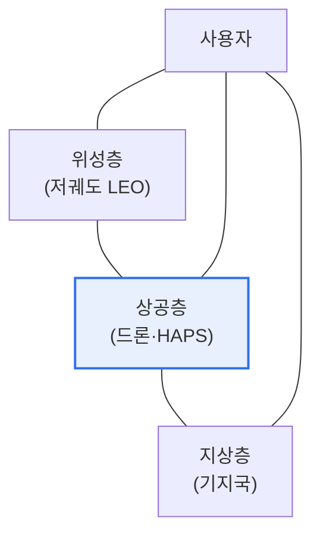

# SATIN(위성-상공-지상 통합형 무선 네트워크)

## 1. 개요

### 가. 정의
> **SATIN(Satellite-Aerial-Terrestrial Integrated Network)** 은 **위성(Satellite)·상공(Aerial, 드론·성층권 기지국)·지상(Terrestrial)** 네트워크를 하나로 통합하여, 지구 어디서나 끊김 없는 통신을 제공하는 6G 지향의 3차원 통합 네트워크다.

SATIN의 핵심 발상은 '**지상망만으로는 지구 전체를 덮을 수 없으니 하늘까지 통신망으로 활용하자**'는 것이다. 현재의 이동통신은 지상 기지국 중심이라, 바다·산악·오지·재난 지역처럼 기지국이 없는 곳은 통신 음영지대가 된다. 지구 표면의 상당 부분이 여전히 연결되지 않은 이유다. SATIN은 이 한계를 3차원으로 확장해 해결한다. 저궤도 위성이 전 지구를 덮고, 드론·성층권 기지국(HAPS)이 상공에서 특정 지역을 유연하게 보강하며, 지상망이 도심의 고용량을 담당한다. 이 세 계층이 유기적으로 연동되어, 사용자는 어디에 있든 가장 적합한 계층에 연결되어 끊김 없이 통신한다. 6G가 지향하는 '전 지구 완전 연결'의 핵심 구조로, 재난·오지·해양 통신의 새 장을 연다.

### 나. 등장 배경
6G 시대의 초연결·완전 커버리지 요구와, 저궤도 위성(스타링크 등)·성층권 통신 기술의 성숙이 지상-공중-위성 통합망을 현실화했다.

## 2. 네트워크 구조와 특징

| 계층 | 역할 | 특징 |
|---|---|---|
| **위성(Satellite)** | 전 지구 커버리지 | 저궤도(LEO) 저지연, 광역 |
| **상공(Aerial)** | 유연한 지역 보강 | 드론·성층권(HAPS), 이동·임시 |
| **지상(Terrestrial)** | 고용량 도심 서비스 | 5G/6G 기지국 |

세 계층이 통합되어, 위치·상황에 따라 최적 계층에 연결되고 계층 간 끊김 없이 이동(핸드오버)한다.

## 3. 활용 방안

| 분야 | 활용 |
|---|---|
| **재난 대비** | 지상망 파괴 시 위성·드론으로 긴급 통신 복구 |
| **UAV 활용** | 드론을 이동 기지국·중계기로 활용, UAV 제어·통신 |
| **낙후지역 서비스** | 오지·도서·해양에 위성으로 통신 제공(디지털 격차 해소) |

재난으로 지상 기지국이 파괴되어도 위성·드론이 즉시 통신을 복구하고, 기지국이 없는 오지·바다에도 위성으로 서비스를 제공해 디지털 격차를 줄인다.

## 4. 고려사항 및 시사점

1. **이종 계층 간 연동이 핵심 기술**이다. 위성·상공·지상은 지연·이동성·용량이 크게 달라, 이들을 매끄럽게 연동하고 계층 간 핸드오버를 처리하는 통합 관리 기술이 관건이다.
2. **6G 완전 커버리지의 기반**이다. 지상 중심의 한계를 넘어 지구 전체·3차원 공간을 연결하는 SATIN은 6G가 지향하는 초연결·비지상망(NTN)의 핵심 구조다.
3. **주파수·표준·보안 과제**가 있다. 위성·지상 주파수 조율, 국제 표준화(3GPP NTN), 넓어진 공격 표면에 대한 보안 확보가 상용화의 선결 과제다.

---

> **한 줄 요약**: SATIN은 *위성·상공(드론·HAPS)·지상 네트워크를 통합* 한 3차원 무선망으로, 재난 통신 복구·UAV 활용·낙후지역 서비스를 실현하며 6G의 전 지구 완전 커버리지(NTN) 기반이 되되 이종 계층 연동·주파수·보안이 과제다.
