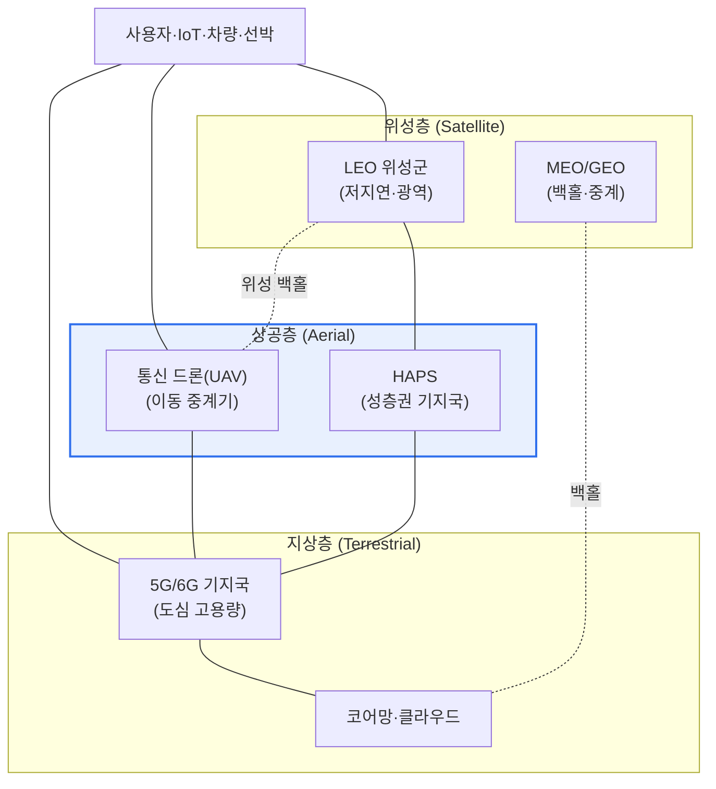
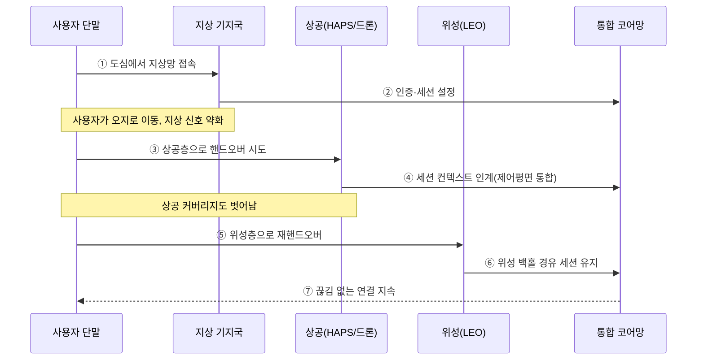

# SATIN(위성-상공-지상 통합형 무선 네트워크)

## 1. 개요

### 가. 정의
> **SATIN(Satellite-Aerial-Terrestrial Integrated Network)** 은 **위성(Satellite)·상공(Aerial, 드론·성층권 기지국)·지상(Terrestrial)** 계층을 하나의 제어·데이터 평면으로 통합하여, 지구 어디서나 끊김 없는 통신을 제공하는 6G 지향의 3차원(3D) 통합 무선 네트워크다.

SATIN의 핵심 발상은 '**지상망만으로는 지구 전체를 덮을 수 없으니 하늘과 우주까지 통신 인프라로 끌어들이자**'는 것이다. 현재의 이동통신은 지상 기지국(gNB)을 촘촘히 세워 서비스하는 구조라, 기지국을 세울 수 없거나 채산성이 맞지 않는 바다·산악·사막·오지·재난 지역은 구조적으로 통신 음영지대가 된다. 지표면의 상당 부분과 해양·공역이 여전히 연결되지 않은 근본 원인이 여기에 있다. SATIN은 이 한계를 수평(면적)이 아니라 수직(고도) 방향으로 확장해 해결한다.

구체적으로 저궤도(LEO) 위성군이 전 지구를 상시 덮어 커버리지의 바닥을 깔고, 드론·성층권 기지국(HAPS)이 상공에서 특정 지역을 유연하게 보강하며, 지상망이 도심의 초고용량 트래픽을 담당한다. 세 계층은 서로 대체재가 아니라 보완재로 동작한다. 즉 사용자는 자신의 위치·이동성·요구 품질에 따라 가장 적합한 계층에 연결되고, 계층 간 이동 시에도 끊김 없이 핸드오버된다. 이 구조는 3GPP가 표준화 중인 **비지상망(NTN, Non-Terrestrial Network)** 개념을 지상망과 유기적으로 융합한 것으로 이해할 수 있으며, 6G가 지향하는 '전 지구 완전 연결(Global Seamless Coverage)'의 핵심 청사진으로 논의된다.

### 나. 등장 배경 및 필요성
SATIN이 부상한 배경에는 세 가지 흐름이 겹친다. 첫째, **수요 측면의 초연결·완전 커버리지 요구**다. 자율주행 선박·항공, 원격 재난 대응, 사물인터넷(IoT)의 전 지구 확산은 '사람이 사는 곳'을 넘어 '지구 표면 전체'에서의 연결을 요구한다. 지상망만으로 이를 채우려면 경제성이 붕괴한다.

둘째, **공급 측면의 기술 성숙**이다. 재사용 발사체로 위성 발사 비용이 급감하면서 수천 기 규모의 저궤도 위성군(예: 스타링크·원웹 등)이 실제로 배치되어, 과거 정지궤도(GEO) 위성의 고지연 한계를 저궤도의 저지연으로 상당 부분 극복했다. 성층권에 오래 머무는 HAPS(고고도 플랫폼)와 통신 중계 드론 기술도 성숙 단계에 접어들었다.

셋째, **표준화의 진전**이다. 3GPP는 Release 17에서 NTN을 정식 규격에 편입했고, 이후 릴리스에서 지상·비지상 통합을 심화하고 있다. 이처럼 수요·기술·표준이 동시에 무르익으면서, 지상-상공-위성을 별개 망이 아니라 '하나의 망'으로 설계하려는 SATIN 개념이 6G 연구의 중심 주제로 올라섰다.

## 2. 네트워크 구조와 계층별 역할

SATIN은 고도에 따라 세 계층으로 쌓이며, 각 계층이 서로 다른 물리적 특성(지연·이동성·용량·커버리지 반경)을 갖는다. 전체 구조를 조감하면 다음과 같다.

```mermaid
flowchart TB
  subgraph SAT["위성층 (Satellite)"]
    S1["LEO 위성군<br/>(저지연·광역)"]
    S2["MEO/GEO<br/>(백홀·중계)"]
  end
  subgraph AER["상공층 (Aerial)"]
    A1["HAPS<br/>(성층권 기지국)"]
    A2["통신 드론(UAV)<br/>(이동 중계기)"]
  end
  subgraph TER["지상층 (Terrestrial)"]
    T1["5G/6G 기지국<br/>(도심 고용량)"]
    T2["코어망·클라우드"]
  end
  S1 --- A1
  A1 --- T1
  S1 -.위성 백홀.- A2
  A2 --- T1
  U["사용자·IoT·차량·선박"] --- S1
  U --- A2
  U --- T1
  T1 --- T2
  S2 -.백홀.- T2
  style AER fill:#e8f0fe,stroke:#2f6fed,stroke-width:2px
```

### 가. 위성층(Satellite) — 커버리지의 바닥
위성층은 전 지구를 예외 없이 덮는 것이 존재 이유다. 특히 고도 약 300~1,500km의 **저궤도(LEO)** 위성군은 전파 왕복거리가 짧아 정지궤도 대비 지연이 획기적으로 낮고, 다수 위성이 촘촘히 돌며 지상의 한 지점을 릴레이하듯 이어받아 서비스한다. 다만 개별 위성이 지평선을 빠르게 가로지르므로, 위성 간 끊김 없는 핸드오버와 정밀한 궤도·빔 관리가 필수다.

위성층의 실무적 함의는 '**최후의 연결(connectivity of last resort)**'을 보장한다는 데 있다. 지상 인프라가 전무하거나 파괴된 상황에서도 하늘에서 신호가 내려오므로, 재난·군사·해양·항공 통신의 안전판이 된다. 반면 광역을 소수 빔으로 덮는 구조상 단위 면적당 용량은 지상망에 크게 못 미치고, 단말의 안테나·전력 요구도 높아, 위성층만으로 도심 트래픽을 감당하려는 설계는 비현실적이다. 이 때문에 위성은 '넓게 얕게', 지상은 '좁게 깊게'라는 역할 분담이 자연스럽게 도출된다.

### 나. 상공층(Aerial) — 유연한 지역 보강
상공층은 성층권(약 18~25km)에 장기 체공하는 **HAPS**와, 필요할 때 띄우는 **통신 드론(UAV)** 으로 구성된다. 위성보다 훨씬 지표에 가까워 지연이 더 짧고 지상 단말과의 링크 품질이 좋으며, 지상 기지국보다 훨씬 넓은 반경을 한 대가 커버한다. 무엇보다 '이동·임시 배치'가 가능하다는 점이 결정적 차별점이다.

이 유연성은 트래픽이 급증하는 특정 지역이나 시점을 겨냥한 '**온디맨드 커버리지**'를 가능케 한다. 예컨대 대형 집회·경기장, 관광 성수기의 도서 지역, 재난 현장처럼 수요가 일시적으로 폭증하는 곳에 드론 기지국을 띄워 용량을 즉시 보강할 수 있다. 위성이 상시·광역이라면 상공층은 국지·탄력의 성격을 갖는 셈이다. 다만 HAPS·드론은 체공 시간·전력·기상 영향이라는 제약을 받으므로, 항구적 인프라가 아니라 지상·위성층을 보완하는 '기동 예비대'로 설계하는 것이 합리적이다.

### 다. 지상층(Terrestrial) — 고용량의 심장
지상층은 기존 5G/6G 기지국과 코어망·클라우드로 구성되며, 인구 밀집 지역의 초고용량·초저지연 서비스를 담당한다. 광케이블 백홀과 조밀한 기지국 배치 덕분에 단위 면적당 처리량이 압도적으로 높고, MEC(Mobile Edge Computing) 등 저지연 응용의 본거지가 된다.

SATIN에서 지상층의 역할은 단순한 '한 계층'을 넘어선다. 대개 코어망·인증·정책 제어의 중심이 지상에 있어, 위성·상공층에서 발생한 트래픽도 결국 지상 코어를 경유해 인증·라우팅·과금된다. 즉 지상층은 용량의 심장인 동시에 **통합 제어의 두뇌** 역할을 겸한다. 따라서 SATIN 설계의 난제는 "어떻게 위성·상공의 트래픽을 지상 코어와 매끄럽게 통합하느냐"로 귀결되며, 이는 3.항의 핵심 기술 논의로 이어진다.

계층별 특성을 한눈에 비교하면 다음과 같다. 이 표는 각 계층이 왜 상호 보완적인지를 '지연·용량·이동성'의 상충 관계로 요약한 것이다.

| 계층 | 대표 고도/구성 | 커버리지 | 지연 | 단위면적 용량 | 성격 |
|---|---|---|---|---|---|
| **위성(LEO)** | 300~1,500km, 위성군 | 전 지구 | 낮음(저궤도) | 낮음 | 상시·광역 |
| **상공(HAPS/드론)** | 성층권~수km | 광역·국지 | 매우 낮음 | 중간 | 탄력·기동 |
| **지상(gNB)** | 지표 기지국 | 국지·도심 | 매우 낮음 | 높음 | 상시·고용량 |

## 3. 핵심 동작 원리와 통합 기술

SATIN이 '세 개의 망'이 아니라 '하나의 망'이 되려면, 사용자가 계층을 넘나들 때 이를 인지하지 못할 만큼 매끄러운 연동이 필요하다. 그 과정을 절차로 표현하면 다음과 같다.

```mermaid
sequenceDiagram
  participant U as 사용자 단말
  participant T as 지상 기지국
  participant A as 상공(HAPS/드론)
  participant S as 위성(LEO)
  participant C as 통합 코어망
  U->>T: ① 도심에서 지상망 접속
  T->>C: ② 인증·세션 설정
  Note over U,T: 사용자가 오지로 이동, 지상 신호 약화
  U->>A: ③ 상공층으로 핸드오버 시도
  A->>C: ④ 세션 컨텍스트 인계(제어평면 통합)
  Note over U,A: 상공 커버리지도 벗어남
  U->>S: ⑤ 위성층으로 재핸드오버
  S->>C: ⑥ 위성 백홀 경유 세션 유지
  C-->>U: ⑦ 끊김 없는 연결 지속
```

### 가. 이종 계층 간 끊김 없는 핸드오버
가장 근본적인 기술 과제는 특성이 판이한 계층 사이를 오갈 때 세션을 유지하는 것이다. 지상↔상공↔위성은 지연·도플러 편이·신호 세기·이동 패턴이 모두 다르다. 특히 LEO 위성은 스스로 초속 수 km로 이동하므로, 단말이 정지해 있어도 접속 위성이 계속 바뀌는 '이동하는 인프라' 문제가 생긴다.

이를 풀려면 계층·위성의 위치와 채널 상태를 미리 예측해 선제적으로 핸드오버를 준비하는 지능형 이동성 관리가 필요하다. 통합 코어가 세션 컨텍스트(인증·베어러·정책)를 계층에 독립적으로 보관하고 인계함으로써, 물리 계층이 바뀌어도 논리 세션은 끊기지 않게 한다. 이 '제어평면 통합'이 SATIN의 성패를 가르는 핵심이다.

### 나. 통합 자원·주파수 관리
세 계층은 한정된 무선 자원과 주파수를 공유해야 하므로 간섭 회피와 동적 자원 할당이 중요하다. 위성·지상이 인접 대역을 쓰거나 공유할 경우 상호 간섭을 조율해야 하고, 트래픽 수요에 따라 어느 계층이 어느 지역을 담당할지를 실시간으로 배분해야 한다. 여기서 AI 기반의 예측·최적화가 유력한 수단으로 논의된다. 예컨대 재난이 예상되는 지역에 사전에 상공·위성 자원을 편성해두는 식이다.

### 다. 지능형 계층 선택과 SDN/NFV
사용자마다 최적 계층이 다르고 시간에 따라 변하므로, 어느 계층에 붙일지를 결정하는 정책 엔진이 필요하다. 저지연이 중요한 응용은 가까운 지상·상공층으로, 커버리지가 없는 지역은 위성층으로 보내는 식의 라우팅이 상황 인지형으로 이뤄져야 한다. 망 전체를 소프트웨어로 유연하게 재구성하는 **SDN/NFV**와, 계층별 요구가 다른 서비스를 논리적으로 분리하는 **네트워크 슬라이싱**이 이러한 통합 제어를 실현하는 기반 기술로 함께 논의된다.

## 4. 활용 방안 및 사례

SATIN의 가치는 '지상망이 닿지 않거나 무력화된 상황'에서 가장 뚜렷하게 드러난다. 각 활용은 앞서 본 계층별 특성이 실제 문제에 어떻게 맞물리는지를 보여준다.

| 분야 | 핵심 계층 | 활용 내용 |
|---|---|---|
| **재난 대응** | 위성·상공 | 지상망 파괴 시 위성·드론으로 긴급 통신 즉시 복구 |
| **UAV/무인 이동체** | 상공·위성 | 드론을 이동 기지국·중계기로 활용, UAV·자율주행 제어 링크 |
| **오지·해양·항공** | 위성 | 도서·사막·원양·항공기에 상시 통신 제공(디지털 격차 해소) |
| **IoT·센서망** | 위성 | 전 지구 저전력 센서의 데이터 수집(환경·물류 추적) |

첫째, **재난 대응**에서 SATIN은 특히 빛을 발한다. 지진·홍수로 지상 기지국이 붕괴되면 통상 통신이 마비되는데, 이때 통신 드론을 재난 상공에 띄우고 위성 백홀로 외부와 연결하면 몇 시간 내에 임시 통신망을 세울 수 있다. 실제로 대형 자연재해 이후 위성 인터넷 단말과 통신 드론이 응급 통신 복구에 투입된 사례가 보고되며, 이는 SATIN이 지향하는 다계층 회복력의 축소판이다.

둘째, **무인 이동체 제어**다. 자율주행 드론·선박·차량은 통신 음영에서도 제어 링크가 끊기면 안 되므로, 위성·상공층이 지상 커버리지의 빈틈을 메워 연속적 제어를 보장한다. 동시에 드론 자체를 이동 중계기로 재활용해 커버리지를 확장하는 이중 역할도 가능하다.

셋째, **디지털 격차 해소와 IoT**다. 인구 밀도가 낮아 지상 기지국의 채산성이 없는 도서·산간·원양에도 위성으로 브로드밴드와 저전력 IoT 연결을 제공함으로써, 통신 소외 지역을 줄이고 환경 모니터링·물류 추적 같은 전 지구 규모의 센싱을 가능케 한다.

## 5. 심화 — 6G·NTN 표준화 동향과 국내 대응

SATIN은 단일 완성 규격이라기보다, 6G를 향한 여러 표준·연구 흐름이 수렴하는 '방향'에 가깝다. 사실관계가 빠르게 갱신되는 영역이므로 세부 수치·일정은 일반화해 이해하는 것이 안전하다.

표준화 측면에서 3GPP는 Release 17에서 NTN을 정식 편입한 이후, 후속 릴리스에서 지상·비지상의 통합, 저궤도 위성 이동성, IoT-NTN 등을 지속 확장하고 있다. 국제전기통신연합(ITU)은 6G(IMT-2030) 비전에서 '유비쿼터스 연결(ubiquitous connectivity)'을 핵심 사용 시나리오의 하나로 제시하는데, 이는 사실상 위성·상공·지상 통합을 전제한다. 즉 SATIN적 사고는 6G 표준의 밑그림에 이미 반영되어 있다.

산업 측면에서는 위성 사업자와 이동통신 사업자의 경계가 허물어지는 흐름이 두드러진다. 저궤도 위성군 운용사와 통신사가 제휴해 일반 스마트폰이 위성과 직접 통신하는 'direct-to-cell(단말 직접 위성 연결)' 서비스가 상용화 초기 단계에 접어들었고, 이는 SATIN이 실험실 개념을 넘어 시장으로 내려오고 있음을 보여준다. 국내에서도 6G 및 저궤도 위성통신 관련 연구개발과 주파수·표준 대응이 국가 차원에서 추진되고 있어, 기술사 관점에서는 표준·주파수·산업 정책이 맞물린 융합 이슈로 접근할 필요가 있다.

## 6. 고려사항 및 시사점 (기술사 관점)

1. **이종 계층 연동이 최대 기술 관건이다.** 위성·상공·지상은 지연·이동성·용량이 근본적으로 달라, 이를 하나의 제어평면으로 묶고 계층 간 핸드오버·세션 인계를 매끄럽게 처리하는 통합 관리 기술이 SATIN의 성패를 좌우한다. 여기에 AI 기반 이동성·자원 예측이 결합되어야 실효성이 생긴다.

2. **주파수·표준·규제 조율이 상용화의 선결 조건이다.** 위성·지상 주파수의 공유·간섭 조율, 국가 간 궤도·주파수 배분, 3GPP NTN 표준의 성숙이 병행되지 않으면 기술이 있어도 서비스가 불가능하다. 특히 국경을 넘나드는 위성 특성상 국제 협력·규제 정합성이 지상망보다 훨씬 중요하다.

3. **보안·회복력 관점의 재설계가 필요하다.** 계층이 늘고 무선 링크가 하늘·우주로 확장되면 공격 표면이 넓어진다. 신호 재밍·스푸핑, 위성 링크 도청, 계층 간 인증 우회 같은 새로운 위협에 대비한 종단 간 암호화·상호 인증·이상 탐지가 요구된다. 반대로 다계층 이중화는 회복력을 높이는 장점이므로, 보안과 회복력을 함께 설계하는 균형이 중요하다.

4. **경제성·전력·지속가능성의 트레이드오프를 고려해야 한다.** 위성 발사·운용, HAPS·드론 체공, 지상망 증설은 각기 비용·전력·환경 부담이 다르다. 어느 계층을 얼마나 투입할지는 커버리지 목표와 트래픽 수요에 대한 비용-편익 분석 위에서 결정해야 하며, 저궤도 위성군의 우주 쓰레기·주파수 혼잡 같은 지속가능성 이슈도 정책적으로 함께 다뤄야 한다.

## 참고자료
- 3GPP, "Non-Terrestrial Networks (NTN)" — https://www.3gpp.org/technologies/ntn-overview
- ITU-R, IMT-2030 (6G) Framework — https://www.itu.int/en/ITU-R/study-groups/rsg5/rwp5d/imt-2030/Pages/default.aspx

---

> **한 줄 요약**: SATIN은 *위성(광역)·상공(드론·HAPS, 탄력)·지상(고용량)* 을 하나의 제어평면으로 통합한 3차원 무선망으로, 재난 통신 복구·UAV 제어·오지 서비스를 실현하며 6G의 전 지구 완전 커버리지(NTN) 기반이 되되 이종 계층 연동·주파수·보안·경제성이 핵심 과제다.
