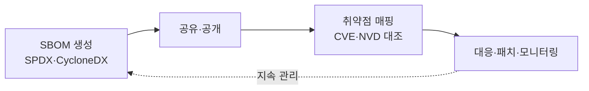

# SBOM(Software Bill of Materials)

## 1. 개요

### 가. 정의
> 소프트웨어를 구성하는 **모든 컴포넌트·라이브러리·의존성과 그 버전·라이선스 정보를 목록화**한 명세서. 제조업의 자재명세서(BOM)에서 개념을 빌려온 것으로, 소프트웨어 공급망 보안(SSC)의 핵심 산출물이다.

SBOM의 근본 취지는 "**보이지 않으면 관리할 수 없다**"는 데 있다. 현대 애플리케이션은 코드의 절반 이상이 직접 작성한 것이 아니라 외부 오픈소스로 채워지는데, 정작 그 안에 무엇이 들어 있는지 목록조차 없는 경우가 많다. SBOM은 이 "소프트웨어의 성분표"를 명시화해 취약점·라이선스 리스크를 관리 대상으로 끌어올린다.

### 나. 등장 배경 및 필요성
오픈소스 의존성이 폭증하면서 하나의 앱이 직간접적으로 수백~수천 개 컴포넌트에 의존하게 되었고, 그 안의 결함 하나가 전체 공급망으로 번지는 사고가 잇따랐다. 빌드 시스템을 오염시킨 **SolarWinds**, 널리 쓰이는 로깅 라이브러리의 치명적 결함인 **Log4Shell(Log4j)** 이 대표적이다. Log4Shell 당시 많은 조직이 "우리 시스템이 Log4j를 쓰는지조차 파악하지 못해" 대응이 늦어졌는데, SBOM이 있었다면 즉시 영향 범위를 식별할 수 있었다. 이런 배경에서 미국 행정명령(**EO 14028**) 이후 공공 조달 소프트웨어에 SBOM 제출이 의무화되며 확산되었다.

## 2. SBOM 구성요소·표준 포맷

SBOM이 실효성을 가지려면 사람이 아니라 도구가 자동으로 해석할 수 있어야 하므로, 기계 판독이 가능한 **표준 포맷**으로 작성하는 것이 중요하다. 포맷이 표준화되어야 서로 다른 조직·도구 간에 SBOM을 주고받고 자동 대조할 수 있다.

| 구분 | 내용 |
|---|---|
| **구성요소** | 컴포넌트명·버전, 공급자, 의존관계, 라이선스, 해시(무결성 검증) |
| **표준 포맷** | **SPDX**(Linux재단, ISO 표준), **CycloneDX**(OWASP, 보안 특화), SWID |

SPDX는 라이선스·규정 준수에 강점이 있고 국제표준(ISO/IEC 5962)으로 채택되었으며, CycloneDX는 취약점·공급망 보안 활용에 초점을 둔다. 해시를 포함하는 이유는, 명세된 컴포넌트가 실제 배포물과 동일한지(변조 여부)를 검증하기 위함이다.

## 3. 관리 대상: 오픈소스 취약점

SBOM으로 가시화하려는 리스크는 크게 네 가지이며, 그 중 **전이(transitive) 의존성**이 가장 까다롭다. 내가 직접 가져온 라이브러리가 또 다른 라이브러리를 부르는 다단계 구조라, 정작 문제가 되는 컴포넌트는 눈에 보이지 않는 깊은 곳에 잠복하기 때문이다.

| 취약점 | 내용 |
|---|---|
| **알려진 취약점(CVE)** | Log4j 등 공개된 결함이 전이 의존성에 잠복 |
| **의존성 리스크** | 다단계 전이 의존성으로 무엇을 쓰는지 파악 곤란 |
| **라이선스 위반** | GPL 등 카피레프트 라이선스 미준수 시 법적 리스크 |
| **유지보수 중단·악성** | EOL(지원 종료) 패키지, 악성 주입(Typosquatting) |

라이선스 위반이 보안 못지않게 중요한 이유는, GPL 같은 카피레프트 라이선스를 모르고 포함하면 자사 소스코드 공개 의무가 발생하는 등 **법적·사업적 리스크**로 직결되기 때문이다.

## 4. SBOM 기반 관리 방안

SBOM은 한 번 만들고 끝나는 문서가 아니라 **생성→매핑→대응→재생성이 순환하는 지속 프로세스**여야 한다. 새로운 CVE는 매일 공개되므로, 어제까지 안전하던 컴포넌트가 오늘 취약해질 수 있기 때문이다.

| 단계 | 방안 |
|---|---|
| **생성** | CI/CD 빌드 시점에 SBOM 자동 생성(정확성·최신성 확보) |
| **분석(SCA)** | SCA 도구로 구성요소·취약점·라이선스 스캔 |
| **매핑** | CVE/NVD 데이터베이스와 대조해 취약 컴포넌트 식별 |
| **대응·모니터링** | 패치·업그레이드, 신규 CVE 공개를 지속 감시 |

핵심은 SBOM 생성을 사람 손이 아니라 **빌드 파이프라인에 자동 통합**하는 것이다. 수작업 명세는 금세 실제 코드와 어긋나 신뢰할 수 없게 되므로, 빌드마다 실제 산출물에서 SBOM을 뽑아내야 한다.

## 5. 고려사항 및 시사점
SBOM은 공급망 투명성의 기반이지만, 취약점 목록만으로는 실제 위험을 과대평가하기 쉽다. 어떤 컴포넌트에 CVE가 있어도 **해당 코드 경로가 실제로 실행되지 않으면 위험하지 않을 수** 있다. 그래서 "이 취약점이 우리 제품에서 실제로 악용 가능한가"를 알려주는 **VEX(Vulnerability Exploitability eXchange)** 와 결합해 대응 우선순위를 정하는 것이 기술사 관점의 핵심이다. 운영 측면에서는 SBOM·SCA·VEX를 **DevSecOps 파이프라인에 자동 통합**해 생성·분석·대응을 상시화해야 하며, 국내에서도 SW 공급망 보안 가이드와 의무화가 확산되는 흐름에 맞춰 조직 차원의 SBOM 관리 체계를 선제적으로 구축할 필요가 있다.

---

> **한 줄 요약**: SBOM은 소프트웨어 구성요소를 SPDX·CycloneDX로 목록화해 *오픈소스 취약점·라이선스 리스크를 가시화* 하고, *빌드 시 자동 생성→SCA 스캔→CVE 매핑→VEX 우선순위화→모니터링* 의 지속 프로세스로 공급망 보안을 관리하는 기반이다.
