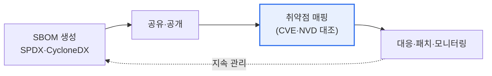

# SBOM(Software Bill of Materials)

## 1. 개요

### 가. 정의
> 소프트웨어를 구성하는 **모든 컴포넌트·라이브러리·의존성과 라이선스·버전 정보를 목록화**한 명세서. 공급망 보안(SSC)의 핵심 산출물로, 미국 행정명령(EO 14028) 이후 의무화 확산.

### 나. 필요성
- 오픈소스 의존성 급증 → **취약점·라이선스 리스크 가시성** 확보
- 소프트웨어 공급망 공격(SolarWinds, Log4Shell) 대응

## 2. 오픈소스 소프트웨어 취약점 (가)

| 취약점 | 내용 |
|---|---|
| **알려진 취약점(CVE)** | Log4j 등 공개된 보안 결함, 전이적 의존성에 잠복 |
| **의존성 리스크** | 다단계 전이 의존성으로 취약점 파악 곤란 |
| **라이선스 위반** | GPL 등 카피레프트 미준수 시 법적 리스크 |
| **유지보수 중단** | 방치된(EOL) 패키지, 악성 패키지 주입(Typosquatting) |

## 3. SBOM 기반 오픈소스 관리 방안 (나)

| 단계 | 방안 |
|---|---|
| **생성** | 빌드 시 SBOM 자동 생성(표준 포맷: SPDX·CycloneDX·SWID) |
| **분석(SCA)** | SCA 도구로 구성요소·취약점·라이선스 스캔 |
| **매핑** | CVE/NVD와 대조해 취약 컴포넌트 식별 |
| **대응·모니터링** | 패치·버전 업그레이드, 지속적 감시(신규 CVE 알림) |

## 4. 시사점
- SBOM은 **공급망 투명성**의 기반 — "보이지 않으면 관리 못함"
- DevSecOps 파이프라인에 SBOM·SCA **자동 통합**
- VEX(취약점 활용성 정보)와 결합해 대응 우선순위화

---

> **한 줄 요약**: SBOM은 소프트웨어 구성요소를 목록화해 *오픈소스 취약점·라이선스 리스크를 가시화* 하고, *생성(SPDX/CycloneDX)→SCA 스캔→CVE 매핑→모니터링* 으로 공급망 보안을 관리한다.
