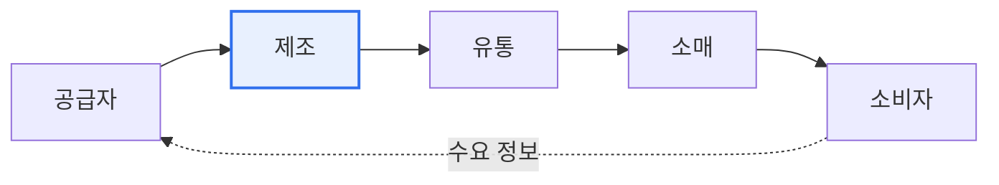

# 공급망관리(SCM, Supply Chain Management)

## 1. 개요

### 가. 개념과 중요성 대두 배경
> **SCM**은 원자재 조달부터 생산·유통·최종 소비자에 이르는 **공급망 전체의 흐름(자재·정보·자금)을 통합 관리·최적화**하여, 비용을 낮추고 고객 가치를 높이는 경영 기법이다.

SCM이 중요해진 배경에는 '**공급망 리스크가 곧 기업 존폐로 직결된다**'는 현실이 있다. 코로나19로 인한 물류 대란, 반도체 대란처럼 공급망 한 곳이 끊기면 전 산업이 마비되는 것을 목격하면서, 재고와 공급망 관리가 단순 비용 절감을 넘어 위기 대응 역량이 되었다. 공급망은 여러 기업이 사슬처럼 연결되어 있어, 한 지점의 지연·부족이 전체로 증폭되어 전파되는 **채찍 효과(Bullwhip Effect)** 가 발생한다. 최종 수요의 작은 변동이 상류로 갈수록 크게 부풀려져 과잉·부족 재고를 낳는 것이다. SCM은 공급망 전체의 정보를 공유·통합해 이 채찍 효과를 줄이고, 수요를 정확히 예측해 적정 재고를 유지함으로써 비용과 위기 대응을 함께 최적화한다.

### 나. 필요성
글로벌 분업과 불확실성 증대로 공급망이 복잡·취약해지면서, 전체를 가시화하고 최적화하는 통합 관리가 경쟁력의 핵심이 되었다.

## 2. SCM 흐름과 채찍 효과

SCM은 자재의 하류 흐름과 수요·정보의 상류 흐름을 통합 관리한다. 정보가 공유되지 않으면 상류로 갈수록 수요 예측이 부풀려지는 채찍 효과가 커지므로, 실시간 정보 공유가 핵심이다.

## 3. 수요 예측과 재고 산정

수요 예측은 대개 ①목표 설정 → ②대상·기간 결정 → ③데이터 수집 → ④예측 기법 선정 → ⑤예측 실행 → ⑥검증 → ⑦적용의 단계로 진행한다. 예측 기법은 크게 나뉜다.

| 예측 기법 | 내용 |
|---|---|
| **정성적** | 델파이·전문가 의견(신제품·데이터 부족 시) |
| **시계열** | 이동평균·지수평활·ARIMA(과거 추세) |
| **인과형** | 회귀분석(영향 요인 기반) |
| **AI 기반** | 머신러닝 수요예측 |

재고는 수요·공급의 불확실성에 대비한다. **안전재고** 는 수요·리드타임 변동에 대비한 여유 재고로, 수요 표준편차·리드타임·서비스 수준(안전계수)으로 산정한다. **적정재고** 는 재고 유지비와 부족비의 균형점에서 결정한다.

## 4. 고려사항 및 시사점

1. **정보 공유로 채찍 효과 완화**가 핵심이다. 공급망 참여자 간 실시간 수요·재고 정보를 공유(CPFR·VMI)하면 예측 정확도가 오르고 과잉·부족 재고가 줄어든다.
2. **디지털 공급망(Digital SCM)** 으로 진화한다. IoT·빅데이터·AI로 공급망을 실시간 가시화하고 수요를 정밀 예측하며, 디지털 트윈으로 시뮬레이션해 위기에 선제 대응한다.
3. **회복탄력성(Resilience) 확보**가 중요해졌다. 효율(비용 최소화)만 추구하던 공급망에서, 공급처 다변화·재고 버퍼 등으로 위기에도 끊기지 않는 회복탄력적 공급망으로 전환하고 있다.

---

> **한 줄 요약**: SCM은 *조달-생산-유통-소비 공급망 전체를 통합 최적화* 하는 기법으로, 정보 공유로 채찍 효과를 완화하고 수요 예측·안전재고로 적정 재고를 유지하며, 디지털 SCM과 회복탄력성 확보로 발전하고 있다.
