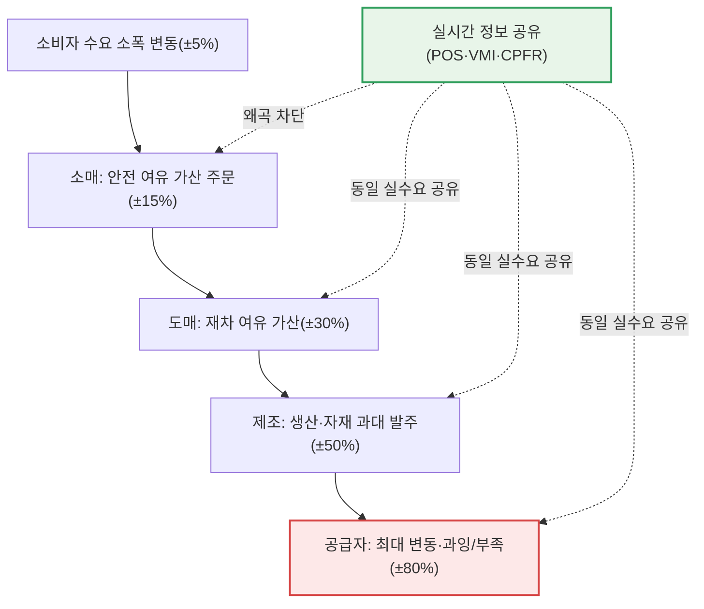

# 공급망관리(SCM, Supply Chain Management)

## 1. 개요

### 가. 개념과 중요성 대두 배경
> **SCM**은 원자재 조달부터 생산·유통·최종 소비자에 이르는 **공급망 전체의 흐름(자재·정보·자금)을 통합 관리·최적화**하여, 비용을 낮추고 고객 가치를 높이는 경영 기법이다.

SCM이 중요해진 배경에는 '**공급망 리스크가 곧 기업 존폐로 직결된다**'는 현실이 있다. 과거 SCM은 재고를 줄여 비용을 아끼는 효율화 도구로 이해되었으나, 최근에는 위기 상황에서 공급을 끊기지 않게 하는 생존 역량으로 그 위상이 바뀌었다. 코로나19로 인한 글로벌 물류 대란, 2021년 이후의 차량용 반도체 대란처럼 공급망의 한 지점이 끊기면 완성차·전자 등 전 산업이 감산·중단에 몰리는 것을 목격하면서, 재고와 공급망 관리가 단순 비용 절감을 넘어 국가·기업의 위기 대응 역량이 되었다.

공급망은 여러 기업이 사슬처럼 연결되어 있어, 한 지점의 지연·부족이 전체로 증폭되어 전파되는 **채찍 효과(Bullwhip Effect)** 가 발생한다는 구조적 취약성을 갖는다. 최종 소비자의 수요는 소폭만 변했는데도, 소매→도매→제조→공급자로 상류로 갈수록 각 단계가 안전을 위해 주문을 부풀리면서 변동 폭이 눈덩이처럼 커진다. 채찍의 손잡이를 조금만 흔들어도 끝단이 크게 요동치는 데서 이름이 유래했다. 그 결과 상류 기업은 과잉·부족 재고를 반복하며 막대한 비용을 떠안는다.

SCM은 공급망 전체의 정보를 공유·통합해 이 채찍 효과를 줄이고, 수요를 정확히 예측해 적정 재고를 유지함으로써 비용과 위기 대응을 함께 최적화한다. 핵심 통찰은 '**개별 기업의 국소 최적화가 아니라 공급망 전체의 전역 최적화**'를 추구한다는 점이다. 각 기업이 자기 재고만 최소화하려 하면 오히려 전체 채찍 효과가 커지므로, 참여자들이 수요·재고 정보를 공유하고 협업할 때 비로소 전체 비용이 내려간다.

### 나. 등장 배경과 필요성
SCM 개념이 부상한 근본 원인은 글로벌 분업의 심화다. 하나의 스마트폰이 수십 개국 수백 개 협력사의 부품으로 만들어지는 시대에, 공급망은 길고 복잡하며 취약해졌다. 자연재해·전쟁·감염병·무역분쟁 같은 불확실성이 공급망 어느 지점에서든 발생할 수 있고, 그 충격이 전 세계로 즉시 전파된다. 이런 환경에서 공급망 전체를 실시간으로 가시화(visibility)하고 최적화하는 통합 관리 없이는, 단일 기업의 효율만으로 경쟁력을 유지할 수 없게 되었다. 즉 SCM은 '기업 간 경쟁이 아니라 공급망 간 경쟁'이라는 인식 전환의 산물이다.

또한 고객의 기대 수준이 높아진 것도 SCM의 필요성을 키웠다. 전자상거래의 확산으로 '당일·익일 배송'이 표준이 되면서, 기업은 재고를 최소화하면서도 빠르게 대응해야 하는 상충된 요구를 동시에 만족시켜야 한다. 이 딜레마는 개별 물류 부서의 노력만으로는 풀리지 않으며, 조달·생산·유통·판매를 하나로 꿰는 공급망 차원의 통합 최적화를 통해서만 해소된다.

## 2. SCM의 구성과 자재·정보·자금의 흐름

SCM이 관리하는 대상은 크게 세 가지 흐름, 즉 하류로 흐르는 자재(제품), 상류로 흐르는 수요·정보, 그리고 반대 방향으로 흐르는 자금이다. 아래 전체 구조도는 이 흐름들이 공급망을 따라 어떻게 순환하는지를 보여준다.

```mermaid
flowchart LR
  S["공급자(원자재)"] --> M["제조(생산)"]
  M --> D["유통(물류)"]
  D --> R["소매"]
  R --> C["소비자"]
  C -. "수요·판매 정보(상류 전파)" .-> R
  R -. "주문 정보" .-> D
  D -. "주문 정보" .-> M
  M -. "발주 정보" .-> S
  style M fill:#e8f0fe,stroke:#2f6fed,stroke-width:2px
  style D fill:#fef3e8,stroke:#ed9b2f,stroke-width:2px
```

**자재의 하류 흐름**은 원자재가 부품·반제품·완제품으로 가공되며 소비자를 향해 이동하는 물리적 흐름이다. 이 흐름의 목표는 필요한 물건을 필요한 때·장소에 최소 비용으로 전달하는 것(JIT, Just-In-Time의 이상)이며, 리드타임 단축과 물류 최적화가 핵심 과제다. 재고는 이 흐름의 완충 장치인 동시에 비용의 원천이어서, 재고를 얼마나 둘지가 SCM의 중심 의사결정이 된다.

**정보의 상류 흐름**은 소비자의 실제 수요·판매 데이터가 소매에서 제조·공급자로 거슬러 올라가는 흐름이다. 이 흐름이 단절되어 각 단계가 바로 아래 단계의 '주문'만 보고 판단하면, 실제 소비자 수요가 아니라 왜곡된 주문 신호에 반응하게 되어 채찍 효과가 폭증한다. 따라서 SCM의 승부처는 이 정보 흐름을 얼마나 실시간으로, 왜곡 없이 공유하느냐에 있다. POS(판매시점) 데이터를 공급자와 직접 공유하는 것이 대표적 해법이다.

**자금의 흐름**은 소비자의 지불이 소매→제조→공급자로 역류하는 흐름으로, 최근에는 공급망 금융(SCF)으로 확장되어 협력사의 자금 부담을 완화하고 공급망 전체의 안정성을 높이는 수단이 되었다. 세 흐름을 통합해 보는 관점이 SCM을 개별 물류·구매 관리와 구별짓는 본질이다.

## 3. 채찍 효과의 발생 원인과 완화 기법

채찍 효과는 SCM이 해결하려는 핵심 문제이므로 그 원인과 대책을 별도로 깊이 볼 필요가 있다. 채찍 효과는 대체로 네 가지 원인에서 비롯된다. 첫째는 **수요 예측의 갱신**으로, 각 단계가 주문을 받을 때마다 미래 수요를 상향 조정해 안전 여유를 얹기 때문이다. 둘째는 **일괄 주문(batching)** 으로, 주문·운송 비용을 아끼려 한꺼번에 크게 주문하면 수요 신호가 뭉쳐 왜곡된다. 셋째는 **가격 변동(판촉)** 으로, 할인 때 대량 구매·이후 구매 중단이 반복되며 수요가 널뛴다. 넷째는 **부족 시 과대 주문(rationing)** 으로, 공급이 부족할 것 같으면 실제 필요량보다 부풀려 주문하는 심리다.

아래 프로세스 세부도는 최종 수요의 작은 변동이 상류로 갈수록 증폭되는 채찍 효과의 메커니즘과, 정보 공유가 이 고리를 어떻게 끊는지를 보여준다.

```mermaid
flowchart TB
  C["소비자 수요 소폭 변동(±5%)"] --> R["소매: 안전 여유 가산 주문(±15%)"]
  R --> W["도매: 재차 여유 가산(±30%)"]
  W --> M["제조: 생산·자재 과대 발주(±50%)"]
  M --> S["공급자: 최대 변동·과잉/부족(±80%)"]
  SHARE["실시간 정보 공유(POS·VMI·CPFR)"] -. "왜곡 차단" .-> R
  SHARE -. "동일 실수요 공유" .-> W
  SHARE -. "동일 실수요 공유" .-> M
  SHARE -. "동일 실수요 공유" .-> S
  style S fill:#fde8e8,stroke:#d64545,stroke-width:2px
  style SHARE fill:#e8f5e9,stroke:#2e9e5b,stroke-width:2px
```

여기서 각 단계의 변동 폭(±5→±80%)은 개념적 예시로, 실제 값은 산업·품목에 따라 다르지만 '상류로 갈수록 증폭된다'는 방향성은 여러 실증 연구에서 공통으로 관찰된다. 이 원인들의 공통점은 '각 단계가 실제 소비자 수요가 아니라 바로 아래 단계의 왜곡된 주문에 반응한다'는 점이다. 따라서 완화의 핵심은 정보 공유로 모든 단계가 동일한 실수요를 보게 하는 것이다. 대표 기법으로 **VMI(공급자 주도 재고관리)** 는 공급자가 소매의 재고·판매 데이터를 직접 보고 보충량을 결정해 중간 왜곡을 제거한다. **CPFR(협업적 계획·예측·보충)** 은 참여 기업들이 하나의 수요 예측을 공동 수립·공유해 예측을 일치시킨다. 실제로 P&G와 월마트가 기저귀 공급망에서 POS 데이터를 실시간 공유해 채찍 효과를 줄인 사례가 VMI/CPFR의 효과를 보여주는 고전적 예다.

## 4. 수요 예측과 재고 산정

수요 예측은 SCM의 출발점이며, 예측이 정확해야 적정 재고를 유지할 수 있다. 예측은 대개 ①목표 설정 → ②대상·기간 결정 → ③데이터 수집 → ④예측 기법 선정 → ⑤예측 실행 → ⑥검증 → ⑦적용의 단계로 진행한다. 각 단계에서 예측 오차를 측정(MAPE 등)하고 지속 보정하는 것이 실무의 핵심으로, 한 번의 예측이 아니라 실제와 비교하며 반복 개선하는 순환 과정이다.

예측 기법은 데이터의 유무·성격에 따라 다음과 같이 나뉜다. 신제품처럼 과거 데이터가 없으면 정성적 기법을, 안정적 과거 추세가 있으면 시계열을, 명확한 영향 요인이 있으면 인과형을, 대량·다변수 데이터가 있으면 AI 기반을 선택한다. 하나만 쓰기보다 여러 기법을 조합(앙상블)하는 것이 실무에서 정확도를 높인다.

| 예측 기법 | 대표 방법 | 적용 상황 |
|---|---|---|
| **정성적** | 델파이·전문가 의견 | 신제품·데이터 부족 시 |
| **시계열** | 이동평균·지수평활·ARIMA | 과거 추세·계절성이 뚜렷할 때 |
| **인과형** | 회귀분석 | 가격·프로모션 등 영향 요인이 명확할 때 |
| **AI 기반** | 머신러닝·딥러닝 수요예측 | 대량·비정형·다변수 데이터 |

재고는 수요·공급의 불확실성에 대비하는 완충 장치다. **안전재고(Safety Stock)** 는 수요·리드타임 변동에 대비한 여유 재고로, 대략 `안전계수(Z) × 수요의 표준편차 × √리드타임`으로 산정한다. 여기서 안전계수는 목표 서비스 수준에 대응하는데, 예컨대 결품을 5%까지 허용하는 95% 서비스 수준이면 Z는 약 1.65다. 서비스 수준을 99%로 올리면 Z가 약 2.33으로 커져 안전재고와 비용이 급증하므로, 결품 손실과 재고 유지비를 저울질해 목표 수준을 정해야 한다.

**적정재고**는 재고를 더 두어 얻는 결품 방지 이익(부족비 감소)과, 그로 인해 늘어나는 재고 유지비(자본비·보관비·진부화)의 균형점에서 결정된다. 경제적 주문량(EOQ) 모형이 이 균형을 수식화한 고전적 예다. 재고를 무조건 줄이는 것이 능사가 아니라, 결품이 매출·신뢰에 미치는 손실까지 함께 계산해야 한다는 것이 핵심이다.

모든 품목을 동일하게 관리할 수는 없으므로 실무에서는 **ABC 재고 분류** 로 중요도를 차등화한다. 파레토 법칙에 따라 대개 전체 품목의 상위 약 20%(A등급)가 매출·재고가치의 약 80%를 차지하는데, A등급은 엄격한 실시간 관리와 잦은 점검·정밀 예측을 적용하고, C등급(다수·저가치)은 관리 비용을 아끼기 위해 넉넉한 안전재고와 단순 보충 규칙을 쓴다. 이처럼 '중요한 소수에 관리 역량을 집중'하는 차등 전략이 한정된 자원으로 공급망 전체를 효율화하는 실무의 정석이다.

## 5. Push·Pull 전략과 SCOR 참조모델

SCM을 실제로 설계할 때는 '무엇을 기준으로 생산·보충을 촉발할 것인가'라는 운영 전략을 정해야 하며, 이는 크게 Push와 Pull로 나뉜다. **Push(밀어내기)** 방식은 수요 예측에 근거해 미리 생산·재고를 채워 하류로 밀어내는 방식으로, 규모의 경제와 안정적 가동률을 얻지만 예측이 틀리면 과잉·부족 재고와 채찍 효과가 커진다. 계절성이 뚜렷하고 리드타임이 긴 제조업(가전·의류)에서 흔하다.

**Pull(끌어당기기)** 방식은 실제 수요가 발생한 뒤에 그 신호로 생산·보충을 촉발하는 방식으로, 도요타의 JIT·간판(Kanban)이 대표적이다. 재고를 최소화하고 채찍 효과를 억제하지만, 수요 급변에 대한 완충이 얇아 공급 충격에 취약하다. 현실의 기업은 둘을 결합한 **Push-Pull 혼합** 을 쓴다. 예컨대 델(Dell)은 표준 부품은 예측 기반으로 미리 확보(Push)하되, 최종 조립은 고객 주문 후 수행(Pull)하는 방식으로 재고와 대응성을 동시에 잡았다. 어느 지점에서 Push를 Pull로 전환할지(디커플링 포인트)를 정하는 것이 SCM 설계의 핵심 판단이다.

| 구분 | Push(예측 기반) | Pull(수요 기반) |
|---|---|---|
| 촉발 기준 | 수요 예측 | 실제 주문·소비 |
| 재고 수준 | 높음(선제 비축) | 낮음(적시 보충) |
| 강점 | 규모의 경제·가동률 | 채찍효과 억제·재고 절감 |
| 약점 | 과잉·진부화 위험 | 수요 급변에 취약 |

디커플링 포인트를 하류(소비자)에 가깝게 둘수록 재고는 늘지만 대응 속도가 빨라지고, 상류로 옮길수록 재고는 줄지만 리드타임이 길어진다. 따라서 이 지점은 제품의 수요 변동성과 고객이 감내하는 대기시간을 함께 고려해 결정해야 하며, 하나의 정답이 아니라 품목별 전략적 선택의 문제다.

한편 SCM의 성숙도를 진단·개선하려면 공통 참조모델이 필요한데, 대표적인 것이 **SCOR(Supply Chain Operations Reference)** 모델이다. SCOR는 공급망 프로세스를 계획(Plan)·조달(Source)·생산(Make)·배송(Deliver)·반품(Return), 그리고 이를 관통하는 관리(Enable)의 표준 범주로 나누고, 각 프로세스의 성과지표(비용·대응시간·유연성·자산효율 등)를 정의한다. 이를 통해 기업은 자사 공급망을 표준 언어로 진단하고 업계 벤치마크와 비교하며 개선 우선순위를 정할 수 있다. 최근에는 순환경제·지속가능성 요소를 반영한 확장판이 논의되고 있어, 참조모델 자체도 시대 요구에 맞춰 진화하고 있다.

## 6. 심화 — 디지털 SCM과 공급망 회복탄력성

최근 SCM은 '효율 중심'에서 '회복탄력성(Resilience) 중심'으로, 그리고 '수작업·경험'에서 '디지털·데이터 기반'으로 이중 전환하고 있다. 첫째, **디지털 공급망(Digital SCM)** 은 IoT 센서로 물류·재고를 실시간 추적하고, 빅데이터·AI로 수요를 정밀 예측하며, **디지털 트윈(Digital Twin)** 으로 공급망을 가상 복제해 "특정 항만이 봉쇄되면 어떻게 될까"를 사전 시뮬레이션한다. 이를 통해 위기가 실제로 닥치기 전에 대체 경로·대체 공급처를 미리 마련하는 선제적 대응이 가능해졌다.

둘째, **공급망 회복탄력성** 은 코로나·전쟁 이후 최대 화두다. 과거의 극단적 효율(단일 최저가 공급처, 무재고 JIT)은 평시에는 저비용이지만 위기에는 곧바로 공급 중단으로 이어졌다. 이에 기업들은 공급처 다변화(멀티 소싱), 지리적 분산(니어쇼어링·프렌드쇼어링), 전략 부품의 안전재고 확대, 리쇼어링 등으로 '**효율과 회복탄력성의 균형**'을 재설계하고 있다. 반도체·배터리 같은 전략 물자에서는 국가 차원의 공급망 안보(예: 미국 반도체법, 핵심광물 공급망 협력)가 기업 SCM 전략을 좌우하는 변수가 되었다.

이러한 전환의 필요성은 대형 공급망 충격 사례에서 반복 확인된다. 2021년 3월 초대형 컨테이너선이 수에즈 운하를 약 6일간 가로막아 세계 교역의 상당 부분이 지연된 사건은, 물리적 병목 한 곳이 전 세계 공급망을 마비시킬 수 있음을 보여주었다. 이런 사건 이후 기업들은 단일 경로·단일 공급처 의존을 재점검하고, 디지털 트윈으로 '병목 발생 시나리오'를 사전 점검해 대체 경로를 확보하는 방향으로 움직였다. 회복탄력성이 더 이상 선택이 아니라 필수 역량이 된 것이다.

셋째, **지속가능 공급망(ESG)** 도 새로운 요구다. 탄소국경조정제도(CBAM) 등으로 공급망 전 단계의 탄소 배출·인권·노동을 추적·관리해야 하며, 이는 SCM의 관리 대상을 비용·시간에서 환경·사회 책임으로 확장시킨다. 기술사 관점에서 오늘날 SCM은 물류 최적화를 넘어 데이터·AI·지정학·ESG가 얽힌 전략적 경영 과제로 진화하고 있으며, 앞으로는 생성형 AI 기반 수요 시뮬레이션과 자율형 공급망(Autonomous Supply Chain)으로 의사결정 자동화가 더욱 진전될 전망이다.

## 7. 고려사항 및 시사점 (기술사 관점)

1. **정보 공유로 채찍 효과를 완화하는 것이 최우선이다.** 공급망 참여자 간 실시간 수요·재고 정보를 POS 연계·VMI·CPFR로 공유하면 예측 정확도가 오르고 과잉·부족 재고가 동시에 줄어든다. 개별 기업의 국소 최적화가 아니라 공급망 전체의 전역 최적화 관점으로 협업 체계를 설계해야 한다.
2. **효율과 회복탄력성의 균형을 재설계해야 한다.** 비용 최소화만 추구한 극단적 효율 공급망은 위기에 취약하므로, 공급처 다변화·전략 재고·지리적 분산으로 끊기지 않는 공급망을 구축하되, 과도한 버퍼가 비용을 잠식하지 않도록 리스크 기반으로 차등 적용해야 한다.
3. **디지털 전환으로 가시성과 예측력을 높여야 한다.** IoT·빅데이터·AI·디지털 트윈으로 공급망을 실시간 가시화하고 수요를 정밀 예측하며 위기를 시뮬레이션해 선제 대응한다. 다만 데이터 표준·연계와 파트너 간 시스템 통합이 전제되어야 실효를 거둔다.
4. **공급망 안보와 ESG를 전략 변수로 통합해야 한다.** 반도체·배터리 등 전략 물자는 지정학적 리스크와 국가 정책(공급망 안보)이 좌우하고, 탄소·인권 규제(CBAM 등)가 공급처 선택 기준을 바꾼다. SCM을 비용·납기의 문제를 넘어 지속가능성·안보 관점으로 확장해야 한다.
5. **예측 오차와 불확실성을 전제로 운영해야 한다.** 수요 예측은 본질적으로 틀릴 수 있으므로, 서비스 수준·안전재고를 품목의 중요도·리드타임에 따라 차등 설정하고, 예측 오차(MAPE)를 상시 모니터링하며 지속 보정하는 순환 체계를 갖추어야 한다.

---

> **한 줄 요약**: SCM은 *조달-생산-유통-소비에 이르는 공급망 전체의 자재·정보·자금 흐름을 통합 최적화* 하는 기법으로, 정보 공유(VMI·CPFR)로 채찍 효과를 완화하고 수요 예측·안전재고로 적정 재고를 유지하며, 오늘날 디지털 SCM과 회복탄력성·공급망 안보·ESG를 아우르는 전략 과제로 진화하고 있다.
