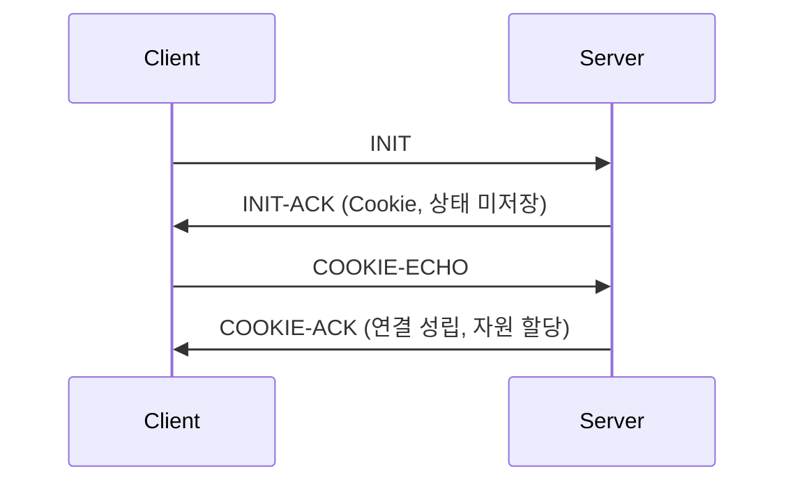

# SCTP (Stream Control Transmission Protocol)

## 1. 개요

### 가. 정의
> TCP·UDP의 한계를 함께 보완한 **전송계층 프로토콜(RFC 4960)** 로, **메시지 지향 + 신뢰성 + 멀티스트리밍 + 멀티호밍**을 동시에 제공한다.

전송계층에는 오랫동안 두 축만 존재했다. 순서·신뢰성을 보장하지만 바이트 스트림이라 메시지 경계가 없고 단일 연결이 하나의 순서열에 묶이는 **TCP**, 그리고 빠르지만 신뢰성이 없는 **UDP**다. SCTP는 이 둘의 장점을 취해, "신뢰성 있는 전송"과 "메시지 단위 처리"를 결합하고, 여기에 통신망 요구에서 비롯된 멀티스트리밍·멀티호밍을 더한 제3의 프로토콜로 설계되었다.

### 나. 등장 배경 및 필요성
SCTP는 원래 전화망 신호(SS7)를 IP망으로 옮기는 SIGTRAN 작업에서 출발했다. 신호 트래픽은 개별 신호가 **독립된 메시지**이고 지연·손실에 민감해 고가용성이 필수인데, TCP로 나르면 두 가지 벽에 부딪힌다. 하나는 앞선 세그먼트 하나가 손실되면 무관한 뒤 메시지까지 대기하는 **HoL(Head-of-Line) 블로킹**, 다른 하나는 연결이 단일 IP 경로에 묶여 그 경로가 끊기면 세션 전체가 죽는 **단일경로 취약성**이다. SCTP는 한 연결 안에 독립 순서열(스트림)을 여럿 두어 HoL을 완화하고, 연결에 여러 IP를 등록해 경로 장애 시 즉시 절체함으로써 이 한계를 근본적으로 해소한다.

## 2. 주요 특징

SCTP의 정체성은 네 가지 특징이 맞물려 나온다. **멀티스트리밍**은 하나의 논리 연결(association) 안에 서로 독립적으로 순서를 관리하는 스트림을 여러 개 두는 것으로, 한 스트림의 손실이 다른 스트림을 막지 않아 HoL 블로킹을 완화한다. **멀티호밍**은 하나의 연결이 양단에서 여러 IP 주소를 보유하는 것으로, 주 경로 장애 시 예비 경로로 넘겨 가용성을 높인다. **메시지 지향**은 애플리케이션이 보낸 메시지 경계를 그대로 보존해 수신 측 재조립 부담을 없앤다. 여기에 확인응답·재전송 기반 **신뢰성과 스트림별 순서**를 제공하고, 연결 설정 시 **쿠키**로 자원 고갈 공격을 방어한다.

| 특징 | 설명 | 해결하는 문제 |
|---|---|---|
| **멀티스트리밍** | 한 연결 내 여러 독립 스트림 | HoL 블로킹 완화 |
| **멀티호밍** | 여러 IP 경로 보유, 장애 시 절체 | 단일경로 가용성 |
| **메시지 지향** | 메시지 경계 보존(TCP는 바이트 스트림) | 재조립 부담 |
| **신뢰성·순서** | SACK 확인응답·재전송, 스트림별 순서 | 손실·순서 역전 |
| **보안(쿠키)** | 4-way handshake + 쿠키 | SYN Flooding |

## 3. 프로토콜 구조·동작

TCP가 3-way 핸드셰이크로 자원을 먼저 할당하는 반면, SCTP는 **4-way 핸드셰이크에 쿠키 메커니즘**을 도입해 연결이 확정되기 전까지 서버가 상태를 저장하지 않는다. 서버는 INIT을 받으면 연결 상태를 만들지 않고, 필요한 정보를 서명한 쿠키에 담아 INIT-ACK로 돌려준다. 클라이언트가 그 쿠키를 COOKIE-ECHO로 되돌려 보내 정당성이 확인된 후에야 서버가 자원을 할당하므로, 위조 주소로 INIT만 쏟아붓는 **SYN Flooding에 구조적으로 강하다**.

전송 단위는 **청크(Chunk)** 로, 공통 헤더 뒤에 제어 청크(INIT 등)와 데이터 청크가 하나의 패킷에 여러 개 번들로 실린다. 데이터 청크에는 스트림 번호와 순서번호(SSN)가 붙어 스트림별 순서를 관리한다.

| 요소 | 내용 |
|---|---|
| **Association** | 연결 단위(멀티스트림·멀티호밍 포함) |
| **Chunk** | 공통 헤더 + 제어/데이터 청크 번들 |
| **4-way handshake** | INIT→INIT-ACK(쿠키)→COOKIE-ECHO→COOKIE-ACK |
| **혼잡·흐름 제어** | TCP 유사(SACK 기반, 경로별 관리) |

## 4. TCP·UDP 비교

세 프로토콜의 차이는 결국 "무엇을 보장하고 무엇을 포기했는가"의 트레이드오프다. UDP는 모든 보장을 버려 최고 속도를, TCP는 신뢰성을 얻는 대신 바이트 스트림·단일경로·HoL을 감수했다. SCTP는 신뢰성을 유지하면서 메시지 경계·멀티스트림·멀티호밍까지 얻었지만, 그만큼 프로토콜이 복잡하고 중간 장비 지원이 부족하다.

| 구분 | TCP | UDP | SCTP |
|---|---|---|---|
| **신뢰성** | O | X | O |
| **메시지 경계** | X | O | O |
| **멀티스트림** | X | X | O |
| **멀티호밍** | X | X | O |

## 5. 고려사항 및 시사점
기술사 관점에서 SCTP는 "기술적 우수성이 곧 보급을 보장하지 않는다"는 대표 사례다. 4G/5G 코어의 Diameter, SS7 신호(SIGTRAN), WebRTC 데이터채널 등 **고가용·다경로가 필수인 영역**에서는 사실상 표준으로 쓰이지만, 범용 인터넷에서는 확산이 더디다. 가장 큰 걸림돌은 **방화벽·NAT 장비의 미지원**으로, 상당수 미들박스가 SCTP 프로토콜 번호를 몰라 차단한다. 이를 우회하려 UDP 위에 SCTP를 캡슐화하는 방식(예: WebRTC의 DTLS/UDP 위 SCTP)이 실무 해법이 되었다. 따라서 도입 시에는 기술적 이점과 함께 **경로상의 미들박스 호환성**을 반드시 사전 검증해야 하며, HoL 완화를 노린다면 QUIC 같은 대안과 비교 검토하는 것이 바람직하다.

---

> **한 줄 요약**: SCTP는 *신뢰성 + 메시지 지향 + 멀티스트리밍·멀티호밍* 을 결합한 전송 프로토콜로, 쿠키 기반 4-way 핸드셰이크로 SYN Flooding을 막고 HoL 블로킹 완화·다경로 가용성을 제공하나 NAT·방화벽 미지원이 보급의 제약이다.
