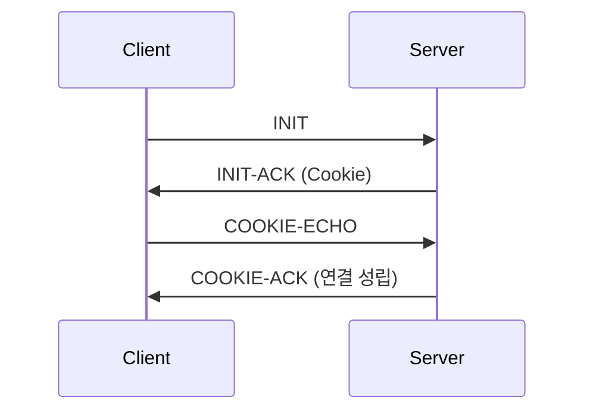

# SCTP (Stream Control Transmission Protocol)

## 1. 개요

### 가. 정의
> TCP·UDP의 한계를 보완한 **전송계층 프로토콜(RFC 4960)** 로, **메시지 지향 + 신뢰성 + 멀티스트리밍·멀티호밍**을 제공한다.

### 나. 등장 배경
- 신호(SS7) 전송 등에서 TCP의 **HoL 블로킹·단일경로** 한계 극복 필요

## 2. 주요 특징

| 특징 | 설명 |
|---|---|
| **멀티스트리밍** | 한 연결(association) 내 여러 스트림 → **HoL 블로킹 완화** |
| **멀티호밍(Multi-homing)** | 여러 IP 경로 보유 → 경로 장애 시 절체(가용성) |
| **메시지 지향** | 메시지 경계 보존(TCP는 바이트 스트림) |
| **신뢰성·순서** | 확인응답·재전송, 스트림별 순서 보장 |
| **보안** | 4-way handshake + **쿠키**로 SYN Flooding 방어 |

## 3. 프로토콜 구조·동작

| 요소 | 내용 |
|---|---|
| **Association** | 연결 단위(멀티스트림·멀티호밍 포함) |
| **Chunk** | 공통 헤더 + 제어/데이터 청크로 구성 |
| **4-way handshake** | INIT→INIT-ACK(쿠키)→COOKIE-ECHO→COOKIE-ACK |
| **혼잡·흐름 제어** | TCP 유사(SACK 기반) |

## 4. TCP·UDP 비교

| 구분 | TCP | UDP | SCTP |
|---|---|---|---|
| **신뢰성** | O | X | O |
| **메시지 경계** | X | O | O |
| **멀티스트림** | X | X | O |
| **멀티호밍** | X | X | O |

## 5. 고려사항 및 시사점
- 통신 신호(4G Diameter·SS7), WebRTC 데이터채널에 활용
- 방화벽·NAT 미지원 이슈 → 배포 제약
- 고가용·다경로가 필요한 서비스에 적합

---

> **한 줄 요약**: SCTP는 *신뢰성 + 메시지 지향 + 멀티스트리밍·멀티호밍* 을 제공하는 전송 프로토콜로, 4-way(쿠키) 핸드셰이크로 연결하며 HoL 블로킹 완화·다경로 가용성이 강점이다.
