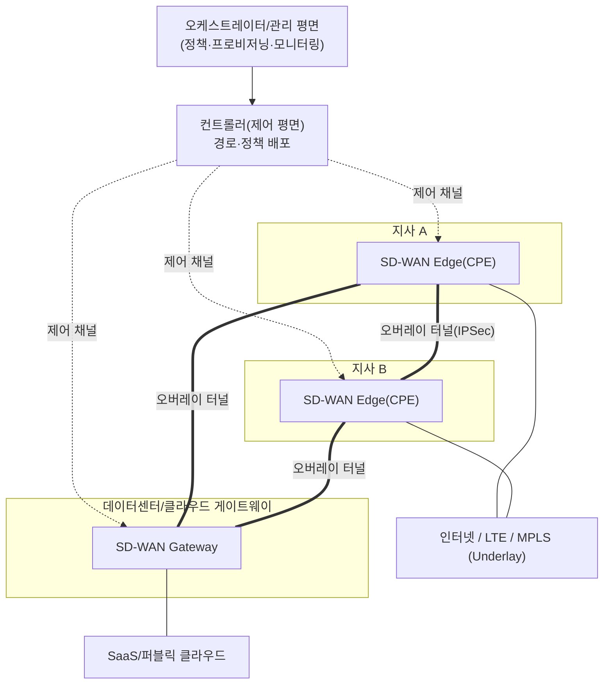
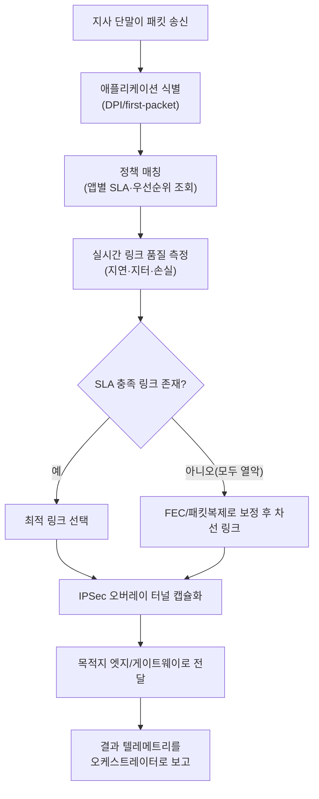

# SD-WAN(Software-Defined WAN, 소프트웨어 정의 광역망)

## 1. 개요

> **SD-WAN**은 SDN(소프트웨어 정의 네트워크)의 제어·데이터 평면 분리 사상을 광역망(WAN)에 적용해, 인터넷·LTE/5G·MPLS 등 서로 다른 회선을 하나의 논리적 오버레이(overlay)로 묶고 **애플리케이션 인지(application-aware) 정책에 따라 트래픽 경로를 중앙에서 소프트웨어로 제어**하는 WAN 아키텍처다. 물리 회선(underlay)의 종류·품질과 무관하게, 정책과 실시간 링크 품질에 근거해 최적 경로를 자동 선택한다는 점이 전통적 라우터 기반 WAN과 구별된다.

SD-WAN이 등장한 근본 배경은 **기업 트래픽의 목적지가 본사 데이터센터에서 클라우드·SaaS로 이동**한 데 있다. 과거 지사 트래픽은 대부분 본사 데이터센터의 애플리케이션을 향했으므로, 값비싼 MPLS 전용회선으로 지사를 본사에 연결하는 허브 앤 스포크(hub-and-spoke) 구조가 합리적이었다. 그러나 Microsoft 365·Salesforce 같은 SaaS와 퍼블릭 클라우드로 업무가 옮겨가면서, 인터넷으로 곧장 나가면 될 트래픽을 본사로 백홀(backhaul)했다가 다시 클라우드로 보내는 '트롬본(trombone) 현상'이 심화되었다. 이는 지연(latency)과 회선 비용을 동시에 키운다.

여기에 **MPLS 회선의 높은 비용과 긴 프로비저닝 기간(수 주~수 개월), 지사별 라우터를 개별 CLI로 관리해야 하는 운영 부담**이 더해지면서, "값싼 인터넷 회선을 MPLS만큼 안정적으로 쓰되, 관리는 중앙에서 소프트웨어로" 하려는 요구가 커졌다. SD-WAN은 회선을 상품화(commoditize)된 대역폭으로 취급하고, 그 위에 암호화된 오버레이 터널을 얹어 **품질이 나쁜 링크는 실시간으로 우회하고, 중요한 애플리케이션에는 좋은 링크를 배정**하는 방식으로 이 문제를 해결한다. 결과적으로 회선 비용 절감, 지사 개통 시간 단축, 클라우드 접속 경험 개선을 동시에 노린다.

## 2. 개념 구조와 핵심 특성

SD-WAN은 SDN과 마찬가지로 **관리(management)·제어(control)·데이터(data)·오케스트레이션(orchestration) 평면**으로 기능을 분리한다. 아래 개념도는 중앙 컨트롤러/오케스트레이터가 다수 지사의 엣지 장비를 어떻게 통제하고, 물리 회선(underlay) 위에 논리 오버레이가 어떻게 형성되는지를 보여준다.

SD-WAN 아키텍처의 특성은 네 가지 축으로 정리된다. 첫째, **평면 분리(decoupling)**다. 경로 계산·정책 판단은 논리적으로 중앙화된 컨트롤러가 담당하고, 엣지 장비(CPE)는 그 정책에 따라 패킷을 전달하는 데이터 평면 역할에 집중한다. 지사 라우터마다 개별 설정을 넣던 방식과 달리, 정책을 한 곳에서 정의하면 수백 개 지사에 일괄 배포되므로 운영이 단순해진다. 예컨대 신규 지사 1개를 여는 '제로 터치 프로비저닝(ZTP)'에서, 현장 담당자가 CPE의 전원과 회선만 연결하면 장비가 오케스트레이터에 자동 등록되고 정책을 내려받아 수십 분 내에 서비스가 가능하다.

둘째, **애플리케이션 인지(Application-aware)**다. SD-WAN은 DPI(심층 패킷 검사)와 첫 패킷 식별(first-packet classification) 기법으로 트래픽이 어떤 애플리케이션인지 식별하고, 애플리케이션별 SLA(지연·손실·지터 허용치)에 맞춰 경로를 배정한다. 음성·화상회의처럼 지터에 민감한 트래픽은 품질 좋은 링크로, 대용량 백업처럼 지연에 둔감한 트래픽은 값싼 링크로 보내는 식이다. 전통적 라우팅이 5-튜플(출발지·목적지 IP·포트·프로토콜)만으로 경로를 정한 것과 달리, SD-WAN은 '이 세션이 무엇을 하는 트래픽인가'라는 애플리케이션 의미(semantics)까지 판단 근거로 삼는다. 이 때문에 정책은 "192.168.x.x 대역을 링크1로"가 아니라 "Microsoft 365 트래픽은 SLA A, 백업 트래픽은 SLA C"처럼 비즈니스 언어로 기술되며, 회선이 바뀌어도 정책을 다시 쓸 필요가 없다.

셋째, **오버레이/언더레이 분리(Overlay/Underlay)**다. 물리 회선(underlay)이 인터넷이든 MPLS든 상관없이, 그 위에 암호화된 논리 터널(overlay)을 형성하고 이 오버레이 수준에서 경로를 제어한다. 회선 사업자·회선 종류에 대한 종속을 줄여 멀티 회선·멀티 사업자 구성을 자유롭게 한다.

넷째, **중앙 가시성·정책 일관성(Centralized visibility)**이다. 모든 엣지의 링크 품질·애플리케이션 사용량·정책 위반이 오케스트레이터 대시보드로 모여, 전사 WAN을 하나의 화면에서 관측·제어한다. 이는 장비별 로그를 수집해 수작업으로 분석하던 전통 방식 대비 장애 대응 속도를 크게 높인다. 예컨대 특정 지사의 인터넷 회선 지연이 급증하면, 관리자는 개별 라우터에 접속하지 않고도 대시보드에서 원인 링크를 식별하고 정책을 조정해 즉시 우회시킬 수 있다.

여기에 더해 **로컬 브레이크아웃(local breakout)**은 SD-WAN이 실질 가치를 만들어내는 대표 기능이다. 지사에서 발생한 SaaS·인터넷 트래픽을 본사로 백홀하지 않고 지사 회선에서 곧장 인터넷으로 내보내는 것으로, 앞서 설명한 트롬본 현상을 근본적으로 없앤다. 다만 이때 각 지사가 인터넷 진입점이 되므로 분산된 보안 통제가 함께 요구되며, 이 지점이 SASE 논의로 이어진다.

## 3. 핵심 기술요소와 트래픽 처리 절차

SD-WAN의 가치는 결국 "**어떤 패킷을, 어떤 링크로, 어떤 품질 기준에 맞춰 보낼 것인가**"를 실시간으로 결정하는 데이터 평면 기술에서 나온다. 주요 기술요소는 아래와 같다.

| 기술요소 | 설명 | 실무적 함의 |
|---|---|---|
| 동적 경로 선택(DPS) | 링크별 지연·지터·손실을 지속 측정해 실시간 최적 경로 선택 | 회선 품질 저하 시 무중단 우회 |
| 애플리케이션 식별 | DPI·first-packet·클라우드 시그니처로 앱 분류 | 앱별 차등 정책 적용 |
| FEC/패킷 복제 | 순방향 오류정정·중요 패킷 이중 전송으로 손실 보정 | 열악한 인터넷 회선에서 음성 품질 확보 |
| 오버레이 암호화 | 엣지 간 IPSec 터널로 기밀성·무결성 보장 | 인터넷 회선을 MPLS 대체로 안전하게 사용 |
| 애플리케이션 SLA | 앱별 허용 지연·손실 임계치 정의·강제 | 정책 기반 자동 링크 전환 |

동적 경로 선택(DPS)은 SD-WAN의 심장이다. 엣지 장비는 BFD(Bidirectional Forwarding Detection) 등으로 각 링크에 프로브(probe)를 지속 송신해 왕복 지연·지터·패킷 손실을 수 밀리초~수백 밀리초 주기로 측정한다. 어떤 링크의 손실률이 애플리케이션 SLA 임계치(예: 음성 트래픽 손실 1% 초과)를 넘으면, 세션을 끊지 않고 다른 링크로 즉시 절체(failover)한다. 사용자는 통화가 끊기는 대신 잠깐의 품질 저하만 겪거나 이를 인지하지 못한다.

여기서 SLA 임계치를 어떻게 잡느냐가 운영 품질을 좌우한다. 임계치를 너무 민감하게 두면 사소한 변동에도 경로가 요동쳐(flapping) 오히려 불안정해지고, 너무 둔감하게 두면 품질 저하를 방치하게 된다. 따라서 애플리케이션 특성에 맞춰 지연·지터·손실 각각의 허용치와 히스테리시스(hysteresis, 되돌림 지연)를 함께 설계하는 것이 실무의 핵심이다.

FEC(Forward Error Correction)와 패킷 복제는 인터넷 회선의 태생적 불안정을 소프트웨어로 보정하는 기법이다. 손실이 잦은 구간에서 중요한 실시간 패킷을 두 링크로 동시에 보내(duplication) 하나가 유실돼도 다른 경로로 도착하게 하거나, 패리티 패킷을 덧붙여(FEC) 일부 손실을 재전송 없이 복구한다. 재전송이 지연을 유발하는 실시간 트래픽에서 특히 효과적이다. 다만 이들 기법은 대역폭을 추가 소비하는 비용을 수반하므로(복제는 최대 2배), 모든 트래픽이 아니라 SLA가 엄격한 소수 애플리케이션에만 선택적으로 적용하는 것이 원칙이다. 즉 SD-WAN의 품질 보정은 '무조건 좋게'가 아니라 '중요한 것에 자원을 집중'하는 정책적 판단의 결과다.

오버레이 암호화는 값싼 인터넷 회선을 MPLS의 대체재로 안전하게 쓰기 위한 전제다. 엣지 장비 간에 IPSec 터널을 자동으로 설정·갱신(키 교환 포함)하여, 공용 인터넷을 지나는 기업 트래픽의 기밀성과 무결성을 확보한다. 수백 개 지사가 서로 풀메시(full-mesh)로 연결될 경우 터널 수가 급증하므로, 컨트롤러가 필요한 터널만 동적으로 생성하는 온디맨드 방식으로 관리 부담을 줄인다.

아래 상세 프로세스도는 지사에서 발생한 패킷 하나가 식별·정책 매칭·경로 선택·터널링을 거쳐 목적지로 전달되는 과정을 나타낸다.

이 흐름에서 주목할 점은, 경로 결정이 목적지 IP만 보는 정적 라우팅이 아니라 **'무슨 애플리케이션인가 × 지금 각 링크 품질이 어떤가 × 정책이 무엇을 요구하는가'의 3요소를 매 순간 결합**한다는 것이다. 이것이 SD-WAN을 단순 다회선 이중화(load balancing)와 구분 짓는 핵심이다.

한편 SD-WAN은 엣지·게이트웨이를 어디에 두느냐에 따라 크게 세 가지 배포 유형으로 나뉘며, 조직의 클라우드 성숙도와 트래픽 패턴에 맞게 선택한다.

- **온프레미스형(On-premises)**: 지사·데이터센터에 물리 CPE를 두고 지사 간 오버레이만 소프트웨어로 제어한다. 클라우드 접속 비중이 낮고 기존 회선 자산을 활용하려는 조직에 적합하나, 클라우드 온램프 이점은 제한적이다.
- **클라우드 지원형(Cloud-enabled)**: 온프레미스 엣지에 더해 주요 IaaS/SaaS 사업자의 클라우드 게이트웨이(온램프)와 직접 연동한다. 클라우드 접속 경로가 최적화되어 SaaS 성능이 개선된다.
- **클라우드 제공형(Cloud-delivered)**: 게이트웨이 기능을 벤더가 운영하는 글로벌 PoP에서 서비스로 제공한다. 원격 사용자·다지점 환경에 유리하며, SSE를 얹으면 곧바로 SASE 형태로 확장된다.

배포 유형 선택은 곧 '어디에서 인터넷·클라우드로 나갈 것인가'라는 브레이크아웃 지점 설계와 직결되며, 이는 성능뿐 아니라 보안 통제 위치를 결정하므로 아키텍처 초기에 확정해야 한다.

## 4. 비교 — 전통 WAN(MPLS)·SD-WAN·SASE

SD-WAN의 위치를 이해하려면 전통 MPLS WAN, 그리고 상위 개념인 SASE와의 관계를 함께 보아야 한다. 아래 표는 세 가지를 비교하되, 차이가 생기는 이유를 함께 설명한다.

| 구분 | 전통 MPLS WAN | SD-WAN | SASE |
|---|---|---|---|
| 경로 제어 | 라우터별 정적/라우팅 프로토콜 | 중앙 정책·앱 인지 동적 | SD-WAN 포함 + 보안 통합 |
| 회선 | MPLS 전용회선 위주 | 인터넷·LTE·MPLS 혼용 | 클라우드 PoP로 수렴 |
| 비용/개통 | 고가·수 주~수 개월 | 저가·수십 분(ZTP) | 구독형 |
| 보안 | 별도 장비(방화벽 등) | 기본 IPSec, 보안은 부가 | 보안 내재화(ZTNA·SWG 등) |
| 클라우드 접속 | 본사 백홀(트롬본) | 지사 로컬 브레이크아웃 | PoP 기반 최적 경로 |

MPLS와 SD-WAN의 근본 차이는 **품질 보장을 '회선 계약'으로 하느냐 '소프트웨어 제어'로 하느냐**에 있다. MPLS는 사업자가 SLA를 계약으로 보장하는 대신 비싸고 유연성이 낮다. SD-WAN은 값싼 여러 회선을 소프트웨어로 묶어 통계적으로 품질을 확보한다. 따라서 SD-WAN이 MPLS를 완전히 대체한다기보다, **핵심 기간 트래픽은 MPLS로 두고 일반·클라우드 트래픽은 인터넷으로 로컬 브레이크아웃(local breakout)하는 하이브리드 구성**이 현실적 해법인 경우가 많다.

SD-WAN과 SASE의 관계는 포함 관계로 이해하면 정확하다. SASE는 "SD-WAN(연결) + SSE(보안 서비스 엣지)"를 클라우드 엣지에서 융합한 상위 아키텍처다. SD-WAN만 도입하면 지사가 인터넷으로 직접 나가면서 경계 방화벽이 커버하던 보안 검사 지점이 사라지는 공백이 생긴다. 이 공백을 클라우드 보안 서비스로 메우는 것이 SASE의 발상이므로, **실무에서는 SD-WAN 도입이 SASE로 가는 첫 단계**로 진행되는 경우가 많다.

실제 적용 사례로, 다수 지점을 운영하는 금융·유통 기업은 각 지점에 SD-WAN CPE를 두어 POS·결제 같은 핵심 트래픽은 MPLS/전용회선으로, 직원 웹·SaaS 트래픽은 인터넷으로 분리해 회선비를 30~50% 절감하는 사례가 보고된다. 다국적 제조기업은 화상회의(예: Microsoft Teams) 트래픽을 애플리케이션 SLA에 묶어 지터가 악화되면 자동으로 링크를 전환하도록 구성해 회의 품질 민원을 줄인다.

전국에 다수 사업소를 둔 공공·물류 기관도 대표적 수혜 대상이다. 수백 개 지점을 개별 라우터 CLI로 관리하던 기관이 SD-WAN을 도입하면, 신규 지점 개통이 수 주에서 수십 분(ZTP)으로 단축되고, 정책 변경이 중앙에서 일괄 배포되어 운영 인력의 반복 작업이 크게 준다. 다만 이 편익은 정책·표준을 사전에 정교하게 설계했을 때 실현되며, 설계 없이 기능만 도입하면 오히려 정책 충돌과 가시성 부재로 운영이 복잡해질 수 있다는 점을 함께 유의해야 한다.

## 5. 심화 — 최신 동향과 아키텍처 진화

최근 SD-WAN은 **단독 솔루션에서 SASE/SSE의 연결 축으로 흡수되는 방향**으로 진화하고 있다. Gartner는 2019년 SASE, 2021년 SSE 개념을 제시하며 네트워크와 보안의 융합을 시장 흐름으로 규정했고, 주요 벤더는 SD-WAN 제품을 SASE 플랫폼의 일부로 재편하고 있다. 즉 "지사 연결"이라는 SD-WAN의 원래 문제의식이, "어디서 접속하든 신원 기반으로 안전하게 연결"이라는 더 넓은 프레임으로 확장되는 것이다.

기술적으로 주목할 최신 흐름은 다음과 같다.

- **AIOps 기반 자율 운영(self-driving WAN)**: 링크 품질·애플리케이션 성능·사용자 경험 데이터를 머신러닝으로 분석해 장애를 사전 예측하고 정책을 자동 최적화한다.
- **클라우드 온램프(cloud on-ramp) 고도화**: 주요 IaaS/SaaS 사업자의 백본에 인접 게이트웨이로 직접 연결해 클라우드 접속 경로를 단축한다.
- **DEM(Digital Experience Monitoring) 결합**: 네트워크 지표를 넘어 실제 사용자가 체감하는 앱 응답성까지 측정해 운영 판단의 기준을 '회선 품질'에서 '사용자 경험'으로 이동시킨다.
- **5G/위성 회선의 언더레이 편입**: 5G 특화망·저궤도 위성이 새로운 백업·주회선 옵션으로 편입되어, 유선 회선이 어려운 지점의 연결성을 넓힌다.

이러한 흐름의 공통점은 SD-WAN이 '회선을 묶는 기술'에서 '애플리케이션과 사용자 경험을 보장하는 정책 엔진'으로 무게중심을 옮기고 있다는 것이다.

시험 관점에서 예상되는 출제 방향은 (1) SDN과 SD-WAN의 관계 및 차이, (2) SD-WAN의 4개 평면과 오버레이/언더레이 개념, (3) 애플리케이션 인지 경로 선택과 FEC 등 품질 보정 기법, (4) MPLS 대비 장단점과 하이브리드 전환 전략, (5) SASE·ZTNA와의 연계다. 답안 구성 시 "왜 등장했는가(클라우드 전환·MPLS 한계) → 어떻게 동작하는가(평면 분리·동적 경로) → 무엇과 연계되는가(SASE·제로트러스트)"의 서사로 전개하면 논리적 완결성을 확보할 수 있다.

## 6. 고려사항 및 시사점

기술사 관점에서 SD-WAN 도입은 단순 회선 교체가 아니라 WAN 운영 모델 전반의 재설계이므로 다음을 함께 고려해야 한다.

- **보안 공백의 선제적 설계**: 지사가 인터넷으로 직접 나가는 로컬 브레이크아웃은 성능을 개선하지만 경계 보안 검사 지점을 없앤다. 도입 초기부터 클라우드 보안(SWG·ZTNA)이나 SASE 로드맵을 함께 설계해, 성능과 보안이 상충하지 않도록 균형을 잡아야 한다.

- **하이브리드 전환 전략과 트레이드오프**: MPLS를 전면 폐기하기보다, 핵심 기간계는 전용회선으로 잔존시키고 일반·클라우드 트래픽을 인터넷으로 이관하는 단계적 전환이 위험을 낮춘다. 비용 절감(인터넷)과 보장된 SLA(MPLS) 사이의 트레이드오프를 애플리케이션 중요도 기준으로 판단해야 한다.

- **벤더 종속성과 운영 역량**: 컨트롤러·오케스트레이터·CPE가 대개 단일 벤더 생태계로 묶이므로 락인(lock-in) 위험이 있다. 표준(예: MEF SD-WAN 서비스 표준) 준수 여부, 멀티벤더/멀티클라우드 상호운용성, 그리고 소프트웨어 중심 운영에 맞는 조직 역량(네트워크+자동화)을 함께 확보해야 한다.

- **가시성과 SLA 측정 체계**: SD-WAN의 이점은 중앙 관측성에서 나오므로, 애플리케이션 성능·사용자 경험(DEM, Digital Experience Monitoring)을 정량 측정하는 체계를 함께 구축해야 실제 개선 효과를 검증하고 정책을 지속 개선할 수 있다.

- **전망 및 연계 기술**: SD-WAN은 SASE·제로 트러스트·엣지 컴퓨팅·5G 특화망과 결합하며 '분산 애플리케이션 시대의 연결 계층'으로 자리잡을 전망이다. AIOps와 결합한 자율 운영, 클라우드 온램프 고도화가 차별화 포인트가 될 것이다.

## 참고자료
- Gartner, "The Future of Network Security Is in the Cloud" (2019) — https://www.gartner.com/en/documents/3956841
- MEF, "SD-WAN Service Attributes and Services (MEF 70.1)" — https://www.mef.net/resources/mef-70-1-sd-wan-service-attributes-and-services/
- Cisco, "What Is SD-WAN?" — https://www.cisco.com/c/en/us/solutions/enterprise-networks/sd-wan/what-is-sd-wan.html
- Fortinet, "What is SD-WAN?" — https://www.fortinet.com/resources/cyberglossary/sd-wan

---
> **한 줄 요약**: SD-WAN은 SDN의 평면 분리 사상을 광역망에 적용해 인터넷·LTE·MPLS 회선을 암호화된 오버레이로 묶고, 애플리케이션 인지 정책과 실시간 링크 품질에 따라 경로를 중앙에서 소프트웨어로 제어하여 비용·민첩성·클라우드 접속 경험을 개선하는 WAN 아키텍처이며, 보안과 융합될 때 SASE로 확장된다.
