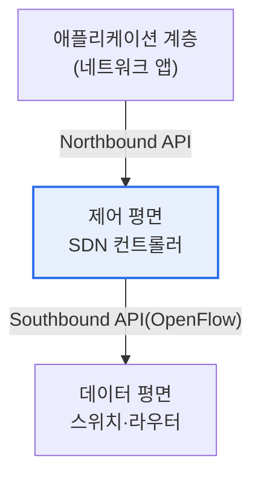

# 소프트웨어 정의 네트워크(SDN, Software Defined Networking)

## 1. 개요

### 가. 정의
> **SDN**은 네트워크 장비의 **제어 기능(Control Plane)과 데이터 전달 기능(Data Plane)을 분리**하여, 중앙의 소프트웨어(컨트롤러)가 네트워크 전체를 프로그래밍 가능하게 제어하는 아키텍처다.

SDN의 핵심 발상은 '**네트워크를 소프트웨어처럼 유연하게 제어하자**'는 것이다. 전통적 네트워크는 각 라우터·스위치가 '어디로 보낼지(제어)'와 '실제로 보내기(전달)'를 모두 자체적으로 처리한다. 그래서 정책을 바꾸려면 수많은 장비를 하나하나 설정해야 하고, 장비마다 벤더가 달라 통합 관리가 어렵다. SDN은 이 두 기능을 분리한다. '어디로 보낼지'를 결정하는 두뇌(제어 평면)를 각 장비에서 떼어내 **중앙 컨트롤러** 로 모으고, 장비는 컨트롤러의 지시대로 패킷을 전달하기만 하는 단순한 일꾼(데이터 평면)이 된다. 그러면 관리자는 중앙 컨트롤러의 소프트웨어에서 네트워크 전체를 한눈에 보고 프로그래밍하듯 제어할 수 있다. 정책 변경이 즉각 전 네트워크에 반영되고, 트래픽을 유연하게 최적화하며, 벤더에 종속되지 않는다. 클라우드 데이터센터처럼 네트워크가 크고 자주 바뀌는 환경에서 특히 강력하다.

### 나. 등장 배경
클라우드·가상화로 네트워크 규모·변경 빈도가 폭증하면서, 장비별 수동 관리의 한계를 넘어 중앙에서 유연하게 제어하는 프로그래머블 네트워크가 요구되었다.

## 2. SDN 구조와 제어 평면의 특징

SDN은 3계층으로 구성된다. **제어 평면(컨트롤러)** 은 네트워크의 두뇌로, 전체를 파악해 전달 규칙을 결정하고 하위 장비에 내려보낸다. 위로는 애플리케이션과 **노스바운드 API**(네트워크 프로그래밍)로, 아래로는 장비와 **사우스바운드 API(OpenFlow)** 로 통신한다. 제어 평면의 특징은 **중앙집중·전역 가시성·프로그래머빌리티** 로, 네트워크 전체를 소프트웨어로 정의·제어하게 한다.

| 계층 | 역할 |
|---|---|
| **애플리케이션** | 네트워크 정책·서비스(방화벽·로드밸런싱) |
| **제어 평면(컨트롤러)** | 전달 규칙 결정, 전역 제어 |
| **데이터 평면(장비)** | 컨트롤러 지시대로 패킷 전달 |

## 3. 오픈플로우(OpenFlow) 프로토콜

**오픈플로우** 는 SDN 컨트롤러와 스위치(데이터 평면) 사이의 표준 통신 프로토콜(사우스바운드 API)이다. 컨트롤러가 스위치의 **플로우 테이블** 에 "이런 패킷은 이렇게 처리하라"는 규칙(플로우 엔트리)을 내려보내고, 스위치는 들어온 패킷을 이 테이블과 대조해 전달·폐기·전송한다.

| 요소 | 내용 |
|---|---|
| **플로우 테이블** | 패킷 처리 규칙(매치-액션) 저장 |
| **플로우 엔트리** | 매치 조건 + 액션(전달·폐기 등) |
| **컨트롤러 통신** | 규칙 하달, 미매치 패킷 문의 |

## 4. 고려사항 및 시사점

1. **중앙 컨트롤러가 단일 장애점**이 될 수 있다. 제어가 한곳에 집중되므로, 컨트롤러 장애 시 네트워크 제어가 마비될 수 있어 컨트롤러 이중화·분산이 필요하다.
2. **네트워크 가상화·자동화의 기반**이다. SDN은 네트워크를 소프트웨어로 정의해, 클라우드 데이터센터의 네트워크 가상화(VXLAN)·자동 프로비저닝(IaC)과 결합해 인프라 자동화를 실현한다.
3. **NFV·인텐트 기반으로 진화**한다. 네트워크 기능을 소프트웨어로 구현하는 NFV, 관리자가 '무엇을 원하는지'만 선언하면 알아서 구성하는 인텐트 기반 네트워킹으로 발전하고 있다.

---

> **한 줄 요약**: SDN은 *제어 평면과 데이터 평면을 분리* 해 중앙 컨트롤러가 네트워크를 프로그래밍하듯 제어하는 아키텍처로, 오픈플로우로 장비의 플로우 테이블에 규칙을 하달하며 네트워크 가상화·자동화의 기반이 되나 컨트롤러 이중화가 과제다.
