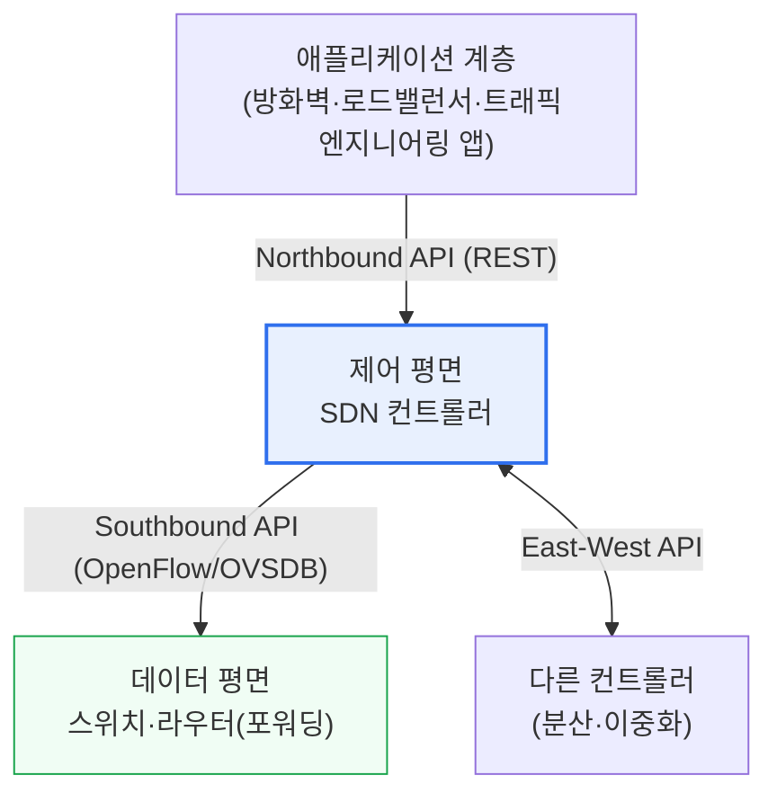
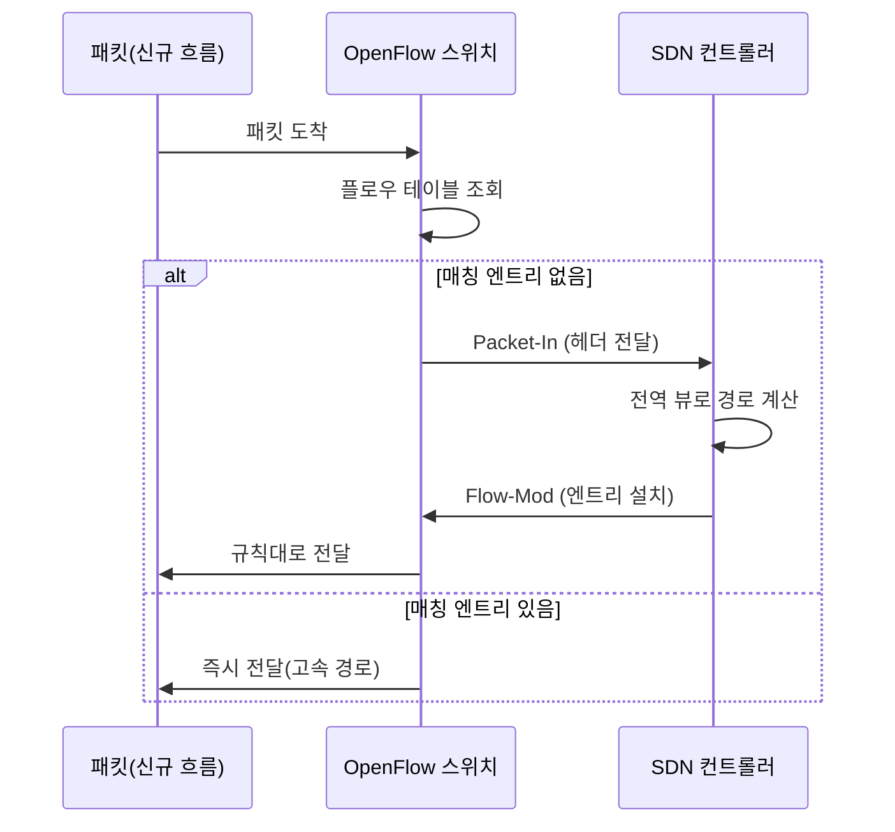

# 소프트웨어 정의 네트워크(SDN, Software Defined Networking)

## 1. 개요

### 가. 정의
> **SDN(Software Defined Networking)** 은 네트워크 장비의 **제어 기능(Control Plane)과 데이터 전달 기능(Data Plane)을 물리적·논리적으로 분리**하여, 중앙집중형 소프트웨어(컨트롤러)가 네트워크 전체를 추상화·프로그래밍 가능하게 제어하는 아키텍처다. 개방형 인터페이스(OpenFlow 등)를 통해 컨트롤러가 하위 장비의 전달 규칙을 직접 정의한다는 점이 핵심이다.

SDN의 근본 발상은 '**네트워크를 소프트웨어처럼 유연하고 중앙집중적으로 제어하자**'는 것이다. 이를 이해하려면 전통적 네트워크의 한계부터 짚어야 한다. 기존 라우터·스위치는 '패킷을 어디로 보낼지 결정하는 두뇌(제어 평면)'와 '실제로 패킷을 내보내는 손발(데이터 평면)'을 한 장비 안에 함께 갖고 있다. 그래서 라우팅 정책이나 접근 제어 정책을 하나 바꾸려면 수십~수백 대의 장비에 일일이 접속해 개별 설정(CLI)을 해야 하고, 벤더마다 명령 체계가 달라 통합 관리가 어렵다. 네트워크가 하나의 거대한 시스템임에도, 관리 관점에서는 자율적으로 움직이는 낱개 장비의 집합처럼 다뤄졌던 것이다.

SDN은 이 구조를 근본적으로 뒤집는다. '어디로 보낼지'를 판단하는 두뇌를 각 장비에서 떼어내 **중앙 컨트롤러**로 모으고, 남은 장비는 컨트롤러의 지시대로 패킷을 전달만 하는 단순한 포워딩 엔진(데이터 평면)이 된다. 그 결과 관리자는 중앙 컨트롤러의 소프트웨어에서 네트워크 전체를 한눈에 보며(전역 가시성), 정책을 프로그래밍하듯 정의하고, 그 변경을 즉시 전 네트워크에 일괄 반영할 수 있다. 트래픽을 실시간으로 재배치해 특정 경로 혼잡을 우회시키는 것도, 특정 벤더에 종속되지 않고 표준 인터페이스로 다양한 장비를 통합 제어하는 것도 가능해진다.

### 나. 등장 배경과 필요성
SDN이 부상한 결정적 배경은 **클라우드와 서버 가상화의 확산**이다. 하나의 물리 서버에 수십 개의 가상머신(VM)·컨테이너가 뜨고, 이들이 오토스케일링과 라이브 마이그레이션으로 수시로 생성·이동·소멸하면서, 네트워크가 감당해야 할 구성 변경의 규모와 빈도가 폭발적으로 늘었다. 사람이 장비마다 수동으로 VLAN·라우팅을 설정하는 방식으로는 이 속도를 따라갈 수 없다. 여기에 대규모 데이터센터 사업자(구글·아마존 등)가 자사 트래픽을 세밀히 최적화하려는 요구가 더해지면서, 네트워크를 코드로 제어하는 **프로그래머블 네트워크**가 절실해졌다. SDN은 이 흐름 속에서 스탠퍼드·버클리 연구(2008년경 OpenFlow 논문)와 ONF(Open Networking Foundation)의 표준화를 거쳐 산업 표준 개념으로 자리 잡았다.

## 2. SDN의 계층 구조와 제어 평면의 특징

SDN은 아래 그림처럼 **애플리케이션 계층 – 제어 평면 – 데이터 평면**의 3계층으로 구성되고, 계층 사이는 표준 API로 연결된다. 위쪽 인터페이스를 노스바운드, 아래쪽을 사우스바운드라 부른다.

```mermaid
flowchart TB
  A["애플리케이션 계층<br/>(방화벽·로드밸런서·트래픽 엔지니어링 앱)"] -->|"Northbound API (REST)"| C["제어 평면<br/>SDN 컨트롤러"]
  C -->|"Southbound API (OpenFlow/OVSDB)"| D["데이터 평면<br/>스위치·라우터(포워딩)"]
  C <-->|"East-West API"| C2["다른 컨트롤러<br/>(분산·이중화)"]
  style C fill:#e8f0fe,stroke:#2f6fed,stroke-width:2px
  style D fill:#f0fdf4,stroke:#16a34a,stroke-width:1px
```

**제어 평면(컨트롤러)** 은 SDN의 두뇌다. 네트워크 토폴로지 전체를 파악해 각 흐름(flow)을 어느 경로로 보낼지 결정하고, 그 규칙을 하위 장비에 내려보낸다. 대표적 오픈소스 컨트롤러로 OpenDaylight, ONOS가 있으며, 상용으로는 Cisco의 APIC(ACI 기반) 등이 있다. 컨트롤러의 특징은 세 가지로 요약된다. **중앙집중(Centralized control)** 은 흩어져 있던 제어 지능을 한곳에 모아 정책의 일관성을 보장하고, **전역 가시성(Global view)** 은 네트워크 전체 상태를 실시간으로 조망해 최적 경로 계산을 가능하게 하며, **프로그래머빌리티(Programmability)** 는 네트워크 동작을 소프트웨어 API로 정의·자동화할 수 있게 한다.

**애플리케이션 계층** 은 컨트롤러가 노출하는 노스바운드 API(주로 REST) 위에서 방화벽, 로드밸런싱, 트래픽 엔지니어링, 침입 탐지 같은 네트워크 서비스를 소프트웨어로 구현한다. 개발자는 물리 장비의 세부를 몰라도, 컨트롤러가 제공하는 추상화된 네트워크 뷰를 대상으로 정책 앱을 작성할 수 있다. 이것이 '네트워크의 애플리케이션화'다.

**데이터 평면(장비)** 은 컨트롤러가 하달한 규칙(플로우 엔트리)에 따라 들어온 패킷을 전달·폐기·수정하는 역할만 담당한다. 스스로 경로를 판단하지 않으므로 하드웨어는 단순·고속화되고, 지능은 컨트롤러 소프트웨어로 집중된다.

| 계층 | 역할 | 대표 기술·인터페이스 |
|---|---|---|
| **애플리케이션** | 네트워크 정책·서비스(방화벽·LB·TE) | 노스바운드 REST API |
| **제어 평면(컨트롤러)** | 토폴로지 파악, 전달 규칙 결정·하달 | OpenDaylight, ONOS |
| **데이터 평면(장비)** | 규칙대로 패킷 전달(포워딩) | OpenFlow 스위치, OVS |

## 3. 오픈플로우(OpenFlow) 프로토콜과 동작 절차

**오픈플로우(OpenFlow)** 는 SDN 컨트롤러와 스위치(데이터 평면) 사이의 대표적 표준 사우스바운드 프로토콜이다. 컨트롤러는 스위치의 **플로우 테이블(Flow Table)** 에 "이런 특징의 패킷은 이렇게 처리하라"는 **플로우 엔트리(Flow Entry)** 를 내려보내고, 스위치는 들어온 패킷을 이 테이블과 대조(match)해 정해진 동작(action)을 수행한다. 각 엔트리는 크게 **매치 필드**(입력 포트, MAC/IP 주소, 포트 번호 등), **액션**(특정 포트로 전달, 폐기, 컨트롤러로 전송, 헤더 수정), **카운터·타임아웃**으로 구성된다.

패킷이 처리되는 절차는 아래와 같다. 스위치에 처음 보는 흐름의 패킷이 도착하면, 매칭되는 엔트리가 없으므로 스위치는 그 패킷(또는 헤더)을 **Packet-In** 메시지로 컨트롤러에 문의한다. 컨트롤러는 전역 뷰를 바탕으로 경로를 계산해, **Flow-Mod** 메시지로 관련 스위치들의 플로우 테이블에 새 엔트리를 설치한다. 이후 같은 흐름의 패킷은 컨트롤러를 거치지 않고 스위치가 테이블만 보고 곧바로 전달하므로, 첫 패킷만 제어 경로를 타고 나머지는 고속 데이터 경로로 흐른다.

```mermaid
sequenceDiagram
  participant P as 패킷(신규 흐름)
  participant S as OpenFlow 스위치
  participant C as SDN 컨트롤러
  P->>S: 패킷 도착
  S->>S: 플로우 테이블 조회
  alt 매칭 엔트리 없음
    S->>C: Packet-In (헤더 전달)
    C->>C: 전역 뷰로 경로 계산
    C->>S: Flow-Mod (엔트리 설치)
    S->>P: 규칙대로 전달
  else 매칭 엔트리 있음
    S->>P: 즉시 전달(고속 경로)
  end
```

이 구조가 주는 실무적 이점은 명확하다. 정책 변경이 컨트롤러의 소프트웨어 로직 한 곳에서 이뤄지고 관련 스위치에 자동 배포되므로, 수백 대 장비를 개별 설정하던 작업이 API 호출 한 번으로 대체된다. 데이터센터에서 신규 VM이 뜰 때 필요한 네트워크 경로·보안 정책을 오케스트레이터(예: OpenStack Neutron)가 컨트롤러 API로 즉시 프로비저닝하는 것이 대표적 활용이다.

| 요소 | 내용 |
|---|---|
| **플로우 테이블** | 패킷 처리 규칙(매치-액션) 저장소 |
| **플로우 엔트리** | 매치 조건 + 액션(전달·폐기·수정) + 카운터·타임아웃 |
| **Packet-In** | 미매칭 패킷을 컨트롤러에 문의 |
| **Flow-Mod** | 컨트롤러가 엔트리를 설치·수정·삭제 |

## 4. 전통 네트워크와의 비교, 그리고 NFV와의 차이

SDN의 가치를 정확히 이해하려면 **무엇이 왜 달라지는지**를 봐야 한다. 전통 네트워크에서 제어와 전달이 한 장비에 묶여 있는 이유는 각 장비가 자율적으로 프로토콜(OSPF·BGP 등)을 돌려 경로를 스스로 학습하기 때문인데, 이 자율성은 견고하지만 전역 최적화와 신속한 정책 일괄 변경에는 불리하다. SDN은 지능을 중앙으로 모아 전역 최적화와 자동화를 얻는 대신, 중앙 컨트롤러 의존이라는 새로운 리스크를 안는다. 즉 둘의 차이는 단순한 우열이 아니라 **분산 자율 대 중앙 집중이라는 제어 철학의 트레이드오프**에서 비롯된다.

| 구분 | 전통 네트워크 | SDN |
|---|---|---|
| 제어·전달 | 장비 내 결합 | 분리(제어=컨트롤러) |
| 정책 변경 | 장비별 수동 설정 | 중앙에서 프로그래밍·일괄 배포 |
| 가시성 | 장비 단위 | 네트워크 전역 뷰 |
| 벤더 종속 | 높음 | 표준 API로 완화 |
| 주요 리스크 | 관리 복잡·느린 변경 | 컨트롤러 단일 장애점 |

한편 SDN과 자주 혼동되는 개념이 **NFV(Network Function Virtualization)** 다. 둘은 상호보완적이지만 다른 문제를 푼다. SDN은 '제어와 전달을 분리해 네트워크를 중앙에서 프로그래밍'하는 데 초점이 있고, NFV는 방화벽·라우터·로드밸런서 같은 **네트워크 기능을 전용 하드웨어(어플라이언스)에서 떼어내 범용 서버 위 소프트웨어(VNF)로 구현**하는 데 초점이 있다. 통신사(Telco)는 두 기술을 결합해, NFV로 가상화한 네트워크 기능들을 SDN으로 유연하게 연결·제어하는 방식으로 5G 코어와 엣지 인프라를 구축한다. 예컨대 네트워크 슬라이싱은 SDN·NFV의 결합 위에서 하나의 물리 인프라를 용도별 논리 네트워크로 분할하는 대표 사례다.

이 트레이드오프는 배포 방식으로도 나타난다. 컨트롤러가 흐름 규칙을 언제 설치하느냐에 따라 **프로액티브(Proactive)** 와 **리액티브(Reactive)** 로 나뉜다. 프로액티브는 예상되는 흐름의 규칙을 사전에 스위치에 미리 깔아 두는 방식으로, 첫 패킷도 컨트롤러를 거치지 않아 지연이 낮고 컨트롤러 부하가 작지만 테이블 용량을 많이 쓴다. 리액티브는 앞서 본 Packet-In 방식처럼 흐름이 처음 나타날 때 규칙을 설치하는 방식으로, 테이블을 아껴 쓰고 유연하지만 첫 패킷 지연과 컨트롤러 부하가 커진다. 대규모 데이터센터는 대개 예측 가능한 대량 트래픽에 프로액티브를, 예외적 흐름에 리액티브를 섞는 하이브리드로 운영한다.

## 5. 심화 — 실무 적용과 최신 동향

SDN은 이미 연구 개념을 넘어 대규모 상용 인프라의 근간이 되었다. 가장 널리 알려진 사례는 **구글의 B4**로, 전 세계 데이터센터를 잇는 WAN에 SDN을 적용해 링크 이용률을 크게 끌어올린 것으로 보고된다(전통 WAN이 장애 대비로 링크를 여유 있게 비워 두는 것과 달리, 중앙 제어로 트래픽을 촘촘히 채워 이용률을 대폭 높였다고 알려져 있다). 데이터센터 내부에서는 VMware NSX, Cisco ACI 같은 상용 솔루션이 SDN 원리를 적용한 **네트워크 가상화(오버레이)** 를 제공하며, 오픈소스 진영에서는 Open vSwitch(OVS)가 사실상 표준 소프트웨어 스위치로 쓰인다.

통신 사업자 영역에서도 적용이 활발하다. 5G 코어망은 제어와 사용자 평면을 분리하는 CUPS(Control and User Plane Separation) 구조를 채택했는데, 이는 제어·데이터 평면 분리라는 SDN의 사상이 표준 이동통신 아키텍처에 반영된 사례로 볼 수 있다. 여기에 NFV로 가상화한 네트워크 기능을 결합해, 하나의 물리 인프라를 초저지연·대용량·대규모 IoT 등 용도별 논리 네트워크로 쪼개는 네트워크 슬라이싱이 구현된다.

기술 진화의 방향도 뚜렷하다. 첫째, **인텐트 기반 네트워킹(IBN, Intent-Based Networking)** 으로의 발전이다. 관리자가 경로·규칙을 세세히 지정하는 대신 "A 서비스는 B 서비스와만 통신하고 지연 10ms 이내를 보장하라" 같은 **의도(intent)** 만 선언하면, 시스템이 이를 구체적 설정으로 자동 변환하고 지속적으로 검증·교정한다. 둘째, **데이터 평면 프로그래밍**의 심화로, P4 언어와 프로그래머블 스위치가 등장해 OpenFlow가 다루던 고정 매치 필드를 넘어 패킷 처리 파이프라인 자체를 코딩할 수 있게 되었다. 셋째, WAN 영역에서는 **SD-WAN**이 기업 지사 연결에 SDN 원리를 적용해 MPLS 전용회선 의존을 줄이고 인터넷·LTE를 정책 기반으로 병용하는 방식으로 빠르게 확산되었다.

동시에 순수 오픈플로우 중심의 초기 SDN 비전은 현실에서 상당 부분 수정되었다는 점도 균형 있게 볼 필요가 있다. 기존 라우팅 프로토콜과 장비 생태계를 한꺼번에 대체하기 어렵고, 컨트롤러 성능·확장성 부담이 크다는 점 때문에, 실제 상용 배포는 물리 네트워크는 그대로 두고 그 위에 논리 네트워크를 얹는 **오버레이 방식(VXLAN 기반 네트워크 가상화)** 이나, 기존 장비의 표준 API(NETCONF/YANG, gNMI)를 활용한 **네트워크 자동화·프로그래머빌리티** 쪽으로 무게중심이 옮겨간 경향이 있다. 즉 "제어·전달의 완전 분리"라는 원형보다, "네트워크를 소프트웨어로 정의·자동화한다"는 SDN의 본질적 가치가 다양한 형태로 계승·확산되고 있다고 보는 것이 정확하다.

이러한 동향의 공통 흐름은 '네트워크 운영을 사람의 수동 개입에서 소프트웨어의 선언적 자동화로 옮기는 것'이며, 이는 인프라를 코드로 관리하는 IaC(Infrastructure as Code)·클라우드 네이티브 운영 철학과 정확히 맞닿아 있다. 결국 SDN은 특정 프로토콜의 승패로 평가할 개념이 아니라, 네트워크를 프로그래머블 자원으로 다루는 사고방식 자체의 전환으로 이해해야 한다.

## 6. 고려사항 및 시사점

기술사 관점에서 SDN은 개별 프로토콜이 아니라 **네트워크 운영 패러다임의 전환**으로 이해하고, 도입 시 다음 트레이드오프를 함께 설계해야 한다.

1. **중앙 컨트롤러의 단일 장애점(SPOF)을 반드시 해소한다.** 제어 지능이 한곳에 집중되므로 컨트롤러 장애는 네트워크 제어 마비로 직결된다. 따라서 컨트롤러 클러스터링·이중화, 이스트-웨스트 API를 통한 분산 컨트롤러 구성, 컨트롤러 단절 시에도 기존 플로우로 전달을 유지하는 페일세이프 설계가 필수다.

2. **제어 채널의 보안과 성능을 확보한다.** 컨트롤러–스위치 채널이 장악되면 전체 네트워크가 위협받으므로 TLS 등으로 채널을 보호하고, 대량의 Packet-In이 컨트롤러로 몰려 처리 병목·DoS가 되지 않도록 흐름 설치 정책(프로액티브 vs 리액티브)과 속도 제한을 설계해야 한다.

3. **점진적·하이브리드 전환 전략을 채택한다.** 기존 전통 장비를 한 번에 교체하기 어려우므로, 오버레이(VXLAN) 기반 네트워크 가상화나 SD-WAN처럼 리스크가 낮은 영역부터 도입하고 레거시와 공존시키는 단계적 마이그레이션이 현실적이다.

4. **자동화·오케스트레이션 및 연계 기술과 통합한다.** SDN의 진짜 가치는 단독이 아니라 NFV·클라우드 오케스트레이터·IaC·인텐트 기반 운영과 결합할 때 발현된다. 표준 API(노스바운드 REST) 확보, 멀티벤더 상호운용성, 운영 인력의 소프트웨어·API 역량 확보가 성공적 도입의 전제가 된다.

5. **투자 대비 효과와 운영 성숙도를 함께 고려한다.** SDN 도입은 장비 교체·컨트롤러 구축·인력 재교육이라는 초기 비용을 수반하므로, 네트워크 변경이 잦고 규모가 큰 데이터센터·멀티클라우드 환경처럼 자동화 효과가 뚜렷한 영역에 우선 적용하는 것이 합리적이다. 반대로 변경이 드물고 안정성이 최우선인 소규모·폐쇄망에서는 전통 방식이 여전히 유효할 수 있으므로, 조직의 운영 성숙도와 트래픽 특성에 맞춘 선택적 도입이 요구된다.

## 참고자료
- Open Networking Foundation, SDN 정의·아키텍처. https://opennetworking.org/sdn-definition/
- OpenFlow Switch Specification(ONF). https://opennetworking.org/software-defined-standards/specifications/
- Software-defined networking(위키백과). https://en.wikipedia.org/wiki/Software-defined_networking

---

> **한 줄 요약**: SDN은 *제어 평면과 데이터 평면을 분리* 해 중앙 컨트롤러가 전역 가시성·프로그래머빌리티로 네트워크를 소프트웨어처럼 제어하는 아키텍처로, 오픈플로우로 장비의 플로우 테이블에 규칙을 하달하며 네트워크 가상화·NFV·인텐트 기반 자동화의 기반이 되나 컨트롤러 단일 장애점과 제어 채널 보안이 핵심 과제다.
