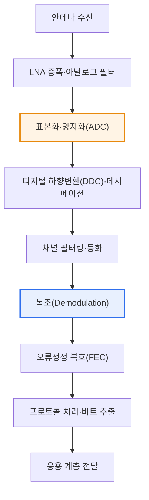

# SDR(Software Defined Radio)

## 1. 개요

### 가. 정의

> **SDR(Software Defined Radio)**는 무선 통신의 **신호 처리 기능(변조·복조·필터링·주파수 변환·프로토콜 처리 등)을 전용 하드웨어 회로가 아닌 소프트웨어로 구현**하여, 하나의 무선 장비가 소프트웨어의 변경만으로 서로 다른 통신 방식·주파수·대역폭을 지원할 수 있도록 하는 재구성 가능(Reconfigurable) 무선 기술이다.

SDR의 핵심 발상은 '**무선의 기능을 하드웨어에 고정하지 말고 소프트웨어로 유연하게 정의하자**'는 것이다. 전통적인 무선 장비는 특정 통신 규격(예: 2G GSM, FM 라디오)에 맞추어 변복조기·믹서·필터 등을 전용 아날로그/디지털 회로로 만들어 넣었다. 규격이 하드웨어에 '박혀' 있으므로, 새로운 세대(3G·4G·5G)나 다른 방식이 등장하면 회로 자체, 즉 장비를 통째로 교체해야 했다. 이는 비용이 크고, 한 번 설치하면 바꾸기 어렵다는 근본적 경직성을 의미한다.

SDR은 이 구조를 정반대로 뒤집는다. 안테나로 받은 아날로그 신호를 **가능한 한 이른 단계에서 디지털로 변환(조기 디지털화)**한 뒤, 이후의 모든 처리(하향변환·필터링·복조·오류정정·프로토콜 해석)를 범용 프로세서(CPU/GPU)·DSP·FPGA 위에서 도는 소프트웨어로 수행한다. 그 결과 하드웨어(RF 프론트엔드·ADC/DAC)는 그대로 둔 채, **소프트웨어만 교체하거나 파라미터를 바꾸어 완전히 다른 통신 시스템을 동작**시킬 수 있다. 마치 컴퓨터가 프로그램만 바꾸어 문서 작성·게임·계산을 모두 해내듯, 하나의 무선 플랫폼이 다수의 규격을 소화하는 것이다.

이러한 유연성 덕분에 SDR은 다양한 규격을 동시에 다뤄야 하는 **군용 전술통신(JTRS)**, 규격 진화가 잦은 **이동통신 기지국**, 임무마다 대역이 달라지는 **위성·아마추어 무선**, 그리고 주변 전파 환경을 감지해 스스로 대역을 바꾸는 **인지 무선(Cognitive Radio)**의 공통 기반 기술로 자리 잡았다. 요약하면 SDR은 무선을 '소프트웨어화'하여 재구성 가능성(Reconfigurability)·확장성(Scalability)·상호운용성(Interoperability)을 동시에 확보한 기술이라 할 수 있다.

### 나. 등장 배경과 필요성

SDR이 요구된 배경은 크게 세 가지로 정리된다. 첫째, **무선 규격의 난립과 급격한 세대 교체**다. 2G→3G→4G→5G로 약 10년 주기로 표준이 바뀌고, Wi-Fi·Bluetooth·LoRa·위성 등 이종 규격이 공존하면서, 규격마다 전용 하드웨어를 두는 방식은 비용·공간·운용 측면에서 지속 가능하지 않게 되었다. 둘째, **주파수 자원의 희소성**이다. 한정된 스펙트럼을 효율적으로 재사용하려면 상황에 맞추어 대역·변조 방식을 동적으로 바꿀 수 있어야 하는데, 이는 소프트웨어 기반 재구성 없이는 불가능하다. 셋째, **반도체·연산 성능의 발전**이다. 고속 ADC/DAC와 FPGA·DSP·범용 프로세서의 성능이 무선 대역폭의 실시간 디지털 처리를 감당할 수준에 이르면서, 하드웨어로만 가능하던 신호처리를 소프트웨어로 옮기는 것이 현실화되었다. 이 세 흐름이 맞물려, 하드웨어 교체 없이 소프트웨어로 대응하는 유연·재구성 무선 기술의 필요성이 커졌다.

## 2. 전체 구조

SDR 시스템은 크게 안테나에 가까운 **RF 프론트엔드**, 아날로그와 디지털 세계를 잇는 **ADC/DAC**, 그리고 신호처리·프로토콜을 담당하는 **소프트웨어 처리부**의 세 계층으로 구성된다. 설계의 핵심 철학은 앞서 말한 대로 'ADC/DAC를 안테나에 최대한 가깝게 배치'하여 아날로그 하드웨어의 비중을 최소화하고, 유연성이 필요한 기능을 최대한 디지털·소프트웨어 영역으로 끌어오는 데 있다.

**RF 프론트엔드**는 안테나로 들어온 미약한 신호를 저잡음 증폭(LNA)하고, 목표 대역을 아날로그 필터로 걸러내며, 믹서로 주파수를 옮기는 순수 아날로그 영역이다. 이 부분은 물리 법칙상 완전히 소프트웨어화하기 어려워, SDR에서도 아날로그로 남는 최소한의 하드웨어다. 다만 광대역 RF 프론트엔드를 쓰면 여러 대역을 한 하드웨어로 커버할 수 있어, 유연성은 여기서부터 시작된다.

**ADC/DAC**는 SDR의 성패를 가르는 핵심 부품이다. ADC(수신)는 아날로그 신호를 표본화·양자화하여 디지털로 바꾸고, DAC(송신)는 그 반대를 수행한다. ADC를 안테나에 가깝게 둘수록(즉 더 높은 주파수에서 직접 디지털화할수록) 소프트웨어가 다룰 수 있는 범위가 넓어지지만, 나이퀴스트 정리에 따라 표본화율(예: 수백 MSPS~수 GSPS)과 유효 비트수(ENOB)가 높아야 하므로 부품 비용·소비전력이 급증한다. 여기서 '얼마나 이른 단계에서 디지털화할 것인가'라는 설계 트레이드오프가 발생한다.

**소프트웨어 처리부**는 디지털화된 표본 스트림을 받아 하향변환·데시메이션(디지털 프론트엔드) 후, 변복조·채널 등화·오류정정 부호화/복호화·프로토콜 스택을 소프트웨어로 처리한다. 실행 플랫폼은 유연성이 큰 범용 CPU/GPU, 실시간성이 중요한 DSP, 대역폭이 큰 병렬 처리에 강한 FPGA로 나뉘며, 실제 시스템은 이들을 혼합(예: FPGA에서 고속 전처리, CPU에서 프로토콜)해 성능과 유연성을 절충한다.

| 구성 계층 | 대표 기능 | 구현 특성 |
|---|---|---|
| **RF 프론트엔드** | 저잡음 증폭·주파수 변환·아날로그 필터 | 아날로그(HW), 광대역화로 유연성 확보 |
| **ADC/DAC** | 아날로그↔디지털 변환(표본화·양자화) | HW, 표본화율·ENOB이 성능 좌우 |
| **디지털 프론트엔드** | 하향변환(DDC)·데시메이션·정형화 | 주로 FPGA |
| **소프트웨어 처리부** | 변복조·등화·FEC·프로토콜 스택 | CPU/GPU·DSP·FPGA 혼합 |

## 3. 수신 동작 절차(Processing Pipeline)

SDR이 신호를 받아 데이터로 복원하는 과정을 단계별로 따라가면, 어디까지가 하드웨어이고 어디부터 소프트웨어인지가 분명해진다. 아래 절차도는 수신(Rx) 경로를 세분화한 것으로, 앞의 전체 구조도가 '무엇으로 구성되는가'를 보였다면 이 그림은 '어떤 순서로 처리되는가'를 보인다.

전반부(S1~S3)는 아날로그 및 변환 하드웨어의 영역이다. 안테나로 들어온 신호는 LNA로 증폭되고 광대역 아날로그 필터로 대역이 제한된 뒤, ADC에서 디지털 표본으로 바뀐다. 이 지점이 SDR의 경계선으로, 이후 단계는 모두 소프트웨어로 대체 가능하다. 만약 다른 통신 규격으로 바꾸고 싶다면, 이 전반부는 대체로 그대로 두고 후반부의 소프트웨어만 교체하면 된다는 점이 SDR의 유연성이 구체적으로 드러나는 대목이다.

중반부(S4~S6)는 소프트웨어 신호처리의 핵심이다. 디지털 하향변환(DDC)은 관심 대역을 기저대역으로 옮기고, 데시메이션으로 표본율을 낮춰 후속 연산 부담을 줄인다. 이어 채널 필터링·등화로 다중경로·잡음의 영향을 보정한 뒤, 복조 단계에서 실제 변조 방식(예: QPSK, 64-QAM, OFDM)에 맞추어 심볼을 비트로 되돌린다. 규격에 따라 이 복조 알고리즘만 바꾸면 되므로, 하나의 SDR이 FM 라디오와 LTE 신호를 모두 복원할 수 있는 이유가 여기에 있다.

후반부(S7~S9)는 신뢰성 확보와 상위 처리다. 채널을 지나며 생긴 비트 오류를 FEC(예: 터보·LDPC 부호)로 정정하고, 프로토콜 스택이 프레임을 해석해 실제 사용자 데이터를 추출한 뒤 응용 계층으로 전달한다. 이 전 과정이 소프트웨어이므로, 로그 수집·성능 모니터링·원격 업데이트 같은 운용 기능까지 통합하기 쉽다는 것도 실무적 장점이다.

## 4. 특징·활용과 유사 개념 비교

SDR의 특징은 유연성·확장성·비용 효율이라는 세 축으로 요약되지만, 각 특징이 '왜' 생기는지를 이해하는 것이 중요하다. **유연성·재구성성**은 기능이 소프트웨어에 있기 때문에 생긴다. 같은 하드웨어로 소프트웨어만 바꾸면 다중 규격·다중 주파수를 지원하므로, 하나의 장비로 여러 임무를 수행한다. **확장성**은 신규 규격이 나와도 소프트웨어 업그레이드(사실상 원격 배포)로 대응할 수 있어, 장비 수명이 길어지는 데서 온다. **비용 효율**은 초기 하드웨어 단가는 다소 높을 수 있으나, 세대 교체마다 장비를 버리지 않아 전체 수명주기 비용(TCO)이 낮아지는 형태로 나타난다.

| 구분 | 내용 | 실무적 함의 |
|---|---|---|
| **유연성·재구성** | SW 변경으로 다중 규격·주파수 지원 | 한 장비로 다임무, 상호운용성 확보 |
| **확장성** | 신규 규격에 SW 업그레이드로 대응 | 원격 배포, 장비 수명 연장 |
| **비용 효율** | HW 교체 최소화 | 초기비용↑·수명주기 총비용↓ |
| **주요 활용** | 군 전술통신, 기지국, 위성, 인지무선 | 다규격 공존·동적 스펙트럼 환경 |

대표적 활용 사례로 **인지 무선(Cognitive Radio)**이 있다. 인지 무선은 주변의 주파수 사용 현황을 실시간으로 감지(Spectrum Sensing)하여, 비어 있는 대역(White Space)을 찾아 기회적으로 사용하는 기술이다. 이러한 '감지 후 즉시 대역·변조 변경'이라는 동적 재구성은 기능이 소프트웨어로 구현된 SDR 위에서만 실현 가능하다. 즉 SDR은 인지 무선을 떠받치는 실행 기반(Enabler)이다.

유사·연계 개념과의 관계도 정리해 둘 필요가 있다. **SDR**이 무선 단말/장비 수준에서 '무선 기능의 소프트웨어화'라면, **SDN(Software Defined Networking)**은 네트워크 수준에서 '제어 평면과 데이터 평면을 분리해 제어를 소프트웨어화'한 것이고, **NFV(Network Function Virtualization)**는 방화벽·라우터 같은 네트워크 기능을 범용 서버 상 소프트웨어로 가상화한 것이다. 세 기술은 '기능을 하드웨어에서 소프트웨어로 옮겨 유연성을 얻는다'는 공통 철학을 공유하며, **Open RAN**에서 이들이 결합되어 기지국(RU/DU/CU)의 무선·네트워크 기능이 함께 소프트웨어화·개방화되는 흐름으로 수렴한다. 차이가 생기는 지점은 다루는 계층으로, SDR은 물리(PHY) 무선 신호, SDN은 네트워크 제어, NFV는 네트워크 기능에 각각 초점을 둔다.

| 구분 | 대상 계층 | 핵심 아이디어 |
|---|---|---|
| **SDR** | 물리(무선 PHY) | 무선 신호처리를 SW로 구현 |
| **SDN** | 네트워크 제어 | 제어/데이터 평면 분리, 제어 SW화 |
| **NFV** | 네트워크 기능 | 전용 장비 기능을 SW로 가상화 |

## 5. 심화 — 최신 동향과 산업 적용

SDR은 최근 이동통신·국방·우주 분야에서 실질적 인프라 기술로 확산되고 있으며, 이는 SDR이 단순한 실험실 개념이 아니라 상용 시스템의 기반임을 보여준다.

첫째, **Open RAN과 vRAN(가상화 기지국)**이다. 전통적 기지국은 특정 벤더의 전용 하드웨어에 기능이 묶여 있었으나, Open RAN은 무선 접속망을 RU(Radio Unit)·DU(Distributed Unit)·CU(Centralized Unit)로 분리하고 인터페이스를 개방한다. 이때 DU/CU의 기저대역 신호처리는 상당 부분 범용 서버 위 소프트웨어로 구현되는데, 이는 본질적으로 SDR·NFV 철학의 결합이다. 통신사가 특정 벤더 종속을 줄이고 다양한 공급사 장비를 혼합할 수 있게 하려는 것이 핵심 동기다.

둘째, **위성·비지상망(NTN, Non-Terrestrial Network)**이다. 저궤도(LEO) 위성 통신에서는 위성 하드웨어를 발사 후 교체할 수 없으므로, 소프트웨어로 기능을 갱신·재구성할 수 있는 SDR 페이로드가 특히 유리하다. 실제로 다수의 저궤도 위성 사업이 소프트웨어 정의 페이로드를 채택해, 궤도상에서 임무·대역을 재프로그래밍하는 방향으로 가고 있다. 5G 표준(3GPP Rel-17 이후)이 NTN을 정식으로 포함하면서, 지상망과 위성망을 하나의 소프트웨어 정의 인프라로 통합하려는 시도가 이어지고 있다.

셋째, **국방·전술통신**이다. SDR의 초기 대형 프로젝트인 미국의 JTRS(Joint Tactical Radio System) 이래로, 여러 이종 무선 규격을 하나의 단말로 상호운용하려는 군의 요구는 SDR 발전의 강력한 동인이었다. 하나의 무전기가 아군의 다양한 통신 방식을 소프트웨어 전환만으로 지원하면, 전장에서의 상호운용성과 보안 대응이 크게 향상된다.

넷째, **저가 SDR의 대중화**다. 과거 고가 장비였던 SDR은 RTL-SDR·HackRF·USRP 같은 저가~중가 플랫폼과 GNU Radio 같은 오픈소스 툴체인의 보급으로, 연구·교육·아마추어 영역까지 확산되었다. 이는 SDR 기술의 저변을 넓히는 동시에, 뒤에서 다룰 보안 위협(신호 변조·재밍의 진입장벽 하락)이라는 양면성도 함께 가져왔다.

## 6. 고려사항 및 시사점

1. **성능과 유연성의 트레이드오프를 설계 초기에 정해야 한다.** 소프트웨어 처리는 유연하지만 전용 하드웨어(ASIC)보다 처리 지연·소비전력이 크고, 광대역 실시간 처리에는 고성능 ADC/DAC와 FPGA가 필요해 비용이 상승한다. 따라서 '어느 기능까지 소프트웨어로 내릴 것인가', 'ADC를 얼마나 안테나 가까이 둘 것인가'를 요구 성능·전력 예산·비용에 맞추어 균형 있게 결정하고, 지연에 민감한 부분은 FPGA/DSP로, 유연성이 중요한 부분은 범용 프로세서로 배치하는 이종 분할이 현실적이다.

2. **보안 위협에 대한 방어가 필수다.** 무선 기능을 소프트웨어로 바꿀 수 있다는 것은, 악의적 소프트웨어 변조·재밍·전파 교란·스푸핑에 악용될 수도 있음을 뜻한다. 특히 저가 SDR 대중화로 공격 진입장벽이 낮아졌다. 따라서 SDR 소프트웨어의 무결성 검증(서명·보안 부팅), 원격 업데이트 채널의 인증·암호화, 이상 신호 탐지가 함께 설계되어야 하며, 이는 국방·기지국처럼 중요 인프라일수록 더 엄격히 요구된다.

3. **표준화·상호운용성 확보가 확산의 관건이다.** SDR의 가치는 다양한 규격을 상호운용하는 데 있으므로, 소프트웨어와 하드웨어 사이의 표준 인터페이스(예: SCA, Open RAN 규격)를 준수해야 서로 다른 공급사의 소프트웨어·하드웨어를 조합할 수 있다. 표준을 무시한 독자 구현은 SDR의 개방성·확장성이라는 본질적 장점을 스스로 훼손한다.

4. **5G/6G·위성통신의 재구성 가능한 인프라로 발전한다.** SDR은 SDN·NFV·Open RAN과 결합하여, 지상망과 비지상망(NTN)을 아우르는 소프트웨어 정의 무선 인프라의 물리계층 기반이 된다. 6G에서 논의되는 초광대역·지능형 스펙트럼 공유·AI 기반 신호처리 역시 소프트웨어로 무선을 정의하는 SDR 위에서 구현될 가능성이 크다. 기술사 관점에서는 SDR을 개별 장비 기술이 아니라 '소프트웨어 정의 인프라(Software Defined Infrastructure)'라는 큰 흐름의 한 축으로 이해하고, 관련 기술과 연계해 아키텍처를 설계하는 시각이 필요하다. [[sdn]]

## 참고자료

- 3GPP, "Non-Terrestrial Networks (NTN)" 관련 릴리즈 개요 — https://www.3gpp.org/technologies/ntn-overview
- O-RAN ALLIANCE, "O-RAN Specifications" — https://www.o-ran.org/specifications
- GNU Radio Project — https://www.gnuradio.org/about/

---

> **한 줄 요약**: SDR은 *무선 신호 처리(변복조·필터·프로토콜)를 소프트웨어로 구현해 하나의 장비가 다중 규격·주파수를 지원* 하게 하는 재구성 가능 무선 기술로, 조기 디지털화와 소프트웨어 처리로 유연성·확장성·상호운용성을 확보하며 인지무선·Open RAN·위성(NTN)을 포함한 5G/6G 소프트웨어 정의 인프라의 물리계층 기반이 된다.
