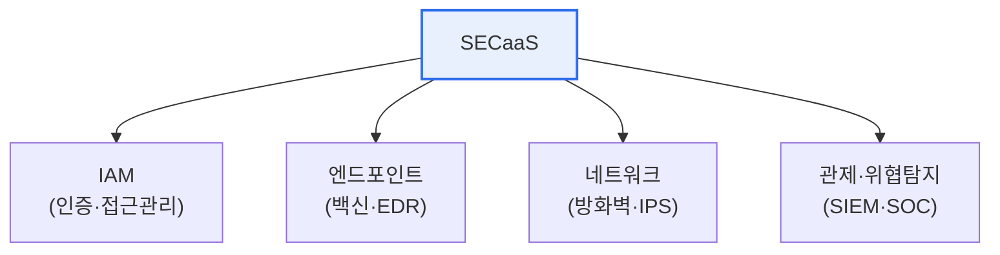

# SECaaS(Security as a Service)

## 1. 개요

### 가. 정의
> **SECaaS**는 방화벽·백신·인증·위협탐지 등 **보안 기능을 클라우드 기반 구독 서비스 형태로 제공**받아 이용하는 모델로, 보안 인프라를 직접 구축하지 않고도 전문 보안 서비스를 활용하게 한다.

SECaaS가 등장한 근본 이유는 '**보안은 점점 어려워지는데, 모든 조직이 자체 보안 역량을 갖추기는 어렵다**'는 데 있다. 사이버 위협은 갈수록 정교·다양해지고, 이에 대응하려면 최신 보안 솔루션과 전문 인력이 필요하다. 그러나 중소기업은 값비싼 보안 장비를 사고 24시간 관제 인력을 두기 어렵다. 대기업도 모든 보안을 자체 감당하기엔 부담이 크다. SECaaS는 이 문제를 클라우드로 푼다. 보안 전문 사업자가 구축한 보안 인프라를 여러 고객이 구독 형태로 나눠 쓴다. 고객은 초기 투자 없이, 사용한 만큼 비용을 내며(OpEx), 항상 최신 상태로 업데이트되는 전문 보안 서비스를 받는다. 위협 정보도 여러 고객으로부터 수집·공유돼 대응이 빨라진다. 즉 SECaaS는 클라우드의 '서비스화(as-a-Service)' 개념을 보안에 적용해, 보안을 소유가 아닌 이용의 대상으로 바꾼 것이다. 다만 보안을 외부에 맡기는 만큼 데이터·통제권 문제를 함께 고려해야 한다.

### 나. 등장 배경
위협의 고도화, 보안 인력·예산 부족, 클라우드 확산이 맞물려, 보안을 구독형 서비스로 제공하는 SECaaS가 확산되었다.

## 2. 주요 서비스 유형

| 유형 | 내용 |
|---|---|
| **IAM** | 인증·권한·접근 관리(SSO·MFA) |
| **엔드포인트 보안** | 클라우드 백신·EDR |
| **네트워크 보안** | 방화벽·IPS·웹 필터링 |
| **위협 관리·관제** | SIEM·SOC·위협 인텔리전스 |
| **데이터 보안** | DLP·암호화·이메일 보안 |

## 3. 장점과 고려사항

| 구분 | 내용 |
|---|---|
| **장점** | 초기 투자 절감(OpEx), 항상 최신, 전문성 활용, 확장 유연 |
| **고려사항** | 데이터 통제권·주권, 서비스 종속(lock-in), 가용성·SLA, 규제 준수 |

SECaaS는 초기 비용 없이 전문 보안을 빠르게 도입할 수 있고 자동 업데이트로 최신 위협에 대응한다. 반면 민감 데이터·로그가 외부 사업자를 거치므로 데이터 주권·규제 준수, 서비스 장애 시 영향, 특정 사업자 종속을 신중히 따져야 한다.

## 4. 고려사항 및 시사점

1. **책임 공유 모델을 이해**해야 한다. 클라우드처럼 SECaaS도 사업자와 고객이 보안 책임을 나누므로, 어디까지가 사업자 책임이고 어디부터 고객 책임인지 명확히 하고 관리 공백을 없애야 한다.
2. **SLA·데이터 주권이 관건**이다. 보안 서비스 중단은 곧 보안 공백이므로 가용성 SLA를 확보하고, 로그·데이터의 저장 위치·접근 통제 등 데이터 주권·규제(개인정보) 준수를 계약에 반영한다.
3. **제로 트러스트와 결합**한다. 경계가 사라진 클라우드·원격 환경에서 SECaaS는 신원 기반 접근통제(제로 트러스트)·SASE 등으로 진화하며, 분산 환경의 통합 보안을 제공하는 방향으로 발전한다. [[zero-trust]]

---

> **한 줄 요약**: SECaaS는 *보안 기능을 클라우드 구독 서비스로 제공* 하는 모델로, 초기 투자 없이 최신 전문 보안을 이용하게 하되, 데이터 주권·SLA·책임 공유·종속성을 고려해야 하며 제로 트러스트·SASE로 진화한다.
