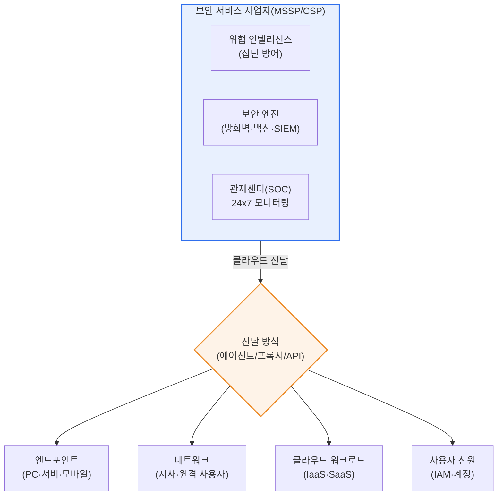
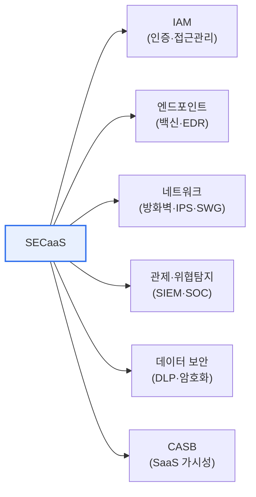

# SECaaS(Security as a Service)

## 1. 개요

### 가. 정의
> **SECaaS(Security as a Service)** 는 방화벽·백신·인증·위협탐지·관제 등 **보안 기능(security function)을 클라우드 기반 구독(subscription) 서비스 형태로 제공**받아 이용하는 모델로, 조직이 보안 장비와 인력을 직접 소유·운영하지 않고도 전문 보안 사업자(MSSP·CSP)의 인프라와 위협 인텔리전스를 이용료 기반(pay-as-you-go)으로 활용하게 하는 클라우드 서비스 유형이다.

SECaaS가 등장한 근본 이유는 '**보안은 점점 어려워지는데, 모든 조직이 자체 보안 역량을 갖추기는 어렵다**'는 구조적 불균형에 있다. 사이버 위협은 랜섬웨어·공급망 공격·API 악용처럼 갈수록 정교·다양해지고, 이에 대응하려면 최신 보안 솔루션과 24시간 관제 인력, 그리고 끊임없이 갱신되는 위협 정보가 필요하다. 그러나 이 세 가지를 모두 자체적으로 갖추는 것은 소수의 대기업조차 부담스럽다. 중소기업은 값비싼 차세대 방화벽(NGFW)이나 SIEM을 구매하고 보안관제센터(SOC)를 24시간 운영할 여력이 없으며, 대기업도 모든 보안 도메인을 내재화하기에는 비용·전문성의 한계가 뚜렷하다.

SECaaS는 이 문제를 '**클라우드의 서비스화(as-a-Service) 개념을 보안에 적용**'하는 방식으로 푼다. 보안 전문 사업자가 대규모로 구축·운영하는 보안 인프라를 여러 고객이 멀티테넌트(multi-tenant) 구독 형태로 나눠 쓰고, 고객은 초기 자본투자(CapEx) 없이 사용한 만큼 운영비(OpEx)로 지불하며, 항상 최신 상태로 패치·업데이트되는 전문 보안 서비스를 받는다. 특히 여러 고객으로부터 수집된 위협 정보가 한 곳에 집약·공유되므로, 한 고객에서 탐지된 신종 위협의 시그니처가 곧바로 전체 고객의 방어에 반영되는 '**규모의 방어(collective defense)**' 효과가 발생한다. 즉 SECaaS는 보안을 '소유(own)의 대상'에서 '이용(consume)의 대상'으로 전환한 것이며, 동시에 보안 통제권의 일부를 외부에 위임하는 만큼 데이터 주권·책임 경계 문제를 함께 안고 있다.

### 나. 등장 배경과 특징
위협의 고도화, 보안 전문 인력·예산의 만성적 부족(보안 인력 수급 격차), 클라우드 및 원격근무의 확산으로 보호 대상이 데이터센터 경계 밖으로 흩어진 상황이 맞물리면서, 보안을 구독형 서비스로 제공하는 SECaaS가 빠르게 확산되었다. SECaaS의 본질적 특징은 ① **클라우드 전달**(에이전트·프록시·API 연동으로 제공), ② **구독·종량 과금**(OpEx 전환), ③ **자동 업데이트**(시그니처·룰·엔진의 상시 최신화), ④ **탄력적 확장성**(트래픽·엔드포인트 증가에 유연 대응), ⑤ **위협 인텔리전스 공유**(멀티테넌트 기반 집단 방어)로 요약된다. 이 특징들은 뒤에서 다룰 SASE/SSE로의 진화와 직접 연결된다.

## 2. 전체 구조와 전달 아키텍처

SECaaS는 '**누가(사업자)–무엇을(보안 기능)–어떻게(클라우드 전달)–누구에게(고객 자산)**'의 네 축으로 구성된다. 아래 전체 구조도는 보안 사업자가 제공하는 서비스군이 클라우드를 통해 고객의 다양한 자산(엔드포인트·네트워크·클라우드 워크로드·사용자)을 보호하는 관계를 보여준다.

```mermaid
flowchart TB
  subgraph P["보안 서비스 사업자(MSSP/CSP)"]
    TI["위협 인텔리전스<br/>(집단 방어)"]
    ENG["보안 엔진<br/>(방화벽·백신·SIEM)"]
    SOC["관제센터(SOC)<br/>24x7 모니터링"]
  end
  P -->|클라우드 전달| DEL{"전달 방식<br/>(에이전트/프록시/API)"}
  DEL --> EP["엔드포인트<br/>(PC·서버·모바일)"]
  DEL --> NW["네트워크<br/>(지사·원격 사용자)"]
  DEL --> CL["클라우드 워크로드<br/>(IaaS·SaaS)"]
  DEL --> ID["사용자 신원<br/>(IAM·계정)"]
  style P fill:#e8f0fe,stroke:#2f6fed,stroke-width:2px
  style DEL fill:#fef3e8,stroke:#ed8f2f,stroke-width:2px
```

전달 아키텍처를 문단으로 풀어 보면, SECaaS는 크게 세 가지 방식으로 고객 자산에 연결된다. 첫째, **에이전트(agent) 방식**은 엔드포인트에 경량 소프트웨어를 설치해 백신·EDR·DLP를 수행하며, 단말이 사내망을 벗어나도 보호가 유지된다. 둘째, **프록시(proxy)·인라인 방식**은 트래픽을 사업자의 클라우드 게이트웨이로 우회시켜 웹 필터링·방화벽·IPS를 적용하는데, 원격근무자의 인터넷 접속을 클라우드 SWG로 검사하는 것이 대표 사례다. 셋째, **API 연동 방식**은 SaaS(예: Microsoft 365, Salesforce)의 API에 붙어 데이터 유출·공유 설정을 감사(out-of-band)하며, CASB의 API 모드가 여기에 해당한다. 이 세 방식은 배타적이지 않고 함께 쓰이며, 어느 방식을 택하느냐에 따라 지연(latency)·가시성·사용자 경험이 달라지므로 도입 시 트래픽 특성에 맞춰 설계해야 한다.

### 가. 책임 공유 모델(Shared Responsibility)
SECaaS를 아키텍처 관점에서 이해할 때 가장 중요한 것은 '**보안 책임을 사업자와 고객이 나눠 진다**'는 책임 공유 모델이다. 사업자는 보안 서비스 자체의 가용성·엔진 최신성·인프라 보안을 책임지고, 고객은 정책 설정·계정 관리·데이터 분류·로그 검토를 책임진다. 문제는 이 경계가 모호할 때 '**아무도 책임지지 않는 관리 공백**'이 생긴다는 점이다. 예컨대 클라우드 방화벽 정책을 고객이 잘못 설정해 포트를 열어두면, 서비스는 정상 작동했더라도 침해가 발생한다. 따라서 도입 단계에서 RACI 형태로 책임 경계를 문서화하고, 사업자 대시보드가 제공하는 가시성만큼 고객이 실제로 검토·조치하는지를 운영 프로세스로 못 박아야 한다.

## 3. 주요 서비스 유형

SECaaS는 보호 대상 계층에 따라 여러 서비스로 분화한다. 아래는 유형별 개요이며, 표 뒤에 각 유형이 '왜 클라우드로 제공될 때 유리한지'를 서술한다.

```mermaid
flowchart LR
  S["SECaaS"] --> I["IAM<br/>(인증·접근관리)"]
  S --> E["엔드포인트<br/>(백신·EDR)"]
  S --> N["네트워크<br/>(방화벽·IPS·SWG)"]
  S --> M["관제·위협탐지<br/>(SIEM·SOC)"]
  S --> D["데이터 보안<br/>(DLP·암호화)"]
  S --> C["CASB<br/>(SaaS 가시성)"]
  style S fill:#e8f0fe,stroke:#2f6fed,stroke-width:2px
```

| 유형 | 대표 기능 | 클라우드 제공 시 이점 |
|---|---|---|
| **IAM** | SSO·MFA·권한관리 | 신원 기반 통제를 SaaS·원격까지 일관 적용 |
| **엔드포인트 보안** | 클라우드 백신·EDR·XDR | 단말 위치 무관 보호, 위협정보 즉시 반영 |
| **네트워크 보안** | 방화벽·IPS·웹 필터링(SWG) | 지사·재택까지 경계 없는 검사 |
| **위협 관리·관제** | SIEM·SOC·위협 인텔리전스 | 24x7 전문 관제를 구독으로 확보 |
| **데이터 보안** | DLP·암호화·이메일 보안 | SaaS 데이터 유출까지 정책 확장 |
| **CASB** | SaaS 사용 가시성·통제 | 섀도 IT 탐지, 클라우드 앱 거버넌스 |

**IAM(Identity and Access Management)** 이 SECaaS로 제공될 때의 핵심 가치는 '경계가 사라진 환경에서 신원이 새로운 경계가 된다'는 점에 있다. 온프레미스 시절에는 사내망 접속 자체가 신뢰의 근거였지만, 사용자가 카페·집·해외에서 SaaS에 접속하는 지금은 '누가 접속하는가'를 매 요청마다 검증해야 한다. 클라우드 IAM은 SSO로 여러 SaaS 로그인을 단일화하고, MFA·적응형 인증(위험 기반)으로 계정 탈취를 방어하며, 이는 제로 트러스트의 출발점이 된다.

**엔드포인트 보안**은 EDR/XDR로 진화하면서 SECaaS의 대표 성공 사례가 되었다. 단순 시그니처 백신은 신종·변종 악성코드를 놓치지만, 클라우드 EDR은 전 고객 단말의 행위 데이터를 집약·분석해 이상 행위를 탐지하고, 한 곳에서 발견된 공격 패턴을 즉시 전체에 적용한다. 예컨대 특정 프로세스가 대량 파일을 암호화하는 랜섬웨어 행위 패턴이 한 고객에서 탐지되면, 그 행위 지표(IoC)가 클라우드를 통해 다른 모든 고객 단말의 차단 룰로 전파된다. 자체 구축 백신으로는 불가능한 '탐지 지연 최소화'가 SECaaS의 구조적 강점이다.

**위협 관리·관제(SIEM/SOC)** 는 인력 문제를 직접 겨냥한다. 자체 SOC를 24시간 운영하려면 최소 3교대·다수 분석가가 필요해 연간 수억 원의 인건비가 든다. 관제형 SECaaS(MSSP)는 이 부담을 구독료로 대체하고, 다수 고객을 담당하는 숙련 분석가 풀과 자동화(SOAR)를 통해 오탐을 줄이며 대응 시간을 단축한다. 다만 관제를 위탁하면 '우리 조직의 맥락(정상 업무 패턴)'을 사업자가 충분히 이해하는지가 탐지 품질을 좌우하므로, 위탁 후에도 튜닝·에스컬레이션 협의를 지속해야 한다.

**CASB(Cloud Access Security Broker)** 와 **데이터 보안(DLP)** 은 SaaS 확산이 만든 새로운 사각지대를 겨냥한다. 직원들이 회사 승인 없이 개인 클라우드 저장소·협업 도구를 쓰는 '섀도 IT(Shadow IT)'는 자체 네트워크 장비로는 보이지 않는다. CASB는 SaaS API·프록시에 붙어 어떤 클라우드 앱이 쓰이는지 가시성을 확보하고, 위험한 앱 차단·외부 공유 통제·이상 다운로드 탐지를 수행한다. 여기에 클라우드 DLP가 결합되면 민감정보(주민번호·카드번호 패턴)가 외부로 유출되는 것을 정책적으로 차단한다. 이처럼 데이터가 사내 경계를 벗어난 환경에서는 '경계 방어'가 아니라 '데이터·신원 중심 통제'가 필요하며, 이는 뒤에서 다룰 SASE/SSE로의 수렴을 이끄는 실무적 동력이 된다.

## 4. 비교: SECaaS vs 자체 구축(On-premise)

두 방식의 차이는 단순한 '비용 절감' 이상이며, 통제권과 대응 속도의 트레이드오프로 이해해야 한다.

| 관점 | 자체 구축(On-premise) | SECaaS(구독형) |
|---|---|---|
| **비용 구조** | CapEx(대규모 선투자) | OpEx(사용량 기반) |
| **도입 속도** | 장비 도입·구축에 수개월 | 수일~수주 내 활성화 |
| **최신성** | 수동 패치·업그레이드 | 자동·상시 최신 |
| **전문성** | 자체 인력 확보 필요 | 사업자 전문성 활용 |
| **통제권** | 완전한 내부 통제 | 일부 외부 위임(데이터 주권 이슈) |
| **확장성** | 장비 증설 필요 | 탄력적 확장 |

비용 관점에서 차이가 생기는 이유는 '**고정비의 변동비화**'에 있다. 자체 구축은 최대 트래픽에 맞춰 장비를 사두어야 하므로 평시에는 자원이 놀지만(과잉투자), SECaaS는 실제 사용량에 비례해 과금되어 자본을 다른 곳에 쓸 수 있다. 예를 들어 계절적 트래픽 변동이 큰 이커머스 기업은 프로모션 기간에만 방어 용량을 늘리고 평시엔 줄여 비용을 최적화할 수 있다. 반대로 통제권 관점에서는 자체 구축이 우위다. 금융·국방처럼 규제상 데이터의 국외 반출이 제한되거나 로그 원본을 직접 보관해야 하는 조직은, 편의성보다 통제권을 우선해 하이브리드(민감 영역은 자체, 일반 영역은 SECaaS)로 절충하는 경우가 많다. 결국 선택은 '무엇을 지키는가'와 '얼마나 빨리·전문적으로 지켜야 하는가'의 균형점에서 결정된다.

### 가. 적용 사례
SECaaS의 실효성은 구체적 도입 패턴에서 드러난다. 첫째, **중소기업의 클라우드 백신·EDR 구독**이다. 전담 보안 인력이 0~1명인 조직이 단말당 월정액으로 클라우드 EDR을 구독하면, 자체 서버·시그니처 관리 없이도 랜섬웨어 행위 기반 탐지와 원격 격리를 확보한다. 자체 구축 대비 초기 투자를 크게 줄이면서 24x7 위협 대응을 얻는 것이 핵심 이점이다.

둘째, **원격근무 확산기의 클라우드 SWG·ZTNA 도입**이다. 코로나19 이후 다수 기업이 재택 직원의 인터넷·사내앱 접속을 기존 VPN 게이트웨이로 몰아 병목과 보안 사각지대를 겪었다. 이를 클라우드 SWG(웹 트래픽 검사)와 ZTNA(앱 단위 최소 권한 접근)로 전환하면, 트래픽을 사내로 우회시키지 않고 가까운 클라우드 접점에서 검사해 지연을 줄이면서 'VPN 전면 개방으로 인한 횡적 이동' 위험을 없앤다.

셋째, **DDoS 방어의 클라우드 전환**이다. 대규모 볼륨 공격은 자체 회선·장비로 흡수하기 어려우므로, 트래픽을 클라우드 방어망으로 우회시켜 정상 트래픽만 원본 서버로 전달하는 방식이 사실상 표준이 되었다. 이는 '방어 용량을 소유가 아니라 이용으로 확보한다'는 SECaaS의 본질을 잘 보여 주는 사례다. 세 사례 모두 공통적으로 '자체 구축의 한계(비용·인력·용량)를 클라우드의 규모와 전문성으로 대체'한다는 논리 위에 서 있다.

## 5. 심화: SASE·SSE로의 진화와 최신 동향

SECaaS를 기술사 관점에서 논할 때 반드시 짚어야 할 흐름은 '**개별 보안 서비스의 나열에서 통합 클라우드 보안 플랫폼으로의 수렴**'이다. Gartner는 2019년 **SASE(Secure Access Service Edge)** 개념을 제시하며, 네트워크(SD-WAN)와 보안 서비스(SWG·CASB·ZTNA·FWaaS)를 하나의 클라우드 전달 플랫폼으로 융합할 것을 예견했다. 이어 2021년에는 SASE에서 보안 기능만 떼어낸 **SSE(Security Service Edge)** 를 정의했는데, SSE는 사용자·기기·애플리케이션의 위치와 무관하게 웹·클라우드·사설 앱으로의 접근을 안전하게 보호하는 보안 스택으로, **SWG(Secure Web Gateway)·CASB·ZTNA·FWaaS** 를 핵심 구성으로 한다.

이 흐름이 중요한 이유는, 초기 SECaaS처럼 백신·방화벽·CASB를 제각각 도입하면 정책이 파편화되고 로그가 분산되어 오히려 관리 사각지대가 생기기 때문이다. SASE/SSE는 이들을 단일 콘솔·단일 정책 엔진으로 묶어 '사용자 신원을 중심으로 어디서 접속하든 동일한 정책을 적용'한다. 예컨대 재택 직원이 사내 앱에 접근할 때 VPN으로 전체 사내망을 열어주는 대신, ZTNA가 해당 앱에만 신원·기기 상태를 검증해 접근을 허용(최소 권한)한다. 이는 'VPN 게이트웨이 취약점을 통한 횡적 이동' 공격을 원천 차단하는 구조적 개선이다.

이 통합 흐름은 운영 조직의 부담을 줄이는 실용적 효과도 크다. 개별 서비스를 여러 사업자에게서 도입하면 콘솔·계정·정책·로그 포맷이 제각각이라 상관분석이 어렵고, 사고가 나도 어느 지점이 뚫렸는지 재구성하는 데 시간이 걸린다. SASE/SSE로 묶으면 단일 콘솔에서 사용자·기기·앱·데이터 흐름을 한눈에 보며 정책을 일관 적용하므로, 관리 인력이 적은 조직일수록 통합 플랫폼의 이점이 커진다. 다만 통합은 곧 단일 사업자 의존을 뜻하므로, 뒤의 고려사항에서 다루는 종속(lock-in) 관리와 함께 판단해야 한다.

또한 SECaaS는 **XDR(Extended Detection and Response)** 와 **SOAR(자동 대응)**, 그리고 최근에는 **AI/LLM 기반 위협 분석**과 결합해 탐지·대응을 자동화하는 방향으로 발전하고 있다. 국내 관점에서는 공공·금융의 클라우드 전환을 뒷받침하기 위해 **CSAP(클라우드보안인증)** 를 획득한 SECaaS를 우선 도입하는 흐름이 있으며, 이는 데이터 주권·규제 준수 요구와 SECaaS의 편익을 조화시키려는 시도로 볼 수 있다. 정리하면 SECaaS의 미래는 '개별 서비스 구독'이 아니라 '**신원 중심의 통합 클라우드 보안 플랫폼(SASE/SSE) 구독**'이며, 여기에 제로 트러스트 원칙이 설계 기반으로 내재화되는 방향이다.

## 6. 고려사항 및 시사점(기술사 관점)

1. **책임 공유 모델의 명확화가 전제다.** 클라우드처럼 SECaaS도 사업자와 고객이 보안 책임을 나누므로, 어디까지가 사업자 책임이고 어디부터 고객 책임인지 RACI로 문서화하고, 사업자 대시보드의 경보를 고객이 실제 검토·조치하는 운영 프로세스를 갖춰 '관리 공백'을 없애야 한다.
2. **SLA·데이터 주권·규제 준수를 계약에 반영한다.** 보안 서비스 중단은 곧 보안 공백이므로 가용성 SLA(예: 99.9% 이상)와 장애 시 배상·대체 수단을 계약에 명시하고, 로그·개인정보의 저장 위치(국내/국외)·접근 통제·보존 기간을 개인정보보호법·CSAP 등 규제에 맞춰 확정해야 한다.
3. **종속(Lock-in)을 관리하고 전환 가능성을 확보한다.** 특정 사업자에 정책·룰·로그가 고착되면 협상력 약화와 전환 비용 증가로 이어지므로, 표준 로그 포맷·데이터 반출(export) 조항·멀티벤더 전략으로 종속을 완화하고, 핵심 통제(암호키 관리 등)는 고객이 보유(BYOK/HYOK)하는 방안을 검토한다.
4. **제로 트러스트 기반 SASE/SSE로의 통합 로드맵을 수립한다.** 개별 서비스의 산발적 도입은 정책 파편화를 낳으므로, 신원(IAM)을 중심축으로 SWG·CASB·ZTNA를 단계적으로 통합하는 로드맵을 세우고, 'VPN 전면 개방'에서 'ZTNA 최소 권한 접근'으로 전환해 공격 표면을 축소한다.
5. **위탁의 부작용(탐지 품질·내부 역량 공동화)을 보완한다.** 관제를 외부에 맡기면 조직 고유의 정상 업무 맥락 반영이 약해질 수 있으므로, 정기적 탐지 룰 튜닝·모의훈련·에스컬레이션 협의를 지속하고, 최소한의 내부 보안 거버넌스 역량은 유지해 사업자에 대한 감독·검증이 가능하도록 한다.

## 참고자료
- Gartner, "Definition of Secure Access Service Edge (SASE)", https://www.gartner.com/en/information-technology/glossary/secure-access-service-edge-sase
- Palo Alto Networks, "What Is Security Service Edge (SSE)?", https://www.paloaltonetworks.com/cyberpedia/what-is-security-service-edge-sse
- Cloudflare Learning, "What is security service edge (SSE)?", https://www.cloudflare.com/learning/access-management/security-service-edge-sse/

---

> **한 줄 요약**: SECaaS는 *방화벽·백신·관제 등 보안 기능을 클라우드 구독 서비스로 제공* 하는 모델로, 초기 투자 없이 최신 전문 보안과 집단 방어를 이용하게 하되 책임 공유·SLA·데이터 주권·종속성을 반드시 관리해야 하며, 개별 서비스 구독에서 제로 트러스트 기반 SASE/SSE 통합 플랫폼으로 진화하고 있다.
