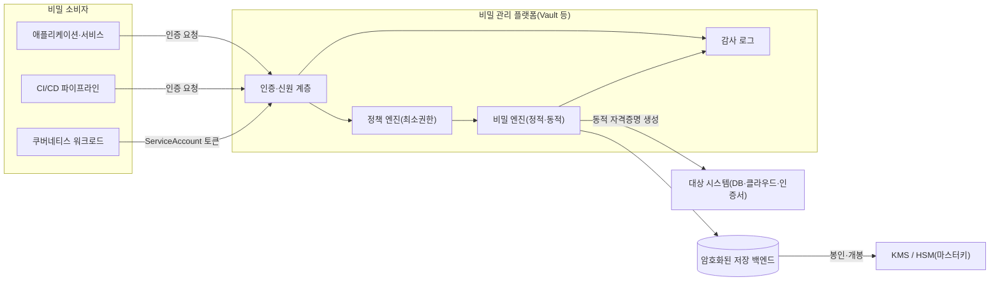
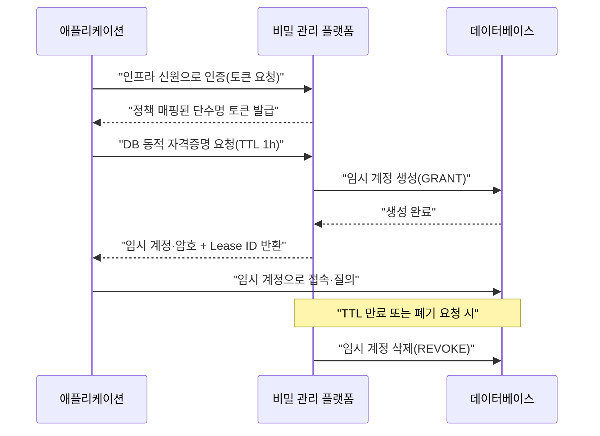

# 비밀 관리(Secrets Management)

## 1. 개요

> 비밀 관리(Secrets Management)는 애플리케이션·인프라·파이프라인이 사용하는 인증정보(비밀번호·API 키·데이터베이스 접속정보·인증서·암호화 키·토큰)를 소스코드와 설정에서 분리하여, 중앙에서 안전하게 저장·발급·회전·폐기하고 접근을 통제·감사하는 체계다.

정보시스템은 서로를 신뢰하기 위해 반드시 어떤 형태의 "비밀"을 교환한다. 애플리케이션은 데이터베이스에 접속하기 위해 계정과 암호를 제시하고, 마이크로서비스는 다른 서비스를 호출하기 위해 API 키나 토큰을 사용하며, CI/CD 파이프라인은 클라우드 계정에 배포하기 위해 접근 키를 갖는다. 문제는 이 비밀들이 손쉽게 소스코드·설정파일·환경변수·컨테이너 이미지·로그·협업 메신저에 흩어진다는 점이다. 이렇게 통제 없이 퍼진 상태를 비밀 산포(secret sprawl)라 하며, 유출 사고의 흔한 근원이 된다.

실제로 GitGuardian의 연례 보고서는 공개 GitHub 저장소에서만 매년 수백만 건의 하드코딩된 비밀이 새로 노출된다고 지속적으로 밝혀 왔고, 2023년 공개 커밋에서 탐지된 비밀이 1,000만 건을 넘었다고 보고했다. 하드코딩된 하나의 클라우드 접근 키가 유출되면 공격자는 이를 이용해 계정 전체를 장악하거나 대규모 요금을 유발할 수 있다. 비밀 관리는 이러한 위험을 "비밀을 코드 밖으로 빼내고, 짧은 수명으로 만들며, 접근을 추적한다"는 원칙으로 완화하려는 접근이다.

비밀 관리가 단순한 "비밀번호 금고" 이상의 의미를 갖는 이유는, 현대 환경이 정적 비밀을 전제로 설계되지 않기 때문이다. 쿠버네티스에서 파드는 초 단위로 생성·소멸하고, 서버리스 함수는 수요에 따라 수천 개가 동시에 뜬다. 이 모든 워크로드가 동일한 장기 자격증명을 공유하면, 하나가 유출될 때 폭발 반경(blast radius)이 시스템 전체로 확대된다. 따라서 비밀 관리는 "정적·장수 비밀"에서 "동적·단수(短壽) 비밀"로의 전환을 핵심 전략으로 삼는다.

### 1.1 등장 배경과 필요성

첫째, 개발·배포 속도가 사람이 비밀을 수동으로 관리하는 속도를 앞질렀다. 과거에는 운영자가 서버에 접속해 설정파일에 비밀번호를 넣는 것으로 충분했지만, 지금은 IaC로 인프라가 자동 생성되고 컨테이너가 자동 배포된다. 비밀을 발급·주입·회전하는 과정 자체를 자동화하지 않으면 배포 파이프라인의 병목이자 사각지대가 된다.

둘째, 규제와 표준이 자격증명의 통제·회전·감사를 명시적으로 요구한다. PCI DSS는 카드 데이터 환경의 접근 통제와 암호키 관리를, ISMS-P·개인정보 안전성 확보조치는 접근권한 관리와 접속기록 보존을 요구한다. 비밀이 어디에 있는지조차 파악하지 못하면 이러한 통제와 감사 증적 제출이 불가능하다.

셋째, 유출의 결과가 치명적이다. 2019년 캐피털 원(Capital One) 사고는 잘못 구성된 방화벽을 통해 획득한 자격증명으로 1억 건 이상의 고객 정보가 유출된 사례이며, 공격자가 일단 유효한 자격증명을 손에 넣으면 정상 트래픽으로 위장해 탐지를 회피할 수 있음을 보여 주었다. 비밀의 수명을 짧게 하고 접근을 세밀하게 통제해야 하는 이유가 여기에 있다.

넷째, "비밀 제로(secret zero)" 문제가 본질적으로 남는다. 애플리케이션이 금고에서 비밀을 꺼내려면 먼저 금고에 인증해야 하는데, 그 최초의 인증 수단(secret zero)을 어떻게 안전하게 부트스트랩할 것인가가 핵심 난제다. 이 문제를 인프라 신원(클라우드 인스턴스 메타데이터, 쿠버네티스 ServiceAccount 토큰 등)으로 푸는 것이 현대 비밀 관리의 설계 초점이다.

### 1.2 핵심 용어

| 용어 | 의미 | 기술사 관점 |
|---|---|---|
| 정적 비밀(Static Secret) | 사람이 등록해 오래 유지되는 비밀 | 회전 부담·유출 시 장기 노출 |
| 동적 비밀(Dynamic Secret) | 요청 시 즉석 생성되어 TTL 후 자동 폐기 | 폭발 반경·수명 최소화 |
| 비밀 회전(Rotation) | 비밀을 주기적·이벤트 기반으로 교체 | 유출 시 유효 기간 단축 |
| 봉인/개봉(Seal/Unseal) | 금고 마스터키를 분할·복원하는 절차 | 키 분산·내부자 위협 통제 |
| 비밀 제로(Secret Zero) | 금고 인증에 필요한 최초 자격증명 | 부트스트랩 신뢰의 뿌리 |
| KMS/HSM | 키 생성·보관·연산 전용 서비스·장비 | 마스터키 보호·규정 준수 |
| 엔벨로프 암호화 | 데이터키를 마스터키로 다시 암호화 | 대량 데이터 성능·키 격리 |

비밀은 단순 문자열이 아니라 "누가, 어떤 워크로드가, 어떤 조건에서, 얼마 동안" 사용할 수 있는가라는 정책과 함께 관리되어야 한다. 즉 비밀 관리는 저장(storage)뿐 아니라 신원(identity)·정책(policy)·감사(audit)의 결합체다.

## 2. 비밀 관리 아키텍처와 개념도

### 2.1 전체 구조

비밀 관리 체계는 크게 다섯 요소로 구성된다. 비밀을 안전하게 보관하는 저장 백엔드, 저장 데이터를 보호하는 마스터키(KMS/HSM), 요청 주체를 확인하는 인증·신원 계층, 어떤 주체가 어떤 비밀에 접근할지 정하는 정책 엔진, 그리고 모든 접근을 기록하는 감사 로그다. 애플리케이션은 비밀을 직접 보관하지 않고, 실행 시점에 금고(vault)에서 발급받아 메모리에만 잠시 두고 사용한다.

이 구조의 핵심은 비밀이 "휴지 상태(at rest)"에서는 마스터키로 암호화되어 있고, "전송 중(in transit)"에는 TLS로 보호되며, "사용 중(in use)"에는 최소 권한과 짧은 수명으로 통제된다는 점이다. 금고 자체가 탈취되어도 마스터키가 별도의 KMS/HSM에 있으면 저장 데이터를 복호화할 수 없도록 신뢰 경계를 분리한다.

인증 계층은 사람(관리자)에게는 조직 IdP(예: OIDC·LDAP)를, 워크로드에는 인프라 신원을 사용한다. 예컨대 쿠버네티스 파드는 자신의 ServiceAccount JWT를 제시하고, 금고는 이를 API 서버에 검증하도록 요청하여 신원을 확인한 뒤 정책에 매핑된 토큰을 발급한다. 이렇게 하면 애플리케이션 코드나 이미지에는 어떠한 장기 비밀도 심지 않아도 된다 — 이것이 secret zero 문제의 현실적 해법이다.

정책 엔진은 확인된 신원에 대해 "이 주체는 결제 DB의 읽기 전용 동적 계정만, 최대 1시간 TTL로 발급받을 수 있다"와 같은 규칙을 적용한다. 접근이 허용되면 비밀 엔진이 실제 비밀을 반환하는데, 정적 엔진은 저장된 값을 그대로 주고, 동적 엔진은 대상 시스템(DB·클라우드)에 즉석으로 계정을 만들어 짧은 수명의 자격증명을 발급한다.

### 2.2 동적 비밀 발급·폐기 절차

동적 비밀은 비밀 관리의 가장 강력한 기능이다. 애플리케이션이 DB 접속이 필요할 때 금고에 요청하면, 금고가 관리자 권한으로 DB에 접속해 임시 계정을 만들고 그 계정 정보를 애플리케이션에 반환한다. 이 계정은 지정된 TTL(예: 1시간)이 지나면 금고가 자동으로 DB에서 삭제한다. 결과적으로 유출되더라도 자격증명이 유효한 시간이 극도로 짧아 폭발 반경이 급감한다.

이 절차에서 리스(lease)와 폐기(revocation)의 개념이 중요하다. 발급된 모든 동적 비밀은 리스로 추적되며, 관리자는 침해가 의심될 때 특정 리스 또는 특정 엔진의 모든 리스를 일괄 폐기할 수 있다. 정적 비밀을 쓰던 시절에는 "유출된 것 같으니 전 시스템의 비밀번호를 바꾸자"는 대규모 작업이 필요했지만, 동적 비밀 체계에서는 리스 폐기 한 번으로 즉각 차단이 가능하다.

또한 봉인·개봉(seal/unseal) 메커니즘은 마스터키 자체의 보호를 다룬다. 금고가 재시작되면 저장 데이터를 복호화할 마스터키가 없는 "봉인" 상태로 시작하며, 샤미르 비밀 분산(Shamir's Secret Sharing)으로 나눈 여러 개의 개봉 키 조각 중 임계값(예: 5개 중 3개)이 모여야 개봉된다. 이는 단일 관리자가 혼자서 금고를 열 수 없게 하여 내부자 위협과 키 탈취를 함께 통제하는 설계다. 운영에서는 이 개봉을 KMS의 자동 개봉(auto-unseal)으로 위임해 가용성을 확보하기도 한다.

## 3. 비밀의 유형과 관리 패턴

### 3.1 정적 비밀과 동적 비밀

정적 비밀은 사람이 등록하여 명시적으로 바꾸기 전까지 유지되는 값이다. 외부 SaaS의 API 키처럼 발급 주체를 우리가 통제할 수 없어 동적 생성이 불가능한 경우에 불가피하게 사용한다. 정적 비밀은 반드시 회전 정책과 짝을 이뤄야 하며, 회전 주기를 90일 등으로 정하고 가능하면 무중단 회전(2세대 키 동시 유효)을 지원해야 한다.

동적 비밀은 앞서 설명했듯 요청 시 생성되고 TTL로 자동 소멸한다. DB·클라우드·메시지 브로커처럼 금고가 관리자 권한으로 계정을 제어할 수 있는 대상에 적합하다. 동적 비밀의 실무적 장점은 "회전"이라는 별도 작업이 사실상 사라진다는 점이다. 모든 자격증명이 애초에 짧은 수명이므로, 회전은 자연스러운 만료·재발급으로 흡수된다.

두 방식의 선택은 대상 시스템의 통제 가능성과 성능 요구에 달려 있다. 초당 수천 건의 접속을 여는 워크로드에 매번 새 DB 계정을 만들면 대상 DB에 부하가 걸리므로, 이 경우 커넥션 풀을 두고 동적 비밀의 TTL을 길게 잡거나 캐싱하는 절충이 필요하다. 즉 보안(수명 최소화)과 성능·가용성 사이의 트레이드오프를 설계해야 한다.

| 구분 | 정적 비밀 | 동적 비밀 |
|---|---|---|
| 생성 시점 | 사전 등록 | 요청 시 즉석 |
| 수명 | 길다(회전 필요) | 짧다(TTL 자동 폐기) |
| 유출 영향 | 크다(장기 노출) | 작다(단기·즉시 폐기) |
| 적용 대상 | 외부 SaaS 키·인증서 | DB·클라우드·브로커 계정 |
| 성능 부담 | 낮음 | 생성 비용·대상 부하 |

### 3.2 암호화 키의 관리: KMS·HSM·엔벨로프 암호화

비밀 중에서도 암호화 키는 특별한 취급을 받는다. 데이터를 암호화하는 데이터키(DEK)를 다시 마스터키(KEK)로 암호화하여 저장하는 엔벨로프 암호화(envelope encryption)가 표준적이다. 대량 데이터는 빠른 대칭키(DEK)로 암호화하고, 그 DEK만 KMS의 KEK로 보호하면 마스터키를 노출하지 않고도 성능과 키 격리를 동시에 얻는다. 예컨대 클라우드 스토리지에 수 TB를 저장할 때 객체마다 별도의 DEK를 쓰고 KEK로 봉인하면, 특정 객체 키가 유출돼도 나머지는 안전하다.

HSM(하드웨어 보안 모듈)은 키를 하드웨어 경계 밖으로 절대 내보내지 않고 내부에서만 암복호화 연산을 수행하는 장비로, FIPS 140-2/140-3 등급 인증을 받아 금융·공공에서 요구된다. 마스터키를 HSM에 두면 소프트웨어 침해로도 키 원문을 탈취할 수 없다. 다만 HSM은 비용과 처리량 제약이 있어, 대량 연산은 DEK로 처리하고 HSM은 KEK 연산에만 사용하는 계층 설계가 일반적이다.

키 관리에는 키의 전 생명주기(생성·활성·회전·폐기·파기)와 암호 민첩성(crypto agility)이 함께 고려되어야 한다. 양자내성암호(PQC) 전환처럼 알고리즘 자체가 바뀔 미래를 대비하면, 애플리케이션이 특정 키·알고리즘에 강결합되지 않도록 키 참조를 추상화(키 ID 기반 호출)해 두는 것이 바람직하다.

### 3.3 접근 통제·감사와의 결합

비밀 관리는 제로 트러스트 원칙과 자연스럽게 맞닿는다. "네트워크 내부에 있으니 신뢰한다"가 아니라 "모든 요청은 신원을 증명하고 최소 권한만 받는다"는 접근을 비밀 발급에 그대로 적용한다. 정책은 주체·비밀 경로·조건(시간·소스·MFA)까지 세밀하게 규정하고, 발급된 모든 비밀은 감사 로그에 남긴다.

감사 로그는 "누가 언제 어떤 비밀을 발급·조회했는가"를 재현할 수 있어야 하되, 로그 자체에 비밀 원문이나 개인정보가 남지 않도록 해시·마스킹 처리해야 한다. 이는 로그가 새로운 유출 지점이 되는 역설을 막기 위한 필수 조치다. 감사 로그는 SIEM으로 연계하여 비정상 패턴(짧은 시간에 다량 비밀 조회, 폐기된 신원의 접근 시도)을 탐지하는 데 활용된다.

## 4. 유사 개념 비교와 사례

비밀 관리는 종종 인접 개념과 혼동된다. 구성 관리(Configuration Management)는 비민감 설정값을 다루지만 비밀 관리는 민감 자격증명에 특화되어 암호화·회전·감사를 추가로 제공한다. 클라우드 사업자의 관리형 비밀 저장소(AWS Secrets Manager, Azure Key Vault, GCP Secret Manager)는 운영 부담이 적어 편리하지만 특정 클라우드에 종속되며, HashiCorp Vault 같은 독립 플랫폼은 멀티클라우드·온프레미스를 아우르고 동적 비밀·다양한 엔진을 제공하는 대신 자체 운영 부담이 크다. 조직은 워크로드 분포와 규제 요건(예: 데이터 주권)에 따라 이를 선택하거나 병행한다.

쿠버네티스 기본 Secret 오브젝트는 흔히 오해되는 부분이다. 기본 Secret은 etcd에 Base64로 인코딩될 뿐 암호화가 아니어서, etcd 저장 암호화(EncryptionConfiguration)를 별도로 켜지 않으면 사실상 평문에 가깝다. 따라서 운영 환경에서는 외부 비밀 관리 플랫폼과 연동(External Secrets Operator, CSI Driver)하여 실제 비밀은 금고에 두고 파드에는 실행 시점에만 주입하는 패턴이 권장된다.

구체적 사고 사례도 교훈을 준다. 2022년 우버(Uber) 침해에서 공격자는 내부에 하드코딩되어 있던 관리자 자격증명을 발견해 권한을 확대했다고 알려졌으며, 이는 "비밀을 스크립트·설정에 남기지 말라"는 원칙의 중요성을 재확인시켰다. 반대로 동적 비밀과 짧은 TTL을 도입한 조직은 자격증명 유출이 탐지되더라도 이미 만료되어 악용이 어려워지는 방어 효과를 얻는다.

## 5. 심화: 최신 동향과 워크로드 신원 표준화

비밀 관리의 최근 흐름은 "비밀 없는(secretless) 인증"으로 향한다. 워크로드가 아예 장기 비밀을 갖지 않고, 인프라가 부여한 검증 가능한 신원으로 단기 토큰을 그때그때 받는 방식이다. 대표 표준인 SPIFFE/SPIRE는 워크로드에 SVID(SPIFFE Verifiable Identity Document)라는 단수명 인증서를 자동 발급하여, 서비스 간 상호 TLS 인증을 비밀 공유 없이 수행하게 한다. 서비스 메시(Service Mesh)의 사이드카가 이 신원을 활용해 mTLS를 자동화하는 것도 같은 맥락이다.

클라우드 간 연동에서는 OIDC 기반의 워크로드 아이덴티티 페더레이션이 확산되고 있다. 예컨대 GitHub Actions가 클라우드에 배포할 때 장기 접근 키를 저장하는 대신, 실행마다 발급되는 OIDC 토큰을 클라우드가 신뢰하도록 구성하면 저장할 비밀이 사라진다. 이는 secret zero를 "저장된 비밀"이 아니라 "실행 컨텍스트가 증명하는 신원"으로 대체하는 진화다.

또한 비밀 산포를 사후에 잡는 비밀 스캐닝(secret scanning)이 개발 파이프라인에 표준 탑재되고 있다. GitHub Push Protection, GitGuardian, TruffleHog 등은 커밋·PR 단계에서 하드코딩된 비밀을 탐지·차단하며, 유출이 확인되면 자동 회전·폐기까지 연계한다. 이는 DevSecOps의 "시프트 레프트" 원칙을 비밀 관리에 적용한 사례로, 예방(금고)과 탐지(스캐닝)의 이중 방어를 구성한다.

## 6. 고려사항 및 시사점

기술사 관점에서 비밀 관리 도입은 다음을 종합적으로 고려해야 한다.

- **가용성과 단일 장애점 관리**: 금고가 다운되면 모든 비밀 발급이 멈춰 시스템 전체가 마비될 수 있다. 다중 노드 HA 구성, 자동 개봉, 지역 간 복제, 그리고 짧은 캐싱 등으로 금고 자체가 새로운 SPOF가 되지 않도록 설계해야 한다. 보안 강화가 가용성 저하로 이어지지 않게 균형을 잡는 것이 핵심 트레이드오프다.

- **secret zero와 신뢰의 뿌리 설계**: 부트스트랩 신원을 인프라(클라우드 인스턴스·쿠버네티스 ServiceAccount·OIDC)로 옮겨 저장되는 최초 비밀을 없애야 한다. 신뢰의 뿌리를 무엇으로 삼을지, 그 뿌리가 위조 불가능한지를 아키텍처 초기에 결정해야 한다.

- **수명 최소화와 성능의 균형**: 동적 비밀의 TTL을 짧게 할수록 안전하지만 대상 시스템의 계정 생성·삭제 부하와 지연이 커진다. 워크로드 특성(접속 빈도·지속성)에 맞춰 TTL·리스·커넥션 풀 전략을 설계하고, 침해 시 즉시 폐기 경로를 반드시 확보한다.

- **규제 준수와 감사 증적**: PCI DSS·ISMS-P·개인정보 안전성 확보조치가 요구하는 접근권한 관리, 접속기록 보존, 키 관리 요건을 충족하도록 감사 로그를 설계하되, 로그에 비밀·개인정보 원문이 남지 않도록 마스킹한다. 규제 대응은 사후 부가가 아니라 초기 설계에 내재화해야 한다.

- **점진적 도입과 조직 변화 관리**: 기존 하드코딩된 비밀을 한꺼번에 제거하기 어렵다. 먼저 관찰 모드로 비밀 사용 현황을 파악하고, 고위험 비밀(운영 DB·클라우드 루트)부터 동적 전환하며, 개발자 경험(SDK·사이드카 주입)을 개선해 저항을 줄이는 단계적 전략이 현실적이다.

- **암호 민첩성과 미래 대비**: 키·알고리즘을 애플리케이션에서 추상화(키 ID 참조)해 두면 PQC 전환이나 알고리즘 취약점 발견 시 코드 변경 없이 교체할 수 있다. 이는 장기 운영 관점에서 유지보수성과 보안을 함께 높인다.

## 참고자료

- HashiCorp, "Vault Documentation — Secrets Engines, Dynamic Secrets, Seal/Unseal": https://developer.hashicorp.com/vault/docs
- OWASP, "Secrets Management Cheat Sheet": https://cheatsheetseries.owasp.org/cheatsheets/Secrets_Management_Cheat_Sheet.html
- NIST SP 800-57, "Recommendation for Key Management": https://csrc.nist.gov/pubs/sp/800/57/pt1/r5/final
- SPIFFE/SPIRE Project Documentation: https://spiffe.io/docs/latest/spiffe-about/overview/
- GitGuardian, "State of Secrets Sprawl": https://www.gitguardian.com/state-of-secrets-sprawl-report

---

> **한 줄 요약**: 비밀 관리는 인증정보를 코드에서 분리해 중앙에서 안전하게 저장·발급·회전·감사하는 체계로, 정적 비밀을 동적·단수명 비밀과 인프라 신원 기반 인증으로 전환해 유출 시 폭발 반경을 최소화하는 것이 핵심이다.
