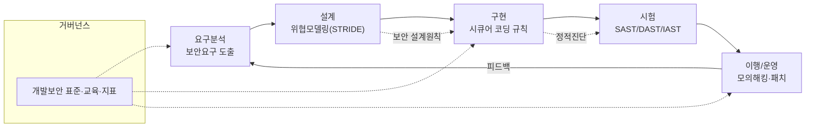
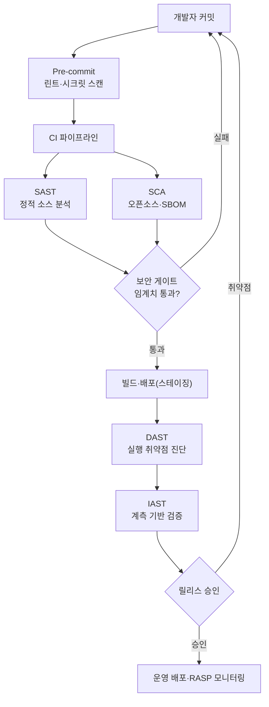

# 시큐어 코딩(Secure Coding)과 소프트웨어 개발보안

## 1. 개요

> **시큐어 코딩(Secure Coding)**이란 소프트웨어 개발 생명주기(SDLC) 전반에서 설계·구현 단계에 내재된 보안 취약점(Vulnerability)을 사전에 제거하기 위해, 검증된 코딩 규칙과 개발보안 표준을 준수하여 안전한 소스코드를 작성하는 개발 방법론을 말한다. 넓은 의미의 **소프트웨어 개발보안(Software Development Security)**은 시큐어 코딩을 포함해 요구사항·설계·구현·시험·운영 전 단계에 보안 활동을 통합하는 체계를 가리킨다.

시큐어 코딩이 부각된 배경은 "보안 사고의 대부분이 운영 단계의 방어 실패가 아니라 개발 단계에서 이미 심어진 결함에서 비롯된다"는 통찰에 있다. 전통적으로 보안은 방화벽·IPS·WAF와 같은 경계 방어(Perimeter Defense) 중심으로 운영 단계에서 다뤄졌으나, 웹·모바일·클라우드로 애플리케이션 계층이 공격의 주 표적이 되면서 네트워크 경계 통제만으로는 SQL 인젝션이나 크로스사이트 스크립팅(XSS) 같은 애플리케이션 로직 결함을 막을 수 없게 되었다. 실제로 애플리케이션 계층을 겨냥한 공격이 전체 침해 사고의 상당 비중을 차지하며, OWASP는 웹 취약점의 근본 원인 대부분이 입력 검증 누락·잘못된 인증·안전하지 않은 설계에 있다고 지적한다.

이러한 전환은 곧 "보안은 나중에 덧붙이는 기능이 아니라 처음부터 품질 속성으로 설계·구현되어야 한다"는 인식으로 이어진다. 보안을 별도 산출물이 아니라 유지보수성·신뢰성과 나란한 소프트웨어 품질 특성(ISO/IEC 25010의 Security)으로 다루는 것이 시큐어 코딩의 철학적 출발점이다.

또 하나의 배경은 **결함 수정 비용의 비대칭성**이다. IBM System Sciences Institute 등에서 널리 인용되는 연구에 따르면, 요구·설계 단계에서 발견·수정하는 결함 비용을 1이라 할 때 구현 단계에서는 약 6.5배, 시험 단계에서는 약 15배, 운영(출시 후) 단계에서는 약 60~100배까지 증가한다. 즉 취약점을 코딩 단계에서 걸러내는 것이 경제적으로 압도적으로 유리하며, 이것이 "보안을 왼쪽(개발 초기)으로 당긴다"는 **시프트 레프트(Shift-Left) 보안**의 논리적 근거가 된다.

제도적 배경도 강력하다. 국내에서는 「전자정부법 시행령」과 행정안전부·KISA의 「소프트웨어 개발보안 가이드」에 따라 일정 규모 이상의 공공 정보화 사업에 개발보안(시큐어 코딩) 적용이 의무화되어 있고, 감리 점검 항목으로도 다뤄진다. 국제적으로는 CWE(Common Weakness Enumeration), SANS/CWE Top 25, OWASP Top 10, MITRE의 CWE와 연계된 CVE 체계가 취약점 분류의 사실상 표준으로 자리 잡았다. 따라서 시큐어 코딩은 단순한 개발 관행이 아니라 법·제도·표준이 요구하는 필수 공학 활동으로 이해해야 한다.

## 2. 소프트웨어 개발보안 생명주기와 활동 체계

시큐어 코딩을 코딩 규칙의 나열로만 이해하면 실패한다. 취약점은 코드 한 줄에서 태어나기도 하지만, 잘못된 요구사항·안전하지 않은 아키텍처 결정에서 구조적으로 잉태되기 때문이다. 따라서 개발보안은 SDLC 전 단계에 보안 활동을 배치하는 **Secure SDLC(S-SDLC)** 관점에서 접근해야 한다. 대표 준거 모델로는 마이크로소프트의 SDL(Security Development Lifecycle), OWASP SAMM, BSIMM 등이 있으며, 이들은 공통적으로 "단계별 게이트에서 보안 검증을 통과해야 다음 단계로 진행한다"는 원칙을 공유한다.

아래 개념도는 각 단계에 매핑되는 핵심 보안 활동의 전체 구조를 보여준다.

이 구조에서 주목할 점은 보안 활동이 단계마다 단절되지 않고 앞뒤로 피드백된다는 것이다. 시험 단계에서 발견된 취약점 패턴은 다시 코딩 규칙과 설계 원칙으로 환류되어야 하며, 운영 중 탐지된 공격 유형은 다음 릴리스의 위협 모델링 입력이 된다. 이러한 순환 구조가 있어야 조직의 개발보안 역량이 시간이 지날수록 축적·성숙하며, 일회성 진단으로는 얻을 수 없는 지속적 개선(Continuous Improvement)이 가능해진다.

**요구분석 단계**에서는 기능 요구사항과 별개로 기밀성·무결성·가용성·인증·인가·감사 같은 **보안 요구사항**을 명시적으로 도출한다. 예컨대 "개인정보 항목은 저장 시 암호화한다", "관리자 기능은 재인증을 거친다" 같은 비기능 요구를 SRS에 정량적으로 못박아야 이후 단계에서 검증 가능한 기준이 된다. 이 단계가 부실하면 아무리 코딩을 잘해도 "무엇을 지켜야 하는지"가 불명확해 방어의 기준선이 흔들린다.

**설계 단계**의 핵심은 **위협 모델링(Threat Modeling)**이다. 자료 흐름도(DFD)를 그려 신뢰 경계(Trust Boundary)를 식별하고, STRIDE(Spoofing·Tampering·Repudiation·Information Disclosure·Denial of Service·Elevation of Privilege) 관점에서 자산별 위협을 도출한 뒤, 각 위협에 대응하는 완화책을 설계에 반영한다. 이때 최소 권한(Least Privilege), 심층 방어(Defense in Depth), 안전한 기본값(Secure Defaults), 실패 시 안전(Fail-Safe Defaults) 같은 **Saltzer & Schroeder의 보안 설계 원칙**을 적용해 구조적 취약점을 원천 차단한다.

**구현 단계**가 좁은 의미의 시큐어 코딩이 적용되는 지점이다. 입력 검증, 출력 인코딩, 파라미터화 쿼리(Prepared Statement), 안전한 세션·암호 API 사용 등 언어·프레임워크별 코딩 규칙을 준수한다. 이때 중요한 것은 규칙을 개발자 개인의 규율에만 맡기지 않고, 프레임워크·라이브러리 차원의 안전한 기본값으로 강제하는 것이다. 예컨대 Spring Security의 CSRF 토큰 자동 삽입, ORM의 바인딩 변수 기본화, 템플릿 엔진의 자동 이스케이프처럼 "안전한 길이 가장 쉬운 길(Secure by Default)"이 되도록 개발 환경을 설계하면, 개별 개발자의 실수가 곧바로 취약점으로 이어지지 않는다. 이는 인적 오류를 전제하고 구조로 방어한다는 안전공학의 원칙과도 맞닿아 있다. **시험 단계**에서는 자동화 도구(SAST/DAST/IAST)와 수동 코드 리뷰·모의해킹으로 잔존 취약점을 검출하며, **운영 단계**에서는 취약점 공시(CVE) 모니터링·긴급 패치·런타임 보호(RASP)로 지속적 보안을 유지한다. 이 모든 활동을 관통하는 것이 표준·교육·지표로 구성된 **개발보안 거버넌스**이며, 개발자 교육과 취약점 밀도(KLoC당 결함 수) 같은 지표 관리가 병행되어야 활동이 조직에 정착한다.

## 3. 시큐어 코딩 취약점 유형과 진단 프로세스

국내 「소프트웨어 개발보안 가이드」는 취약점을 **7대 유형**으로 분류한다. 이 분류는 개발자가 코드 리뷰와 진단 시 점검 관점을 체계화하도록 돕는 실무적 프레임이다. 각 유형은 단순 목록이 아니라 "어느 지점에서 신뢰할 수 없는 데이터가 신뢰 경계를 넘는가"라는 공통 원리로 꿰어진다.

이 7대 유형을 관통하는 사고 틀은 CWE·OWASP와 같은 국제 취약점 분류 체계와 연동된다. 국내 가이드의 유형은 개발자가 코드에서 점검할 관점을 제시하고, CWE는 개별 약점을 고유 번호로 식별하며, OWASP Top 10은 웹에서 가장 위험한 위험군을 우선순위화한다. 세 체계를 함께 활용하면 "무엇을(CWE), 왜 중요하게(OWASP), 어디를(개발보안 유형) 점검하는가"를 일관되게 정렬할 수 있어, 진단 결과의 추적성과 조치 우선순위 결정이 용이해진다.

가장 대표적인 **입력 데이터 검증 및 표현** 유형은 외부에서 들어온 값을 검증 없이 명령어·쿼리·경로에 결합할 때 발생한다. SQL 인젝션, XSS, 명령어 삽입, 경로 조작이 모두 여기에 속하며, 근본 대응은 "신뢰할 수 없는 입력은 데이터로만 취급하고, 실행 문맥과 분리한다"는 원칙이다. **보안 기능** 유형은 인증·인가·암호화·접근제어의 잘못된 구현으로, 하드코딩된 비밀번호나 취약한 암호 알고리즘(예: MD5, DES) 사용이 전형이다. **시간 및 상태** 유형은 경쟁 상태(Race Condition)·TOCTOU(Time-of-Check to Time-of-Use)처럼 동시성 제어 실패에서 비롯된다.

이 밖에 **에러 처리**(과도한 오류 정보 노출로 내부 구조 유출), **코드 오류**(널 포인터 역참조·자원 해제 누락), **캡슐화**(디버그 코드·중요정보 평문 노출), **API 오용**(취약하거나 폐기된 함수 호출)이 나머지 유형을 이룬다. 아래 표는 7대 유형과 대표 취약점, 대응책을 정리한 것이다(표는 보조 수단이며, 각 대응의 원리는 본문과 4장 사례에서 서술한다).

| 유형 | 대표 취약점(CWE) | 근본 원인 | 핵심 대응 |
|---|---|---|---|
| 입력 데이터 검증·표현 | SQL Injection, XSS, 경로 조작 | 입력·실행 문맥 미분리 | 파라미터화 쿼리, 출력 인코딩, 화이트리스트 검증 |
| 보안 기능 | 취약한 암호, 부적절 인가 | 잘못된 보안 API 구현 | 표준 암호(AES/SHA-256), 서버측 인가 |
| 시간 및 상태 | Race Condition, TOCTOU | 동시성 제어 실패 | 원자적 연산, 락, 재검증 |
| 에러 처리 | 정보 노출, 미처리 예외 | 과다 오류 정보 | 일반화된 오류 메시지, 서버 로깅 |
| 코드 오류 | 널 역참조, 자원 누수 | 방어적 코딩 부재 | 널 체크, try-with-resources |
| 캡슐화 | 디버그 코드, 평문 저장 | 정보 은닉 실패 | 배포 전 제거, 민감정보 암호화 |
| API 오용 | 취약 함수 사용 | 안전하지 않은 API | 안전한 대체 API, 폐기 함수 금지 |

취약점 진단은 개발과 분리된 일회성 감사가 아니라, CI/CD 파이프라인에 통합된 반복 프로세스로 운영해야 실효가 있다. 아래 개념도는 커밋에서 배포에 이르는 진단 파이프라인의 세부 흐름을 나타낸다.

이 파이프라인의 설계 의도는 "가능한 한 왼쪽에서, 가능한 한 자동으로" 취약점을 걸러내는 데 있다. 커밋 직전 시크릿 스캔으로 API 키·비밀번호 유출을 차단하고, CI에서 SAST·SCA로 소스와 의존성을 검사하며, 보안 게이트에서 임계치(예: High 등급 0건)를 넘지 못하면 병합을 막는다. 이렇게 하면 취약점이 운영에 도달하기 전에 개발자에게 즉시 피드백되어, 앞서 언급한 60~100배의 사후 수정 비용을 회피할 수 있다.

다만 자동화된 게이트는 오탐과 미탐의 균형을 세심하게 조정해야 한다. 임계치를 지나치게 엄격히 잡으면 오탐으로 인해 정상 배포가 막혀 개발팀이 게이트를 우회하려는 유인이 생기고, 반대로 느슨하게 잡으면 실제 취약점이 통과한다. 따라서 초기에는 경고(warning) 모드로 운영하며 오탐 규칙을 튜닝(Suppression·베이스라인 설정)한 뒤, 신규 취약점(New Findings)에 한해 차단 모드로 전환하는 점진적 도입이 현실적이다. 이는 시큐어 코딩이 도구 설치가 아니라 조직에 맞춘 지속적 운영·튜닝의 문제임을 보여준다.

## 4. 대표 취약점 사례와 대응 (구체 코드·수치)

**사례 1 — SQL 인젝션(CWE-89).** 로그인 처리에서 `"SELECT * FROM users WHERE id='" + input + "'"`처럼 입력을 문자열로 결합하면, 공격자가 `' OR '1'='1`을 입력해 인증을 우회하거나 `; DROP TABLE`로 데이터를 파괴할 수 있다. 2017년 이후 OWASP Top 10에서 인젝션은 오랫동안 1~3위를 지켰고, 국내 대형 유출 사고 다수의 근본 원인이었다. 대응은 **파라미터화 쿼리(Prepared Statement)**로, `SELECT * FROM users WHERE id=?`처럼 쿼리 구조와 데이터를 분리하면 입력이 절대 SQL 구문으로 해석되지 않는다. ORM 사용 시에도 동적 쿼리 조립부는 반드시 바인딩 변수를 쓰고, 부득이한 경우 화이트리스트 검증을 병행한다.

**사례 2 — 크로스사이트 스크립팅(XSS, CWE-79).** 게시판에 ``를 저장(Stored XSS)하면, 열람자의 세션 쿠키가 탈취된다. 대응의 핵심은 **문맥별 출력 인코딩(Output Encoding)**이다. HTML 본문에는 `<`를 `&lt;`로, 속성값·자바스크립트·URL 문맥에는 각기 다른 인코딩을 적용해야 하며, 입력 검증만으로는 우회가 가능하므로 출력 시점 인코딩이 원칙이다. 여기에 CSP(Content Security Policy) 헤더로 인라인 스크립트 실행을 제한하고, 쿠키에 `HttpOnly`·`Secure`·`SameSite` 속성을 부여해 심층 방어를 구성한다.

**사례 3 — 취약한 암호·비밀번호 저장(CWE-327/916).** 비밀번호를 MD5나 단순 SHA로 저장하면 레인보우 테이블·GPU 무차별 대입에 취약하다. 초당 수십억 회 해시 계산이 가능한 현대 GPU 환경에서 MD5 8자리 비밀번호는 수 분 내 복원될 수 있다. 대응은 **적응형 해시 함수**(bcrypt·scrypt·Argon2)에 사용자별 솔트(Salt)를 적용하고, 작업 계수(cost factor)를 하드웨어 발전에 맞춰 상향하는 것이다. 대칭 암호는 AES-256, 전송 구간은 TLS 1.2 이상을 표준으로 삼고, 자체 구현 암호(Roll-your-own crypto)는 금지한다.

**사례 4 — 안전하지 않은 역직렬화·SSRF(CWE-502/918).** 최근 웹 애플리케이션에서는 신뢰할 수 없는 객체를 역직렬화하다 원격 코드 실행(RCE)으로 이어지거나, 서버가 사용자 입력 URL로 내부 자원에 요청을 보내는 SSRF(Server-Side Request Forgery)가 부상하고 있다. 특히 SSRF는 클라우드 환경에서 메타데이터 엔드포인트(예: 169.254.169.254)에 접근해 임시 자격증명을 탈취하는 경로로 악용되어 OWASP Top 10 2021에 신규 등재되었다. 대응은 역직렬화 대상 타입의 화이트리스트 제한, 외부 요청 대상의 도메인·IP 대역 검증(사설 대역 차단), 그리고 애플리케이션 계정에 최소 권한만 부여하는 심층 방어다. 이 사례들은 공통적으로 "신뢰 경계를 넘는 데이터의 문맥을 분리하고, 검증된 표준 메커니즘을 사용하라"는 원리로 수렴한다. 특히 클라우드·MSA 환경에서는 서비스 간 호출이 늘어나면서 신뢰 경계 자체가 다수·동적으로 존재하므로, 코드 한 줄의 안전성만이 아니라 호출 관계 전반의 검증이 요구된다.

## 5. 진단 기법 비교 — SAST·DAST·IAST·SCA

취약점 진단 도구는 검사 대상과 시점이 달라 상호 보완적으로 조합해야 한다. 어느 하나로 모든 취약점을 잡을 수 있다는 기대는 오탐(False Positive)과 미탐(False Negative) 사이에서 반드시 실패한다. 각 기법의 차이가 생기는 이유는 "소스코드를 보는가, 실행을 보는가, 내부 계측을 보는가"라는 관점의 차이에 있다.

**SAST(정적 분석)**는 소스코드·바이트코드를 실행하지 않고 데이터 흐름·제어 흐름을 분석해 취약점을 찾는다. 개발 초기(커밋·빌드)에 적용 가능해 시프트 레프트에 부합하고 코드 라인 단위로 원인을 지목하지만, 실행 문맥을 모르므로 오탐이 많다는 것이 실무적 함의다. **DAST(동적 분석)**는 실행 중인 애플리케이션에 실제 공격 페이로드를 보내 반응을 관찰하므로 오탐이 적고 런타임·설정 취약점까지 잡지만, 소스 위치를 특정하기 어렵고 실행 환경이 필요해 시점이 늦다. **IAST**는 애플리케이션에 에이전트를 심어 실행 중 내부 데이터 흐름을 계측하므로 SAST의 정밀성과 DAST의 정확성을 절충한다. **SCA**는 자작 코드가 아니라 오픈소스 의존성의 알려진 취약점(CVE)과 라이선스를 검사하며, SBOM과 결합해 공급망 보안을 담당한다.

| 기법 | 검사 대상 | 적용 시점 | 강점 | 한계 |
|---|---|---|---|---|
| SAST | 소스·바이트코드 | 개발·빌드 | 조기 적용, 라인 지목 | 오탐 多, 실행 문맥 모름 |
| DAST | 실행 애플리케이션 | 시험·스테이징 | 오탐 少, 런타임 취약점 | 위치 특정 난이, 시점 늦음 |
| IAST | 계측된 실행 | 시험(계측) | 정밀+정확 절충 | 성능 오버헤드, 언어 제약 |
| SCA | 오픈소스 의존성 | 전 단계 | 공급망·CVE·라이선스 | 자작 코드 취약점 미검출 |

실무에서는 이들을 파이프라인 단계별로 배치한다. 예컨대 커밋 시 SAST·시크릿 스캔, 빌드 시 SCA, 스테이징에서 DAST·IAST를 돌리고, 운영에서는 RASP로 런타임 공격을 차단한다. 최근에는 이들 결과를 통합·우선순위화하는 **ASPM(Application Security Posture Management)**이 등장해, 도구별 산발적 경보를 자산·위험 기준으로 정렬함으로써 "경보 피로(Alert Fatigue)" 문제를 완화한다.

한편 자동화 도구가 놓치는 영역은 여전히 크다. 인가 로직의 오류(예: 다른 사용자의 자원에 접근 가능한 IDOR, CWE-639), 비즈니스 로직 결함, 설계 수준의 신뢰 경계 오류는 도구가 "정상 코드"로 판정하기 쉽다. 이러한 취약점은 애플리케이션의 의도를 이해하는 사람만이 발견할 수 있으므로, 수동 코드 리뷰·위협 모델링·모의해킹이 자동 진단과 반드시 병행되어야 한다. 즉 진단 전략은 "자동화로 넓게 훑고, 사람으로 깊게 판단한다"는 이원 구조로 설계하는 것이 바람직하다.

## 6. 심화 — 최신 동향: AI·공급망·DevSecOps로의 확장

시큐어 코딩은 고정된 규칙집이 아니라 위협 환경과 개발 방식의 변화에 따라 끊임없이 진화하는 영역이다. 클라우드 네이티브·MSA·AI 개발이 주류가 되면서 방어의 대상과 방법도 재편되고 있으며, 최근의 지형은 크게 세 방향으로 빠르게 변하고 있다. 첫째, **AI를 활용한 코드 보안**이다. LLM 기반 코드 어시스턴트가 자동 생성한 코드에 취약점이 포함되는 문제가 실증적으로 보고되면서, 생성 코드에 대한 실시간 SAST 검증과 AI 기반 자동 수정(Auto-remediation)이 결합되고 있다. GitHub·Snyk 등은 취약점 탐지와 수정 제안을 IDE 안에서 즉시 제공하는 방향으로 진화 중이며, 이는 "개발자가 보안 전문가가 아니어도 안전한 코드를 쓰도록" 돕는 접근이다. 다만 AI가 만든 코드는 그럴듯하지만 미묘하게 취약할 수 있어, 인간 리뷰와 정적 진단의 이중 검증은 여전히 필수다.

둘째, **소프트웨어 공급망 보안과의 통합**이다. SolarWinds 사건 이후 자작 코드뿐 아니라 빌드 파이프라인·의존성·아티팩트 전체의 무결성이 핵심 과제가 되었다. 시큐어 코딩은 이제 SBOM(구성요소 명세)·SLSA(빌드 무결성 수준)·서명(Sigstore)과 연계되어, "안전하게 코딩된 코드가 변조 없이 빌드·배포되었음"까지 보증하는 범위로 확장된다. 미국 행정명령(EO 14028)과 국내 SBOM 도입 논의가 이 흐름을 제도적으로 뒷받침한다.

이와 함께 **자동 수정과 SBOM의 결합**도 주목할 만하다. 취약한 오픈소스 버전을 탐지하면 안전한 버전으로 자동 상향하는 의존성 봇(Dependabot·Renovate)이 보편화되고 있으며, 이는 알려진 취약점(N-day)의 노출 시간을 크게 단축한다. 실제로 공개된 CVE의 상당수는 패치가 존재함에도 미적용 상태로 방치되어 악용되므로, 탐지-수정-검증의 자동 루프를 구축하는 것이 공급망 위험 관리의 핵심이 된다.

셋째, **DevSecOps로의 문화적 통합**이다. 시큐어 코딩을 보안팀의 게이트키핑이 아니라 개발·운영·보안이 공유하는 책임으로 재정의하는 것이다. 이를 위해 보안 정책을 코드로 관리하는 Policy as Code(OPA), 인프라 설정 취약점을 코드에서 검사하는 IaC 스캐닝(Terraform·쿠버네티스 매니페스트 대상)이 시큐어 코딩의 범위에 편입되고 있다. 즉 "코드"의 정의가 애플리케이션 소스에서 인프라·정책·파이프라인까지 넓어지면서, 시큐어 코딩도 그만큼 외연을 확장하고 있다.

## 7. 고려사항 및 시사점

첫째, **비용-효과의 균형과 리스크 기반 적용**이 필요하다. 모든 코드에 최고 수준의 진단을 일률 적용하면 개발 속도가 저하되고 경보 피로로 오히려 보안이 무력화된다. 자산의 중요도·노출도에 따라 진단 강도와 게이트 임계치를 차등 적용하고, 인터넷 노출·개인정보 처리 시스템에 자원을 집중하는 리스크 기반 접근이 현실적이다. 트레이드오프는 "속도 대 안전"이며, 자동화와 게이트 임계치 튜닝으로 이 긴장을 관리해야 한다.

둘째, **도구가 아니라 사람과 프로세스가 본질**이다. 시큐어 코딩의 성패는 개발자 역량과 조직 문화에 달려 있다. 정기적 개발보안 교육, 시큐어 코딩 가이드의 사내 표준화, 취약점 밀도·평균 수정 시간(MTTR) 같은 지표 관리가 병행되어야 도구 도입 효과가 지속된다. 도구는 미탐·오탐을 남기므로, 수동 코드 리뷰와 위협 모델링 같은 인간의 판단이 최종 방어선으로 남는다.

셋째, **시프트 레프트와 시프트 라이트의 병행**이다. 개발 초기 예방(시프트 레프트)이 비용 면에서 유리하지만, 런타임에서만 드러나는 설정·연계 취약점과 신규 CVE는 운영 단계 방어(RASP·지속 모니터링, 시프트 라이트)로 보완해야 한다. 개발과 운영 양쪽에서 보안을 확보하는 "양방향 전개"가 안전한 소프트웨어의 조건이다.

넷째, **제도·표준 준수와 감리 대응**이다. 공공 정보화 사업은 개발보안 적용이 의무이며 감리 점검 대상이므로, 착수 단계부터 진단 계획·결과·조치 이력을 산출물로 관리해야 한다. 향후에는 AI 생성 코드·공급망 무결성까지 규제 범위가 확대될 전망이므로, SBOM·서명·진단 자동화를 미리 파이프라인에 내재화하는 것이 규제 대응과 경쟁력 확보에 유리하다.

다섯째, **연계 기술과의 통합 관점**이 요구된다. 시큐어 코딩은 위협 모델링(설계), SBOM·SLSA(공급망), DevSecOps(프로세스), 제로 트러스트(런타임 접근통제)와 하나의 방어 체계로 엮일 때 비로소 효과를 발휘한다. 개별 활동의 합이 아니라 SDLC 전체를 관통하는 심층 방어의 일부로 설계하는 것이 기술사 관점의 핵심 시사점이다.

여섯째, **측정 가능한 목표 설정과 성숙도 향상**이 관건이다. "안전한 코드"라는 정성적 목표는 관리되지 않으면 표류하므로, OWASP SAMM·BSIMM 같은 성숙도 모델로 조직의 현 수준을 진단하고, 취약점 밀도·평균 수정 시간(MTTR)·게이트 통과율 같은 지표로 개선을 추적해야 한다. 예상 출제 관점에서도 "시큐어 코딩의 정착 방안을 조직·프로세스·기술·측정의 4개 축으로 논하라"는 형태가 유력하므로, 도구·규칙의 나열을 넘어 거버넌스와 지표까지 아우르는 답안 구성이 고득점의 요건이다.

## 참고자료

- OWASP, "OWASP Top 10" — https://owasp.org/www-project-top-ten/
- MITRE, "CWE Top 25 Most Dangerous Software Weaknesses" — https://cwe.mitre.org/top25/
- KISA·행정안전부, 「소프트웨어 개발보안 가이드」 — https://www.kisa.or.kr/
- OWASP, "Software Assurance Maturity Model(SAMM)" — https://owaspsamm.org/
- SLSA, "Supply-chain Levels for Software Artifacts" — https://slsa.dev/

---

> **한 줄 요약**: 시큐어 코딩은 SDLC 전 단계에 보안을 통합해 설계·구현 단계의 취약점을 사전 제거하는 개발보안 활동으로, 입력 검증·출력 인코딩 등 코딩 규칙과 위협 모델링·SAST/DAST/SCA 진단을 CI/CD에 내재화하고 AI·공급망·DevSecOps로 외연을 넓혀 심층 방어를 완성한다.
