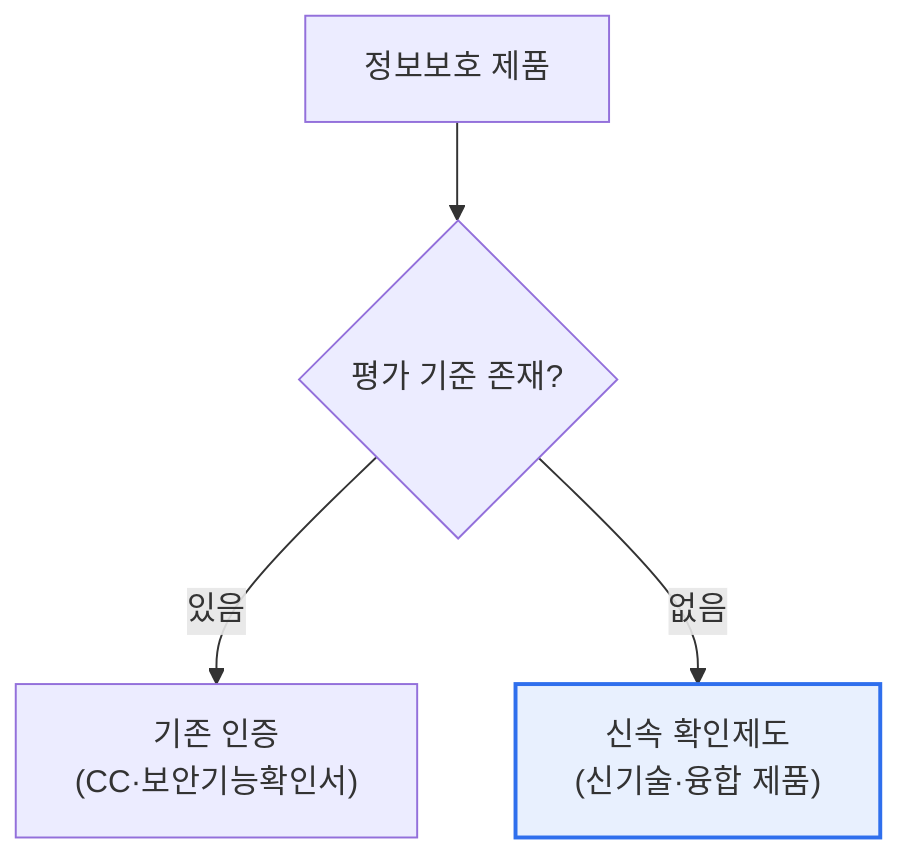

# 정보보호 제품 신속 확인제도

## 1. 개요

### 가. 정의
> 기존 인증 체계에 **평가 기준이 없어 도입이 지연되던 신기술·융합 정보보호 제품**에 대해, 별도의 신속 절차로 보안성을 확인해 공공기관 도입 길을 열어주는 제도.

이 제도가 필요해진 근본 이유는 '**기술 발전 속도와 인증 제도의 시차**'다. CC 인증이나 보안기능 확인서 같은 기존 평가 체계는 정해진 평가 기준(보호 프로파일)이 있는 제품만 인증할 수 있다. 그런데 클라우드 보안·AI 보안·제로트러스트 같은 신기술 융합 제품은 아직 평가 기준 자체가 없어, 아무리 우수해도 공공기관이 도입할 수 없는 사각지대에 놓였다. 신속 확인제도는 이 문제를 해결한다. 정해진 기준이 없는 혁신 제품이라도 보안성을 신속히 확인해주어, 공공시장 진입을 가능케 하고 국내 보안 산업의 혁신을 촉진한다. 즉 '기준이 없어서 못 쓰던' 제품을 '확인을 통해 쓸 수 있게' 만드는 다리 역할을 한다.

### 나. 등장 배경
신기술 융합 보안 제품이 쏟아지는데 이를 평가할 기준 마련이 늦어 공공 도입이 막히자, 혁신 제품의 시장 진입 지원과 보안 산업 활성화를 위해 신속 확인 절차가 도입되었다.

## 2. 기존 인증과의 관계

정보보호 제품이 공공에 도입되려면 보안성을 인정받아야 한다. 평가 기준이 있는 제품은 기존 인증(CC 인증, 보안기능 확인서)을 받고, 기준이 없는 신기술·융합 제품은 신속 확인제도를 활용한다. 두 경로가 상호 보완적으로 작동해, 모든 유형의 보안 제품이 검증을 거쳐 도입될 수 있게 한다.

| 구분 | 기존 인증 | 신속 확인제도 |
|---|---|---|
| **대상** | 평가 기준 있는 제품 | 기준 없는 신기술·융합 제품 |
| **방식** | 정형 평가(보호 프로파일) | 신속 보안성 확인 |
| **목적** | 표준 검증 | 혁신 제품 신속 도입 지원 |

## 3. 절차와 효과

신속 확인은 신청 → 보안성 확인 심사 → 확인서 발급의 흐름으로, 기존 인증보다 신속하게 진행된다. 확인을 받은 제품은 공공기관 도입 근거를 갖게 되어, 혁신 제품의 시장 진입과 국내 보안 산업 성장을 촉진한다.

| 효과 | 내용 |
|---|---|
| **혁신 제품 진입** | 기준 없는 신기술 제품의 공공 도입 |
| **산업 활성화** | 국내 보안 스타트업·신제품 지원 |
| **보안 강화** | 검증되지 않은 제품 무분별 도입 방지 |

## 4. 고려사항 및 시사점

1. **혁신과 검증의 균형**이 제도의 핵심이다. 신속함을 추구하되 보안성 확인이라는 최소 검증을 유지해, 혁신 지원과 안전 확보를 함께 달성해야 한다.
2. **기존 인증 체계로의 연계·전환**을 고려한다. 신속 확인은 한시적 다리이므로, 해당 기술의 평가 기준이 마련되면 정식 인증 체계로 흡수·전환되는 것이 바람직하다.
3. **국내 보안 산업 생태계 활성화**에 기여한다. 평가 기준 부재로 좌절하던 신기술 보안 기업에 공공시장 진입 기회를 열어, 보안 산업의 혁신과 자립을 촉진한다.

---

> **한 줄 요약**: 정보보호 제품 신속 확인제도는 *평가 기준이 없어 도입이 막히던 신기술·융합 보안 제품* 의 보안성을 신속히 확인해 공공 도입을 지원하는 제도로, 혁신과 검증의 균형·기존 인증 연계로 보안 산업 활성화에 기여한다.
