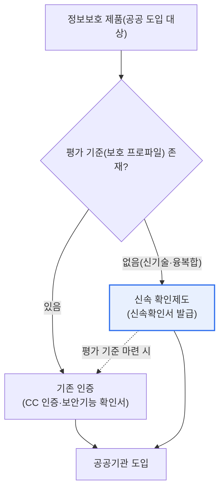
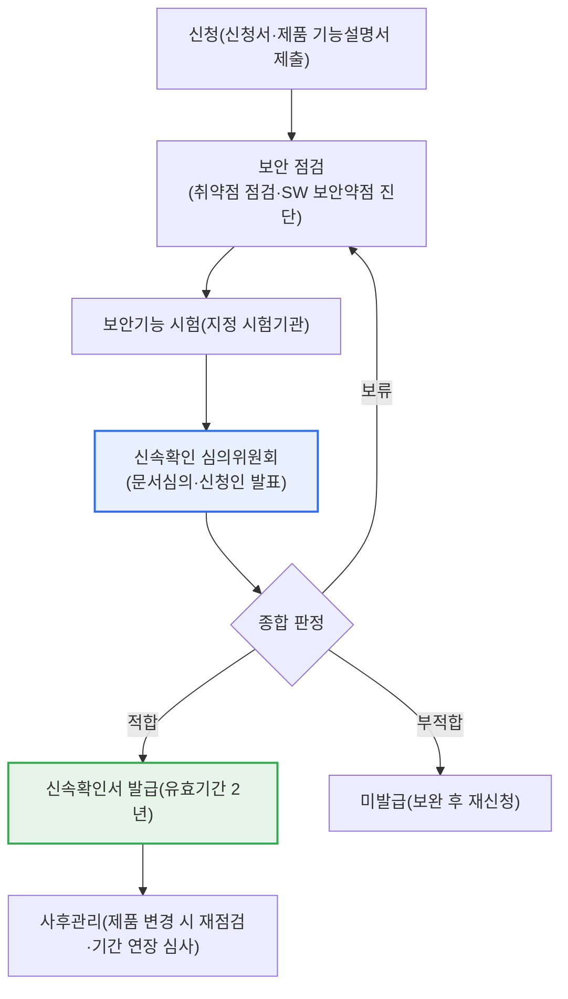

# 정보보호 제품 신속 확인제도

## 1. 개요

### 가. 정의
> **정보보호 제품 신속 확인제도**는 기존 인증 체계에 **평가 기준(보호 프로파일 등)이 없어 공공 도입이 지연되던 신기술·융복합 정보보호 제품**에 대해, 별도의 신속한 절차로 보안성을 확인(적합 판정 시 신속확인서 발급)하여 공공기관 도입의 길을 열어주는 제도이다.

이 제도가 필요해진 근본 이유는 '**기술 발전 속도와 인증 제도의 시차(時差)**'에 있다. 공공기관이 정보보호 제품을 도입하려면 「전자정부법」·「국가정보보안 기본지침」 등에 따라 보안성을 검증받은 제품을 사용해야 하는데, 대표적 검증 수단인 **CC(공통평가기준) 인증**이나 **보안기능 확인서**는 정해진 평가 기준, 즉 국가용 보호 프로파일(PP)이나 국가 보안 요구사항이 존재하는 제품 유형만 평가할 수 있다. 그런데 클라우드 보안·제로트러스트·AI 기반 보안·융복합(예: 보안+네트워크+데이터) 제품처럼 새롭게 등장한 유형은 **평가 기준 자체가 아직 마련되지 않아**, 제품이 아무리 우수해도 공공시장에 진입할 수 없는 사각지대에 놓였다.

신속 확인제도는 바로 이 공백을 메운다. 정해진 기준이 없는 혁신 제품이라도 보안 점검·기능 시험 결과를 바탕으로 신속히 보안성을 확인해 주어, 공공시장 진입을 가능하게 하고 국내 정보보호 산업의 혁신을 촉진한다. 즉 '기준이 없어서 도입하지 못하던' 제품을 '확인을 통해 도입할 수 있게' 만드는 **가교(架橋) 역할**을 하는 제도로 이해하면 정확하다. 다만 이는 정식 인증을 대체하는 것이 아니라, 정식 평가 기준이 마련될 때까지의 **한시적·보완적 통로**라는 점이 제도 설계의 핵심 전제다.

### 나. 등장 배경과 근거
제도의 배경에는 신기술 보안 기업들의 누적된 애로가 있다. 새로운 위협에 대응하는 혁신 제품이 계속 출시되는데도, 이를 평가할 기준 마련이 뒤따르지 못해 공공조달 진입이 막히면서 스타트업·중소 보안기업의 성장이 지체되는 문제가 반복되었다. 이에 과학기술정보통신부는 **「정보보호시스템 평가·인증 등에 관한 고시」(과기정통부 고시 제2022-61호)** 및 한국인터넷진흥원(KISA)의 세부 안내(2022년 10월)를 근거로, **2022년 11월부터 신속 확인제도를 시행**하였다. 운영은 KISA가 주관하고, 보안 시험은 지정 시험기관(TTA, KTR 등)이 수행하는 체계로 짜여 있다.

## 2. 기존 인증 체계와의 관계

정보보호 제품이 공공에 도입되려면 어떤 형태로든 보안성을 인정받아야 한다. 아래 구조도는 평가 기준의 유무에 따라 제품이 어떤 검증 경로로 갈라지는지를 보여준다.

```mermaid
flowchart TB
  P["정보보호 제품(공공 도입 대상)"] --> E{"평가 기준(보호 프로파일) 존재?"}
  E -->|"있음"| C["기존 인증<br/>(CC 인증·보안기능 확인서)"]
  E -->|"없음(신기술·융복합)"| F["신속 확인제도<br/>(신속확인서 발급)"]
  C --> G["공공기관 도입"]
  F --> G
  F -.->|"평가 기준 마련 시"| C
  style F fill:#e8f0fe,stroke:#2f6fed,stroke-width:2px
```

이 구조에서 두 경로는 경쟁 관계가 아니라 **상호 보완적**으로 작동한다. 평가 기준이 있는 제품은 기존 인증(CC 인증·보안기능 확인서)이라는 정형 평가를 거치고, 기준이 없는 신기술·융복합 제품은 신속 확인제도를 통해 보안성을 확인받는다. 그리고 신속확인을 받은 제품 유형에 대해 이후 정식 평가 기준이 마련되면, 해당 제품은 정규 인증 체계로 흡수·전환되는 것이 바람직하다(그림의 점선). 이렇게 함으로써 '기준이 있는 제품'과 '기준이 아직 없는 제품' 모두가 검증을 거쳐 공공에 도입될 수 있는 이중 안전망이 완성된다.

기존 인증과 신속 확인제도의 차이는 단순히 '빠르냐 느리냐'의 문제가 아니라 **검증의 성격 차이**에서 비롯된다. CC 인증은 사전에 합의된 보호 프로파일에 제품이 부합하는지를 정형적·심층적으로 평가하므로 시간이 오래 걸리지만 검증 깊이가 깊다. 반면 신속 확인은 정형 기준이 없는 상태에서 **보안 점검(취약점 점검·소스코드 보안약점 진단)과 기능 시험 결과를 근거로 심의위원회가 종합 판정**하는 방식이어서, 상대적으로 신속하되 '최소한의 보안성 확인'에 방점이 있다. 이 차이를 이해하지 못하면 신속확인을 정식 인증과 동등한 것으로 오해할 수 있으므로 주의해야 한다.

| 구분 | 기존 인증(CC·보안기능확인서) | 신속 확인제도 |
|---|---|---|
| **대상** | 평가 기준(PP) 있는 제품 | 기준 없는 신기술·융복합 제품 |
| **방식** | 정형 평가(보호 프로파일 대비 심층 평가) | 보안점검·기능시험 결과 기반 심의 |
| **소요** | 상대적으로 장기 | 상대적으로 신속(발급까지 약 2개월 수준) |
| **결과물** | 인증서 | 신속확인서(유효기간 2년) |
| **성격** | 표준 검증 | 혁신 제품의 신속 도입 지원(한시적 가교) |

## 3. 신청 요건과 심의 절차

신속 확인제도는 '빠르지만 검증 없는' 통로가 아니라, **정해진 요건과 심의 단계를 거치는 절차적 제도**다. 아래 프로세스도는 신청부터 신속확인서 발급·사후관리까지의 흐름을 나타낸다.

```mermaid
flowchart TD
  A["신청(신청서·제품 기능설명서 제출)"] --> B["보안 점검<br/>(취약점 점검·SW 보안약점 진단)"]
  B --> C["보안기능 시험(지정 시험기관)"]
  C --> D["신속확인 심의위원회<br/>(문서심의·신청인 발표)"]
  D --> E{"종합 판정"}
  E -->|"적합"| F["신속확인서 발급(유효기간 2년)"]
  E -->|"보류"| B
  E -->|"부적합"| G["미발급(보완 후 재신청)"]
  F --> H["사후관리(제품 변경 시 재점검·기간 연장 심사)"]
  style F fill:#e6f4ea,stroke:#34a853,stroke-width:2px
  style D fill:#e8f0fe,stroke:#2f6fed,stroke-width:2px
```

### 가. 신청과 보안 점검
신청 단계에서 기업은 제품의 기능설명서와 함께 보안성을 입증할 자료를 제출한다. 이때 핵심이 되는 것이 **보안 점검**으로, 크게 알려진 취약점에 대한 **취약점 점검**과, 개발 단계 결함을 확인하는 **소프트웨어 보안약점 진단(시큐어코딩)** 이 요구된다. 이는 제품이 최소한 알려진 보안 결함과 코드 수준의 취약점을 통제하고 있음을 확인하기 위한 것으로, 신속함을 이유로 기본적인 보안 위생을 건너뛰지 않도록 하는 장치다.

이 단계가 중요한 이유는, 정형 평가 기준이 없는 제품일수록 '무엇을 기준으로 안전하다고 볼 것인가'가 모호하기 때문이다. 취약점 점검과 보안약점 진단은 기준이 없는 상황에서도 적용 가능한 **공통의 보안 최저선**을 제공한다. 예컨대 특정 신기술 제품이 기능은 혁신적이어도 소스코드에 다수의 심각한 보안약점을 안고 있다면, 이 단계에서 걸러져 보완을 요구받는다.

### 나. 보안기능 시험
다음으로 제품이 표방하는 보안 기능이 실제로 동작하는지를 지정 시험기관(TTA, KTR 등)이 검증한다. 이는 제품 문서에 적힌 기능 명세가 구현과 일치하는지를 확인하는 절차로, '기능은 있다고 하는데 실제로는 작동하지 않는' 허위·과장 위험을 줄인다. 신기술 제품은 참조할 표준 시험 항목이 없는 경우가 많아, 제품 특성에 맞춰 시험 범위를 협의·설계하는 유연성이 함께 요구된다.

보안기능 시험은 신청 기업 입장에서 준비 부담이 큰 단계이기도 하다. 시험 항목 도출·환경 구성·재현 절차 마련에 상당한 시간과 비용이 들 수 있으므로, 기업은 신청 전에 시험기관과 사전 협의를 통해 범위를 명확히 하는 것이 실무적으로 유리하다.

또한 시험 결과는 심의 단계에서 제품 안전성 판단의 핵심 근거가 되므로, 기능 명세를 과장 없이 명확하게 작성하고 시험 가능한 형태로 정의하는 것이 중요하다. 명세가 모호하면 시험 범위가 불명확해져 보류·재신청으로 이어질 수 있으며, 이는 '신속'이라는 제도 취지를 스스로 훼손하는 결과가 된다.

### 다. 신속확인 심의와 사후관리
제출된 문서와 보안 점검·기능 시험 결과는 **신속확인 심의위원회**의 심의를 거친다. 심의는 제출 자료에 대한 **문서 심의**와 **신청인의 발표**를 포함하며, 위원회는 ① 제품이 실제로 신기술·융복합 제품에 해당하는지, ② 제품의 기능, ③ 제품의 안전성, ④ 유지보수 방안의 적절성 등을 종합적으로 평가해 **적합·보류·부적합**으로 판정한다. '적합'을 받으면 **유효기간 2년의 신속확인서**가 발급되며, 전체 소요 기간은 대체로 신청 후 약 2개월 수준으로 알려져 있다.

발급으로 끝이 아니라 **사후관리**가 이어진다. 제품에 변경이 생기면 취약점 점검·보안약점 진단을 다시 수행해 변경을 승인받아야 하고, 유효기간(2년)을 연장하려면 기존 인증제도로의 전환 가능성 등을 검토하고 취약점 점검을 거쳐 기간을 연장한다. 이러한 사후관리는 '한 번 확인받으면 방치되는' 위험을 막고, 제품이 지속적으로 보안 수준을 유지하도록 강제하는 안전장치다.

| 심의 판정 | 의미 | 후속 조치 |
|---|---|---|
| **적합** | 보안성 확인 요건 충족 | 신속확인서 발급(유효기간 2년) |
| **보류** | 일부 보완 필요 | 보완 후 재심의 |
| **부적합** | 요건 미충족 | 미발급, 보완 후 재신청 |

### 라. 적용 예시로 본 절차의 의미
절차의 취지는 구체적 상황에 대입해 보면 분명해진다. 예를 들어 클라우드 워크로드 보안(CWPP)이나 제로트러스트 접근제어 같은 융복합 제품은, 기능이 여러 보안 범주에 걸쳐 있어 기존의 단일 보호 프로파일로는 평가 항목을 특정하기 어렵다. 이런 제품은 CC 인증 경로에서 '평가 기준 없음'으로 좌초하기 쉽지만, 신속 확인제도에서는 취약점 점검·보안약점 진단으로 코드·구성의 보안 최저선을 확인하고, 제품이 표방하는 핵심 보안 기능(예: 워크로드 격리, 정책 기반 접근통제)이 실제 동작하는지를 시험한 뒤, 심의위원회가 신기술 해당성과 안전성을 종합 판정한다.

이 과정에서 심의위원회의 네 가지 평가 관점(신기술·융복합 해당성, 기능, 안전성, 유지보수 방안의 적절성)은 '기준이 없는 제품을 어떻게 공정하게 판단할 것인가'라는 난제에 대한 실무적 답이다. 특히 **유지보수 방안의 적절성**을 판정 요소에 포함한 것은, 신기술 제품일수록 출시 후 취약점 대응·패치 체계가 갖춰졌는지가 실사용 안전성을 좌우하기 때문이다. 즉 신속확인은 '지금 이 제품이 안전한가'뿐 아니라 '앞으로도 안전하게 유지될 수 있는가'까지 함께 본다는 점에서, 단순 통과 절차가 아니라 최소한의 지속가능성 검증을 지향한다.

## 4. 심화 — 도입 효과와 최근 동향

신속 확인제도는 시행 이후 신기술 보안기업의 공공시장 진입을 실제로 확대하는 성과를 냈다. 클라우드 보안, EDR, 제로트러스트, AI 보안 등 기존 평가 기준으로 포섭하기 어려웠던 융복합 제품들이 신속확인을 통해 공공 조달에 참여할 근거를 얻으면서, 국내 보안 스타트업의 레퍼런스 확보와 매출 창출에 기여하고 있다. 이는 정보보호 산업 육성이라는 정책 목표와 직접 맞닿아 있다.

제도의 효과는 단순히 '한 제품의 진입'에 그치지 않고 **산업 생태계의 선순환**을 겨냥한다. 공공 레퍼런스를 확보한 신기술 기업은 이를 발판으로 민간·해외 시장으로 확장하고, 그 성장은 다시 신기술 투자와 신제품 출시로 이어진다. 정부 입장에서도 검증되지 않은 제품의 무분별한 도입을 막으면서 혁신 제품의 확산을 유도할 수 있어, '보안'과 '산업 진흥'이라는 두 정책 목표를 동시에 달성하는 수단이 된다. 이 점에서 신속확인은 조달 제도이면서 동시에 산업정책 도구의 성격을 함께 지닌다.

동시에 제도의 **정합성 유지**를 위한 후속 노력도 진행되고 있다. 신속확인을 받은 제품 유형에 대해 정식 평가 기준(보호 프로파일)을 마련해 정규 인증으로 전환하려는 흐름, 그리고 성능평가·보안기능 확인서 등 인접 제도와의 정비가 병행된다. 예를 들어 정보보호 제품 성능평가 제도에 새로운 제품군을 추가하고 평가 기준을 강화하는 등, 신기술 제품의 검증 체계 전반이 지속적으로 보강되는 추세다. 다만 개별 제도의 세부 기준·대상 품목은 개정으로 계속 바뀌므로, 실제 신청·활용 시에는 KISA·정보보호산업진흥포털의 최신 공고를 확인하는 것이 바람직하다.

한편 도입 기관 입장에서의 활용 포인트도 짚어둘 필요가 있다. 공공기관 정보화 담당자는 조달·구매 규격을 작성할 때, 표준 인증이 존재하는 품목은 CC 인증·보안기능 확인서를, 아직 기준이 없는 신기술 품목은 신속확인서를 각각 요구 근거로 삼을 수 있다. 이때 신속확인은 CC 인증과 검증 성격이 다르다는 점을 규격에 반영해, 신속확인 제품을 도입하더라도 운영 단계의 자체 보안성 검토(형상관리·취약점 점검·로그 모니터링)를 함께 규정하는 것이 안전하다. 이는 제도가 '도입의 문턱을 낮추되 보안 책임까지 면제하는 것은 아니다'라는 원칙을 실무에서 관철하는 방법이다.

## 5. 고려사항 및 시사점

신속 확인제도는 '혁신 지원'과 '보안 검증'이라는 두 목표를 동시에 추구하는 제도로, 기술사 관점에서 다음을 균형 있게 고려해야 한다.

1. **혁신 속도와 검증 깊이의 균형이 제도의 본질이다.** 신속함을 앞세우되 취약점 점검·보안약점 진단·기능 시험이라는 최소 검증을 유지해야, 혁신 지원과 안전 확보를 함께 달성할 수 있다. 검증을 지나치게 완화하면 검증되지 않은 제품이 공공에 유입될 위험이, 지나치게 강화하면 제도의 존재 이유인 '신속성'이 훼손될 위험이 있다.

2. **기존 인증 체계로의 연계·전환을 전제로 운영해야 한다.** 신속확인은 유효기간 2년의 한시적 가교이므로, 해당 기술의 정식 평가 기준이 마련되면 CC 인증·보안기능 확인서 등 정규 체계로 흡수·전환하는 로드맵이 필요하다. 그렇지 않으면 신속확인이 '우회 통로'로 고착될 수 있다.

3. **국내 정보보호 산업 생태계 활성화 관점에서 접근해야 한다.** 평가 기준 부재로 좌절하던 신기술 보안기업에 공공시장 진입 기회를 열어 레퍼런스·매출을 확보하게 함으로써, 보안 산업의 혁신과 자립을 촉진한다. 특히 자본·인력이 부족한 스타트업에는 시험·심의 준비 부담을 낮추는 지원이 병행될 필요가 있다.

4. **사후관리와 책임 소재를 명확히 해야 한다.** 신속확인서는 발급으로 끝나지 않고 제품 변경 시 재점검, 유효기간 연장 심사 등 지속적 관리가 요구된다. 도입 기관은 신속확인이 CC 인증과 검증 깊이가 다름을 인지하고, 제품 운영 단계에서 자체 보안 점검·모니터링을 병행하는 것이 바람직하다.

5. **AI·클라우드 등 융복합 신기술의 확산에 대응하는 유연성이 필요하다.** 앞으로도 표준 평가 기준이 없는 새로운 유형의 보안 제품이 계속 등장할 것이므로, 제도는 특정 품목에 고착되지 않고 신기술 등장에 맞춰 심의 기준과 시험 방법을 유연하게 확장할 수 있어야 한다.

6. **제도의 신뢰성 확보를 위한 심의 투명성·전문성이 관건이다.** 정형 기준 없이 심의위원회의 종합 판정에 의존하는 구조이므로, 판정의 일관성·객관성을 담보할 심의 기준의 공개, 위원 구성의 전문성·독립성, 판정 사유의 기록·환류 체계가 뒷받침되어야 한다. 이것이 미흡하면 '왜 이 제품은 되고 저 제품은 안 되는가'라는 형평성 논란으로 제도의 신뢰가 훼손될 수 있다.

## 참고자료
- 한국인터넷진흥원(KISA), 신기술 및 융·복합 정보보호제품 신속확인 제도: https://www.kisa.or.kr/1041502
- ZDNet Korea, "11월부터 정보보호제품 신속확인제…발급까지 2개월 소요"(2022): https://zdnet.co.kr/view/?no=20221018081026

---

> **한 줄 요약**: 정보보호 제품 신속 확인제도는 *평가 기준이 없어 공공 도입이 막히던 신기술·융복합 보안 제품* 에 대해 취약점 점검·보안약점 진단·기능 시험과 심의위원회 판정을 거쳐 유효기간 2년의 신속확인서를 발급하는 한시적 가교 제도로, 혁신 지원과 최소 검증의 균형·기존 인증 연계·사후관리를 통해 보안 산업 활성화에 기여한다.
