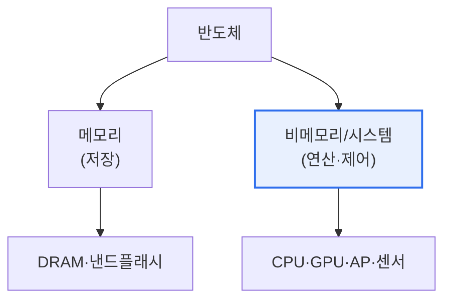

# 반도체 산업 — 메모리·비메모리, 가치사슬, 성장 전략

## 1. 개요

### 가. 배경
> 반도체는 모든 디지털 기기의 두뇌로, 글로벌 기업·국가 간 주도권 경쟁이 치열하다. 우리나라는 **메모리 반도체 강국**이지만 **비메모리(시스템) 반도체는 상대적으로 열세**로, 이 불균형 해소가 국가적 과제다.

반도체 산업을 이해하는 핵심은 '**메모리와 비메모리는 성격이 근본적으로 다른 시장**'이라는 점이다. 메모리는 데이터를 저장하는 표준화된 제품(DRAM·낸드)으로, 소품종·대량생산이며 대규모 설비 투자와 미세공정 기술이 경쟁력을 좌우한다. 우리나라가 강한 분야다. 반면 비메모리(시스템 반도체)는 연산·제어를 담당하는 다품종·소량 맞춤 제품(CPU·GPU·AP·센서)으로, 설계 역량과 다양한 고객 대응이 핵심이며 전체 반도체 시장의 약 2/3를 차지한다. 이 시장은 설계·제조가 분업화되어 있고, 우리나라는 제조(파운드리)는 강하지만 설계(팹리스)가 약하다. 따라서 반도체 강국이 되려면 메모리 우위를 지키면서 비메모리 설계 생태계를 키워 균형을 맞춰야 한다.

## 2. 메모리 vs 비메모리 반도체 비교

| 구분 | 메모리 반도체 | 비메모리(시스템) 반도체 |
|---|---|---|
| **기능** | 데이터 저장 | 연산·제어·변환 |
| **제품** | DRAM, 낸드플래시 | CPU, GPU, AP, 센서 |
| **생산** | 소품종·대량생산 | 다품종·소량 맞춤 |
| **경쟁력** | 미세공정·설비 투자 | 설계 역량·고객 대응 |
| **시장 비중** | 약 1/3 | 약 2/3 |
| **한국 위상** | 강국(1위권) | 열세(설계 취약) |

## 3. 반도체 산업의 가치사슬(Value Chain)

비메모리 반도체는 설계와 제조가 분업화되어 있다. 이 분업 구조를 이해하는 것이 성장 전략의 출발점이다.

| 단계 | 역할 | 예 |
|---|---|---|
| **설계(팹리스)** | 칩 설계, 제조 안 함 | 퀄컴, 엔비디아 |
| **IP·설계자산** | 설계 핵심 블록 제공 | ARM |
| **제조(파운드리)** | 위탁 생산 | TSMC, 삼성 파운드리 |
| **후공정(OSAT)** | 패키징·테스트 | ASE |
| **종합(IDM)** | 설계+제조 일괄 | 인텔, 삼성 |

우리나라는 파운드리(제조)에서는 세계적 경쟁력이 있으나, 고부가가치인 설계(팹리스)와 IP 분야가 취약하다.

## 4. 비메모리 성장을 위한 비전과 전략

| 전략 | 내용 |
|---|---|
| **팹리스 육성** | 설계 스타트업·인력 양성, 설계 IP 확보 |
| **파운드리 경쟁력** | 미세공정 투자, 다양한 고객 확보 |
| **생태계·분업 강화** | 설계-제조-후공정 협력, 소부장 국산화 |
| **국가 지원** | R&D·세제 지원, 특화단지, 인력 양성 |
| **첨단 패키징** | 칩렛·이종집적으로 미세화 한계 보완 |

## 5. 고려사항 및 시사점

1. **설계 생태계 육성이 핵심 과제**다. 메모리 우위만으로는 한계가 있으므로, 고부가가치 팹리스 설계 역량과 IP·인력을 키워 비메모리 경쟁력을 확보해야 한다.
2. **공급망 안정과 기술 주권**이 중요하다. 반도체가 경제안보의 핵심이 되면서, 소재·부품·장비 국산화와 안정적 공급망 확보가 국가 전략이 되었다.
3. **AI 반도체가 새로운 기회**다. AI 붐으로 GPU·NPU·HBM 수요가 폭증하면서, 메모리(HBM) 강점과 AI 반도체 설계를 결합하는 것이 성장 돌파구가 된다.

---

> **한 줄 요약**: 반도체는 *저장의 메모리(한국 강국)와 연산의 비메모리(설계 취약)* 로 나뉘며, 설계-제조(파운드리)-후공정의 가치사슬에서 팹리스 설계 생태계 육성·공급망 안정·AI 반도체가 비메모리 성장의 핵심 전략이다.
