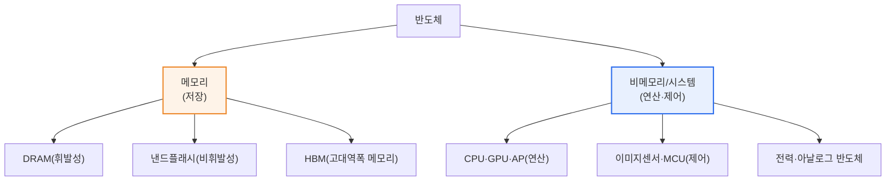
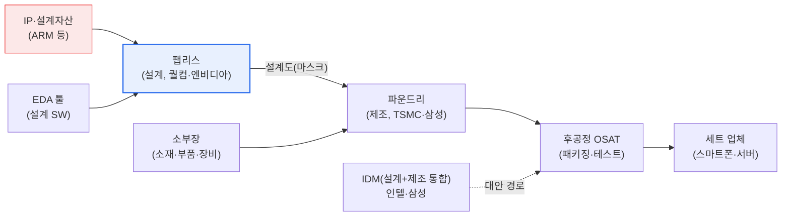

# 반도체 산업 — 메모리·비메모리, 가치사슬, 성장 전략

## 1. 개요

### 가. 정의와 배경
> 반도체는 모든 디지털 기기의 두뇌로, 데이터를 저장하는 **메모리**와 연산·제어를 담당하는 **비메모리(시스템) 반도체**로 대별된다. 우리나라는 메모리 반도체 강국이지만 비메모리는 상대적으로 열세로, 이 구조적 불균형의 해소가 국가적 과제다.

반도체 산업을 이해하는 첫 번째 열쇠는 '**메모리와 비메모리는 성격이 근본적으로 다른 시장**'이라는 인식이다. 메모리는 데이터를 저장하는 표준화된 규격품(DRAM·낸드플래시)으로, 같은 규격의 제품을 대량으로 찍어내는 소품종·대량생산 구조다. 따라서 경쟁력은 곧 '**얼마나 미세하게, 얼마나 싸게, 얼마나 많이**' 만드느냐에 달려 있고, 이는 대규모 설비 투자와 미세공정 기술로 귀결된다. 이 게임의 규칙이 자본과 공정 기술이기 때문에, 막대한 투자를 감내하고 앞선 공정을 유지해 온 우리나라 기업이 세계 1~2위를 다투는 강자로 자리 잡았다.

반면 비메모리(시스템 반도체)는 연산·제어·변환을 담당하는 다품종·소량 맞춤 제품(CPU·GPU·AP·이미지센서·전력반도체 등)이다. 고객마다 요구하는 기능이 다르므로 '**얼마나 잘 설계하고, 얼마나 다양한 고객을 대응하느냐**'가 경쟁력의 본질이다. 시장 규모 역시 전체 반도체의 약 2/3를 차지해 메모리(약 1/3)보다 크다. 문제는 이 큰 시장에서 우리나라의 위상이 낮다는 점이다. 설계(팹리스)와 설계자산(IP) 역량이 취약하고, 제조(파운드리)는 강하지만 최선단 공정 리더십과 다양한 고객 기반 확보에서 도전을 받는다.

이런 이질성 때문에 반도체 산업은 몇 가지 뚜렷한 특징을 갖는다. **극단적 자본집약성**(최선단 공장 하나에 수십조 원), **빠른 기술 진부화**(무어의 법칙에 따른 세대 교체), **높은 수율 민감성**(불량률 몇 %가 수익을 좌우), 그리고 **강한 지정학성**(핵심 장비·소재·시장이 특정국에 편중)이 그것이다. 이 특징들은 뒤에서 다룰 사이클 변동성·공급망 리스크·경제안보 이슈의 근본 원인이 된다.

두 번째 열쇠는 '**분업**'이다. 메모리는 설계와 제조를 한 회사가 통합(IDM)하는 경우가 많지만, 비메모리는 설계 전문 팹리스와 제조 전문 파운드리가 나뉘어 있다. 이 수평 분업 구조 덕분에 자본이 부족한 설계 기업도 아이디어만으로 시장에 진입할 수 있게 되었고, 반대로 파운드리는 세계의 팹리스 물량을 모아 규모의 경제를 실현한다. 따라서 반도체 강국이 되려면 메모리 우위를 지키면서 비메모리의 '설계 생태계'를 함께 키워 균형을 맞추는 이원 전략이 필요하다. 이 글은 (1) 메모리·비메모리의 차이, (2) 가치사슬의 분업 구조, (3) 비메모리 성장 전략, (4) 최근 AI 반도체 동향을 심화해 다룬다.

## 2. 산업 전체 구조도

반도체 산업의 큰 그림은 '무엇을 만드는가(제품)'와 '누가 어느 단계를 맡는가(가치사슬)'의 두 축으로 그릴 수 있다. 아래 구조도는 제품 분류를, 3장의 다이어그램은 가치사슬 흐름을 각각 표현한다.

```mermaid
flowchart TB
  S[반도체] --> M["메모리<br/>(저장)"]
  S --> N["비메모리/시스템<br/>(연산·제어)"]
  M --> M1["DRAM(휘발성)"]
  M --> M2["낸드플래시(비휘발성)"]
  M --> M3["HBM(고대역폭 메모리)"]
  N --> N1["CPU·GPU·AP(연산)"]
  N --> N2["이미지센서·MCU(제어)"]
  N --> N3["전력·아날로그 반도체"]
  style N fill:#e8f0fe,stroke:#2f6fed,stroke-width:2px
  style M fill:#fef3e8,stroke:#ed8a2f,stroke-width:2px
```

메모리 안에서도 성격이 갈린다. DRAM은 속도가 빠르지만 전원이 꺼지면 데이터가 사라지는 휘발성 메모리로 주기억장치에 쓰이고, 낸드플래시는 느리지만 전원이 꺼져도 데이터를 유지하는 비휘발성 메모리로 저장장치(SSD)에 쓰인다. 최근에는 여러 DRAM 칩을 수직으로 쌓아 대역폭을 크게 높인 **HBM(High Bandwidth Memory)**이 AI 가속기용으로 급부상했는데, 이는 전통적 메모리 시장과 AI 반도체를 잇는 결정적 연결고리가 되었다. 비메모리는 연산(CPU·GPU·AP), 제어(MCU·이미지센서), 전력·아날로그 등으로 나뉘며 제품 종류가 수천 가지에 달할 만큼 다양하다.

## 3. 메모리 vs 비메모리 반도체 비교

두 시장의 차이는 단순한 기능 차이가 아니라 '**경쟁의 규칙 자체가 다르다**'는 데 있다. 메모리는 규격이 표준화되어 있어 제품 자체로는 차별화가 어렵고, 결국 원가와 공정 미세화로 승부한다. 그래서 호황·불황의 진폭이 크다. 수요가 몰리면 가격이 급등하고, 공급이 넘치면 가격이 폭락하는 '사이클' 산업이며, 소수 기업이 대규모 투자로 경쟁하는 과점 구조가 형성된다.

비메모리는 정반대다. 고객의 요구에 맞춰 칩을 설계하므로 한 번 특정 제품에 채택되면 오래 유지되는 안정적 매출 구조를 갖고, 시장 사이클의 진폭도 상대적으로 작다. 대신 진입장벽이 '자본'이 아니라 '설계 역량·소프트웨어 생태계·고객 신뢰'에 있어, 후발 주자가 단기간에 따라잡기 어렵다. 우리나라가 메모리에서는 세계 정상에 있으면서 비메모리에서 고전하는 이유가 바로 이 규칙의 차이 때문이다.

| 구분 | 메모리 반도체 | 비메모리(시스템) 반도체 |
|---|---|---|
| **기능** | 데이터 저장 | 연산·제어·변환 |
| **제품** | DRAM, 낸드플래시, HBM | CPU, GPU, AP, 센서, 전력반도체 |
| **생산** | 소품종·대량생산 | 다품종·소량 맞춤 |
| **경쟁력** | 미세공정·설비 투자·원가 | 설계 역량·SW 생태계·고객 대응 |
| **시장 특성** | 사이클(호·불황 진폭 큼) | 상대적 안정, 채택 시 장기 매출 |
| **시장 비중** | 약 1/3 | 약 2/3 |
| **한국 위상** | 강국(1위권) | 열세(설계 취약) |

실제 사례로, 2021~2022년 팬데믹 특수로 메모리 가격이 급등했다가 2023년 IT 수요 둔화로 대규모 적자 사이클을 겪은 것은 메모리 시장의 변동성을 잘 보여준다. 반대로 이미지센서·전력반도체처럼 특정 기기에 오래 채택되는 비메모리는 완만한 성장세를 유지했다. 이 차이는 곧 '우리나라 반도체 수출이 왜 이렇게 출렁이는가'를 설명하는 근거이기도 하다 — 수출의 상당 부분이 사이클성 메모리에 쏠려 있기 때문이다.

이 사이클성은 단순한 가격 변동을 넘어 **투자 타이밍의 딜레마**를 낳는다. 메모리는 호황기에 증설을 결정하지만 실제 양산까지 수년이 걸리므로, 완공 시점에 이미 불황에 접어들어 공급 과잉을 심화시키는 '돼지 사이클(hog cycle)'이 반복된다. 그럼에도 미세공정 리더십을 놓치면 원가 경쟁에서 밀리므로 불황기에도 기술 투자를 멈출 수 없다. 이처럼 '멈출 수 없는 투자'가 메모리 산업의 진입장벽을 극단적으로 높여 소수 과점을 굳히는 동시에, 비메모리로의 사업 다각화가 왜 절실한지를 역설적으로 보여준다. 매출의 안정성을 확보하려면 사이클 완충 역할을 할 수 있는 비메모리·시스템 반도체 비중을 키우는 것이 구조적 해법이 되기 때문이다.

## 4. 반도체 산업의 가치사슬(Value Chain)

비메모리 반도체는 설계와 제조가 분업화되어 있다. 이 분업 구조를 이해하는 것이 성장 전략의 출발점이다. 아래 흐름도는 아이디어에서 완성 칩까지의 단계별 주체와 흐름을 보여준다.

```mermaid
flowchart LR
  IP["IP·설계자산<br/>(ARM 등)"] --> FL["팹리스<br/>(설계, 퀄컴·엔비디아)"]
  FL -->|"설계도(마스크)"| FD["파운드리<br/>(제조, TSMC·삼성)"]
  EDA["EDA 툴<br/>(설계 SW)"] --> FL
  MAT["소부장<br/>(소재·부품·장비)"] --> FD
  FD --> OSAT["후공정 OSAT<br/>(패키징·테스트)"]
  OSAT --> SET["세트 업체<br/>(스마트폰·서버)"]
  IDM["IDM(설계+제조 통합)<br/>인텔·삼성"] -.대안 경로.-> OSAT
  style FL fill:#e8f0fe,stroke:#2f6fed,stroke-width:2px
  style IP fill:#fce8e8,stroke:#ed2f2f
```

**설계(팹리스)** 단계는 부가가치의 원천이다. 팹리스는 공장을 갖지 않고 칩을 설계만 하며, 제조는 파운드리에 맡긴다. 퀄컴·엔비디아·AMD가 대표적이다. 설계에는 EDA(설계 자동화 소프트웨어)와 ARM 같은 회사가 제공하는 검증된 설계 블록(IP)이 필수인데, 이 EDA와 IP 시장은 소수 해외 기업이 장악하고 있어 설계 생태계의 '보이지 않는 관문' 역할을 한다. 우리나라 팹리스가 성장하려면 단순히 설계 인력만이 아니라 이 IP·툴 생태계에 대한 접근과 국산 IP 확보가 함께 이뤄져야 한다.

**제조(파운드리)** 는 팹리스의 설계도를 받아 실제 칩을 찍어내는 위탁생산이다. TSMC가 최선단 공정에서 압도적 점유율로 시장을 주도하고, 삼성 파운드리가 그 뒤를 추격하는 구도다. 파운드리 경쟁력의 핵심은 '**최선단 미세공정을 먼저, 안정적 수율로**' 확보하는 것과 '**다양한 고객을 확보**'하는 것이다. 미세공정 한 세대(예: 5nm→3nm)를 앞서면 성능·전력 효율에서 우위를 점해 대형 고객을 끌어올 수 있기에, 파운드리는 수십조 원 규모의 설비 투자를 계속 감내해야 하는 '쩐의 전쟁'이다.

여기서 짚어야 할 것이 **EDA·IP라는 '보이지 않는 병목'** 이다. 아무리 뛰어난 설계 인력이 있어도, 칩을 설계하는 소프트웨어(EDA)와 검증된 설계 블록(IP)이 없으면 현대의 복잡한 칩을 설계할 수 없다. 그런데 이 두 시장은 소수 해외 기업이 사실상 표준을 쥐고 있어, 설계 생태계의 최상류에 강력한 진입장벽을 형성한다. 우리나라 팹리스 육성이 인력 양성만으로 완성되지 않는 이유가 여기에 있다 — 국산 IP를 축적하고 EDA 접근성을 확보하며, 대학·연구소가 설계 자산을 공유하는 개방형 생태계를 함께 만들어야 비로소 설계 저변이 넓어진다. 이는 단기 투자로 해결되지 않는, 수십 년에 걸친 지식 축적의 문제라는 점에서 국가 전략의 인내심이 요구된다.

**후공정(OSAT)** 은 완성된 웨이퍼를 잘라 칩을 포장(패키징)하고 검사(테스트)하는 단계다. 과거에는 부가가치가 낮은 하청으로 여겨졌으나, 미세공정이 물리적 한계(원자 크기)에 다가서면서 상황이 달라졌다. 여러 칩을 하나로 결합하는 **첨단 패키징(칩렛·이종집적, 2.5D/3D)** 이 성능을 끌어올리는 새로운 열쇠로 부상하며, 후공정의 전략적 중요성이 크게 높아졌다. **소부장(소재·부품·장비)** 은 이 모든 단계를 떠받치는 기반으로, 노광장비 등 핵심 장비는 특정 해외 기업 의존도가 높아 공급망 리스크의 대표적 사례가 된다. 마지막으로 설계와 제조를 한 회사가 모두 하는 **IDM(종합반도체)** 모델이 있으며, 메모리 기업과 인텔이 이에 해당한다.

## 5. 비메모리 성장을 위한 비전과 전략

앞선 진단을 종합하면 전략의 방향은 분명하다. 메모리 우위를 지키면서, 취약한 설계(팹리스)와 IP를 키우고, 강점인 파운드리를 최선단으로 밀어올리며, 이를 떠받칠 소부장·인력·생태계를 함께 구축하는 것이다. 아래 표의 각 전략은 서로 맞물려 있어 하나만으로는 효과가 제한적이다.

| 전략 | 내용 | 이유·함의 |
|---|---|---|
| **팹리스 육성** | 설계 스타트업·인력 양성, 국산 IP 확보 | 부가가치 원천, 사이클 방어 |
| **파운드리 경쟁력** | 최선단 미세공정 투자, 고객 다변화 | 선단공정 우위=대형고객 유치 |
| **생태계·분업 강화** | 설계-제조-후공정 협력, 소부장 국산화 | 공급망 자립, 리스크 완화 |
| **국가 지원** | R&D·세제, 특화단지(클러스터), 인력양성 | 자본·인력 규모의 문제 해결 |
| **첨단 패키징** | 칩렛·이종집적으로 미세화 한계 보완 | 후공정이 성능의 새 열쇠 |

특히 국가 차원에서는 대규모 반도체 클러스터를 조성해 설계-제조-소부장 기업과 인력을 한곳에 집적시키는 '**생태계 집적**' 전략이 추진되고 있다. 이는 개별 기업의 노력만으로는 메우기 어려운 인력·인프라의 규모 문제를 국가가 함께 푸는 접근이다. 미국의 CHIPS Act, EU의 Chips Act처럼 주요국이 자국 내 생산 기반 확보를 위해 대규모 보조금 경쟁에 나선 것도 같은 맥락이며, 반도체가 산업을 넘어 '경제안보'의 문제가 되었음을 보여준다.

전략들 사이의 우선순위를 판단할 때 유의할 점은, 팹리스와 파운드리가 서로를 필요로 하는 '**닭과 달걀**' 관계라는 것이다. 국내 팹리스가 부족하면 국내 파운드리는 해외 고객에 의존해야 하고, 반대로 믿을 만한 국내 파운드리·패키징 기반이 얕으면 팹리스는 설계를 맡길 곳이 마땅치 않다. 따라서 어느 한쪽만 지원하는 정책은 효과가 반감되며, 설계-제조-후공정-소부장을 하나의 생태계로 묶어 동시에 키우는 '패키지형 지원'이 필요하다. 클러스터 전략이 주목받는 이유도 바로 이 상호의존을 물리적 집적으로 해소하려는 데 있다. 다만 보조금·세제 지원은 자칫 중복 투자와 공급 과잉을 부를 수 있으므로, 시장 수요와 기술 로드맵에 정렬된 선택과 집중이 병행되어야 한다.

## 6. 심화 — AI 반도체와 HBM, 그리고 최근 동향

최근 반도체 산업의 지형을 뒤흔든 결정적 변수는 **생성형 AI**다. 대규모 언어모델의 학습·추론에는 막대한 병렬 연산과 데이터 대역폭이 필요한데, 이를 감당하는 것이 GPU·NPU 같은 AI 가속기와, 그 옆에서 데이터를 초고속으로 공급하는 **HBM**이다. 여기서 우리나라 메모리 산업에 중요한 기회가 열렸다. HBM은 여러 DRAM을 수직으로 쌓아 만드는 고부가가치·고난도 메모리로, 기존 DRAM 강자인 우리나라 기업이 세계 시장을 주도하고 있다. 즉 '**메모리 강점(HBM)을 AI라는 성장 시장에 접목**'하는 형태로, 사이클성 메모리 사업이 성장 사업으로 재평가받는 계기가 된 것이다.

한편 AI 반도체 경쟁은 순수한 하드웨어 싸움만이 아니다. 엔비디아의 사례처럼, AI 가속기의 진짜 진입장벽은 칩 자체보다 그 위에서 돌아가는 **소프트웨어 생태계(개발 도구·라이브러리)** 에 있다. 개발자들이 특정 플랫폼에 익숙해지면 하드웨어를 바꾸기 어려운 '락인(lock-in)'이 발생하기 때문이다. 이는 후발 주자가 성능 좋은 칩을 만들어도 시장 안착이 쉽지 않은 이유이며, 우리나라 AI 반도체(NPU) 전략이 칩 설계와 더불어 소프트웨어 스택·개발자 생태계 확보를 병행해야 하는 근거가 된다.

동시에 이 흐름은 비메모리 전략에도 시사점을 준다. AI 가속기의 두뇌인 GPU·NPU 설계는 여전히 해외 팹리스가 주도하므로, 우리나라는 (1) HBM 등 AI용 메모리에서의 우위를 지렛대로 삼고, (2) AI 반도체(NPU) 설계 역량을 국가적으로 키우며, (3) HBM과 로직 칩을 결합하는 첨단 패키징 경쟁력을 확보하는 '3중 연계' 전략이 유효하다. 실제로 AI 붐 이후 최선단 파운드리와 HBM, 첨단 패키징이 하나의 밸류체인으로 묶이면서, 이 세 영역을 모두 갖춘 기업이 유리해지는 통합 경쟁 구도가 나타나고 있다. 다만 AI 수요의 지속성, 미·중 기술 패권 경쟁에 따른 수출통제 등 불확실성이 크므로, 특정 시황에 대한 단정보다는 '메모리·파운드리·패키징의 균형 강화'라는 구조적 방향에 무게를 두는 것이 안전하다.

## 7. 고려사항 및 시사점

1. **설계 생태계 육성이 최우선 과제**다. 메모리 우위만으로는 시장의 2/3인 비메모리를 놓치게 된다. 고부가가치 팹리스 설계 역량과 국산 IP·EDA 접근성, 그리고 무엇보다 설계 인력을 장기적으로 육성해야 하며, 이는 단기 성과가 아니라 10년 단위의 투자로 접근해야 한다.
2. **공급망 안정과 기술 주권**이 핵심이다. 반도체가 경제안보의 중심이 되면서, 핵심 장비·소재의 특정국 의존을 낮추는 소부장 국산화와 다변화된 안정적 공급망 확보가 국가 전략이 되었다. 특정 장비·소재의 병목은 곧 전체 생산의 병목이 되므로 리스크 분산이 필수다.
3. **AI 반도체·HBM이 새로운 성장 축**이다. 메모리(HBM) 강점과 AI 가속기 설계·첨단 패키징을 연계하는 통합 전략이 사이클 산업의 한계를 넘는 돌파구가 된다. 다만 AI 수요의 변동성과 지정학 리스크를 함께 관리해야 한다.
4. **미세화 한계와 첨단 패키징으로의 전환**에 대비해야 한다. 공정 미세화가 물리적 한계에 다가서면서, 성능 향상의 무게중심이 '더 작게'에서 '더 잘 붙이기(칩렛·이종집적)'로 이동하고 있다. 후공정을 저부가가치 하청이 아닌 전략 영역으로 재인식하고 투자해야 한다.
5. **인력 확보가 모든 전략의 병목**이다. 설계·공정·패키징 어느 전략도 결국 사람이 실행한다. 이공계 기피와 고급 인력 유출을 막고 해외 인재를 유치하는 인력 정책이 뒷받침되지 않으면 다른 투자의 효과가 반감된다.

## 참고자료
- 한국반도체산업협회(KSIA): https://www.ksia.or.kr/
- SEMI(국제반도체장비재료협회): https://www.semi.org/
- 산업통상자원부 반도체 산업 정책: https://www.motie.go.kr/

---

> **한 줄 요약**: 반도체는 *저장의 메모리(한국 강국)와 연산의 비메모리(설계 취약)* 로 나뉘고 경쟁 규칙 자체가 다르며, IP·팹리스·EDA→파운드리→후공정으로 이어지는 가치사슬에서 **팹리스 설계 생태계 육성·소부장 국산화·AI 반도체(HBM·첨단 패키징) 연계**가 비메모리 성장과 경제안보의 핵심 전략이다.
