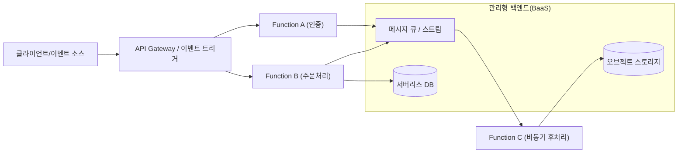
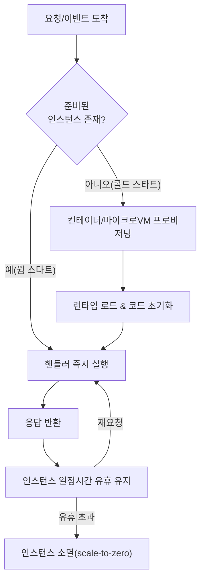

# 서버리스 컴퓨팅(Serverless Computing / FaaS)

## 1. 개요

> **정의**: 서버리스 컴퓨팅은 개발자가 서버의 프로비저닝·스케일링·패치 등 인프라 운영을 클라우드 사업자에게 완전히 위임하고, **이벤트에 반응하는 함수(Function) 또는 관리형 서비스 단위로 애플리케이션을 구성**하며, 실제 실행에 사용한 자원만큼만 과금(pay-per-use)받는 클라우드 실행 모델이다.

"서버가 없다"는 명칭은 물리적 서버가 사라진다는 뜻이 아니라, **서버의 존재가 개발자의 관심사에서 사라진다(server-less)**는 의미다. 전통적 IaaS·PaaS에서는 트래픽이 없어도 인스턴스를 상시 기동하고 그만큼 비용을 지불해야 했으나, 서버리스는 요청이 들어온 순간에만 함수 인스턴스를 생성해 실행하고 유휴 시에는 자원을 0으로 축소(scale-to-zero)한다. 이는 곧 **자원 사용의 최소 단위를 '서버 대여 시간'에서 '함수 1회 호출·수십 밀리초'로 낮추는** 변화이며, 마이크로서비스·이벤트 기반 아키텍처의 확산과 맞물려 등장 배경을 형성했다.

등장 배경은 세 가지다. 첫째, **운영 부담의 폭증**이다. 컨테이너·오케스트레이션이 보편화되며 개발팀이 감당해야 할 인프라 관리 표면이 넓어졌고, 비즈니스 로직보다 운영에 자원이 쏠리는 문제가 대두되었다. 둘째, **비용 효율**이다. 트래픽 변동이 크거나 간헐적인 워크로드(배치, 웹훅, IoT 이벤트)에서 상시 기동 인스턴스는 낭비가 크며, 사용량 기반 과금이 이를 해소한다. 셋째, **개발 민첩성**이다. 함수 단위 배포로 릴리스 주기를 단축하고, 관리형 백엔드(BaaS)와 결합해 최소한의 코드로 서비스를 완성할 수 있게 되었다. 2014년 AWS Lambda 발표가 상용화의 기점이며, 이후 서버리스는 FaaS를 넘어 서버리스 DB·서버리스 컨테이너로 개념이 확장되고 있다.

## 2. 서버리스 아키텍처 구조와 구성요소

서버리스 애플리케이션은 크게 **연산을 담당하는 FaaS(Function as a Service)**와 **상태·기능을 제공하는 BaaS(Backend as a Service)**의 조합으로 구성된다. 요청은 API Gateway·이벤트 소스를 통해 진입하고, 함수는 무상태(stateless)로 실행된 뒤 관리형 스토리지·DB·메시지 큐와 상호작용하며 상태를 외부에 위임한다.

**FaaS**는 이벤트에 의해 트리거되는 짧은 수명의 함수 실행 환경이다. 개발자는 함수 코드와 메모리·타임아웃 설정만 제공하며, 나머지 런타임·확장은 플랫폼이 담당한다. 함수는 무상태 원칙을 지켜야 하므로 세션·캐시 같은 상태는 반드시 외부 저장소에 둔다. **BaaS**는 인증(Auth), 데이터베이스, 스토리지, 알림 등 백엔드 기능을 API 형태로 제공하는 관리형 서비스로, 서버리스 프런트엔드가 서버 코드 없이 기능을 완성하도록 돕는다. **이벤트 소스**는 함수 실행의 방아쇠로, HTTP 요청·스토리지 객체 생성·큐 메시지·스케줄(cron)·DB 변경 스트림 등이 있다.

| 구성요소 | 역할 | 대표 예시 |
|---|---|---|
| FaaS | 이벤트 기반 무상태 함수 실행 | AWS Lambda, Azure Functions, Google Cloud Functions |
| API Gateway | 라우팅·인증·throttling·요청 변환 | Amazon API Gateway |
| 이벤트 소스 | 함수 트리거 | S3, SQS/SNS, EventBridge, Kinesis, cron |
| BaaS(상태) | 관리형 DB·스토리지·인증 | DynamoDB, Aurora Serverless, Firebase |
| 오케스트레이션 | 함수 워크플로 조합 | AWS Step Functions |

## 3. 동작 원리 — 실행 수명주기와 콜드 스타트

서버리스의 핵심 기술 쟁점은 **함수 인스턴스의 수명주기 관리**다. 요청이 없을 때 자원을 0으로 유지하다가 요청이 도착하면 실행 환경을 즉석에서 만들어야 하는데, 이 준비 과정에서 지연이 발생하는 것이 **콜드 스타트(Cold Start)**다.

콜드 스타트는 **실행 환경 프로비저닝 → 런타임 로드 → 초기화 코드(핸들러 밖) 실행**의 3단계로 발생하며, 언어·패키지 크기·메모리 설정에 따라 수십 ms에서 수 초까지 편차가 크다. 예컨대 대형 의존성을 포함한 JVM 함수는 초기화가 무거워 콜드 스타트가 1~2초에 달하는 반면, 경량 런타임은 수백 ms 이하다. 실무에서는 초기화 로직을 핸들러 밖으로 빼 인스턴스 재사용 시 캐시하고, **프로비저닝된 동시성(Provisioned Concurrency)**으로 웜 인스턴스를 상시 확보하며, AWS의 경우 마이크로VM인 **Firecracker**로 부팅 시간을 밀리초 단위로 단축한다. 스케일링은 요청 수에 비례해 함수 인스턴스를 수평 복제하는 방식이라 사실상 자동이며, 동시 실행 수에 계정·리전별 상한(quota)이 걸린다는 점을 설계 시 고려해야 한다.

## 4. 전통 모델과의 비교

서버리스의 위치를 이해하려면 IaaS·컨테이너(CaaS)와의 책임 경계 차이를 비교해야 한다. 아래 표는 나열이지만, 그 **차이가 생기는 이유**는 '어디까지 개발자가 통제하고 어디까지 위임하는가'라는 추상화 수준의 이동에 있다. 추상화가 올라갈수록 운영 부담과 세밀한 제어권을 맞바꾼다.

| 구분 | IaaS(VM) | 컨테이너(K8s) | 서버리스(FaaS) |
|---|---|---|---|
| 확장 단위 | 인스턴스 | 파드/노드 | 함수 호출 |
| 스케일 투 제로 | 불가(상시 기동) | 제한적 | 기본 지원 |
| 과금 기준 | 시간 | 시간/리소스 | 실행 횟수·시간(ms) |
| 운영 부담 | 높음(OS·패치) | 중간 | 최소 |
| 실행 시간 제약 | 없음 | 없음 | 있음(예: 15분 상한) |
| 콜드 스타트 | 없음 | 낮음 | 있음 |

IaaS는 통제권이 크지만 OS·미들웨어 운영을 떠안고 유휴 비용을 지불한다. 컨테이너는 이식성과 세밀한 제어를 주면서도 오케스트레이터 운영 부담이 남는다. 서버리스는 운영을 거의 제거하는 대신 **실행 시간 상한, 콜드 스타트, 로컬 디스크·상태 제약, 벤더 종속** 같은 제약을 수용한다. 따라서 지속적이고 예측 가능한 고부하 워크로드는 컨테이너·IaaS가 총소유비용에서 유리할 수 있고, 간헐적·이벤트성·스파이크형 워크로드는 서버리스가 유리하다는 **손익분기(break-even) 판단**이 아키텍처 선택의 핵심이다.

## 5. 적용 사례

서버리스는 **이미지·데이터 후처리 파이프라인**에서 특히 강점을 보인다. 예를 들어 사용자가 오브젝트 스토리지에 이미지를 업로드하면 객체 생성 이벤트가 함수를 트리거해 썸네일을 생성하고 메타데이터를 DB에 기록하는 구조는, 업로드가 몰릴 때 자동으로 수백 개 인스턴스로 확장되고 한가할 때는 0으로 줄어 비용이 사용량에 정확히 비례한다. 또 **웹훅·챗봇·IoT 이벤트 수집**처럼 요청이 불규칙하고 상시 서버 유지가 낭비인 워크로드, **정기 배치(cron)**, **API 백엔드의 특정 엔드포인트**에 폭넓게 쓰인다. 최근에는 **AI 추론 전처리·경량 추론**, RAG 파이프라인의 문서 처리 단계에도 활용된다. 반대로 밀리초 지연이 치명적인 초저지연 거래, 장시간 연속 연산(대규모 학습), 상태를 대량으로 유지하는 워크로드에는 부적합하다.

## 6. 심화 — 서버리스의 확장과 최신 동향

서버리스는 FaaS를 넘어 **서버리스 컨테이너**와 **서버리스 데이터베이스**로 개념이 확장되고 있다. AWS Fargate, Google Cloud Run은 컨테이너를 서버리스 방식(scale-to-zero·사용량 과금)으로 실행해 FaaS의 실행 시간·런타임 제약을 완화하면서 서버리스의 운영 이점을 취한다. Aurora Serverless·DynamoDB On-Demand 같은 서버리스 DB는 트래픽에 따라 용량을 자동 조절한다. 표준화 측면에서는 **CloudEvents(CNCF)**가 이벤트 메시지 포맷을 표준화해 벤더 간 이벤트 상호운용성을 높이고, **Knative**가 쿠버네티스 위에서 서버리스 실행·오토스케일을 제공해 오픈소스 기반의 벤더 중립 서버리스를 지향한다. 콜드 스타트 완화를 위한 마이크로VM(Firecracker)·스냅샷 복원 기법, 엣지 로케이션에서 함수를 실행하는 **엣지 서버리스(Edge Functions)**, WebAssembly 런타임을 활용한 초경량 서버리스도 활발한 연구·상용화 영역이다. 이러한 흐름은 '함수 중심'을 넘어 '**필요할 때만 존재하는 컴퓨팅**'이라는 서버리스 철학을 다양한 계층으로 일반화하는 방향으로 이해할 수 있다.

## 7. 고려사항 및 시사점

기술사 관점에서 서버리스 도입은 다음을 종합적으로 판단해야 한다.

- **워크로드 적합성과 손익분기 분석**: 트래픽 패턴(간헐/스파이크 vs 상시 고부하)과 실행 시간 특성을 기준으로 서버리스·컨테이너·IaaS의 총소유비용을 비교하고, 대규모 상시 트래픽에서는 오히려 서버리스 단가가 불리해질 수 있는 손익분기점을 사전에 산정한다.
- **벤더 종속(Lock-in)과 이식성**: 이벤트 포맷·트리거·BaaS API가 사업자별로 상이해 종속이 심화되므로, CloudEvents·Knative 등 표준·오픈소스 계층을 채택하고 비즈니스 로직을 벤더 SDK와 분리하는 헥사고날 설계로 이식성을 확보한다.
- **성능·지연의 트레이드오프**: 콜드 스타트가 SLA에 미치는 영향을 평가해 프로비저닝 동시성·초기화 최적화·경량 런타임으로 대응하고, 저지연이 절대 요건인 구간은 상시 기동 모델과 혼합(하이브리드)한다.
- **관측성과 운영 성숙도**: 분산된 다수 함수는 추적이 어려우므로 분산 트레이싱·구조적 로깅·상관 ID 기반 관측성을 필수로 갖추고, IaC(Infrastructure as Code)로 함수·트리거·권한을 형상관리한다.
- **보안·거버넌스**: 함수별 최소권한(IAM) 원칙, 이벤트 소스 신뢰 검증, 종속 패키지 취약점(SCA) 관리, 동시성 상한을 활용한 비용 폭주·DoS 방어를 설계 단계에서 반영한다.

향후 서버리스는 엣지·WebAssembly·서버리스 컨테이너와 결합하며 적용 범위를 넓혀갈 전망이며, '운영 없는 확장'이라는 가치와 '제약·종속'이라는 비용을 균형 있게 설계하는 아키텍트의 판단력이 성패를 좌우한다.

## 참고자료
- AWS Lambda 개발자 안내서, https://docs.aws.amazon.com/lambda/
- CNCF CloudEvents 명세, https://cloudevents.io/
- Knative Documentation, https://knative.dev/docs/
- CNCF Serverless Whitepaper, https://github.com/cncf/wg-serverless

---

> **한 줄 요약**: 서버리스는 인프라 운영을 사업자에 위임하고 이벤트 기반 무상태 함수(FaaS)와 관리형 백엔드(BaaS)를 사용량 과금·스케일 투 제로로 실행하는 모델로, 운영 부담 제거의 이점과 콜드 스타트·실행 제약·벤더 종속의 트레이드오프를 워크로드 특성에 맞춰 판단해야 한다.
