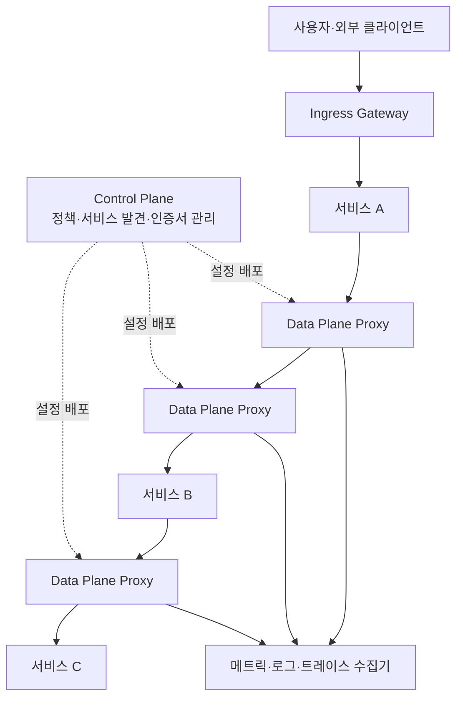
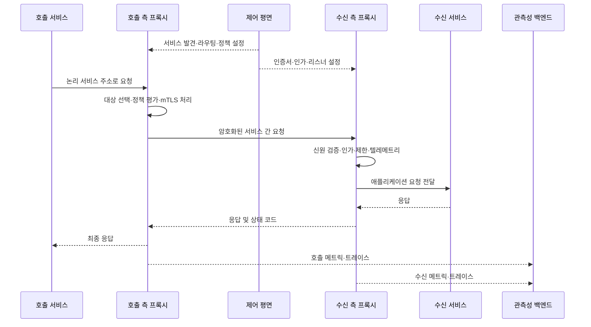

# 서비스 메시(Service Mesh)

## 1. 개요

### 가. 정의
> **서비스 메시(Service Mesh)**는 마이크로서비스 사이의 통신을 애플리케이션 코드와 분리하여, 연결·트래픽 제어·신뢰성·보안·관측성을 일관되게 제공하는 전용 인프라 계층이다.

마이크로서비스가 늘어나면 서비스의 수보다 서비스 간 호출 경로와 정책의 수가 더 빠르게 증가한다. 한 서비스가 HTTP를 호출하는지 gRPC를 호출하는지, 재시도와 타임아웃을 어떻게 적용하는지, 호출 주체를 어떻게 인증하는지, 장애가 어느 경로에서 발생했는지를 각 서비스가 제각각 구현하면 운영 규칙이 쉽게 분산된다. 서비스 메시는 이 공통 관심사를 통신 경로의 중간 계층으로 옮겨 애플리케이션이 비즈니스 로직에 집중하도록 한다.

CNCF는 서비스 메시를 클라우드 네이티브 환경에서 서비스 간 통신을 안전하고 빠르며 신뢰성 있게 다루는 전용 인프라 계층으로 설명한다([CNCF Cloud Native Glossary](https://glossary.cncf.io/service-mesh/)). 따라서 서비스 메시는 단순히 서비스들을 연결해 놓은 네트워크 토폴로지가 아니라, 정책을 배포하고 프록시가 실제 트래픽을 중개하는 **관리 가능한 통신 플랫폼**으로 이해해야 한다.

### 나. 등장 배경과 필요성

모놀리식 시스템에서는 프로세스 내부 함수 호출이 많고 네트워크 경계가 적으므로 호출 재시도, 인증서 검증, 분산 추적을 공통 라이브러리로 처리하기 쉽다. 반면 마이크로서비스는 여러 프로세스, 노드, 가용 영역, 언어 런타임을 넘나든다. 호출자는 네트워크 지연과 일시적 오류를 만나고, 수신자는 버전이 다른 API를 제공하며, 운영자는 릴리스 중 특정 버전으로 트래픽을 일부 보내야 한다.

이 문제를 각 팀이 Go, Java, Python 등의 클라이언트 라이브러리로 따로 해결하면 기능의 편차와 버전 불일치가 발생한다. 어떤 서비스는 지수 백오프를 구현하지만 다른 서비스는 무한 재시도를 하고, 어떤 서비스는 mTLS를 검증하지만 다른 서비스는 평문 통신을 허용하는 식이다. 이 편차는 장애와 보안 사고의 공통 원인이 된다.

서비스 메시는 프록시와 제어 평면을 통해 통신 정책을 외부화한다. 서비스 코드는 변하지 않더라도 프록시가 요청을 관찰하고, 목적지를 선택하고, 암호화된 채널을 만들며, 응답시간과 오류율을 수집할 수 있다. 다만 외부화가 만능은 아니다. 프록시를 추가하면 지연·메모리·운영 복잡도가 늘어나므로, 서비스 수와 통신 복잡도가 실제로 그 비용을 정당화하는지 먼저 판단해야 한다.

### 다. 핵심 가치와 적용 범위

서비스 메시는 다음 네 가지 가치를 하나의 통신 계층에서 제공한다.

1. **연결성**: 서비스 발견, 로드밸런싱, 프로토콜 중개와 같은 호출 기반을 표준화한다.
2. **신뢰성**: 타임아웃, 재시도, 회로 차단, 장애 격리, 지연 주입을 정책으로 관리한다.
3. **보안성**: 서비스의 워크로드 신원을 바탕으로 mTLS와 인가 정책을 적용한다.
4. **관측성**: 메트릭, 로그, 분산 추적을 요청 단위로 수집하여 서비스 의존성을 파악한다.

적용 범위는 클러스터 내부의 동서 트래픽이 중심이지만, 인그레스 게이트웨이와 이그레스 게이트웨이를 통해 외부 트래픽 및 다른 클러스터·가상머신과의 경계를 관리할 수도 있다. 따라서 API 게이트웨이를 대체한다기보다, 외부 진입점과 내부 서비스 간 정책을 서로 다른 신뢰 경계에 맞게 조합하는 것이 일반적이다.

## 2. 전체 구조와 동작 원리

### 가. 논리 아키텍처

서비스 메시는 논리적으로 **데이터 평면(data plane)**과 **제어 평면(control plane)**으로 나뉜다. 데이터 평면은 실제 요청을 전달하는 프록시들의 집합이며, 요청의 라우팅과 암호화, 재시도, 정책 집행, 텔레메트리 생성이 일어나는 실행 영역이다. 서비스 프로세스와 프록시가 함께 배치되는 전통적 방식에서는 프록시가 서비스의 인바운드와 아웃바운드 통신을 모두 중개한다.

제어 평면은 데이터 평면에 적용할 의도(desired state)를 받아 서비스 발견 정보, 라우팅 규칙, 인증서와 정책을 프록시가 이해하는 동적 설정으로 변환한다. 제어 평면이 일반 요청의 데이터 경로에 직접 들어가는 것은 아니며, 제어 경로를 통해 프록시를 구성한다. 이 분리를 통해 제어 평면의 일시적 장애가 이미 배포된 데이터 평면의 모든 요청을 즉시 중단하지 않도록 설계할 수 있다.

Istio의 공식 아키텍처 문서도 데이터 평면은 Envoy 프록시가 서비스 간 통신을 중개하고 텔레메트리를 수집하며, 제어 평면은 프록시를 관리·구성한다고 설명한다([Istio Architecture](https://istio.io/latest/docs/ops/deployment/architecture/)). 특정 제품의 컴포넌트 이름은 달라질 수 있지만, 데이터 평면과 제어 평면의 역할 분리는 서비스 메시의 공통적인 설계 원리다.

### 나. 요청 처리 흐름

호출 서비스는 대개 서비스 이름이나 가상 호스트를 대상으로 요청할 뿐, 특정 인스턴스의 IP 주소와 실패한 인스턴스의 상태를 직접 관리하지 않는다. 호출 측 프록시는 제어 평면으로부터 받은 서비스 발견 정보와 라우팅 규칙을 이용하여 목적지 인스턴스를 고르고, 필요하다면 요청 헤더·경로·가중치에 따라 버전을 선택한다.

수신 측 프록시는 요청이 어느 워크로드에서 왔는지 확인하고, 대상 서비스에 허용된 호출인지 정책을 평가한다. mTLS를 사용하는 경우 프록시는 상호 인증과 암호화 채널을 담당하므로 애플리케이션이 인증서와 키를 직접 다루는 부담이 줄어든다. 단, 비즈니스 권한은 HTTP 메서드, 경로, 사용자 클레임 등 애플리케이션 수준 정보가 필요할 수 있어 프록시의 네트워크 정책만으로 모두 해결할 수 없다.

요청이 처리되는 동안 두 프록시는 공통 형식의 지표를 만든다. 호출 시간, 응답 코드, 재시도 횟수, 대상 워크로드, 트레이스 식별자 등을 통합하면 여러 언어로 개발된 서비스도 동일한 기준으로 성능과 오류를 비교할 수 있다. 그러나 개인정보나 토큰을 무분별하게 로그에 남기면 관측성이 오히려 새로운 정보보호 위험이 되므로 마스킹과 보존기간을 함께 설계해야 한다.

## 3. 주요 구성요소와 기능

### 가. 데이터 평면 프록시

데이터 평면 프록시는 서비스와 가까운 위치에 배치되어 패킷 또는 요청을 실제로 전달한다. 전통적인 사이드카 모델에서는 각 애플리케이션 Pod에 프록시 컨테이너를 하나씩 두고, 네트워크 규칙으로 애플리케이션의 송수신을 프록시로 우회한다. 이 방식은 애플리케이션 변경을 최소화하고 서비스 단위의 세밀한 L7 정책을 적용하기 쉽다.

프록시는 애플리케이션의 비즈니스 로직을 대신하지 않는다. 프록시는 요청을 전달할 대상과 방법을 판단하지만, 주문 금액의 유효성이나 고객의 결제 한도처럼 도메인 의미를 갖는 결정은 서비스가 담당해야 한다. 이 경계를 지키지 않으면 프록시 설정이 사실상 숨은 애플리케이션이 되어 테스트와 변경 관리가 어려워진다.

프록시를 사용할 때는 CPU와 메모리 오버헤드, 홉 증가에 따른 지연, 설정 전파 시간, 장애 시 우회 경로를 평가해야 한다. 특히 서비스 간 호출이 많은 시스템에서는 한 요청이 여러 프록시를 통과하므로 단일 호출의 추가 지연보다 호출 fan-out에 따른 누적 비용이 커질 수 있다.

### 나. 제어 평면

제어 평면은 서비스 레지스트리나 오케스트레이터에서 워크로드와 엔드포인트 정보를 읽고, 운영자가 정의한 라우팅·보안·관측성 정책을 프록시 설정으로 변환한다. 또한 워크로드 신원에 사용할 인증서를 발급·갱신하고, 정책이 어느 네임스페이스와 서비스에 적용되는지 관리한다.

제어 평면은 구성의 단일 진실 공급원 역할을 하므로 변경 이력과 승인 절차가 중요하다. 잘못된 라우팅 규칙 하나가 전체 트래픽을 잘못된 버전으로 보내거나, 과도한 재시도가 장애를 증폭시킬 수 있다. Git 기반 선언적 관리, 정책 검증, 단계적 배포, 자동 롤백을 적용하면 제어 평면의 변경도 일반 소프트웨어 배포와 같은 수준으로 통제할 수 있다.

제어 평면 고가용성도 필수다. 이미 프록시에 배포된 설정이 유지되더라도 제어 평면이 오랫동안 중단되면 신규 워크로드 등록, 인증서 갱신, 정책 변경이 멈춘다. 따라서 여러 복제본, 리더 선출, 상태 저장소의 백업, 만료 전 인증서 갱신, 제어·데이터 경로의 분리 모니터링을 함께 고려한다.

### 다. 트래픽 관리

서비스 메시는 논리적인 서비스 이름과 실제 인스턴스 집합을 분리하여 트래픽을 제어한다. 라운드 로빈처럼 단순한 분배 외에도 가중치 기반 분배, 헤더·쿠키·경로 기반 라우팅, 지역·가용 영역 우선 라우팅, 특정 버전으로의 미러링을 정책으로 표현할 수 있다.

예를 들어 신규 결제 서비스 v2를 처음에는 전체 요청의 1%에만 연결하고 오류율과 p95 지연을 확인한 후 10%, 50%, 100%으로 늘리는 카나리 배포를 구현할 수 있다. 문제가 확인되면 애플리케이션을 다시 빌드하지 않고 라우팅 가중치를 0%로 바꾸어 신속하게 이전 버전으로 되돌린다. 다만 데이터베이스 스키마가 양방향 호환되지 않는다면 트래픽만 되돌려도 데이터 문제가 남으므로 배포 순서와 계약 호환성을 함께 점검해야 한다.

재시도와 타임아웃은 네트워크 오류를 흡수하지만 잘못 사용하면 장애를 확대한다. 호출자가 1초 타임아웃으로 세 번 재시도하고 그 호출자가 다시 여러 서비스로 fan-out하면 원래 요청 하나가 수십 개의 하위 요청으로 증폭될 수 있다. 멱등성이 보장되는 읽기 요청 중심으로 재시도하고, 재시도 예산과 전체 요청 deadline을 정하여 연쇄 재시도를 차단해야 한다.

### 라. 회복 탄력성과 장애 격리

회로 차단(circuit breaking)은 특정 대상의 오류율이나 동시 요청 수가 임계값을 넘을 때 호출을 잠시 중단하여 장애 서비스가 회복할 시간을 준다. 벌크헤드(bulkhead)는 연결 풀이나 동시성 한도를 분리하여 한 서비스의 고갈이 다른 서비스의 자원까지 침범하지 않도록 한다. 이 두 기능은 서로 다른 장애 양상을 다룬다.

지연 주입과 오류 주입은 실제 장애를 기다리지 않고 복원력을 검증하는 방법이다. 예를 들어 추천 서비스에 500ms 지연을 넣어 주문 서비스의 타임아웃과 대체 응답이 정상 작동하는지 확인할 수 있다. 운영 환경에서 실행할 때는 대상 범위, 시간, 승인자, 중지 조건을 명확히 하고 고객 영향이 낮은 시간대와 제한된 트래픽부터 시작해야 한다.

### 마. 서비스 간 보안

서비스 메시는 워크로드의 암호학적 신원을 기반으로 서비스 간 인증을 표준화할 수 있다. mTLS는 통신 내용을 암호화할 뿐 아니라 양쪽이 서로 인증하게 하므로, 네트워크 위치만으로 신뢰하는 방식보다 제로 트러스트 원칙에 가깝다. 인증서 자동 발급과 갱신은 운영 부담을 낮추지만, 루트 신뢰 앵커와 키 보관, 폐기, 만료 모니터링은 별도로 관리해야 한다.

인증(authentication)과 인가(authorization)는 분리해서 설계한다. "서비스 A가 서비스 B임을 증명했다"는 사실은 인증이고, "서비스 A가 B의 조회 API를 호출할 수 있다"는 결정은 인가다. 최소 권한 정책은 서비스·네임스페이스·메서드·경로 단위로 구체화하고, 기본 거부 후 필요한 통신만 허용하는 방식으로 전환한다.

프록시가 주로 다루는 것은 서비스 신원과 통신 정책이다. 최종 사용자의 로그인 토큰, 개인정보 접근 목적, 업무 권한은 API 게이트웨이와 애플리케이션의 책임과 연결해야 한다. 프록시에서 단순히 토큰이 존재하는지만 검사하고 애플리케이션의 권한 판단을 생략하면 인증은 되었지만 권한이 과도한 문제가 생긴다.

### 바. 관측성과 운영 가시성

서비스 메시가 생성하는 기본 지표는 요청 수, 성공·실패 수, 응답시간, 재시도와 회로 차단 횟수 등이다. 이 지표를 서비스·버전·경로·상태 코드별로 묶으면 어느 버전에서 오류가 증가했는지, 네트워크 지연인지 애플리케이션 지연인지 구분할 수 있다.

분산 추적은 하나의 사용자 요청이 여러 서비스를 거치는 경로를 추적한다. 호출 서비스가 전달하는 trace ID와 span context를 프록시가 보존하면 서비스 코드가 서로 다른 언어라도 공통 추적이 가능하다. 추적 샘플링률을 100%로 고정하면 비용과 저장량이 커질 수 있으므로 오류 요청 우선, 고지연 요청 우선, 대표 샘플링 등 정책을 선택한다.

관측성 데이터는 운영자에게만 유용한 것이 아니라 용량 계획과 서비스 수준 관리의 근거다. 예를 들어 결제 API의 p99 지연과 오류 예산을 릴리스 전후로 비교하면 배포 승격 여부를 객관적으로 판단할 수 있다. 지표 이름과 라벨을 무제한으로 늘리면 cardinality 폭증으로 모니터링 시스템 자체가 장애를 일으킬 수 있으므로 라벨 사전과 보존 정책을 정한다.

## 4. 배포 방식과 관련 기술 비교

### 가. 사이드카 방식

사이드카 방식은 애플리케이션 인스턴스마다 동일한 기능을 수행하는 프록시를 함께 배치한다. 호출 경로가 애플리케이션 컨테이너에서 로컬 프록시로 이동한 뒤 원격 프록시로 전달되므로, 서비스별 정책과 L7 처리를 세밀하게 적용할 수 있다. 장애 분석 시 애플리케이션과 프록시의 로그를 같은 Pod 단위로 묶을 수 있다는 장점도 있다.

반면 워크로드 수가 수천 개로 늘어나면 프록시 수와 설정 분배량이 함께 증가한다. 모든 Pod가 프록시를 하나씩 갖기 때문에 메모리 예약과 이미지 업데이트, 보안 패치, 시작 순서 관리가 부담이 된다. 또한 프록시가 애플리케이션과 같은 Pod 자원을 사용하므로 리소스 제한을 잘못 설정하면 비즈니스 컨테이너의 성능에 영향을 준다.

### 나. 앰비언트 방식

앰비언트(ambient) 방식은 애플리케이션 Pod마다 사이드카를 넣는 대신 노드 단위의 경량 L4 프록시와 필요할 때 사용하는 L7 프록시를 분리하는 접근이다. Istio 공식 문서에 따르면 앰비언트 데이터 평면은 기본적으로 ztunnel이 L4 통신과 제로 트러스트 보안을 담당하고, L7 기능이 필요할 때 waypoint 프록시를 선택적으로 사용한다([Istio Ambient Overview](https://istio.io/latest/docs/ambient/overview/)).

이 방식은 모든 워크로드에 무거운 사이드카를 주입하지 않아 운영 비용과 애플리케이션 호환성 부담을 줄일 여지가 있다. 그러나 L4에서 처리할 정책과 L7 waypoint가 필요한 정책을 구분해야 하고, 기존 사이드카와 혼합 운영할 때 트래픽 경로와 정책 우선순위를 명확히 해야 한다. 기능이 적은 방식이 항상 더 단순한 것은 아니며, 조직의 운영 역량과 디버깅 도구가 성숙했는지를 함께 판단해야 한다.

Istio는 앰비언트 모드가 2024년 일반 사용 가능 단계에 도달했다고 발표했으며, 기존 사이드카 방식과 앰비언트 방식을 선택할 수 있는 데이터 평면 모드를 문서화하고 있다([Istio Ambient Mode Reaches General Availability](https://istio.io/latest/blog/2024/ambient-reaches-ga/), [Istio Sidecar or Ambient](https://istio.io/latest/docs/overview/dataplane-modes/)). 이는 특정 제품을 무조건 채택하라는 의미가 아니라, 서비스 메시가 프록시 배치 비용과 정책 세분성 사이의 균형을 조정하는 방향으로 발전하고 있음을 보여주는 사례다.

### 다. 방식 비교

| 비교 항목 | 사이드카 | 앰비언트 | 애플리케이션 라이브러리 |
|---|---|---|---|
| 배치 단위 | Pod·워크로드 | 노드 L4 + 선택적 L7 | 애플리케이션 프로세스 |
| 코드 변경 | 거의 없음 | 거의 없음 | 언어별 적용 필요 |
| L7 정책 | 기본적으로 세밀함 | waypoint 등 선택 필요 | 구현 범위에 따라 다름 |
| 리소스 비용 | 워크로드 수에 비례 | 노드·선택적 L7 중심 | 프로세스 자원에 포함 |
| 언어 독립성 | 높음 | 높음 | 낮음~중간 |
| 운영 복잡도 | 프록시 수 증가 | 모드·경로 이해 필요 | 라이브러리 표준화 필요 |

표의 항목만으로 결론을 내리면 안 된다. 사이드카는 세밀한 제어가 필요한 작은 메시에 적합할 수 있고, 앰비언트는 많은 워크로드에 공통 L4 보안과 연결성을 빠르게 적용할 때 유리할 수 있다. 반대로 매우 작은 시스템은 어떤 메시 방식보다 단순한 라이브러리나 플랫폼 기본 네트워크 정책이 비용 대비 효과가 높을 수 있다.

### 라. API 게이트웨이·Ingress·서비스 메시 비교

API 게이트웨이는 외부 고객이나 파트너가 들어오는 북-남 트래픽의 진입점으로 인증, 요금 제한, API 제품화, 외부 계약 버전 관리를 담당하는 경우가 많다. Ingress는 클러스터 외부에서 내부 서비스로 들어오는 경로를 정의하는 입구 개념이며, 제품에 따라 게이트웨이 기능을 함께 제공할 수 있다. 서비스 메시는 내부 서비스 간 동-서 트래픽의 일관된 통신 정책에 초점을 둔다.

세 기술은 겹치는 기능이 있어 조직이 같은 프록시를 여러 경계에서 사용할 수도 있다. 그러나 외부 사용자 인증과 내부 워크로드 인증은 위협 모델이 다르고, 외부 API의 공개 계약과 내부 서비스의 배포 단위도 다르다. 한 구성요소에 모든 정책을 몰아넣기보다 경계별 책임을 나누고, 로그·추적 ID·정책 모델을 연계하는 것이 운영상 더 명확하다.

## 5. 적용 사례와 도입 절차

### 가. 전자상거래 카나리 배포 사례

전자상거래 플랫폼이 주문, 재고, 결제, 배송 서비스를 분리했다고 가정하자. 결제 서비스 v2를 도입할 때 서비스 메시는 주문 서비스에서 발생하는 요청의 5%만 v2로 보내고, 나머지는 v1으로 유지할 수 있다. v2의 승인 성공률, p95 응답시간, 재시도율, 오류 코드 분포를 관찰해 기준을 만족하면 점진적으로 비중을 높인다.

이때 중요한 것은 트래픽 비중을 바꾸는 기능 자체가 아니라 승격 기준을 측정 가능한 SLO로 정의하는 것이다. 결제 성공률이 목표보다 낮거나 특정 카드사 연동 오류가 증가하면 자동 롤백하고, 장애가 데이터 중복 승인으로 이어지지 않도록 결제 요청의 멱등 키를 애플리케이션에서 관리한다. 메시의 재시도 정책만으로 결제 중복 문제를 해결할 수 없다는 점이 핵심이다.

### 나. 금융·공공 업무의 내부 보안 사례

금융 또는 공공 시스템에서 고객정보 조회 서비스와 통계 서비스가 통신한다고 가정하면, 네트워크에 연결되어 있다는 이유만으로 서로를 신뢰해서는 안 된다. 워크로드 신원을 기준으로 mTLS를 적용하고, 통계 서비스가 고객정보의 비식별 집계 API만 호출하도록 경로·메서드 단위 인가 정책을 둔다.

정책 변경은 담당자 승인과 테스트 환경 검증을 거쳐 배포하고, 인증서 발급·폐기와 정책 거부 이벤트를 감사 로그로 남긴다. 개인정보가 포함된 원문 응답은 관측성 백엔드에 저장하지 않으며, 추적 데이터에는 업무 식별자 대신 가명화된 상관 ID를 사용한다. 이렇게 해야 서비스 메시의 보안 기능이 개인정보 보호와 감사 증적 요구를 함께 만족시킬 수 있다.

### 다. 단계적 도입 절차

1. **현황 조사**: 서비스 목록, 호출 그래프, 프로토콜, 평균·상위 지연, 장애 경로, 민감 데이터를 파악한다.
2. **목표 정의**: mTLS 적용률, 오류 예산, 관측성 커버리지, 카나리 배포 시간처럼 측정 가능한 목표를 정한다.
3. **파일럿 선정**: 호출량이 통제되고 팀의 소유권이 명확한 비핵심 서비스 두세 개를 선택한다.
4. **관측성 우선 적용**: 요청 지표와 추적을 먼저 확인해 프록시 도입 전후의 성능 기준선을 만든다.
5. **보안 단계화**: 허용 목록을 관찰 모드로 검증한 후 점진적으로 기본 거부와 mTLS 강제 단계로 이동한다.
6. **트래픽 정책 적용**: 타임아웃, 재시도, 회로 차단, 카나리 라우팅을 한 번에 모두 켜지 않고 기능별로 검증한다.
7. **운영 표준화**: 정책 템플릿, 배포 승인, 롤백 절차, 장애 대응 훈련, 비용 지표를 표준 운영 절차로 만든다.
8. **확대와 재평가**: 서비스 수가 늘어날 때 제어 평면 부하와 프록시 비용을 재측정하고, 메시를 적용하지 않을 예외 기준도 문서화한다.

## 6. 심화 — 운영 모델과 최신 방향

서비스 메시는 기술 제품 하나를 설치하는 프로젝트가 아니라 통신 정책을 운영하는 플랫폼 전환이다. 플랫폼 팀은 기본 템플릿과 가드레일을 제공하고, 각 서비스 팀은 자신의 SLO와 데이터 분류에 맞춰 라우팅·권한 정책을 선언해야 한다. 중앙 팀이 모든 정책을 수동으로 승인하면 병목이 되고, 각 팀이 자유롭게 변경하면 전체 신뢰 경계가 무너질 수 있으므로 위험도별 승인 체계를 둔다.

관측성은 세 가지 신호를 연계해야 한다. 메트릭은 오류율과 지연의 추세를 빠르게 보여주고, 로그는 특정 요청의 상세 원인을 남기며, 추적은 여러 서비스가 연결된 경로를 보여준다. 프록시는 세 신호에 공통 trace ID와 워크로드 identity를 기록해야 하지만, 고카디널리티 라벨과 민감한 헤더를 통제하지 않으면 저장 비용과 개인정보 위험이 커진다.

멀티클러스터 환경에서는 서비스 발견, 신원 체계, 인증서 발급자, 게이트웨이 경로, 지역 장애 시 failover 정책을 함께 정해야 한다. 클러스터마다 별도의 신뢰 도메인을 사용할지 하나의 신뢰 도메인으로 묶을지에 따라 인증서와 사고 범위가 달라진다. 단순히 클러스터를 연결한 뒤 동일한 정책을 복사하는 방식은 지역별 규제와 데이터 주권을 반영하지 못할 수 있다.

앰비언트 방식의 발전은 프록시 기능을 L4 보안 계층과 선택적 L7 처리 계층으로 나누어 비용과 기능을 조정하려는 방향을 보여준다. 하지만 이는 운영자가 어느 계층에서 어떤 정책이 집행되는지 이해해야 한다는 새로운 요구를 만든다. 기술사 답안에서는 "사이드카가 구식이고 앰비언트가 항상 우월하다"고 단정하기보다, 워크로드 규모·L7 요구·운영 역량·성능 예산을 기준으로 선택한다고 서술하는 것이 타당하다.

## 7. 고려사항 및 시사점

### 가. 성능과 비용의 균형

프록시를 거치는 홉, TLS 암복호화, 텔레메트리 생성은 추가 CPU와 지연을 만든다. 도입 전후의 p50·p95·p99 지연, CPU·메모리 사용량, 네트워크 처리량, 프록시 재시작률을 동일한 부하 조건에서 비교해야 한다. 평균 지연만 보면 꼬리 지연을 놓칠 수 있으므로 사용자 경험과 직접 연결되는 상위 백분위 지표를 사용한다.

### 나. 재시도 폭풍과 장애 전파 방지

재시도는 실패를 숨기는 기능이 아니라 제한된 시간 안에 성공 가능성을 높이는 수단이다. 호출 deadline, 최대 재시도 횟수, 백오프와 지터, 멱등성, 회로 차단을 함께 설계하고, 종속 서비스의 용량을 넘는 재시도가 발생하지 않는지 부하 시험으로 검증해야 한다. 특히 동기 호출이 많은 그래프에서는 한 노드의 장애가 상위 서비스의 스레드와 연결 풀을 고갈시키지 않도록 벌크헤드를 둔다.

### 다. 보안과 정책의 실효성

mTLS가 적용되었다고 해서 업무 권한이 자동으로 보장되는 것은 아니다. 워크로드 신원, 사용자 신원, 호출 목적, 데이터 분류를 정책 모델에 연결하고, 기본 거부·최소 권한·정기 재검토 원칙을 운영해야 한다. 인증서와 정책의 만료, 비정상적인 거부 급증, 예상하지 못한 신규 호출 경로를 탐지하는 감사 지표도 필요하다.

### 라. 제어 평면의 가용성과 변경 안전성

제어 평면은 모든 요청의 데이터 경로에 없더라도 잘못된 설정을 배포하면 광범위한 영향을 줄 수 있다. 구성 검증, 린트, 정책 충돌 검사, 테스트 클러스터 적용, 점진 배포, 자동 롤백을 파이프라인에 포함한다. 제어 평면 자체는 다중 복제본과 백업을 마련하고 인증서 갱신 실패가 언제 발생하는지 사전에 알림을 설정한다.

### 마. 조직과 책임 경계

메시를 플랫폼 팀만의 도구로 운영하면 서비스 팀이 정책을 이해하지 못하고 예외를 남발할 수 있다. 반대로 각 서비스 팀이 프록시 세부 설정을 직접 관리하면 공통 통제가 무너질 수 있다. 플랫폼 팀은 표준 템플릿과 안전한 기본값을 제공하고, 서비스 팀은 서비스의 SLO·데이터 분류·호출 계약에 대한 책임을 지는 공동 운영 모델이 적절하다.

### 바. 기술사 관점의 도입 판단

모든 애플리케이션에 서비스 메시를 의무화하는 것은 좋은 아키텍처 원칙이 아니다. 서비스 수가 적고 호출이 단순한 시스템에서는 프록시 운영 비용이 얻는 효과보다 클 수 있으며, 서버리스나 외부 SaaS 중심 시스템은 다른 통합 방식이 적합할 수 있다. 반대로 다언어 마이크로서비스, 빈번한 카나리 배포, 강한 서비스 간 인증, 통합 추적이 필요한 환경에서는 공통 통신 계층의 가치가 커진다.

최종 판단은 기능 목록이 아니라 사업 목표와 운영 지표로 내려야 한다. 장애 복구시간 단축, 정책 적용률, 배포 리드타임, 보안 감사 대응시간, 클라우드 비용을 기준선과 비교하고, 메시 도입으로 개선되지 않는 문제는 애플리케이션·데이터·조직 영역에서 별도로 해결한다. 이것이 서비스 메시를 유행하는 인프라가 아니라 지속 가능한 정보시스템 관리 수단으로 만드는 핵심이다.

## 참고자료

- [CNCF Cloud Native Glossary — Service Mesh](https://glossary.cncf.io/service-mesh/)
- [CNCF — Service mesh: A critical component of the cloud native stack](https://www.cncf.io/blog/2017/04/26/service-mesh-critical-component-cloud-native-stack/)
- [Istio — Architecture](https://istio.io/latest/docs/ops/deployment/architecture/)
- [Istio — What is Istio?](https://istio.io/latest/docs/overview/what-is-istio/)
- [Istio — Ambient Overview](https://istio.io/latest/docs/ambient/overview/)
- [Istio — Sidecar or ambient?](https://istio.io/latest/docs/overview/dataplane-modes/)
- [Istio — Ambient Mode Reaches General Availability](https://istio.io/latest/blog/2024/ambient-reaches-ga/)
- [CNCF Cloud Native Security Whitepaper](https://www.cncf.io/wp-content/uploads/2022/06/CNCF_cloud-native-security-whitepaper-May2022-v2.pdf)

---

> **한 줄 요약**: 서비스 메시는 데이터 평면 프록시와 제어 평면으로 서비스 간 연결·트래픽·신뢰성·보안·관측성을 일관되게 관리하는 인프라 계층이며, 도입 시 기능보다 성능 비용·정책 실효성·운영 역량을 함께 평가해야 한다.
