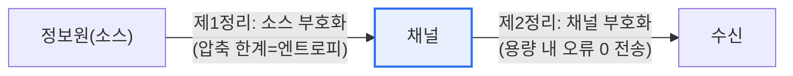

# 정보이론과 샤논(Shannon)의 정리

## 1. 개요

### 가. 정보이론의 개념
> **정보이론(Information Theory)** 은 정보를 정량적으로 측정하고, **통신에서 정보를 얼마나 압축할 수 있고 얼마나 빠르게 오류 없이 전송할 수 있는지의 한계를 수학적으로 규명**하는 이론으로, 클로드 샤논이 창시했다.

정보이론이 통신의 근간이 된 근본 이유는 '**정보라는 추상적 개념을 숫자로 잴 수 있게 하고, 통신의 이론적 한계를 못박았다**'는 데 있다. 샤논 이전에는 '정보의 양'이라는 것을 객관적으로 측정할 방법이 없었다. 샤논은 정보의 양을 **불확실성(엔트로피)** 으로 정의했다. 어떤 사건이 일어날지 예측하기 어려울수록(불확실할수록) 그 결과가 주는 정보량이 크다. 예를 들어 항상 앞면인 동전은 결과를 봐도 정보가 없지만(엔트로피 0), 공정한 동전은 불확실해 최대 정보(1비트)를 준다. 이렇게 정보를 비트(bit)로 정량화하자, 비로소 "데이터를 얼마나 압축할 수 있는가", "잡음 있는 채널로 얼마나 빠르게 정확히 보낼 수 있는가"라는 질문에 명확한 한계를 제시할 수 있게 됐다. 이 한계를 규정한 것이 샤논의 두 정리다. 이 이론은 오늘날 데이터 압축(zip·JPEG)·오류정정부호·통신·암호의 이론적 토대가 되었다.

### 나. 엔트로피
정보량은 사건의 발생 확률에 반비례하며, 전체 평균 정보량이 **엔트로피(H)** 다. 불확실성이 클수록 엔트로피가 크다.

## 2. 샤논의 제1정리와 제2정리

| 정리 | 내용 |
|---|---|
| **제1정리(소스 부호화)** | 무손실 압축의 한계는 정보원의 **엔트로피**다. 엔트로피보다 더 압축하면 정보 손실이 불가피하다. |
| **제2정리(채널 부호화)** | 잡음 있는 채널에도 **채널 용량(C)** 이 있으며, 전송률이 용량보다 작으면 적절한 부호화로 **오류를 임의로 0에 가깝게** 만들 수 있다. |

**제1정리**는 압축의 한계를 말한다. 데이터를 아무리 잘 압축해도 그 정보의 엔트로피 아래로는 줄일 수 없다(무손실 기준). **제2정리**는 놀라운 결과로, 잡음이 있어도 전송 속도만 채널 용량 이하라면 오류 없는 통신이 이론적으로 가능함을 증명했다. 이는 오류정정부호 연구의 출발점이 됐다.

## 3. 샤논-하틀리(Shannon-Hartley) 정리

샤논-하틀리 정리는 제2정리의 채널 용량을 구체적 수식으로 제시한다. 대역폭이 있는 아날로그 잡음 채널의 최대 용량을 다음과 같이 나타낸다.

> **C = B log₂(1 + S/N)**  (C: 채널용량 bps, B: 대역폭 Hz, S/N: 신호대잡음비)

이 식은 통신 용량을 늘리는 두 가지 길을 보여준다. **대역폭(B)** 을 넓히거나, **신호대잡음비(S/N)** 를 높이는 것이다. 다만 S/N은 로그로 작용해 늘릴수록 효과가 줄고, 대역폭 확대는 자원 한계가 있다. 이 정리는 5G·와이파이 등 모든 통신 시스템의 용량 설계 기준이 된다.

## 4. 고려사항 및 시사점

1. **통신·압축의 이론적 상한**을 제시한다. 샤논의 정리는 어떤 기술로도 넘을 수 없는 한계를 규정해, 통신·압축 기술이 얼마나 이상에 근접했는지 판단하는 기준이 된다.
2. **현대 디지털 기술의 토대**다. 데이터 압축(허프만·JPEG), 오류정정(LDPC·터보코드), 이동통신 용량 설계가 모두 정보이론에 기반하며, 이론과 실제의 간극을 좁히는 방향으로 발전해 왔다.
3. **AI·데이터 분야로 확장**된다. 엔트로피·상호정보량 개념은 머신러닝의 손실함수(교차엔트로피)·특징 선택·의사결정나무 분할 기준 등으로 널리 활용되어, 정보이론의 영향이 통신을 넘어선다. [[decision-tree]]

---

> **한 줄 요약**: 정보이론은 *정보를 엔트로피로 정량화* 하며, 샤논 제1정리(압축 한계=엔트로피)·제2정리(용량 내 오류 0 전송)와 샤논-하틀리 정리(C=B log₂(1+S/N))로 통신·압축의 이론적 한계를 규정해 현대 디지털 기술의 토대가 된다.
