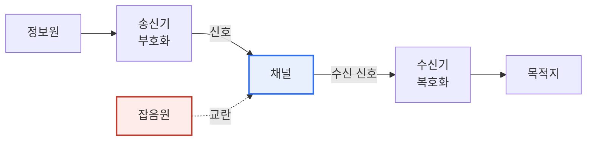

# 정보이론과 샤논(Shannon)의 정리

## 1. 개요

### 가. 정보이론의 개념
> **정보이론(Information Theory)** 은 정보를 정량적으로 측정하고, **통신에서 정보를 얼마나 압축할 수 있고 얼마나 빠르게 오류 없이 전송할 수 있는지의 한계를 수학적으로 규명**하는 이론으로, 1948년 클로드 섀넌(Claude Shannon)의 논문 「A Mathematical Theory of Communication」에서 창시되었다.

정보이론이 현대 통신·컴퓨팅의 근간이 된 근본 이유는 '**정보라는 추상적 개념을 숫자로 잴 수 있게 하고, 통신의 이론적 한계를 못박았다**'는 데 있다. 섀넌 이전에는 '정보의 양'이라는 것을 객관적으로 측정할 방법이 없었다. 전신·전화 기술자들은 경험적으로 대역폭과 속도를 다뤘지만, "이 메시지는 정보가 얼마나 들어 있는가"를 수치로 말할 도구가 없었다. 섀넌의 결정적 전환은 정보의 의미(semantics)를 의도적으로 배제하고, 정보의 양을 오직 **불확실성(엔트로피)** 으로 정의한 것이다. 즉 '무슨 뜻인가'가 아니라 '얼마나 예측하기 어려운가'로 정보를 측정했다.

이 정의의 직관은 다음과 같다. 어떤 사건이 일어날지 예측하기 어려울수록(불확실할수록) 그 결과가 실제로 관측되었을 때 주는 정보량이 크다. 예를 들어 항상 앞면만 나오는 조작된 동전은 결과를 봐도 새로 알게 되는 것이 없어 정보가 0이지만(엔트로피 0), 앞뒤가 반반인 공정한 동전은 결과가 완전히 불확실하므로 관측 시 최대 정보(1비트)를 준다. 마찬가지로 "내일 해가 뜬다"는 메시지는 정보량이 거의 없지만, "내일 특정 주식이 30% 오른다"는 메시지는 확률이 낮아 정보량이 크다.

이렇게 정보를 **비트(bit)** 라는 보편 단위로 정량화하자, 비로소 "데이터를 이론적으로 얼마나 압축할 수 있는가", "잡음 있는 채널로 얼마나 빠르게 정확히 보낼 수 있는가"라는 질문에 명확한 한계를 제시할 수 있게 됐다. 이 두 한계를 규정한 것이 섀넌의 두 정리다. 이 이론은 오늘날 데이터 압축(ZIP·JPEG·MP3), 오류정정부호, 5G·와이파이 통신, 암호학의 이론적 토대가 되었으며, 나아가 머신러닝의 손실함수와 특징 선택에까지 확장되었다.

### 나. 엔트로피 — 정보량의 정량화
정보이론의 출발점인 엔트로피를 조금 더 구체적으로 짚을 필요가 있다. 개별 사건의 정보량(자기정보)은 발생 확률 p에 대해 `I = -log₂ p` 로 정의된다. 확률이 낮은(드문) 사건일수록 로그값이 커져 정보량이 크며, 이는 앞서의 직관을 수식으로 옮긴 것이다. 그리고 정보원 전체가 내보내는 **평균 정보량**이 곧 엔트로피 `H = -Σ pᵢ log₂ pᵢ` 다. 불확실성이 클수록, 즉 여러 결과가 고르게 나올수록 엔트로피가 크다.

구체적 수치로 보면, 앞뒤 확률이 각각 0.5인 공정한 동전의 엔트로피는 `-(0.5·log₂0.5 + 0.5·log₂0.5) = 1비트`다. 반면 앞면 확률이 0.9로 치우친 동전은 약 0.47비트에 불과하다. 즉 편향된 정보원은 평균적으로 예측 가능성이 높아 실어 나르는 정보가 적고, 바로 이 '남는 예측 가능성'이 압축의 여지가 된다.

예를 들어 영어 텍스트는 알파벳이 고르게 나오지 않고 e·t가 자주, z·q가 드물게 나오며 'q 다음에는 거의 u가 온다'처럼 문자 간 상관까지 있어 실효 엔트로피가 문자당 약 1비트 수준으로 낮다. 그래서 원래 8비트 ASCII로 저장된 텍스트가 무손실 압축으로 크게 줄어드는 것이다. 이처럼 엔트로피는 단순한 이론 개념이 아니라 "이 데이터는 원리적으로 얼마나 줄일 수 있는가"라는 실무 질문에 직접 답한다.

### 다. 정보이론이 답하는 근본 질문
정보이론이 던지고 답한 질문을 세 가지로 정리하면 그 구조가 분명해진다. 첫째, "정보의 양을 어떻게 재는가"에 대해 엔트로피로 답했다. 둘째, "데이터를 어디까지 압축할 수 있는가"에 대해 제1정리(엔트로피가 하한)로 답했다. 셋째, "잡음 있는 채널로 얼마나 정확·빠르게 보낼 수 있는가"에 대해 제2정리와 섀넌-하틀리 정리(채널 용량)로 답했다.

이 세 질문은 오늘날 IT 시스템의 저장·전송 전 영역을 관통한다. 파일을 압축해 저장하는 일, 무선으로 데이터를 보내는 일, 저장장치의 비트 오류를 정정하는 일이 모두 이 틀 안에서 설계된다. 그래서 정보이론은 특정 기술이 아니라 '디지털 정보를 다루는 모든 기술의 물리학'에 해당한다고 평가된다.

## 2. 섀넌의 제1정리와 제2정리

정보이론의 두 축은 '얼마나 줄일 수 있는가(압축)'와 '얼마나 정확히 보낼 수 있는가(전송)'이며, 각각을 섀넌 제1정리와 제2정리가 규정한다. 아래 그림은 정보가 소스에서 채널을 거쳐 수신되기까지 두 정리가 개입하는 지점을 나타낸다.

```mermaid
flowchart LR
  S["정보원(소스)"] -->|"제1정리: 소스 부호화<br/>압축 한계 = 엔트로피"| E["압축 데이터"]
  E -->|"채널 부호화(중복 추가)"| C["잡음 채널"]
  C -->|"제2정리: 전송률<용량이면 오류→0"| D["복호·수신"]
  style C fill:#e8f0fe,stroke:#2f6fed,stroke-width:2px
  style S fill:#f1f8e9,stroke:#558b2f,stroke-width:2px
```

섀넌이 제시한 통신 시스템의 일반 모델은 위 흐름을 좀 더 세분화한다. 정보원이 만든 메시지는 송신기(부호화기)에서 신호로 바뀌어 채널로 보내지고, 채널에서 잡음원(noise source)이 신호를 교란하며, 수신기(복호화기)가 이를 복원해 목적지로 전달한다. 이 모델의 의의는 '의미'를 배제하고 순수하게 신호와 잡음의 문제로 통신을 추상화했다는 데 있다.

```mermaid
flowchart LR
  I["정보원"] --> T["송신기<br/>부호화"]
  T -->|"신호"| CH["채널"]
  NZ["잡음원"] -.->|"교란"| CH
  CH -->|"수신 신호"| RX["수신기<br/>복호화"]
  RX --> DST["목적지"]
  style CH fill:#e8f0fe,stroke:#2f6fed,stroke-width:2px
  style NZ fill:#fdecea,stroke:#c0392b,stroke-width:2px
```

이 그림에서 제1정리는 '송신기(부호화)' 단계의 압축 한계를, 제2정리는 '채널+잡음원'을 통과할 때의 전송 한계를 각각 규정한다. 두 정리가 서로 다른 단계를 담당하기에, 실제 시스템은 소스 부호화(압축)로 데이터를 엔트로피까지 줄인 뒤 채널 부호화(오류정정)로 다시 계산된 중복을 더하는 2단계 구조를 취한다. 얼핏 모순처럼 보이는 '줄였다가 다시 늘리는' 과정은, 압축은 정보원의 낭비적 중복을 제거하고 채널 부호화는 잡음 극복에 필요한 '설계된 중복'만 정확히 더한다는 점에서 최적이다.

### 가. 제1정리 — 소스 부호화(압축의 한계)
제1정리(소스 부호화 정리)는 **무손실 압축의 하한이 정보원의 엔트로피**라고 못박는다. 데이터를 아무리 정교하게 압축해도, 평균 부호 길이를 그 정보원의 엔트로피 H 아래로 줄이면 반드시 정보 손실이 발생한다. 반대로 말하면 엔트로피에 임의로 가깝게는 접근할 수 있어, 좋은 압축 알고리즘의 목표는 '엔트로피에 얼마나 근접하느냐'가 된다.

이 정리가 실무에서 갖는 의미는 압축 기술의 '천장'을 알려준다는 데 있다. 허프만 부호(Huffman coding)는 자주 나오는 심볼에 짧은 코드를, 드문 심볼에 긴 코드를 배정해 평균 길이를 엔트로피에 근접시키고, 산술 부호(arithmetic coding)는 그보다 더 가까이 접근한다. 예컨대 특정 텍스트의 엔트로피가 문자당 1.5비트라면, 어떤 무손실 압축기도 평균 1.5비트 미만으로는 못 줄인다는 것이 제1정리의 보증이다. JPEG·MP3 같은 손실 압축은 이 한계를 '넘는' 것이 아니라, 사람이 인지하지 못하는 정보를 버려 원본과 다른(엔트로피가 더 낮은) 데이터를 만드는 것으로 이해해야 한다.

### 나. 제2정리 — 채널 부호화(전송의 한계)
제2정리(채널 부호화 정리)는 정보이론에서 가장 놀라운 결과로 꼽힌다. 잡음이 있는 채널에도 **채널 용량(C)** 이라는 최대 전송 속도가 존재하며, 실제 전송률 R이 이 용량보다 작기만 하면(R < C) 적절한 부호화를 통해 **오류 확률을 임의로 0에 가깝게** 만들 수 있다는 것이다. 직관과 달리, 잡음이 있어도 속도만 용량 이하로 낮추면 '거의 완벽한' 통신이 이론적으로 가능하다.

이 결과가 혁명적인 이유는, 그 이전까지 사람들이 "잡음 채널에서는 오류를 줄이려면 속도를 무한히 낮춰야 한다"고 믿었기 때문이다. 섀넌은 오류 없는 통신과 유의미한 속도가 양립할 수 있음을 증명했고, 이는 오류정정부호(FEC) 연구의 출발점이 됐다.

다만 제2정리는 '그런 부호가 존재한다'는 존재 증명일 뿐 '어떻게 만드는가'는 알려주지 않는다. 증명은 무작위 부호의 평균 성능을 활용한 것이어서, 실제로 구현 가능하고 복호가 현실적인 부호를 찾는 일은 별개의 난제로 남았다. 그래서 이후 수십 년간 그 이상적 한계에 근접하면서도 계산적으로 실용적인 부호를 찾는 것이 통신공학의 핵심 과제가 되었고, 이 여정이 뒤에서 다룰 터보·LDPC 부호로 이어진다.

| 정리 | 내용 | 실무 적용 |
|---|---|---|
| **제1정리(소스 부호화)** | 무손실 압축의 한계는 정보원의 **엔트로피**. 엔트로피보다 더 줄이면 손실 불가피. | ZIP, 허프만·산술 부호, PNG |
| **제2정리(채널 부호화)** | 전송률 R < 채널용량 C 이면 적절한 부호화로 **오류를 임의로 0에 근접**시킬 수 있음. | LDPC, 터보코드, 리드-솔로몬 |

## 3. 섀넌-하틀리(Shannon-Hartley) 정리

제2정리가 '채널 용량이 존재한다'는 것을 보였다면, 섀넌-하틀리 정리는 대역폭이 있는 아날로그 잡음 채널(가우시안 채널)에서 그 **용량을 구체적 수식으로** 제시한다. 이 식은 통신 시스템 용량 설계의 실질적 기준이 되므로 정보이론에서 가장 자주 인용된다.

> **C = B · log₂(1 + S/N)**  (C: 채널용량 bps, B: 대역폭 Hz, S/N: 신호대잡음비, 선형 스케일)

이 식은 통신 용량을 늘리는 두 가지 길을 보여준다. 첫째는 **대역폭(B)** 을 넓히는 것으로, 용량이 대역폭에 선형으로 비례한다. 둘째는 **신호대잡음비(S/N)** 를 높이는 것인데, 여기에는 중요한 함의가 있다. S/N은 로그 안에 들어가므로 아무리 신호 전력을 키워도 용량 증가 효과가 점점 줄어드는 '수확 체감'이 일어난다. 예를 들어 S/N을 10배 올려도 log₂ 항의 증가는 제한적이며, 이는 전력을 무작정 키우기보다 대역폭 확보나 변조 효율 개선이 더 효과적일 수 있음을 시사한다.

구체적 수치 예시로, 대역폭 20 MHz에 S/N = 100(20 dB)인 채널의 용량은 `20×10⁶ × log₂(101) ≈ 20×10⁶ × 6.66 ≈ 133 Mbps`로 계산된다. 이처럼 이 정리는 5G·와이파이·LTE 등 모든 통신 시스템에서 "이 주파수 자원과 전력으로 이론상 최대 몇 bps를 낼 수 있는가"를 가늠하는 설계 기준이 된다. 실제 시스템의 처리율이 이 한계에 얼마나 근접하느냐가 통신 기술 성숙도의 척도다.

이 식에서 실무적으로 중요한 함의 하나는, 대역폭이 부족한 환경에서 무작정 전송 출력을 높이는 전략이 비효율적이라는 점이다. S/N이 로그 안에 있어 전력을 두 배로 올려도 용량은 겨우 몇 % 늘 뿐이기 때문이다. 그래서 현대 무선 통신은 대역폭 확장(밀리미터파), 다중 안테나(MIMO)로 공간 자원을 늘리는 방식, 고차 변조(256-QAM 등)로 심볼당 비트를 늘리는 방식을 조합해 이 한계에 접근한다. 정보이론이 제시한 수식 하나가 이런 공학적 선택의 방향을 규정하는 셈이다.

또한 이 식은 극단적 상황에 대한 통찰도 준다. S/N이 매우 낮은(잡음이 신호를 압도하는) 심우주 통신이나 저전력 IoT에서도 채널 용량은 0이 아니라 여전히 양수이므로, 전송률을 충분히 낮추면 오류 없는 통신이 가능하다. 실제로 심우주 탐사선이 극도로 미약한 신호로도 데이터를 지구까지 보내는 것은 이 원리에 기반해 전송률을 낮추고 강력한 오류정정을 적용하기 때문이다.

## 4. 심화 — 이론과 실제의 간극, 그리고 AI로의 확장

### 가. 이상적 한계에 근접해 온 부호화 기술
섀넌이 제2정리로 '한계'를 제시한 뒤, 통신공학의 역사는 그 한계에 얼마나 가까이 다가가느냐의 여정이었다. 초기의 해밍 부호·리드-솔로몬 부호는 한계와 상당한 거리가 있었으나, 1993년 **터보코드(Turbo Code)** 의 등장으로 섀넌 한계에 불과 수십 분의 1 dB까지 근접하는 실용적 부호가 처음 실현되었다.

이어 1960년대에 제안되었다가 계산 능력 부족으로 잊혔다 재발견된 **LDPC(저밀도 패리티 검사) 부호**는 5G 데이터 채널과 위성·저장장치(SSD)에 널리 쓰이며 섀넌 한계에 매우 근접한 성능을 보인다. 즉 섀넌의 1948년 존재 증명이 약 반세기 만에 공학적으로 거의 '따라잡힌' 것이다. 이 역사는 이론이 먼저 목표를 제시하고 공학이 뒤따라 실현하는 과학사의 전형적 사례로 자주 인용된다.

한 가지 유의할 점은, '섀넌 한계에 근접했다'는 평가가 특정 채널 모델(대개 가우시안 잡음, 무한에 가까운 부호 길이)을 전제한다는 것이다. 실제 무선 환경은 페이딩·간섭 등으로 이상적 모델과 다르므로, 이론적 근접도와 실측 성능 사이에는 여전히 조건에 따른 간극이 있다는 점을 함께 이해해야 한다.

### 나. AI·데이터 분야로의 확장
정보이론의 개념은 통신을 넘어 오늘날 인공지능·데이터과학의 핵심 도구가 되었다. 머신러닝 분류 모델의 표준 손실함수인 **교차엔트로피(Cross-Entropy)** 는 예측 분포와 실제 분포의 차이를 엔트로피 개념으로 측정한 것이고, 두 분포의 거리를 재는 **KL 발산(Kullback-Leibler divergence)** 역시 정보이론에서 나왔다. 또한 의사결정나무(Decision Tree)의 분할 기준인 **정보 이득(Information Gain)** 은 분할 전후 엔트로피 감소량으로 정의되어, "어떤 특징으로 나눠야 불확실성이 가장 크게 줄어드는가"를 판단한다.

특징 선택에서 쓰이는 **상호정보량(Mutual Information)** 도 두 변수가 공유하는 정보량을 엔트로피로 재는 개념이다. 이처럼 '불확실성의 정량화'라는 섀넌의 아이디어는 통신 이론의 경계를 훌쩍 넘어 현대 데이터 기술 전반의 공통 언어가 되었다. 딥러닝의 정보 병목(Information Bottleneck) 이론처럼 학습의 원리 자체를 정보 압축으로 해석하려는 연구도 이어지고 있어, 정보이론은 여전히 살아 있는 분석 틀이다. [[decision-tree]]

### 다. 이론과 실제의 간극이 주는 교훈
섀넌의 정리가 '존재 증명'에 그쳤다는 점은 공학적으로 중요한 교훈을 남긴다. 한계가 있다는 것을 아는 것과 그 한계에 도달하는 방법을 아는 것은 별개이며, 두 정리 이후 반세기 동안의 부호화 연구는 바로 이 간극을 메우는 과정이었다. 이는 오늘날 엔지니어가 성능 목표를 세울 때, '이론적 한계'를 먼저 계산해 그 대비 현재 수준을 가늠하는 방법론의 원형이 되었다.

즉 정보이론은 구체적 알고리즘을 넘어, "먼저 이론적 상한을 구하고 그에 얼마나 근접했는지로 기술을 평가한다"는 사고방식 자체를 통신·데이터 분야에 심어 놓았다는 점에서 그 영향이 방법론적이기도 하다.

## 5. 고려사항 및 시사점 (기술사 관점)

1. **통신·압축의 이론적 상한을 제시한다.** 섀넌의 정리는 어떤 기술로도 넘을 수 없는 한계(엔트로피=압축 하한, 채널 용량=전송 상한)를 규정해, 현재의 통신·압축 기술이 이상에 얼마나 근접했는지 평가하는 절대 기준이 된다. 신기술의 성능 주장을 검증할 때도 이 한계를 넘는다는 주장은 원리적으로 배격할 수 있다.
2. **현대 디지털 기술의 공통 토대다.** 데이터 압축(허프만·산술·JPEG), 오류정정(LDPC·터보·리드-솔로몬), 이동통신 용량 설계가 모두 정보이론에 기반하며, 이론적 한계와 실제 성능의 간극을 좁히는 방향으로 발전해 왔다. 시스템 설계 시 '이론적 한계 대비 효율'을 지표로 삼을 수 있다.
3. **AI·데이터 분야로 영향이 확장된다.** 엔트로피·교차엔트로피·상호정보량·KL 발산 개념이 머신러닝의 손실함수·특징 선택·의사결정나무 분할 기준으로 널리 활용되어, 정보이론의 파급이 통신을 넘어선다. 데이터 기반 시스템 설계자에게 정보이론은 필수 소양이 되었다.
4. **자원 배분의 트레이드오프를 정량화한다.** 섀넌-하틀리 정리는 대역폭·전력·용량의 관계를 수식으로 제시해, 주파수 자원과 에너지 예산 안에서 최적 설계점을 찾는 근거가 된다. 특히 S/N의 로그적 수확 체감은 전력 증대보다 대역폭·변조 효율 개선이 유리한 국면을 판단하는 데 쓰인다.
5. **의미(semantics)를 배제한 정의의 힘과 한계를 인식해야 한다.** 섀넌 정보이론은 정보의 '의미'가 아닌 '불확실성'만 다루므로 통신 신뢰성 설계에는 강력하지만, 정보의 가치·중요도·의미론적 정확성까지 포괄하지는 않는다. 따라서 의미 기반 통신(semantic communication) 등 최신 연구 흐름과 접목할 때는 이 경계를 분명히 인식하고 보완적으로 활용해야 한다.

## 참고자료
- C. E. Shannon, "A Mathematical Theory of Communication", Bell System Technical Journal, 1948: https://people.math.harvard.edu/~ctm/home/text/others/shannon/entropy/entropy.pdf
- Wikipedia, Shannon–Hartley theorem: https://en.wikipedia.org/wiki/Shannon%E2%80%93Hartley_theorem
- Wikipedia, Noisy-channel coding theorem: https://en.wikipedia.org/wiki/Noisy-channel_coding_theorem

---

> **한 줄 요약**: 정보이론은 *정보를 엔트로피로 정량화* 하며, 섀넌 제1정리(무손실 압축 한계=엔트로피)·제2정리(전송률<용량이면 오류→0)와 섀넌-하틀리 정리(C=B·log₂(1+S/N))로 통신·압축의 이론적 한계를 규정하고, 나아가 교차엔트로피·정보이득 등으로 현대 AI·데이터 기술의 토대가 된다.
