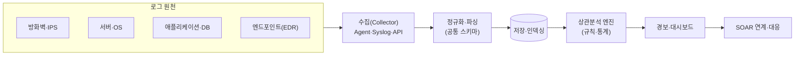
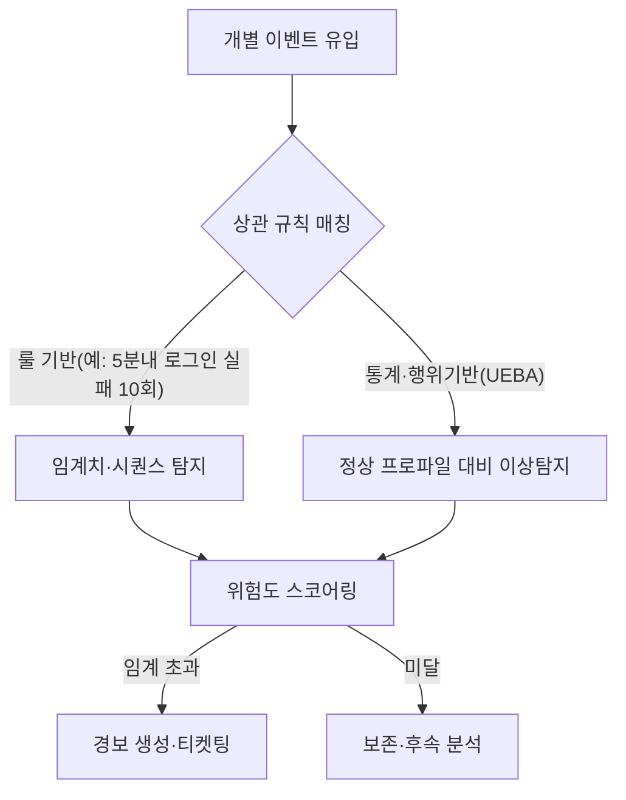

# SIEM(Security Information and Event Management, 보안 정보·이벤트 관리)

## 1. 개요

### 가. 정의 및 등장 배경
> **SIEM**은 조직 전반에 산재한 보안 장비·서버·네트워크·애플리케이션의 **로그와 이벤트를 실시간으로 수집·정규화·상관분석**하여 위협을 탐지하고, 규정 준수(Compliance) 보고와 사고 조사에 필요한 근거를 제공하는 **통합 보안관제 플랫폼**이다.

SIEM이 등장한 근본 배경은 '**보안 데이터는 폭증하는데 그것을 한데 모아 의미 있게 해석할 수단이 없다**'는 문제였다. 방화벽·IPS·백신·서버·DB·웹서버는 저마다 다른 형식의 로그를 각자 쏟아낸다. 어느 한 장비의 로그만 봐서는 "정상 로그인"으로 보이지만, 여러 장비의 로그를 시간축 위에서 겹쳐보면 "해외 IP에서의 로그인 성공 → 권한 상승 → 대량 데이터 전송"이라는 하나의 공격 시나리오가 드러난다. 개별 장비의 국소적 시야로는 이런 **다단계·저속(low-and-slow) 공격**을 포착할 수 없다. SIEM은 흩어진 로그를 한곳으로 모아 공통 포맷으로 정규화하고, 이벤트 간의 인과·상관관계를 규칙과 통계로 엮어 '전체 그림'을 그려준다. 초기에는 로그 관리(SIM)와 실시간 이벤트 관리(SEM)가 별개 제품이었으나, 2005년경 두 기능이 통합되며 오늘날의 SIEM 개념이 정립되었다.

### 나. 필요성
로그의 양적 폭증, 공격의 다단계·지능화, 그리고 ISMS-P·개인정보보호법·PCI-DSS 등이 요구하는 **로그 보존·감사 의무**가 맞물리면서, 이질적 로그를 통합해 탐지·조사·보고를 한 번에 수행하는 SIEM은 보안관제센터(SOC)의 핵심 인프라가 되었다. 특히 침해사고 발생 시 "언제, 어디서, 무엇이 일어났는가"를 소급 추적할 수 있는 단일 근거 저장소로서의 가치가 크다.

## 2. 아키텍처와 데이터 처리 파이프라인

SIEM은 로그가 흘러 들어와 위협 경보로 변환되는 하나의 파이프라인으로 이해하는 것이 가장 정확하다. 아래는 전체 구조도이다.

**수집(Collection)** 단계에서는 에이전트, Syslog, WMI, REST API 등 다양한 방식으로 원천 로그를 끌어온다. 원천마다 프로토콜과 형식이 달라, 유실 없이 안정적으로 수집하는 것 자체가 설계의 첫 관문이다. **정규화(Normalization)·파싱** 단계에서는 서로 다른 형식의 로그를 사용자·IP·시각·행위 같은 공통 필드로 매핑한다. 이 정규화가 부실하면 이후의 상관분석이 무의미해지므로, SIEM 품질의 8할이 파서 품질에서 갈린다고 해도 과언이 아니다. **저장·인덱싱** 단계는 대용량 로그를 압축·색인해 빠른 검색과 장기 보존을 동시에 만족시켜야 한다.

핵심은 **상관분석(Correlation)** 엔진이다. 여기서 개별 이벤트가 시나리오로 조립된다. 아래는 상관분석의 세부 처리 흐름이다.

상관분석은 크게 두 축으로 작동한다. 하나는 **룰(Rule) 기반**으로, "동일 계정에서 5분 내 로그인 실패 10회 후 성공"처럼 사람이 정의한 시퀀스·임계치를 매칭한다. 명확하지만 알려진 패턴만 잡는 한계가 있다. 다른 하나는 **통계·행위 기반(UEBA, User and Entity Behavior Analytics)**으로, 사용자·자산의 평소 행동 프로파일을 학습해 "이 계정이 새벽 3시에 평소의 100배 데이터를 다운로드"하는 식의 미지의 이상을 탐지한다. 최근 SIEM은 이 둘을 결합하고 각 이벤트에 위험도 점수를 누적해, 점수가 임계치를 넘을 때만 경보를 발생시킴으로써 **오탐(False Positive)**을 줄인다.

## 3. 핵심 기능과 구성요소

SIEM의 기능은 단순 로그 뷰어를 넘어선다. 각 기능은 서로 맞물려 '탐지→조사→증빙'의 순환을 완성한다.

| 기능 | 설명 | 실무적 의미 |
|---|---|---|
| **로그 수집·정규화** | 이기종 로그를 공통 스키마로 통합 | 분석의 토대, 파서 품질이 핵심 |
| **실시간 상관분석** | 규칙·통계로 이벤트 연관 탐지 | 다단계 공격 시나리오 포착 |
| **이상행위 분석(UEBA)** | 정상 프로파일 대비 이탈 탐지 | 내부자 위협·미지 위협 대응 |
| **경보·대시보드** | 위협 시각화, 우선순위 부여 | 분석가 판단 지원 |
| **로그 보존·검색** | 장기 저장, 포렌식 소급 검색 | 규정 준수·사고 조사 근거 |
| **컴플라이언스 리포팅** | ISMS-P·PCI-DSS 등 보고서 자동화 | 감사 대응 공수 절감 |
| **위협 인텔리전스(TI) 연계** | 외부 IoC와 로그 대조 | 알려진 악성 지표 즉시 탐지 |

특히 **컴플라이언스 리포팅**은 SIEM 도입의 현실적 동인 중 하나다. 예컨대 개인정보보호법상 개인정보처리시스템의 접속기록은 최소 1년(5만 명 이상 등은 2년) 보관·점검이 의무인데, SIEM은 이 접속기록의 수집·보존·정기 점검·보고서 생성을 자동화해 감사 대응 부담을 크게 낮춘다. 이처럼 SIEM은 '위협 탐지 도구'인 동시에 '규정 준수 증빙 도구'라는 이중 정체성을 가진다.

## 4. 로그관리·SOAR와의 비교

SIEM은 인접 개념과 자주 혼동되므로, 차이가 생기는 이유를 함께 이해해야 한다.

| 구분 | 단순 로그관리(Log Mgmt) | SIEM | SOAR |
|---|---|---|---|
| **초점** | 수집·저장·검색 | 수집+**상관분석·탐지** | 탐지 후 **대응 자동화** |
| **분석 능력** | 검색 위주 | 실시간 상관·이상탐지 | 플레이북 기반 조치 |
| **산출물** | 로그 아카이브 | 위협 경보·리포트 | 자동 대응·케이스 |
| **관계** | SIEM의 하위 기능 | 탐지의 중심 | SIEM 경보를 입력으로 소비 |

단순 로그관리 도구(예: 로그 서버, 기본 ELK)는 '모아서 검색'까지가 역할이지만, SIEM은 그 위에 **상관분석과 탐지 지능**을 얹는다는 점에서 결정적으로 다르다. 한편 SOAR와의 관계는 상호 보완적이다. SIEM이 위협을 '**탐지**'해 경보를 만들면, SOAR가 그 경보를 받아 조사·차단을 '**자동 대응**'한다. 즉 SIEM은 눈(탐지), SOAR는 손(대응)에 비유된다. 최근에는 이 둘에 EDR·NDR을 통합한 **XDR(Extended Detection and Response)**, 그리고 인프라 부담을 없앤 **클라우드 네이티브 SIEM(SaaS형)**으로 시장이 재편되고 있다.

### 적용 사례
한 금융회사가 SIEM을 도입해 이상금융거래 탐지에 활용한 경우, 개별 채널에서는 정상이던 "낯선 단말 로그인 → 계좌정보 조회 → 이체 한도 상향 → 대량 이체"라는 일련의 행위를 하나의 상관 규칙으로 묶어 실시간 차단에 성공한 사례가 대표적이다. 반대로, 로그 원천이 초당 수만 건(EPS, Events Per Second) 규모로 늘면서 라이선스 비용과 스토리지가 급증해, 저가치 로그를 필터링·티어링하지 않으면 운영이 불가능해지는 문제도 함께 나타난다. 즉 SIEM의 성패는 '무엇을 얼마나 수집하느냐'는 **수집 정책 설계**에서 갈린다.

## 5. 심화: 최신 동향과 한계 극복

전통적 온프레미스 SIEM은 세 가지 한계에 부딪혀 왔고, 그 극복 과정이 곧 최신 동향이다. 첫째, **경보 피로(Alert Fatigue)** 문제다. 규칙이 늘수록 오탐이 폭증해 분석가가 진짜 위협을 놓친다. 이를 완화하기 위해 머신러닝 기반 UEBA와 위험도 스코어링, 나아가 생성형 AI를 결합한 **AI-SIEM**이 등장해 경보를 자동 요약·우선순위화하고 조사 질의를 자연어로 지원한다. 둘째, **비용·확장성** 문제다. 로그량이 EPS 단위로 폭증하면서 저장·라이선스 비용이 감당하기 어려워지자, 오브젝트 스토리지에 원본을 저가 보관하고 필요 시 조회하는 **데이터 레이크형·티어링 아키텍처**와, 인프라 운영 부담을 제거한 클라우드 네이티브 SIEM으로 이동하고 있다. 셋째, **탐지 범위** 문제다. 클라우드·컨테이너·SaaS로 자산이 흩어지면서 온프레미스 중심 SIEM의 시야가 좁아졌고, 이에 클라우드 워크로드·API 로그까지 포괄하고 대응까지 아우르는 **XDR·SOAR 통합** 방향으로 진화하고 있다. 요컨대 SIEM은 '탐지 정확도(AI), 비용 효율(레이크·SaaS), 대응 연계(XDR/SOAR)'라는 세 축에서 동시에 진화 중이다.

## 6. 고려사항 및 시사점

1. **수집 정책이 비용과 효과를 동시에 좌우**한다. 모든 로그를 무차별 수집하면 비용이 폭증하고 노이즈에 묻히므로, 위협 탐지·컴플라이언스에 실제로 기여하는 로그를 선별하고 저가치 로그는 티어링·필터링하는 **가치 기반 수집 전략**이 필수다. 이는 '완전성 vs 비용'의 트레이드오프를 조직 리스크 수준에 맞춰 조율하는 문제다.

2. **탐지 규칙(Use Case)은 지속적으로 튜닝해야** 한다. SIEM은 도입으로 끝나는 제품이 아니라 규칙을 계속 다듬어야 하는 '운영'의 대상이다. MITRE ATT&CK 프레임워크에 규칙을 매핑해 탐지 커버리지의 공백을 체계적으로 점검하고, 오탐률을 주기적으로 낮추는 운영 프로세스가 뒷받침돼야 실효를 낸다.

3. **사람(SOC 분석가) 역량과의 결합**이 관건이다. 아무리 정교한 상관분석도 최종 판단과 대응은 분석가의 몫이다. SIEM은 분석가를 대체하는 것이 아니라 증강하는 도구이므로, 위협 헌팅·포렌식 역량을 갖춘 인력과 SOAR 자동화를 함께 갖출 때 비로소 '탐지-분석-대응'의 선순환이 완성된다.

4. **SOAR·XDR·TI와의 통합 로드맵**을 전제로 도입해야 한다. SIEM을 단독 섬으로 두면 탐지 후 대응이 수작업에 머문다. 위협 인텔리전스로 탐지 정확도를 높이고, SOAR로 대응을 자동화하며, XDR로 엔드포인트·클라우드까지 시야를 넓히는 통합 아키텍처 관점에서 도입·발전시켜야 투자 대비 효과를 극대화할 수 있다.

5. **개인정보·로그 자체의 보안**도 고려해야 한다. SIEM은 민감 로그가 집결되는 곳이므로 그 자체가 공격 표적이자 개인정보 집적소가 된다. 저장 로그의 접근통제·암호화·무결성 보장과, 로그 내 개인정보의 가명·마스킹 처리를 함께 설계해야 SIEM이 새로운 위험원이 되는 것을 막을 수 있다.

---

> **한 줄 요약**: SIEM은 이기종 로그를 *수집·정규화·상관분석*해 다단계 위협을 탐지하고 컴플라이언스 증빙을 제공하는 통합 보안관제 플랫폼으로, SOAR(대응)·XDR·AI와 결합해 진화하며, 성패는 수집 정책 설계·규칙 튜닝·분석가 역량의 결합에 달려 있다.
