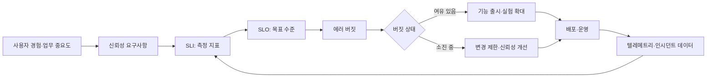
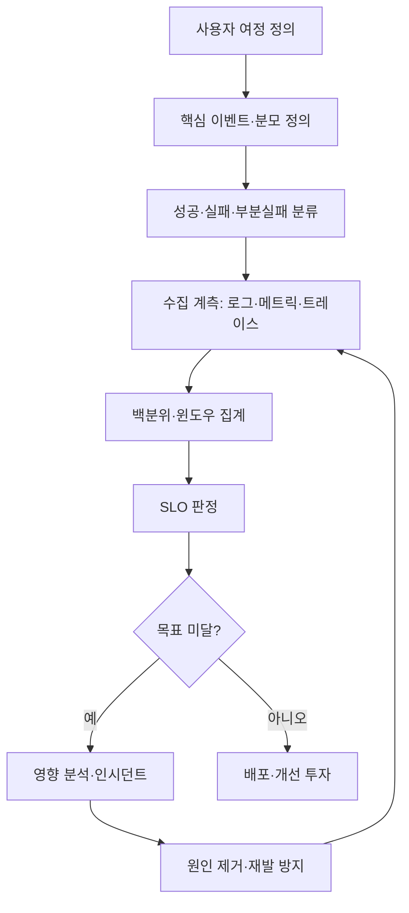

# SRE(Site Reliability Engineering)와 서비스 신뢰성 관리

## 1. 개요

> SRE는 소프트웨어 시스템을 안정적으로 운영하는 일을 엔지니어링 문제로 보고, 서비스 수준 목표와 자동화·측정·장애 학습을 통해 신뢰성과 변경 속도를 함께 관리하는 실천 체계이다.

디지털 서비스는 한 번 배포한 뒤 유지하는 정적 산출물이 아니라, 지속적으로 변경되고 외부 환경과 상호작용하는 시스템이다.
사용자는 기능의 존재보다 필요한 순간에 응답하고, 데이터가 보존되며, 예측 가능한 품질을 제공하는지를 기준으로 서비스를 평가한다.
따라서 기능 개발 완료를 프로젝트의 종료로 보는 관점만으로는 운영 품질을 설명하기 어렵다.

전통적인 운영 조직은 장애를 줄이기 위해 변경을 통제하고, 개발 조직은 기능을 빠르게 출시하기 위해 변경을 늘리려는 경향이 있다.
이 목표 충돌을 개인의 노력이나 야간 대응으로 해결하면 운영자의 소진과 변경 회피가 누적된다.
SRE는 신뢰성을 추상적인 구호가 아니라 사용자 관점의 지표와 목표로 정의하고, 목표에 사용할 수 있는 변경 여유를 에러 버짓으로 관리한다.

SRE의 핵심은 “장애가 없어야 한다”는 비현실적인 완벽성이 아니다.
분산 시스템과 외부 의존성이 존재하는 한 일정 수준의 실패는 발생하므로, 어떤 실패를 허용하고 어떤 실패를 차단할지 위험 기반으로 결정한다.
서비스의 중요도와 업무 손실을 고려해 목표를 다르게 정하고, 목표 미달 시에는 기능 출시보다 신뢰성 개선을 우선하는 의사결정 규칙을 만든다.

SRE는 DevOps와 대립하는 별도 개발 방법론이 아니다.
DevOps가 개발과 운영의 장벽을 낮추고 전달 흐름을 개선하는 문화·조직적 방향이라면, SRE는 그 방향을 가용성·지연시간·장애 대응·자동화라는 운영 공학의 메커니즘으로 구체화한다.
기술사는 도구 도입보다 서비스 수준 정의, 책임 경계, 데이터 기반 의사결정, 학습 루프가 작동하는지를 평가해야 한다.

## 2. SRE의 구성 원리와 전체 개념도

SRE는 서비스 사용자, 제품 요구사항, 시스템 설계, 운영 데이터, 개선 활동을 하나의 순환 구조로 연결한다.
먼저 사용자가 중요하게 여기는 경험을 측정 가능한 SLI로 표현하고, 달성할 수준을 SLO로 정한다.
SLO와 실제 성과의 차이는 에러 버짓으로 환산되며, 버짓의 잔여량은 배포 속도와 안정성 투자 사이의 의사결정 근거가 된다.

SLI(Service Level Indicator)는 서비스 수준을 관찰하는 실제 측정값이다.
예를 들어 전체 요청 중 성공한 요청의 비율, 일정 임계시간 안에 완료된 요청의 비율, 처리된 메시지 중 유효한 메시지의 비율을 사용할 수 있다.
CPU 사용률은 운영에 유용한 신호일 수 있지만 사용자가 경험한 품질을 직접 나타내지 않으므로, 핵심 SLI와 인프라 보조 지표를 구분해야 한다.

SLO(Service Level Objective)는 특정 기간 동안 SLI가 달성해야 하는 목표다.
“빠르고 안정적으로 제공한다”는 표현을 “월간 유효 요청 성공률 99.9% 이상” 또는 “읽기 요청의 99%가 300ms 이내”처럼 측정 가능한 형태로 바꾼다.
목표를 100%로 설정하면 작은 네트워크 지연도 실패로 처리되어 과도한 비용이 발생할 수 있으므로, 사용자의 기대와 비용의 균형을 반영한다.

SLA(Service Level Agreement)는 고객과 제공자 사이의 계약 또는 약속이며, SLO와 달리 보상·서비스 크레딧·책임 범위가 포함될 수 있다.
내부 운영 목표인 SLO를 외부 계약인 SLA와 동일하게 설정하면 내부 개선을 위한 여유가 사라질 수 있다.
반대로 SLA가 SLO보다 지나치게 느슨하면 계약 위반은 피하더라도 실제 사용자 신뢰가 하락할 수 있으므로 두 목표 사이의 관계를 명시한다.

| 구분 | 질문 | 주 사용자 | 설계 시 주의점 |
|---|---|---|---|
| SLI | 현재 품질을 어떻게 측정하는가? | 운영·개발팀 | 사용자 여정과 측정 분모를 명확히 한다 |
| SLO | 어느 수준을 목표로 하는가? | 서비스 소유자·팀 | 기간·대상·예외·집계 방식을 고정한다 |
| SLA | 고객에게 무엇을 약속하는가? | 고객·사업부 | 보상과 책임 조건을 계약에 반영한다 |
| 에러 버짓 | 허용 가능한 실패의 양은 얼마인가? | 제품·개발·운영 | 잔여량에 따른 행동 규칙을 사전 합의한다 |

신뢰성은 가용성만으로 구성되지 않는다.
가용성이 높아도 응답이 지나치게 느리거나 데이터가 잘못되면 사용자는 서비스를 신뢰하지 않는다.
일반적으로 가용성, 지연시간, 처리량, 정확성, 내구성, 신선도, 보안성과 같은 품질 속성을 업무 흐름에 맞춰 조합한다.
예를 들어 검색 서비스는 결과의 신선도와 관련성이 중요하고, 결제 서비스는 중복 승인 방지와 정합성이 가용성만큼 중요하다.

## 3. 서비스 수준 목표와 에러 버짓

### 3.1 SLI를 사용자 여정에 맞추는 방법

SLI를 정할 때는 시스템 내부에서 측정하기 쉬운 값을 먼저 선택하기보다 사용자가 완료하려는 작업을 정의한다.
쇼핑몰의 사용자는 “웹 서버가 살아 있는가”가 아니라 “장바구니에서 결제까지 성공했는가”를 경험한다.
따라서 요청 성공률을 측정할 때 상태 코드만 보지 말고, 비즈니스 오류와 부분 실패를 어떻게 처리할지 함께 결정해야 한다.

측정 분모의 정의는 지표의 의미를 좌우한다.
전체 요청 중 성공 요청의 비율을 계산하면서 봇·헬스체크·재시도 요청을 중복 포함하면 실제 사용자 품질과 다른 값이 나온다.
반대로 실패 요청을 분모에서 제외하면 수치는 좋아 보이지만 사용자 영향이 숨겨진다.
필터 조건, 샘플링, 재시도, 타임아웃, 지역별 트래픽을 문서화해 지표가 운영 중 임의로 바뀌지 않게 한다.

가용성 SLI는 유효 이벤트의 성공 수를 전체 유효 이벤트 수로 나누는 방식으로 표현할 수 있다.
지연시간 SLI는 평균값보다 백분위수나 임계시간 이내 비율을 사용해 꼬리가 긴 지연을 드러내는 편이 적합하다.
데이터 파이프라인은 정해진 시각까지 도착한 데이터 비율과 레코드 정확성·중복률을 함께 봐야 한다.
하나의 숫자로 모든 품질을 대표하려는 시도는 장애의 성격을 가릴 수 있다.

### 3.2 에러 버짓의 계산과 운영

에러 버짓은 SLO가 허용하는 실패량이다.
월간 SLO가 99.9%라면 이론상 허용되는 오류 비율은 0.1%이며, 전체 유효 요청 수에 이 비율을 곱해 기간 내 허용 오류 수를 계산할 수 있다.
예를 들어 한 달에 1,000,000건의 유효 요청이 있다면 허용 오류는 1,000건이며, 이는 오류를 장려하는 quota가 아니라 위험을 관리하기 위한 상한선이다.

에러 버짓 잔여량이 많다고 품질이 자동으로 보장되는 것은 아니다.
트래픽이 줄었거나 계측이 누락되어 버짓이 남아 보일 수 있으므로, SLI의 관측 범위와 데이터 품질을 별도로 점검한다.
반대로 일시적인 대규모 장애로 버짓이 소진되면 원인을 분석하고 복구한 뒤, 팀이 합의한 정책에 따라 위험한 변경을 잠시 늦춘다.

에러 버짓 정책은 사전에 행동으로 연결해야 한다.
잔여량이 충분하면 정상적인 기능 배포를 진행하고, 경고 구간에서는 변경 규모와 승인 수준을 조정하며, 소진 구간에서는 긴급 보안 패치 외의 변경을 제한하는 식이다.
정책이 모호하면 제품팀과 운영팀이 장애 때마다 다시 협상하게 되어 버짓의 의사결정 기능이 약해진다.

| 버짓 상태 | 제품·개발 행동 | 운영 행동 | 관리 포인트 |
|---|---|---|---|
| 충분 | 계획된 기능·실험 허용 | 표준 모니터링 | 변경 위험을 기록한다 |
| 경고 | 단계적 배포·추가 검증 | 원인 후보와 추세 분석 | 신규 오류율을 낮춘다 |
| 소진 임박 | 고위험 변경 연기 | 용량·의존성 점검 | 반복 장애를 우선 처리한다 |
| 소진 | 신뢰성 작업 우선 | 인시던트 복구·안정화 | 예외 승인과 종료 조건을 남긴다 |

에러 버짓은 팀을 처벌하는 점수표가 되어서는 안 된다.
외부 의존성 장애나 통제할 수 없는 공통 플랫폼 장애가 전체 팀의 실적을 왜곡할 수 있으므로, 책임 경계와 제외 조건을 투명하게 정한다.
다만 제외 조건을 넓히는 방식으로 수치를 꾸미면 실제 위험이 사라지지 않으므로, 제외 사유와 사용자 영향은 별도 기록해야 한다.

## 4. 운영 자동화와 인시던트 관리

### 4.1 토일(Toil)과 자동화

토일(toil)은 서비스 성장에 비례해 반복되고, 수동이며, 자동화할 수 있고, 장기적인 가치가 낮은 운영 작업이다.
장애 때마다 같은 명령을 복사하거나, 용량을 수동으로 조정하거나, 경보를 확인하고 사람에게 전달하는 일이 대표적이다.
모든 반복 작업이 토일은 아니며, 판단과 학습이 필요한 작업이나 일회성 설계 업무를 단순히 자동화 대상으로 분류하면 위험하다.

토일을 줄이는 목적은 사람을 없애는 것이 아니라 사람의 시간을 설계·예방·개선에 되돌리는 것이다.
자동화는 수동 절차를 그대로 코드로 옮기는 것에서 끝나지 않고, 권한·검증·롤백·감사 로그·실패 시 중단 조건을 포함해야 한다.
자동화가 실패했을 때 더 큰 장애를 만들 수 있으므로 점진적 적용과 안전장치를 함께 설계한다.

예를 들어 배포 후 오류율이 임계치를 넘으면 자동으로 이전 버전으로 되돌리는 정책을 둘 수 있다.
그러나 지연시간 증가가 특정 지역에서만 나타나는 경우 전체 롤백이 오히려 정상 사용자에게 영향을 줄 수 있다.
따라서 자동화는 관측 범위, 영향도, 단계적 트래픽, 인간 승인 조건을 반영하는 정책 엔진으로 발전시키는 것이 바람직하다.

### 4.2 인시던트 대응 흐름

인시던트는 정상적인 서비스 수준을 위협하거나 이미 위반한 사건이다.
탐지부터 복구까지의 목표는 완벽한 원인 규명보다 사용자 영향을 줄이고, 안전하게 서비스를 정상화한 뒤, 재발 가능성을 낮추는 순서로 정한다.
대응자가 원인을 찾는 동안에도 상태 페이지, 우회 경로, 기능 제한으로 피해를 줄이는 완화 조치를 병행한다.

일반적인 대응은 탐지, 분류, 선언, 역할 배정, 완화, 복구, 종료, 사후 검토의 흐름으로 운영한다.
인시던트 커맨더는 기술적인 모든 작업을 직접 수행하는 사람이 아니라 우선순위와 의사소통을 조정하는 역할이다.
커뮤니케이션 담당자는 내부·외부 이해관계자에게 확인된 사실과 다음 업데이트 시점을 전달하여 추측성 공지를 줄인다.

심각도는 사용자 수, 업무 손실, 지속시간, 규제·보안 영향, 복구 가능성 등을 기준으로 사전에 정의한다.
예를 들어 결제 승인 중복은 사용자 수가 적어도 금전·법적 영향이 크므로 높은 심각도로 분류될 수 있다.
반대로 내부 관리 화면의 일시적 지연은 사용자 영향과 복구 경로에 따라 낮은 등급으로 관리할 수 있다.

장애가 종료된 뒤 작성하는 비난 없는 사후 검토(blameless postmortem)는 누가 실수했는지가 아니라 어떤 조건에서 실패가 가능했는지를 분석한다.
변경 승인, 테스트 범위, 경보의 신호 대 잡음비, 문서의 최신성, 권한 구조, 조직적 압박까지 시스템의 원인으로 다룬다.
후속 조치는 담당자와 기한, 기대 효과, 검증 지표를 갖춰야 하며, 문서 보관만으로 완료 처리하지 않는다.

| 단계 | 핵심 질문 | 산출물 | 실패하기 쉬운 지점 |
|---|---|---|---|
| 탐지 | 무엇이 정상에서 벗어났는가? | 경보·사용자 신고 | 임계치가 사용자 영향과 무관함 |
| 분류·선언 | 얼마나 심각하고 누가 지휘하는가? | 심각도·커맨더 | 역할이 겹치고 의사결정이 지연됨 |
| 완화 | 지금 무엇을 차단·우회할 것인가? | 롤백·기능 제한 | 원인 분석만 하다 영향이 확대됨 |
| 복구 | 정상 수준을 어떻게 확인하는가? | 검증 결과·종료 판단 | 지표가 회복되기 전에 종료함 |
| 학습 | 어떤 조건을 바꾸어 재발을 막는가? | 사후 검토·개선 backlog | 개인 비난이나 형식적 회의로 끝남 |

## 5. SRE와 관련 접근법의 비교

SRE와 DevOps는 모두 개발과 운영의 협업을 강조하지만 초점이 다르다.
DevOps는 아이디어가 코드로 전달되고 사용자에게 피드백되는 흐름을 최적화하는 데 강점이 있다.
SRE는 그 흐름에서 신뢰성 위험을 정량화하고, 배포 속도를 무제한으로 높이지 않도록 품질의 안전 경계를 제공한다.
따라서 두 접근법은 경쟁 관계가 아니라 DevOps의 전달 문화와 SRE의 운영 제어를 결합하는 관계로 이해해야 한다.

ITIL은 서비스 관리의 표준화된 프로세스와 통제, 역할, 기록을 강조한다.
SRE는 자동화·측정·실험과 공학적 개선을 강조하며, 빠른 변경 환경에서 피드백을 짧게 만드는 데 유리하다.
규제 산업에서는 ITIL의 승인·감사 요구를 무시할 수 없지만, 승인 절차를 수동 티켓에만 의존하면 대응이 늦어지므로 SRE 방식으로 증적과 자동 통제를 연결할 수 있다.

전통적 모니터링은 서버·프로세스의 상태를 확인하는 데서 출발했지만, SRE는 사용자 여정의 결과와 서비스 수준을 중심에 둔다.
인프라 지표가 정상이어도 외부 결제 API의 오류로 주문이 실패할 수 있으므로, 서비스 지표·의존성 지표·자원 지표를 계층적으로 함께 관찰한다.
비교의 핵심은 어떤 도구가 우월한지가 아니라 의사결정에 필요한 신호가 어디에서 만들어지는지에 있다.

| 관점 | 전통적 운영 | DevOps | SRE |
|---|---|---|---|
| 중심 목표 | 안정적인 변경 통제 | 전달 흐름과 협업 개선 | 신뢰성과 변경 속도의 균형 |
| 측정 단위 | 서버·프로세스 상태 | 배포·리드타임 흐름 | 사용자 중심 SLI·SLO |
| 장애 관점 | 담당자 복구와 원인 보고 | 빠른 피드백과 공동 대응 | 영향 완화·학습·재발 방지 |
| 변경 정책 | 사전 승인 중심 | 자동화된 전달 중심 | 에러 버짓에 따른 위험 조정 |
| 자동화 대상 | 반복 명령·점검 | 빌드·테스트·배포 | 운영 판단·복구·가드레일 |

## 6. 실무 적용 사례

### 6.1 온라인 주문 서비스 사례

온라인 주문 서비스에서 팀은 월간 주문 완료율을 핵심 SLI로 정하고, 성공 주문 수를 전체 유효 결제 시도 수로 나누었다.
단순히 웹 페이지의 HTTP 200만 세지 않고, 결제 승인과 주문 저장이 모두 완료된 경우를 성공으로 정의했다.
월간 SLO를 99.95%로 두면 허용 실패 비율은 0.05%이며, 유효 시도 2,000,000건 기준으로 1,000건의 버짓을 운영할 수 있다.

첫 달에는 결제 대행사 타임아웃이 실패의 대부분을 차지했다.
팀은 재시도 횟수를 무작정 늘리지 않고, 멱등 키로 중복 승인 가능성을 막은 뒤 지수 백오프와 사용자 안내를 적용했다.
또한 결제 승인과 주문 저장 사이의 불일치를 보상 작업으로 탐지하여, 사용자가 결제했지만 주문이 보이지 않는 경우를 별도 SLI로 관찰했다.

한 번의 배포가 버짓의 60%를 소진했을 때, 제품팀은 신규 할인 기능의 전면 배포를 중단하고 5% 트래픽의 카나리 배포로 전환했다.
개발팀은 로그의 상관관계 ID와 결제 단계별 지연을 보강했고, 운영팀은 외부 의존성 장애 시 대체 결제 경로를 검토했다.
이 사례에서 에러 버짓은 기능 출시를 막는 추상적 규칙이 아니라 위험 규모에 맞춰 출시 방식을 조정하는 근거가 되었다.

### 6.2 데이터 플랫폼 사례

데이터 플랫폼은 매일 오전 7시까지 영업 데이터가 분석 테이블에 도착해야 하는 서비스라고 가정한다.
이때 가용성만 측정하면 파이프라인 프로세스가 실행 중이라는 사실만 확인하게 된다.
대신 정시 도착률, 레코드 누락률, 중복률, 스키마 검증 통과율을 SLI로 정하고, 업무 마감과 연결된 SLO를 설정한다.

스키마 변경으로 일부 컬럼의 의미가 바뀌면 파이프라인은 성공 상태로 끝나도 지표가 잘못될 수 있다.
데이터 계약과 품질 검증을 배포 단계에 넣고, 실패한 데이터셋은 격리한 뒤 소비자에게 상태를 알린다.
이렇게 하면 “파이프라인 성공”이라는 기술 이벤트와 “분석 가능한 데이터 제공”이라는 사용자 가치의 차이를 줄일 수 있다.

## 7. 심화: 대규모·분산 환경에서의 신뢰성 설계

마이크로서비스가 늘어나면 개별 서비스의 SLO를 단순히 곱해 전체 서비스의 신뢰성을 계산할 수 없게 된다.
직렬 호출 경로에서는 여러 구성요소의 실패가 결합되고, 병렬 호출에서는 부분 성공과 대체 응답의 의미를 정의해야 한다.
따라서 사용자 여정의 중요 경로를 식별하고, 서비스 간 계약·타임아웃·재시도·서킷 브레이커·벌크헤드로 장애 전파를 제한한다.

재시도는 일시적 오류를 흡수하지만, 모든 계층이 동시에 재시도하면 트래픽이 폭증하는 재시도 폭풍이 발생할 수 있다.
재시도 예산, 최대 횟수, 지수 백오프, 지터, 멱등성을 함께 설계하고, 이미 시간 제한을 초과한 요청은 더 이상 재시도하지 않는다.
실패를 숨기는 대체 응답도 업무상 허용되는 범위에서만 사용하며, 품질 저하를 사용자와 운영자에게 명확히 표시한다.

멀티리전 구조는 장애 격리와 복구 시간을 줄일 수 있지만, 데이터 복제 지연과 일관성 모델, 비용, 운영 복잡성을 증가시킨다.
읽기 트래픽을 다른 지역으로 전환해도 결제·재고처럼 강한 일관성이 필요한 데이터는 별도 리더나 업무 보정 절차가 필요하다.
기술사는 “지역을 두 개로 늘리면 고가용성”이라고 단정하지 말고, 장애 시나리오별 복구 목표와 데이터 손실 허용 범위를 검증해야 한다.

신뢰성은 배포 파이프라인 안에서도 관리된다.
정적 분석과 단위 테스트만으로 운영 위험을 완전히 발견할 수 없으므로, 계약 테스트·부하 테스트·장애 주입·카나리 배포·자동 롤백을 위험도에 따라 조합한다.
단계적 배포는 모든 장애를 예방하지 않지만, 영향 범위를 제한하고 빠른 피드백을 제공한다는 점에서 에러 버짓 정책과 잘 맞는다.

관측 데이터는 로그·메트릭·트레이스를 상관관계 ID로 연결해야 한다.
메트릭은 추세와 임계치 감지에 유리하고, 로그는 특정 사건의 문맥을 제공하며, 트레이스는 분산 호출 경로의 병목과 실패 전파를 보여준다.
다만 모든 데이터를 무제한 보관하면 비용과 개인정보 위험이 커지므로, 샘플링·보존기간·마스킹·접근권한을 데이터 거버넌스와 함께 설계한다.

SRE의 성숙도는 도구 수보다 학습 속도와 예방 능력으로 평가한다.
초기에는 수동 온콜과 기본 경보에서 시작하더라도, 반복 장애의 자동화, 서비스 카탈로그, 표준 대시보드, 게임데이, 용량 예측으로 점차 발전할 수 있다.
성숙도 평가에서 높은 등급을 받는 것보다 현재 위험을 정확히 드러내고 다음 개선을 실천하는 것이 중요하다.

## 8. 고려사항 및 시사점

### 8.1 목표의 현실성과 업무 정합성

SLO는 기술팀이 임의로 정하는 숫자가 아니라 사용자 기대와 업무 손실을 반영해야 한다.
결제·의료·공공 안전처럼 실패 비용이 큰 흐름은 높은 신뢰성과 강한 복구 통제가 필요하지만, 내부 검색이나 실험 기능은 상대적으로 다른 목표를 가질 수 있다.
모든 서비스에 같은 99.99%를 요구하면 비용이 급증하고 핵심 서비스에 투자할 자원이 줄어든다.

### 8.2 지표의 조작 가능성과 데이터 품질

지표를 달성하는 것과 실제 신뢰성을 확보하는 것은 다를 수 있다.
분모를 축소하거나 예외를 과도하게 제외하면 대시보드는 좋아 보이지만 사용자의 실패는 사라지지 않는다.
측정 정의를 코드와 문서에 함께 관리하고, 지표 변경에는 영향 분석과 검증 기간을 둬야 한다.

### 8.3 조직·책임·온콜의 지속 가능성

온콜은 특정 영웅에게 의존하는 비상근무가 아니라 팀이 서비스 설계와 운영 결과를 함께 소유하는 체계여야 한다.
근무 시간, 심각도별 호출, 대체 인력, 휴식과 보상, 권한 범위를 명확히 하지 않으면 장애 대응 품질이 사람의 희생에 의해 유지된다.
제품·개발·보안·데이터 팀이 에러 버짓 정책과 후속 조치의 우선순위를 함께 결정해야 한다.

### 8.4 자동화의 안전성과 통제

자동 복구는 빠르지만 잘못된 신호를 확산시킬 수 있다.
배포 중단·롤백·트래픽 차단에는 사전 조건, 최대 영향 범위, 중단 스위치, 감사 로그, 수동 인계 절차를 둔다.
특히 보안 사고와 데이터 손상은 단순 가용성 장애와 다른 대응 경로가 필요하므로, 자동화 정책에 예외 시나리오를 반영한다.

### 8.5 비용·성능·보안의 트레이드오프

중복 구성과 고빈도 관측은 신뢰성을 높일 수 있지만 인프라·네트워크·저장 비용을 키운다.
암호화와 접근통제를 강화하면 지연시간과 운영 복잡성이 증가할 수 있으며, 로그의 상세화는 개인정보 노출면을 넓힐 수 있다.
서비스 중요도와 위협 모델에 따라 비용 대비 위험 감소 효과를 비교하고, 신뢰성 투자의 근거를 사업 언어로 설명해야 한다.

### 8.6 기술사 관점의 연계 전략

SRE는 클라우드 네이티브, DevSecOps, 관측성, 카오스 엔지니어링, 데이터 거버넌스와 결합될 때 효과가 커진다.
그러나 관련 도구를 한꺼번에 도입하기보다 사용자 여정과 가장 큰 실패 비용을 기준으로 우선순위를 정한다.
아키텍처 검토 단계에서 SLO를 비기능 요구사항으로 명시하고, 설계·개발·검증·운영의 각 단계에 측정과 대응 책임을 배치한다.

SRE 도입 성과는 장애 건수 하나로 판단하지 않는다.
탐지 시간, 완화 시간, 복구 시간, 변경 실패율, 반복 장애 비율, 토일 시간, 에러 버짓 소진 추세를 함께 보고 사용자 영향과 연결한다.
숫자가 좋아져도 팀의 야간 호출과 수동 작업이 늘었다면 지속 가능한 신뢰성이 아니므로, 운영자 경험도 품질 지표에 포함해야 한다.

## 참고자료

- Google SRE Book: https://sre.google/sre-book/table-of-contents/
- Google SRE Workbook: https://sre.google/workbook/table-of-contents/

---

> **한 줄 요약**: SRE는 SLI·SLO·에러 버짓과 자동화·장애 학습을 연결해 서비스 신뢰성과 빠른 변화를 동시에 운영하는 엔지니어링 체계이다.
