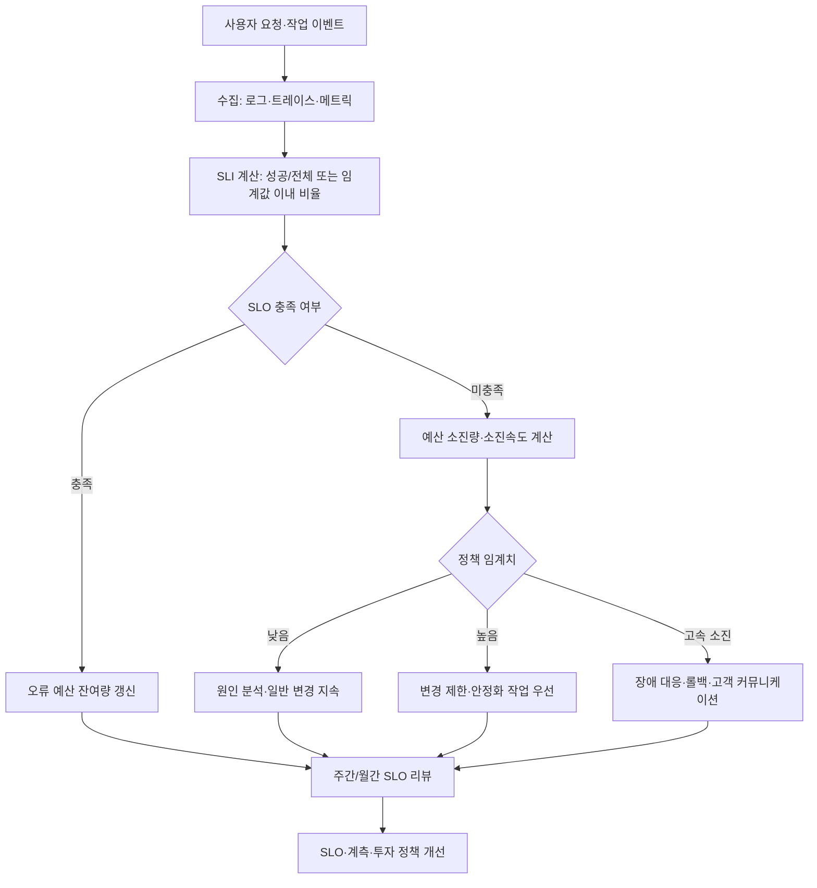
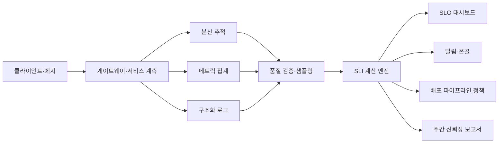

# SLO·SLI·오류 예산(Error Budget) 기반 서비스 신뢰성 관리

## 1. 개요

### 가. 정의

> **SLI(Service Level Indicator)**는 서비스의 신뢰성을 관찰하기 위해 측정하는 정량 지표이며, **SLO(Service Level Objective)**는 그 지표가 목표 기간 동안 만족해야 하는 목표 수준이다.
>
> **SLA(Service Level Agreement)**는 서비스 제공자와 이용자 사이에 합의한 서비스 수준 및 미달 시의 책임·보상 조건을 계약으로 명시한 것이며, **오류 예산(Error Budget)**은 SLO를 100%로 보지 않고 허용 가능한 실패·지연의 여유분으로 환산한 운영 의사결정 기준이다.

SLO·SLI·오류 예산은 단순한 모니터링 대시보드의 지표 묶음이 아니다.
이 체계의 본질은 개발 속도와 서비스 안정성 사이의 긴장을 측정 가능한 정책으로 바꾸는 데 있다.
서비스가 항상 완벽하게 동작해야 한다고 선언하면 현실적인 장애와 네트워크 지연을 모두 실패로 취급하게 된다.
반대로 장애를 감수하자는 식으로 운영하면 고객 영향과 복구 책임이 불분명해진다.
SLO는 기대 가능한 품질을 수치로 표현하고, 오류 예산은 그 품질 목표 안에서 감수할 수 있는 변화의 범위를 제시한다.

가용성만 높다고 좋은 서비스가 되는 것도 아니다.
사용자가 요청한 결과가 정확한지, 응답이 충분히 빠른지, 데이터가 최신인지, 작업이 정해진 시간 안에 완료되는지에 따라 체감 신뢰성이 달라진다.
따라서 서비스의 목적과 사용자 여정에 맞는 SLI를 고르고, 측정 대상과 제외 대상을 명확히 정의해야 한다.
예를 들어 로그인 서비스는 성공률과 지연시간이 중요하지만, 배치 분석 서비스는 일정 시간 안에 작업이 끝나는 처리율과 데이터 품질이 더 중요할 수 있다.

### 나. 등장 배경과 필요성

첫째, 운영팀의 “안정적이다”라는 판단은 개발팀의 “배포가 가능하다”라는 판단과 자주 충돌한다.
장애가 없었다는 느낌만으로 배포를 막으면 작은 개선도 느려지고, 반대로 배포 건수만 최적화하면 고객 영향이 누적된다.
오류 예산은 최근의 SLO 달성률을 기반으로 변경 작업에 사용할 수 있는 위험의 양을 계산하므로 논쟁의 기준을 경험이나 직급이 아니라 데이터로 이동시킨다.

둘째, 평균값 중심의 모니터링은 일부 사용자의 심각한 실패를 가릴 수 있다.
평균 응답시간이 양호해도 특정 지역, 특정 테넌트, 특정 API에서 타임아웃이 집중될 수 있다.
SLO를 전체 평균이 아닌 이벤트 단위의 성공 여부와 분위수 지연시간으로 설계하면 사용자가 실제로 겪는 실패를 더 가까이 표현할 수 있다.

셋째, 서비스가 분산될수록 원인과 책임의 경계가 흐려진다.
프런트엔드, API 게이트웨이, 인증, 결제, 데이터베이스가 연쇄적으로 호출되면 한 구성요소의 지연이 전체 사용자 여정의 실패로 나타난다.
각 서비스의 SLO를 독립적으로 관리하면서도 상위 사용자 여정의 목표와 연결해야, 부분 최적화가 전체 신뢰성을 훼손하는 문제를 줄일 수 있다.

넷째, 오류 예산은 장애를 정당화하는 수치가 아니라 위험을 관리하는 예산이다.
예산이 남았다는 이유로 무리한 변경을 자동 승인해서는 안 된다.
변경의 위험도, 복구 가능성, 데이터 손상 가능성, 규제 영향, 고객의 중요도까지 함께 고려하여 예산을 사용해야 한다.

## 2. SLI·SLO·SLA의 개념과 관계

### 가. SLI의 구성 원리

SLI는 측정값 자체보다 “어떤 사용자 사건을 성공으로 볼 것인가”를 먼저 정의하는 것이 중요하다.
요청 수를 분모로 두고 성공 요청 수를 분자로 두는 가용성 SLI는 이해하기 쉽지만, 캐시 적중과 원천 데이터 조회를 동일한 성공으로 볼 것인지 정책이 필요하다.
또한 헬스 체크만으로 성공률을 계산하면 실제 사용자 요청의 인증·권한·데이터 처리 실패를 놓칠 수 있다.

시간 기반 서비스는 전체 관측 구간 중 정상적으로 서비스를 제공한 시간의 비율을 사용할 수 있다.
요청 기반 서비스는 전체 유효 요청 중 성공한 요청의 비율을 사용할 수 있다.
지연시간 SLI는 전체 요청의 평균보다는 “목표 임계값 이내인 요청의 비율”로 정의하면 사용자 경험과 더 직접적으로 연결된다.
이때 임계값, 측정 지점, 타임아웃, 재시도 요청의 중복 집계 규칙을 함께 기록해야 한다.

데이터 신선도나 정확도도 서비스 목적에 따라 SLI가 될 수 있다.
예를 들어 재고 조회 서비스에서 최근 갱신 시각이 일정 시간 이내인 응답의 비율을 측정하면, 서버가 응답했다는 사실만으로는 드러나지 않는 품질을 감시할 수 있다.
추천 서비스에서는 결과가 반환된 비율뿐 아니라 금칙어 필터 통과율이나 필수 속성 누락률을 품질 지표로 둘 수 있다.
다만 품질 판단이 주관적이면 측정 방법과 검증 표본을 별도로 정의해야 한다.

### 나. SLO의 설정 방식

SLO는 “가용성 99.9%”처럼 숫자 하나만 정하는 작업이 아니다.
대상 서비스, 사용자 집합, 측정 기간, 성공 조건, 데이터 원천, 예외 조건, 목표 미달 시 조치를 한 세트로 정의해야 운영 가능한 목표가 된다.
측정 기간은 이동 기간과 달력 기간 중 목적에 맞는 방식을 선택하고, 기간이 바뀌면 추세와 오류 예산 소진 속도의 해석도 달라진다.

가용성 SLO가 99.9%라면 허용 실패율은 0.1%이다.
하루에 유효 요청이 1,000,000건이라면 단순 계산상 허용되는 실패 요청은 1,000건이다.
그러나 모든 실패가 같은 가치와 피해를 갖는 것은 아니므로, 결제 승인 실패와 비핵심 추천 위젯 실패를 하나의 SLO로 합치면 의사결정이 왜곡될 수 있다.
중요한 사용자 여정과 내부 관리 기능을 분리하여 SLO를 설계하는 이유가 여기에 있다.

목표는 높을수록 좋은 것이 아니라 비용과 기대 품질이 균형을 이루는 수준이어야 한다.
목표를 99.99%로 올리면 허용 실패율이 99.9% 대비 10분의 1로 줄어들어, 이중화·용량·테스트·온콜 대응 비용이 크게 달라질 수 있다.
고객이 실제로 구분하지 못하는 미세한 목표 상향보다, 실패가 집중되는 원인을 제거하는 투자가 더 큰 가치를 만들 때도 있다.
따라서 초기 SLO는 측정 가능한 현재 수준과 고객 기대를 함께 보고 정하고, 운영 데이터를 통해 점진적으로 조정한다.

### 다. SLA와의 차이

SLA는 외부 고객과의 계약 또는 공식 약속이므로 법적·상업적 책임이 따를 수 있다.
반면 SLO는 내부 운영 목표로 사용될 수 있으며, SLA보다 엄격하거나 서비스별로 더 세분화될 수 있다.
SLA에 99.9% 가용성을 약속했다면 내부 SLO를 99.95%로 설정하여 계약 위반 전에 탐지하고 개선할 여지를 둘 수 있다.
SLO를 SLA와 동일하게 설정하면 내부 경보와 고객 보상 기준이 한계선에 붙어 조기 대응이 어려워진다.

| 구분 | SLI | SLO | SLA |
|---|---|---|---|
| 성격 | 측정 지표 | 목표 수준 | 외부 합의·계약 |
| 질문 | 무엇을 어떻게 측정하는가 | 어느 수준을 지킬 것인가 | 못 지키면 무엇을 책임지는가 |
| 주 사용자 | 개발·운영·분석팀 | 서비스 소유자·운영팀 | 고객·영업·법무·운영팀 |
| 예시 | 300ms 이내 응답 비율 | 월간 99.9% 이상 | 미달 시 서비스 크레딧 제공 |
| 변경 방식 | 계측·정의 변경 검토 | 정책·리뷰로 조정 | 계약 변경 절차 필요 |

세 용어를 혼동하면 대시보드에 지표는 많지만 결정할 정책은 없는 상태가 된다.
SLI는 관찰의 언어이고, SLO는 품질의 기준이며, SLA는 이해관계자 사이의 책임 언어라는 구분이 유용하다.
기술사는 이 관계를 문서화할 때 수치만 나열하지 말고 업무 목표와 운영 조치까지 연결해야 한다.

## 3. 오류 예산의 산정과 운영

### 가. 산정 공식

오류 예산은 목표 수준에서 허용되는 실패의 양으로 정의한다.
가용성 SLO가 99.9%라면 오류 예산 비율은 다음과 같이 계산한다.

\[
오류\ 예산\ 비율 = 1 - SLO
\]

요청 기반 측정에서는 다음과 같이 표현할 수 있다.

\[
허용\ 실패\ 수 = 전체\ 유효\ 요청\ 수 \times (1 - 목표\ 성공률)
\]

시간 기반 측정에서는 관측 기간에 오류 예산 비율을 곱하여 허용 중단 시간을 계산한다.
30일을 43,200분으로 보고 99.9% SLO를 적용하면 이론상 허용 중단 시간은 43.2분이다.
이 수치는 장애를 43.2분까지 방치해도 된다는 뜻이 아니라, 계획된 유지보수와 비계획 장애를 포함한 서비스 영향의 총량을 관리하는 기준이다.
측정 방식에 따라 유지보수 제외, 예정된 테스트 제외, 지역별 분리 등의 정책이 달라지므로 계산 전에 범위를 확정해야 한다.

오류 예산 소진율은 남은 예산보다 더 빠른 대응을 가능하게 한다.
예산의 10%가 한 달 동안 소진되었다면 정상처럼 보일 수 있지만, 한 시간 안에 10%가 소진되었다면 큰 장애가 진행 중일 수 있다.
따라서 누적 소진율과 단기 소진율을 함께 관찰하고, 단기 소진이 임계치를 넘으면 페이지 알림이나 변경 동결을 실행할 수 있다.

### 나. 예산 소진의 흐름

먼저 사용자 사건을 수집하고, 신뢰할 수 있는 원천에서 SLI를 계산한다.
그 다음 SLO와 비교하여 오류 예산을 차감하고, 예산 잔여량과 소진 속도에 따라 운영 정책을 적용한다.
이 흐름에서 대시보드가 늦게 갱신되거나 분모가 누락되면 예산이 남아 있는 것처럼 보일 수 있으므로 계측 품질도 관리 대상이다.

예산 임계치에는 단일 숫자보다 단계별 조치가 적합하다.
예산이 50% 남았을 때 원인 분석을 시작하고, 25% 남았을 때 고위험 변경에 추가 승인 절차를 두며, 0%에 가까워지면 안정화 작업을 우선하는 식이다.
다만 임계치가 자동으로 모든 배포를 막도록 설계하면 긴급 보안 패치까지 지연될 수 있으므로, 변경 유형과 긴급도에 따른 예외 절차가 필요하다.

### 다. 예산 기반 의사결정

오류 예산이 충분하면 기능 배포, 성능 실험, 아키텍처 변경 같은 혁신 작업에 일정 수준의 위험을 허용할 수 있다.
이때 위험 허용은 무작위 장애를 허용하는 것이 아니라, 영향 범위를 제한하고 빠르게 되돌릴 수 있는 변경을 선택한다는 의미다.
카나리 배포, 기능 플래그, 자동 롤백, 사전 검증 환경은 동일한 오류 예산으로 더 많은 학습을 얻도록 돕는다.

오류 예산이 부족하면 기능 개발을 무조건 중단하기보다 신뢰성 작업의 우선순위를 올린다.
예를 들어 타임아웃 원인이 데이터베이스 연결 풀 고갈이라면 용량 증설만 하기보다 쿼리 패턴, 재시도 폭주, 커넥션 회수, 부하 분산을 함께 분석한다.
근본 원인을 해결하지 않고 임시로 SLO 목표를 낮추면 지표는 좋아져도 고객 경험은 개선되지 않는다.

## 4. 측정 설계와 기술적 구현

### 가. 이벤트·분모 정의

좋은 SLI는 계산식이 짧고, 동일한 입력에 대해 재현 가능하며, 서비스 소유자가 결과를 설명할 수 있어야 한다.
“정상 요청”의 정의에는 HTTP 상태 코드뿐 아니라 업무 성공 여부와 필수 데이터의 완전성도 포함될 수 있다.
예를 들어 HTTP 200을 반환했지만 결제 승인 결과가 `pending`인 경우, 결제 완료 SLI에서는 성공으로 볼 수 없다.

분모에 내부 재시도와 중복 요청을 포함할지 결정해야 한다.
사용자 한 번의 클릭이 네트워크 재시도로 세 번 전송되었는데 세 요청을 모두 분모로 세면, 사용자 체감과 지표 사이에 차이가 생길 수 있다.
반대로 서버가 받은 실제 요청을 모두 세면 시스템이 재시도 폭주에 얼마나 노출되었는지를 볼 수 있다.
두 관점이 모두 필요하면 사용자 사건 SLI와 인프라 요청 SLI를 분리한다.

제외 조건은 투명하게 관리해야 한다.
점검 시간, 테스트 트래픽, 차단된 악성 요청을 제외할 수 있지만, 장애가 발생한 뒤 불리한 데이터를 제외하면 SLO가 지표 세탁 수단이 된다.
제외 목록은 코드와 문서에 버전 관리하고, 변경 시 서비스 소유자와 관측 담당자의 검토를 받는 것이 바람직하다.

### 나. 지연시간과 백분위수

평균 지연시간은 매우 느린 소수 요청을 가릴 수 있다.
p50은 전형적인 사용자의 경험을, p95와 p99는 꼬리 지연과 일부 사용자의 나쁜 경험을 보여주는 보조 지표로 활용한다.
그러나 “p99가 몇 ms 이하”라는 관측값을 그대로 SLO로 삼는 것보다, 전체 유효 요청 중 임계값 이내 요청 비율을 목표로 정하는 방식이 기간별 비교에 더 명확할 수 있다.

측정 지점에 따라 값이 달라진다.
클라이언트에서 측정한 지연은 DNS·전송·렌더링까지 포함하여 사용자 경험에 가깝지만 네트워크 환경의 영향을 많이 받는다.
서버 내부에서 측정한 지연은 원인 분석에 유리하지만 클라이언트가 느끼는 전체 시간을 설명하지 못한다.
따라서 사용자 여정 SLI와 구성요소별 원인 분석 지표를 함께 운영하되, 둘을 같은 SLO로 혼용하지 않는다.

### 다. 데이터 파이프라인

수집 계층은 원본 이벤트를 잃지 않으면서 비용과 개인정보를 관리해야 한다.
모든 요청의 본문을 로그로 남기면 디버깅에는 도움이 될 수 있지만 개인정보와 비용 위험이 커진다.
대신 식별자를 비식별화하고, 필요한 필드만 구조화하며, 원본 보존 기간과 접근 권한을 분리한다.

집계 지연과 샘플링도 SLO 해석에 영향을 준다.
트레이스는 비용 때문에 샘플링할 수 있지만, 오류 요청과 느린 요청을 우선 보존하는 정책이 필요하다.
메트릭은 높은 카디널리티 라벨을 무제한으로 사용하면 저장 비용과 조회 성능이 악화되므로 서비스·지역·버전·테넌트 등 의사결정에 필요한 차원부터 선정한다.

## 5. 운영 프로세스와 조직 적용

### 가. SLO 수립 절차

1. 핵심 사용자 여정과 사업상 중요한 결과를 식별한다.
2. 여정별로 성공 사건과 실패 사건을 산문으로 정의한다.
3. 로그·트레이스·메트릭 중 신뢰할 수 있는 측정 원천을 선정한다.
4. SLI의 분모·분자·임계값·제외 조건·측정 기간을 문서화한다.
5. 현재 수준, 고객 기대, 비용, 규제 요구를 반영해 초안 SLO를 정한다.
6. 과거 장애와 피크 트래픽에 대입하여 목표가 현실적인지 검증한다.
7. 예산 소진 단계별 운영 조치와 예외 절차를 합의한다.
8. 일정 기간 운영 후 오탐·누락·업무 불일치를 리뷰하여 개선한다.

초기에는 모든 기능에 동일한 SLO를 적용하기보다 핵심 여정부터 시작하는 것이 좋다.
로그인·결제·주문 상태처럼 고객과 수익에 직접 연결되는 흐름을 먼저 정의하면 투자 우선순위가 분명해진다.
그 다음 부가 기능과 내부 시스템으로 확장하면서 지표 운영에 필요한 공통 템플릿을 만든다.

SLO 문서에는 담당 팀만 적지 말고 의존 서비스와 의사결정 권한을 함께 적는다.
데이터베이스 팀의 장애가 주문 서비스 SLO에 영향을 주는 경우, 원인 팀과 고객 커뮤니케이션 팀의 역할이 사전에 정해져 있어야 한다.
책임을 나누는 목적은 책임을 전가하는 것이 아니라 장애 시 복구 경로를 짧게 만드는 것이다.

### 나. 배포·변경관리와의 연계

CI/CD 파이프라인은 오류 예산을 배포 승인에 활용할 수 있다.
최근 기간의 SLO 달성률과 단기 소진 속도가 양호하면 작은 범위의 카나리 배포를 허용하고, 소진이 빠르면 자동으로 배포 범위를 축소하거나 승인자를 추가할 수 있다.
다만 파이프라인은 정책의 실행 수단이지 SLO 정의의 대체물이 아니다.
계측 오류로 인해 자동 차단이나 자동 승인이 발생하지 않도록 데이터 신선도와 계산 실패를 별도로 감시해야 한다.

고위험 변경에는 오류 예산 외의 안전장치를 병행한다.
데이터 스키마 변경은 롤백이 어려울 수 있으므로 호환 가능한 확장 후 전환하는 단계적 방식이 필요하다.
인증·결제 변경은 기능 플래그만으로 충분하지 않을 수 있어 사전 승인, 제한된 사용자군, 거래 중지 절차, 감사 로그를 추가한다.

### 다. 장애 대응과 학습

장애가 발생하면 먼저 고객 영향과 복구를 우선하고, 원인 규명은 복구와 병렬로 진행한다.
SLO와 오류 예산은 장애의 심각도를 빠르게 설명하는 공통 언어가 된다.
그러나 오류 예산 수치가 낮다고 고객 영향이 항상 작다는 뜻은 아니므로, 영향받은 사용자 수·거래 금액·데이터 손상 여부를 함께 본다.

사후 검토에서는 개인의 실수보다 시스템의 조건을 분석한다.
경보가 늦었는지, 롤백 경로가 있었는지, 변경이 충분히 작은 단위였는지, 테스트가 실제 트래픽 특성을 반영했는지, 의존 서비스의 상태를 알 수 있었는지 질문한다.
재발 방지 조치는 담당자와 완료 시점을 정하고, 같은 SLO의 추세에서 효과가 확인되는지 검증한다.

## 6. 비교·사례

### 가. 전통적 KPI와 SLO 비교

전통적 KPI는 매출·처리량·배포 횟수처럼 사업 생산성을 보여주는 데 강점이 있다.
하지만 처리량이 늘면서 오류와 지연이 함께 증가할 수 있고, KPI만 보면 품질 저하가 늦게 드러날 수 있다.
SLO는 사용자가 기대하는 서비스 결과를 중심으로 품질의 하한선을 정하고, KPI와 함께 사용하여 속도와 안정성의 균형을 잡는다.

| 비교축 | 전통적 운영 KPI | SLO·오류 예산 체계 |
|---|---|---|
| 초점 | 산출량·활동량 | 사용자 관점의 신뢰성 |
| 실패 해석 | 장애 건수·평균값 | 목표 대비 예산 소진 |
| 개발과 운영 관계 | 목표 충돌이 협의에 의존 | 데이터 기반 변경 정책 |
| 개선 방향 | 더 많이·더 빨리 | 위험을 통제하며 학습 |
| 한계 | 고객 영향의 분산 표현 | 지표 설계·계측 비용 |

두 체계는 대체 관계가 아니라 보완 관계다.
예를 들어 배포 횟수는 혁신 속도를 나타내고, SLO는 배포가 고객에게 준 품질 영향을 나타낸다.
배포 횟수가 많으면서 SLO도 유지된다면 자동화와 작은 변경의 효과를 확인할 수 있다.
반대로 배포 횟수는 늘었지만 오류 예산이 빠르게 줄면 속도 지표만 최적화한 결과일 수 있다.

### 나. 전자상거래 주문 API 사례

한 전자상거래 주문 API가 월간 유효 요청 10,000,000건 중 성공 요청 9,995,000건을 기록했다고 가정한다.
성공률은 99.95%이고, 목표 SLO가 99.9%라면 이 기간의 요청 기반 오류 예산은 10,000건이므로 5,000건을 사용하고 5,000건이 남는다.
남은 예산이 있다고 해서 모든 변경을 승인하는 것이 아니라, 다음 배포가 재고 차감과 결합되는지 여부를 확인해야 한다.

재고 차감 실패가 주문 생성 실패보다 늦게 나타나면 단순 성공률 SLI는 문제를 놓칠 수 있다.
주문 접수 성공과 재고 확정 성공을 별도의 사용자 여정으로 분리하고, 보상 트랜잭션과 미확정 주문의 처리 시간을 추가로 측정해야 한다.
이렇게 하면 “API 응답 성공”과 “고객 주문이 실제로 완료됨” 사이의 의미 차이를 줄일 수 있다.

한 시간 동안 오류 예산의 40%가 소진되었다면 월간 잔여량만 보고 정상으로 판단해서는 안 된다.
배포 버전별·지역별·의존 데이터베이스별로 소진을 분해하고, 문제가 된 버전을 카나리에서 중지하거나 롤백한다.
동시에 고객에게 주문 재시도나 중복 결제 가능성을 안내하고, 복구 이후에는 멱등키와 재고 정합성 검증을 개선한다.

### 다. 배치 분석 서비스 사례

매시간 수요 예측 배치를 수행하는 서비스에서는 모든 요청의 즉시 응답률보다 정해진 시각까지 결과가 준비되는지가 핵심이다.
예를 들어 “영업 시작 30분 전까지 최근 데이터로 예측 결과가 준비된 작업의 비율 99%”를 SLO로 정의할 수 있다.
이 경우 작업 실패, 데이터 입력 지연, 모델 실행 지연, 결과 적재 실패를 구분하여 원인별 지표를 둬야 한다.

배치 작업은 재실행이 가능하다는 특성이 있어 오류 예산을 요청 실패 수로만 계산하면 실제 비용을 반영하지 못한다.
재실행에 걸린 컴퓨팅 비용, 의사결정 지연, 사람이 수행한 수동 보정 시간을 별도 운영 지표로 관리한다.
SLO는 고객 결과의 시간 약속을 표현하고, 비용 지표는 그 약속을 지키기 위해 지불한 자원을 보여준다.

## 7. 심화: 다중 서비스 환경의 SLO 계층화

### 가. 사용자 여정과 구성요소 목표

마이크로서비스 환경에서는 각 서비스의 SLO를 단순히 곱하여 전체 SLO로 단정하면 안 된다.
실제 호출 그래프에는 병렬 호출, 선택적 기능, 캐시 적중, 재시도, 대체 경로가 존재하기 때문이다.
호출 구조를 분석하고 사용자 여정의 성공 조건을 직접 측정한 뒤, 하위 서비스 SLO를 예산 배분의 참고값으로 사용하는 편이 안전하다.

핵심 여정 SLO는 고객 가치의 결과를 대표한다.
하위 서비스 SLO는 팀이 제어할 수 있는 기술적 품질을 대표한다.
상위 목표가 미달하더라도 하위 서비스들이 모두 목표를 달성한다면 계측 누락이나 상호작용 문제가 있을 수 있고, 일부 하위 서비스만 미달하면 해당 의존성의 개선 우선순위를 정할 수 있다.

### 나. 예산 배분과 의존성 관리

상위 주문 여정에 0.1% 실패 예산이 있다면 인증·상품·재고·결제에 같은 예산을 각각 부여할 수는 없다.
병렬 호출인지 순차 호출인지, 실패 시 대체 가능한지, 고객에게 보이는 핵심 단계인지에 따라 기여하는 위험이 다르다.
예산 배분은 수학적 계산으로 시작하되, 장애 전파 경로와 복구 가능성을 반영한 정책 협의로 확정한다.

의존성 계약에는 성공 조건뿐 아니라 타임아웃과 재시도도 포함해야 한다.
상위 서비스가 하위 서비스의 지연을 기다리며 재시도하면 작은 지연이 전체 장애로 증폭될 수 있다.
타임아웃 예산을 구간별로 나누고, 재시도 횟수와 백오프를 제한하며, 회로 차단기와 격리 풀을 적용하면 오류 예산의 급격한 소진을 완화할 수 있다.

### 다. 신뢰성 투자 포트폴리오

오류 예산 데이터는 어떤 투자가 고객 품질을 개선하는지 평가하는 근거가 된다.
캐시 도입, 데이터베이스 인덱스 개선, 관측성 보강, 배포 자동 롤백, 재해복구 훈련은 서로 다른 비용과 효과를 가진다.
단기 SLO 개선만으로 판단하면 숨은 운영부채와 장기 유지보수 비용을 놓칠 수 있으므로, 투자 효과를 소진율·복구시간·변경 실패율·수동 작업량의 추세로 함께 검증한다.

## 8. 고려사항 및 시사점

### 가. 지표 설계의 정합성

첫째, SLI는 시스템이 측정하기 쉬운 값이 아니라 사용자가 성공했다고 판단하는 결과를 반영해야 한다.
HTTP 상태 코드만으로 업무 성공을 표현할 수 없다면 도메인 이벤트와 결과 상태를 계측에 포함한다.
분모에서 특정 트래픽을 임의로 제외하지 않도록 정의와 예외를 코드 리뷰 수준으로 관리한다.

둘째, 서비스별 지표의 정의가 달라지면 조직 전체의 비교가 어려워진다.
공통 용어와 계산 템플릿을 만들되, 모든 서비스에 동일한 임계값을 강제하지는 않는다.
표준화할 것은 정의 방식과 검증 절차이고, 목표 수준은 사용자 기대와 업무 중요도에 따라 차등화한다.

### 나. 최종 일관성과 사용자 커뮤니케이션

셋째, 분산 시스템에서는 SLO를 달성해도 데이터가 잠시 지연될 수 있다.
사용자에게 처리 중 상태, 마지막 갱신 시각, 재시도 방법을 제공하면 지연 일관성을 품질 문제로만 경험하지 않게 할 수 있다.
운영자는 기술적 성공률과 함께 상태 안내의 정확성도 점검해야 한다.

넷째, 장애 공지는 기술 용어보다 영향·범위·대응 방법을 중심으로 작성한다.
오류 예산의 소진량은 내부 의사결정에 유용하지만, 고객에게는 어떤 기능을 언제까지 사용할 수 없는지와 데이터 보호 조치를 설명하는 것이 우선이다.

### 다. 자동화와 예외 통제

다섯째, 예산 연동 자동화는 빠른 대응을 가능하게 하지만 잘못된 계측이 조직 전체를 오작동시킬 수 있다.
SLO 계산 실패, 데이터 지연, 관측 시스템 장애를 서비스 장애와 구분하는 메타 모니터링을 둔다.
긴급 보안 패치나 법정 조치처럼 예산과 무관하게 수행해야 하는 변경은 별도 승인·사후 검토 절차를 둔다.

여섯째, 자동 롤백은 모든 오류에 적합하지 않다.
데이터 마이그레이션과 외부 계약 변경처럼 이미 외부 효과가 발생한 작업은 버전 되돌리기보다 보상 작업과 호환성 유지가 필요하다.
변경 유형별 복구 전략을 런북으로 만들고 정기적으로 실제 훈련한다.

### 라. 개인정보·감사·비용

일곱째, SLI를 계산하기 위해 수집하는 로그와 추적 데이터도 개인정보 보호 대상이 될 수 있다.
최소 수집, 목적 제한, 보존 기간, 접근 통제, 마스킹을 적용하고, 운영 분석에 불필요한 원문 데이터는 저장하지 않는다.
감사 추적이 필요한 경우에는 원본 데이터와 분석용 파생 데이터를 분리하여 접근 권한과 보존 정책을 차등화한다.

여덟째, 관측성 비용이 서비스 가치보다 커지지 않도록 계측 수준을 조절한다.
고카디널리티 라벨과 장기 원본 보관은 비용을 키울 수 있으므로, 핵심 SLO 계산 데이터와 상세 조사 데이터를 보존 등급별로 나눈다.
비용 절감으로 오류 분석 능력이 훼손되지 않도록 대표 샘플과 오류·지연 우선 보존 정책을 검증한다.

## 9. 한 줄 요약

---

> **한 줄 요약**: SLI로 사용자 관점의 신뢰성을 측정하고 SLO로 목표를 정한 뒤, 오류 예산의 소진 속도에 따라 배포·안정화·투자를 조절하는 것이 데이터 기반 서비스 운영의 핵심이다.
