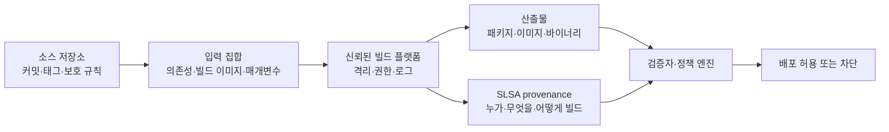
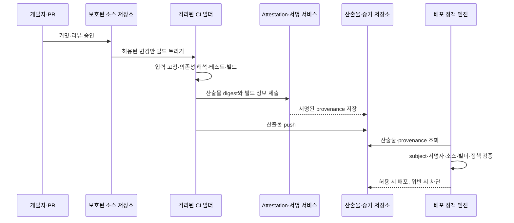

# SLSA 기반 소프트웨어 공급망 보안과 빌드 무결성

## 1. 개요

> **SLSA(Supply-chain Levels for Software Artifacts)**는 소스 코드, 빌드 플랫폼, 의존성, 산출물 사이의 신뢰 관계를 provenance(출처·생성 이력)와 단계별 요구사항으로 표현하여 소프트웨어 공급망의 변조·오염 위험을 줄이는 보안 프레임워크다.

소프트웨어 공급망 공격은 운영 중인 서버에 직접 침입하지 않고 개발·빌드·배포 과정의 신뢰를 악용한다.
개발자가 사용하는 오픈소스 패키지에 악성 코드가 섞이거나, CI 러너의 권한이 탈취되거나, 정상 소스에서 만들어진 것처럼 보이는 바이너리가 빌드 이후 교체될 수 있다.
조직은 최종 파일의 해시만 확인해서는 “무엇으로, 어디서, 어떤 입력을 사용해 이 파일을 만들었는가”라는 질문에 답하기 어렵다.

특히 현대의 CI/CD 파이프라인은 소스 저장소, 패키지 저장소, 컨테이너 레지스트리, 외부 액션, 빌드 캐시, 서명 시스템과 여러 클라우드 계정을 연결한다.
한 단계의 권한이 과도하거나 생성 이력이 위조 가능하면 공격자는 정상 배포 절차 안에 악성 산출물을 끼워 넣을 수 있다.
따라서 공급망 보안은 방화벽이나 런타임 백신만의 문제가 아니라, 소프트웨어가 만들어지는 과정 자체를 증명하고 검증하는 문제다.

SLSA는 이러한 문제를 “산출물이 어떻게 만들어졌는지에 대한 검증 가능한 증거”와 “그 증거를 얼마나 신뢰할 수 있는지에 대한 수준”으로 나눈다.
Build track은 빌드 산출물과 빌드 플랫폼의 관계를 다루고, Source track은 소스가 저장소에 들어오고 변경되는 과정의 신뢰를 다룬다.
각 트랙은 모든 조직이 한 번에 최고 수준을 달성하도록 강제하기보다, 현재 통제 수준을 측정하고 점진적으로 높이도록 돕는다.

논술 답안에서는 SLSA를 단순한 도구나 서명 제품으로 설명해서는 부족하다.
첫째, SBOM은 구성요소 목록이고 SLSA provenance는 생성 과정의 증거라는 차이를 구분해야 한다.
둘째, 서명만 있으면 안전하다는 식으로 단정하지 말고 서명 주체·키 보호·빌드 격리·정책 검증을 함께 설명해야 한다.
셋째, 개발자 편의와 보안 통제를 균형 있게 고려하여 위험 기반 단계적 도입 전략을 제시해야 한다.

### 가. 등장 배경과 필요성

첫 번째 배경은 공격 표면의 확장이다.
한 애플리케이션이 직접 작성한 코드만으로 구성되던 시기와 달리, 현재는 수백 개의 패키지와 빌드 플러그인, 컨테이너 이미지, 배포 액션을 조합한다.
패키지가 정상 버전인지 확인하는 것과 그 패키지가 실제 빌드에 사용되었는지 확인하는 것은 별개의 문제다.
SLSA는 입력과 실행 환경을 설명하는 provenance를 통해 이 연결을 드러낸다.

두 번째 배경은 “재현 가능해 보이는 빌드”와 “신뢰할 수 있는 빌드”의 차이다.
같은 소스 커밋으로 다시 빌드할 수 있더라도, 빌드 과정에서 임의의 비밀값이 주입되거나 외부 다운로드 파일이 바뀌면 결과가 달라질 수 있다.
재현성은 유용한 품질 속성이지만, 빌드 주체가 정당했는지와 provenance가 위조되지 않았는지까지 자동으로 보장하지 않는다.
그러므로 재현성, 서명된 증거, 격리된 빌드 환경을 서로 다른 통제로 설계해야 한다.

세 번째 배경은 규제·조달·고객 요구의 변화다.
공공·금융·의료 영역에서는 납품된 소프트웨어의 구성요소와 취약점 대응뿐 아니라 개발·빌드 통제가 중요한 평가 항목이 된다.
조직은 사고가 발생한 뒤 “어떤 소스와 의존성으로 어느 빌드가 만들어졌는지”를 추적할 수 있어야 하며, 공급업체의 주장도 검증 가능한 증거로 받아야 한다.
SLSA와 NIST SSDF를 함께 적용하면 개발 프로세스의 실천 항목과 산출물 생성 증거를 연결할 수 있다.

### 나. 목표와 범위

SLSA의 목표는 모든 공격을 막는 것이 아니라 공급망에서 발생하는 실수와 변조를 탐지·억제하고, 소비자가 산출물의 생성 경로에 관한 정책을 판단하게 하는 것이다.
예를 들어 조직은 “운영 환경에 배포되는 이미지는 승인된 저장소의 보호된 커밋에서, 중앙 CI 플랫폼으로, 서명된 provenance를 남기며 빌드되어야 한다”는 정책을 만들 수 있다.
정책 엔진은 이미지의 provenance를 읽어 이 조건을 만족하는지 자동 판정한다.

범위는 소스 저장소의 변경 통제, 의존성 수집, 빌드 실행, 산출물 생성, provenance 발행, 서명·보관, 배포 전 검증으로 이어진다.
반면 운영 중 애플리케이션의 모든 취약점, 사업 승인, 개발자의 보안 교육, 침투 테스트를 SLSA 하나가 대신하지는 않는다.
프레임워크의 범위를 명확히 해야 도입 후 “SLSA를 달성했으니 공급망 위험이 모두 제거됐다”는 과신을 피할 수 있다.

## 2. SLSA의 핵심 개념과 구조

SLSA를 이해하는 핵심은 산출물(artifact), 입력(input), 빌드 플랫폼(build platform), provenance, 검증자(verifier)의 관계다.
산출물은 바이너리·패키지·컨테이너 이미지처럼 소비자가 설치하거나 배포하는 결과물이고, 입력은 소스·의존성·빌드 매개변수·빌드 이미지처럼 결과에 영향을 주는 요소다.
빌드 플랫폼은 입력을 받아 산출물을 만들고 그 과정을 설명하는 증거를 발행한다.
검증자는 산출물의 digest와 provenance의 subject를 연결한 뒤, 조직 정책에 따라 배포 허용 여부를 판단한다.

### 가. 산출물과 digest

검증 대상은 파일명보다 암호학적 digest로 식별해야 한다.
파일명과 버전 문자열은 저장소 이동이나 재패키징으로 바뀔 수 있지만, 산출물 바이트에 대한 digest는 내용이 달라질 때 변경된다.
따라서 provenance의 subject에는 산출물의 이름과 digest를 기록하고, 검증 시 실제 다운로드한 파일의 digest를 다시 계산하여 일치 여부를 확인한다.

digest 일치는 필요조건이지 충분조건은 아니다.
공격자가 악성 파일의 digest에 맞춰 가짜 provenance를 만들거나, 합법적인 빌드 플랫폼의 서명키를 훔치면 단순한 문자열 비교만으로는 문제를 해결하지 못한다.
검증자는 digest, provenance 서명, 서명자 신원, 빌드 경로, 입력 커밋, 정책 조건을 함께 확인해야 한다.

예를 들어 `payment-api:2.4.1`이라는 컨테이너 태그가 같은 이름으로 다시 덮어쓰일 수 있는 레지스트리라면, 배포 시스템은 태그보다 immutable digest를 고정해야 한다.
그 후 provenance가 가리키는 digest와 레지스트리에서 받은 이미지의 digest가 같은지 확인한다.
이 절차는 “어떤 이름의 이미지를 받았는가”가 아니라 “검증한 바로 그 바이트를 배포하는가”를 보장하는 데 의미가 있다.

### 나. Provenance

provenance는 산출물이 어떤 입력과 실행 과정을 거쳐 생성되었는지를 나타내는 서명 가능한 증거다.
일반적으로 빌드 정의, 외부 매개변수, 해결된 의존성, 빌드 워크스페이스, 빌드 플랫폼의 식별자, 생성된 산출물과 같은 정보가 포함된다.
소비자는 이 정보를 사용하여 허용된 소스 커밋인지, 승인된 빌드 서비스인지, 기대하지 않은 외부 입력이 끼어들지 않았는지 판단한다.

provenance는 개발자가 작성하는 선언문만으로 신뢰를 얻지 못한다.
사용자 제어 빌드 단계가 provenance의 내용을 임의로 바꿀 수 있다면 공격자는 실제로는 악성 입력을 사용하고도 정상 입력을 사용했다고 주장할 수 있다.
따라서 높은 수준에서는 빌드 플랫폼의 통제 영역에서 증거를 생성하고, 서명 키를 사용자 빌드 명령에서 격리하며, 증거가 산출물과 올바르게 결합되는지 확인해야 한다.

SLSA 권장 provenance는 in-toto attestation framework와 함께 사용되는 형식이다.
attestation은 산출물에 대한 주장을 담는 봉투이고, predicate는 빌드나 테스트처럼 그 주장의 구체적 의미를 담는다.
이 구조는 빌드 provenance 외에도 취약점 검사, 테스트 결과, 라이선스 검사 등 서로 다른 유형의 증거를 동일한 정책 체계에서 다루도록 확장할 수 있다.

### 다. Build track과 Source track

SLSA v1.2는 Build track과 Source track을 구분한다.
Build track은 빌드 플랫폼이 provenance를 생성하고, 그 provenance가 산출물과 빌드 입력을 정확하게 설명하며, 빌드 환경의 변조에 얼마나 강한지를 단계로 평가한다.
Source track은 소스 코드가 어디에서 왔고 어떤 변경 통제를 거쳐 신뢰된 소스 상태가 되었는지를 다룬다.
두 트랙을 분리하면 “빌드가 안전했지만 악성 커밋을 빌드한 경우”와 “소스는 승인되었지만 빌드 플랫폼이 변조된 경우”를 별도로 분석할 수 있다.

SLSA v1.0 이후의 Build level은 L0부터 L3까지 설명된다.
L0은 보장이 없는 상태이며, L1은 빌드 provenance의 존재를 요구한다.
L2는 호스팅된 빌드 플랫폼이 provenance를 생성하고 서명하여 사후 변조에 대한 방어를 높이는 단계다.
L3는 빌드 플랫폼의 강한 격리와 위조 저항을 요구하여 빌드 중 변조 위험을 더 낮추는 단계다.

| 구분 | 핵심 보장 | 대표 위험 완화 | 도입 질문 |
|---|---|---|---|
| Build L0 | 별도 보장 없음 | 체계적 통제가 없는 상태 | 산출물의 생성 경로를 설명할 수 있는가 |
| Build L1 | provenance 존재 | 실수·추적성 부족 | 모든 릴리스가 생성 이력을 남기는가 |
| Build L2 | 서명된 provenance와 호스팅 빌드 | 빌드 후 증거 변조 | 서명 주체와 CI 신원이 신뢰 가능한가 |
| Build L3 | 강화·격리된 빌드 플랫폼 | 빌드 중 조작 | 키·작업공간·빌드 간 경계를 보호하는가 |

이 단계는 제품 보안의 전체 성숙도 점수가 아니다.
예를 들어 L3 수준의 빌드 플랫폼이라도 애플리케이션이 취약한 라이브러리를 사용하거나 운영 서버의 접근통제가 약하면 전체 위험은 남는다.
따라서 조직은 트랙·수준을 자산 중요도와 공격 시나리오에 매핑하고, SBOM·취약점 관리·SSDF·런타임 보안과 함께 관리해야 한다.

### 라. Producer와 Consumer

Producer는 소프트웨어를 만들고 provenance를 발행하는 빌드 플랫폼과 그 플랫폼을 사용하는 조직을 포함한다.
Producer의 책임은 빌드 입력과 결과를 정확히 식별하고, 요구 수준에 맞는 provenance를 생성하며, 서명 키와 빌드 환경을 보호하는 것이다.
Consumer는 패키지를 설치하거나 이미지를 배포하는 조직·서비스이며, provenance를 실제 정책 판단에 사용해야 한다.

소비자가 검증하지 않으면 provenance는 장식용 로그에 머문다.
예를 들어 레지스트리에 provenance가 함께 저장되어 있어도 배포 파이프라인이 서명자나 소스 저장소를 확인하지 않고 최신 태그를 가져오면 보안 통제가 작동하지 않는다.
소비자는 허용된 빌더, 브랜치, 저장소, 조직, 빌드 매개변수, 의존성 조건을 정책으로 정의하고 실패 시 차단·예외·승인 절차를 구분해야 한다.

## 3. 공급망 공격 시나리오와 SLSA 대응

공급망 공격은 개발자의 실수와 외부 공격이 같은 경로를 이용한다는 점이 특징이다.
이메일 피싱으로 CI 토큰을 탈취하거나, 오픈소스 저장소의 릴리스 계정을 빼앗거나, 패키지 이름을 혼동시키는 dependency confusion을 일으키면 정상 개발 흐름을 거스르지 않고 악성 산출물을 전달할 수 있다.
SLSA는 공격을 마술처럼 제거하지 않고, 공격자가 넘어야 할 신뢰 경계를 명확히 하고 사후 검증 증거를 남긴다.

### 가. 악성 의존성과 dependency confusion

공격자는 내부 패키지와 같은 이름의 공개 패키지를 만들어 빌드 도구가 외부 패키지를 먼저 선택하게 할 수 있다.
또는 정상 패키지의 유지관리자 계정을 탈취하여 악성 코드를 포함한 새 버전을 배포할 수 있다.
이때 SBOM은 최종 산출물에 포함된 패키지를 알려 주지만, 패키지가 어떤 저장소·digest·빌드 과정에서 왔는지를 추가로 확인해야 한다.

대응은 의존성 저장소를 허용 목록으로 제한하고, lockfile과 checksum을 검토하며, 의존성 수집 시 provenance와 서명 검증을 수행하는 방식으로 구성한다.
외부 패키지를 내부 프록시에서 캐시하더라도 검증되지 않은 파일을 무조건 신뢰해서는 안 된다.
의존성의 이름뿐 아니라 출처, 버전, digest, 서명자, transitive dependency를 정책 대상으로 삼아야 한다.

### 나. CI/CD 자격증명과 빌드 러너 탈취

공격자가 CI 러너에서 클라우드 배포 키나 provenance 서명 키를 읽으면 정상적인 파이프라인을 통해 악성 산출물을 만들 수 있다.
특히 빌드 스크립트가 처리하는 외부 PR이나 untrusted input에 비밀값이 노출되면, 소스 변경 권한과 릴리스 권한이 연쇄적으로 탈취될 수 있다.

대응은 빌드 단계별 최소권한, 단기 토큰, 비밀값 주입 범위 제한, 신뢰된 브랜치의 승인, ephemeral runner, 네트워크 egress 제한으로 나눈다.
서명 키는 빌드 명령이 실행되는 작업공간에 파일로 두지 않고, 신뢰 경계 안의 서명 서비스가 제한된 요청에만 서명하도록 설계한다.
provenance에는 어떤 빌더가 실행했는지 남기고, 검증자는 승인된 빌더가 아닌 경우 배포를 차단한다.

### 다. 빌드 후 산출물 교체

정상적으로 빌드한 뒤 레지스트리나 배포 저장소에서 파일을 교체하는 공격은 생성 과정이 정상이어도 최종 소비물이 달라지는 문제다.
이를 막기 위해 산출물 digest를 provenance subject로 묶고, provenance에 서명하며, 소비 시 다운로드한 바이트를 다시 해시한다.
레지스트리의 immutable tag, 서명 검증, transparency log, 접근권한 분리를 조합하면 단일 저장소 침해의 영향을 줄일 수 있다.

여기서 서명은 “누가 서명했는가”가 핵심이다.
공격자가 자기 키로 악성 파일에 서명하는 것은 어렵지 않으므로, 검증자는 조직이 신뢰하는 인증서·OIDC 주체·빌드 워크플로 식별자와 서명 시점을 확인해야 한다.
키가 교체되거나 폐기되었을 때 기존 산출물을 어떻게 처리할지, 키 침해 전후의 신뢰 범위를 어떻게 나눌지도 운영 정책으로 정해야 한다.

| 공격 시나리오 | 침해 지점 | 필요한 증거·통제 | 검증 또는 대응 |
|---|---|---|---|
| 악성 오픈소스 릴리스 | 의존성 저장소·관리자 계정 | 패키지 출처, checksum, 의존성 provenance | 허용 저장소와 서명·취약점 정책 적용 |
| dependency confusion | 패키지 해석 순서 | 내부 저장소 우선순위, namespace 정책 | 외부 이름 차단·프록시 고정 |
| CI 러너 탈취 | 빌드 실행 환경 | 빌더 신원, 격리, 최소권한 로그 | 승인된 빌더와 provenance만 허용 |
| provenance 위조 | 증거 저장소·서명키 | 서명, 키 보호, transparency | 서명자·subject·정책 조건 검증 |
| 산출물 교체 | 레지스트리·배포 저장소 | digest 결합, immutable 저장 | 배포 직전 digest 재검증 |

## 4. CI/CD 구현과 검증 절차

SLSA 구현은 “파이프라인에 도구 하나 추가”가 아니라 빌드 경로의 신뢰 경계를 재설계하는 작업이다.
먼저 어떤 산출물이 중요한지, 어떤 입력이 결과에 영향을 주는지, 어떤 빌더를 신뢰할지 목록화한다.
그 다음 provenance 생성, 서명·보관, 소비자 검증을 단계적으로 붙여야 한다.

### 가. 기준선과 자산 분류

모든 저장소에 동일한 통제를 강제하면 작은 팀의 개발 흐름이 과도하게 느려질 수 있다.
반대로 인터넷에 노출된 결제 API나 공공 배포 이미지에 낮은 기준을 적용하면 사고 비용이 크다.
따라서 산출물을 중요도, 외부 노출, 개인정보 처리, 변경 빈도, 공급망 의존성, 복구 가능성으로 분류하고 목표 수준을 정한다.

예를 들어 내부 개발용 도구는 provenance 생성부터 시작하여 L1 수준의 추적성을 확보하고, 고객에게 배포되는 금융 서비스 이미지는 서명된 증거와 중앙 CI, 격리·단기 자격증명을 요구할 수 있다.
이렇게 위험 기반 목표를 정하면 “SLSA 레벨 숫자 경쟁” 대신 실제 위협과 통제의 관계를 설명할 수 있다.
기준선에는 예외의 승인자와 만료일도 포함해야 하며, 영구 예외는 사실상 통제 우회로가 되지 않도록 주기적으로 재평가한다.

### 나. 소스와 빌드 입력 고정

소스 입력은 커밋 digest나 보호된 태그처럼 변경을 추적할 수 있는 형태로 고정한다.
`main`의 최신 상태를 빌드한다고만 기록하면 빌드 당시 정확히 어떤 커밋이 선택되었는지 재현하기 어렵다.
외부 액션과 빌드 이미지도 태그가 아니라 digest 또는 검증 가능한 버전으로 고정하고, lockfile로 패키지 해석 결과를 통제한다.

입력 고정은 재현성만을 위한 작업이 아니다.
검증자가 provenance에서 선언된 소스 커밋과 실제 산출물 사이의 관계를 확인하도록 만드는 보안 통제다.
단, 모든 환경변수를 정적으로 고정할 수는 없으므로, 외부 매개변수를 명시적으로 열거하고 민감정보가 provenance에 유출되지 않는지 별도 검토해야 한다.

### 다. Provenance 생성과 보관

빌드 플랫폼은 산출물이 만들어진 뒤 결과 파일의 digest를 계산하고, 신뢰 경계 안에서 provenance를 생성한다.
증거에는 빌드 플랫폼 식별자, 소스 위치와 커밋, 빌드 정의, 입력 목록, 결과 subject, 생성 시점과 같은 정보를 포함한다.
공급망 사고가 발생했을 때 과거 증거를 조회할 수 있도록 산출물과 provenance의 보존기간, 백업, 접근권한, 삭제 정책도 정한다.

증거 저장소는 일반 로그 저장소와 다른 요구가 있다.
로그가 수정되었는지 탐지할 수 있어야 하고, 서명 검증에 필요한 공개키·인증서 체인을 관리해야 한다.
보안팀은 provenance 생성 성공률, 검증 실패율, 서명키 사용 이상, 예상 밖 빌더를 모니터링하여 통제 자체의 장애도 탐지해야 한다.

### 라. 소비자 검증과 정책 판정

검증자는 먼저 산출물 digest와 provenance subject를 비교한다.
다음으로 provenance 서명이 신뢰된 키 또는 신원에서 생성되었는지, 그 서명 대상이 변조되지 않았는지 확인한다.
그 후 소스 저장소·브랜치·커밋, 빌더 식별자, 빌드 수준, 허용된 입력과 취약점 정책을 순서대로 평가한다.

정책 결과는 허용·차단·수동승인으로 분리하는 편이 운영에 적합하다.
예를 들어 운영 배포는 승인된 저장소와 빌더가 아니면 즉시 차단하되, 개발 환경은 경고와 티켓 발행으로 허용할 수 있다.
다만 긴급 배포 예외가 자동으로 영구 허용으로 바뀌지 않도록 만료시간, 승인자, 사후 검토, 영향 범위를 기록해야 한다.

### 마. 실패 처리와 복구

provenance가 없거나 서명 검증에 실패했을 때 배포를 조용히 진행하면 SLSA 통제는 무력화된다.
정책 엔진은 실패 이유를 산출물 ID, 규칙, 확인된 증거, 조치 안내와 함께 반환해야 한다.
개발자는 어떤 필드를 고쳐야 하는지 알 수 있어야 하며, 보안팀은 반복 실패를 파이프라인 개선 과제로 집계해야 한다.

키 침해나 빌더 침해가 확인되면 단순히 새 키로 서명하는 것만으로는 부족하다.
침해 기간에 생성된 provenance와 산출물을 식별하고, 영향을 받은 의존성과 배포 환경을 역추적하며, 허용 목록·키·토큰을 폐기·교체해야 한다.
provenance가 풍부할수록 영향 범위를 좁히고 재빌드 대상을 결정하는 데 도움이 된다.

## 5. 관련 기술 비교와 연계

### 가. SLSA와 SBOM

SBOM은 산출물에 포함된 구성요소, 버전, 관계를 목록으로 표현한다.
따라서 “무엇이 들어 있는가”를 확인하고 취약점·라이선스 영향 분석을 수행하는 데 강하다.
SLSA provenance는 “그 산출물이 어떤 소스·의존성·빌드 플랫폼을 거쳐 만들어졌는가”를 설명한다.
둘은 대체 관계가 아니라 같은 산출물에 함께 연결되어야 한다.

예를 들어 SBOM에 `openssl 3.x`가 있다고 기록되어도, 해당 패키지가 내부 승인 저장소에서 가져온 것인지, 다른 외부 URL에서 내려받은 것인지, 실제 이미지 digest에 포함된 것인지까지 자동으로 증명되지는 않는다.
반대로 provenance가 신뢰된 빌드 과정을 설명해도 그 결과물 안의 취약한 라이브러리 목록을 편리하게 제공하지는 않는다.
SBOM은 구성 분석, provenance는 생성 경로 검증에 배치한다.

### 나. SLSA와 NIST SSDF

NIST SSDF는 보안 개발 관행을 준비·보호·생산·대응의 실천 항목으로 정리한 프로세스 프레임워크다.
SLSA는 그중 소프트웨어 공급망과 산출물 생성 무결성을 측정·증명하는 구체적 통제와 증거 형식에 집중한다.
조직은 SSDF로 정책·역할·취약점 대응 프로세스를 세우고, SLSA provenance로 빌드·릴리스에 관한 검증 가능한 증거를 남길 수 있다.

두 체계를 비교할 때 하나가 다른 하나를 인증한다거나 완전히 포함한다고 단정하면 안 된다.
SSDF 준수만으로 산출물의 provenance가 위조되지 않는다는 보장은 없고, SLSA L3만으로 위협 모델링·보안 코딩·취약점 대응이 완료되는 것도 아니다.
기술사 답안에서는 프로세스 거버넌스와 기술적 증거 생성을 상호 보완 관계로 서술하는 것이 적절하다.

| 구분 | SLSA | SBOM | NIST SSDF |
|---|---|---|---|
| 중심 질문 | 어떻게 만들어졌으며 신뢰할 수 있는가 | 무엇이 포함되어 있는가 | 안전한 개발 관행을 운영하는가 |
| 대표 산출물 | provenance·attestation | 구성요소 목록 | 정책·절차·실천 증거 |
| 강점 | 빌드 경로·서명·무결성 검증 | 취약점·라이선스·영향 분석 | 조직 프로세스와 개발 수명주기 |
| 한계 | 애플리케이션 취약점 자체를 제거하지 않음 | 생성 경로와 서명 신뢰를 단독 보장하지 않음 | 기계 검증 가능한 빌드 증거가 부족할 수 있음 |
| 연계 | 산출물 digest에 SBOM attestation 연결 | provenance와 함께 소비자 검증 | 역할·정책·교육·대응의 상위 체계로 활용 |

### 다. 서명과 provenance

전자서명은 데이터의 무결성과 특정 키에 의한 발행 사실을 확인하는 수단이다.
그러나 서명키를 가진 주체가 악성 파일에 서명했거나, 검증자가 임의의 키를 신뢰하면 서명은 안전한 결론으로 이어지지 않는다.
provenance는 서명된 주장 안에 빌드 입력·플랫폼·결과를 담고, 검증자는 서명자 신원과 내용의 정책 적합성을 함께 판단한다.

따라서 “서명했으므로 안전”이 아니라 “신뢰된 빌더가, 허용된 입력으로, 기대된 산출물을 만들었다는 주장이 검증되었다”고 표현해야 한다.
이 차이는 인증서 관리와 정책 엔진 설계에서 특히 중요하다.
키 교체·폐기, 인증서 만료, 조직 이동, 빌더 워크플로 변경을 운영 시나리오에 넣어야 한다.

## 6. 적용 사례와 기대 효과

### 가. 컨테이너 기반 결제 서비스 사례

결제 서비스를 운영하는 조직이 매주 컨테이너 이미지를 배포한다고 가정한다.
기존에는 Git 태그를 기준으로 빌드하고 `payment-api:latest`를 운영 클러스터가 가져왔으나, 태그가 재사용되고 외부 PR에서도 동일한 러너가 실행되는 문제가 있었다.
조직은 먼저 보호된 릴리스 브랜치, 승인된 중앙 CI, 이미지 digest 고정, SBOM 생성, provenance 서명을 기준선으로 정했다.

빌드가 완료되면 이미지 digest, 소스 커밋, 빌더 워크플로, 기본 이미지와 의존성 정보를 provenance와 SBOM attestation에 연결한다.
배포 정책은 서명자가 조직의 릴리스 빌더인지, 소스가 보호된 브랜치의 승인 커밋인지, 이미지에 중대 취약점이 없는지, provenance subject와 실제 이미지 digest가 같은지 검사한다.
한 조건이라도 실패하면 운영 배포는 차단되고, 개발 환경에서는 승인 티켓이 생성된다.

이 설계의 효과는 단순히 공격을 막는 데 그치지 않는다.
사고 조사자는 운영 이미지에서 소스 커밋과 빌더를 역추적할 수 있고, 특정 빌더가 침해된 기간의 산출물을 일괄 식별할 수 있다.
또한 개발팀은 “보안팀이 수동으로 검사한다”는 모호한 절차 대신 실패한 정책과 수정 방법을 CI 결과에서 확인할 수 있다.

### 나. 오픈소스 패키지 공급업체 평가 사례

기업이 외부 업체로부터 패키지를 받아 내부 제품에 포함한다고 하자.
계약서에 취약점 통지 의무만 적는 것보다, 릴리스마다 패키지 digest·SBOM·provenance를 제공하고 승인된 빌드 플랫폼과 서명 신원을 공개하도록 요구하면 검증 가능성이 높아진다.
구매 조직은 공급업체가 제공한 증거를 내부 정책 엔진에 넣어 소스·빌더·서명·취약점 조건을 평가한다.

다만 공급업체의 프레임워크 레벨 주장을 그대로 신뢰해서는 안 된다.
어떤 범위의 산출물에 어떤 수준이 적용되는지, 예외·수동 단계·외부 입력이 무엇인지, 증거가 언제부터 보관되는지 확인해야 한다.
조달·법무·개발·보안이 공동으로 최소 증거 목록과 사고 시 재빌드·통지·철회 절차를 계약에 반영하는 것이 바람직하다.

## 7. 심화: SLSA v1.2와 최신 적용 방향

SLSA 공식 문서 기준으로 v1.2는 Build track의 L0~L3 요구사항과 Source track을 함께 설명하고, provenance·검증 요약 attestation 등 권장 형식을 제시한다.
실무에서는 조직이 높은 숫자를 선언하는 것보다, 각 수준의 요구사항이 어떤 위협을 줄이는지와 해당 통제가 실제 파이프라인에서 관찰 가능한지를 확인해야 한다.

Source track은 빌드 이전의 소스 신뢰를 별도 문제로 다룬다는 점에서 중요하다.
빌드가 완전히 격리되어도 공격자가 보호되지 않은 저장소에 악성 커밋을 병합하면 신뢰된 빌더는 악성 소스를 정상적으로 빌드할 수 있다.
반대로 소스 변경 통제가 강해도 빌더가 임의의 외부 입력을 사용하거나 provenance를 위조할 수 있으면 결과물 신뢰는 부족하다.
따라서 소스 변경, 빌드, 배포의 세 경계를 분리하고 각각에 증거를 연결한다.

SLSA의 후속 적용은 의존성 수집과 빌드 환경 증거로 확장되는 방향이다.
의존성을 어디에서 어떤 검증을 거쳐 받아들였는지에 관한 evidence를 provenance에 남기면, 단순한 패키지 이름 확인을 넘어 ingestion 경로의 무결성을 정책화할 수 있다.
또한 하드웨어 기반 측정·증명과 빌드 환경 상태 검증이 논의되지만, 초안·실험 단계인 요구사항은 승인된 안정 사양과 구분하여 도입해야 한다.

기술사 답안에서는 최신 버전을 언급할 때 적용일과 공식 문서 버전을 함께 적고, 초안 기능을 확정된 의무사항처럼 표현하지 않는 것이 안전하다.
조직의 현실적인 로드맵은 릴리스 산출물 목록화 → provenance L1 가시화 → 중앙 CI·서명으로 L2 강화 → 격리·키 보호·정책 검증으로 L3 지향 → Source·의존성 트랙 연계의 순서로 설계할 수 있다.

## 8. 고려사항 및 시사점

### 가. 거버넌스와 책임

SLSA 도입 책임을 보안팀에만 두면 개발팀은 검사 도구를 외부 통제로 인식하고 우회할 수 있다.
소스 소유자, 빌드 플랫폼 운영자, 릴리스 승인자, 배포 소비자의 책임을 RACI로 분리하고, 각 단계의 증거 소유자를 명확히 해야 한다.
빌드 플랫폼이 provenance를 발행하더라도 입력을 선택하는 개발팀과 배포 전에 검증하는 운영팀의 책임이 사라지는 것은 아니다.

### 나. 보안성과 개발 생산성의 균형

모든 커밋마다 최고 수준의 격리와 수동 승인을 적용하면 개발 속도가 급격히 떨어질 수 있다.
반대로 위험한 산출물에 경고만 남기면 통제의 실효성이 약해진다.
개발·스테이징·운영의 정책 강도를 구분하고, 반복 위반은 자동 수정·템플릿·셀프서비스 빌더로 줄이는 방식이 필요하다.

### 다. 키와 신원 관리

provenance 서명키는 공급망의 핵심 자산이므로 장기 고정 비밀키를 여러 러너에 배포하는 설계를 피해야 한다.
단기 신원, 키 관리 시스템, 외부 키 보관, 서명 감사 로그, 키 교체와 폐기 절차를 결합한다.
검증 정책은 키 자체보다 조직·워크플로·빌더 신원과 산출물의 관계를 신뢰하도록 구성하고, 신원 변경 시 영향 분석을 수행해야 한다.

### 라. 예외와 레거시

오래된 빌드 시스템이나 외부 공급업체가 provenance를 제공하지 못하는 경우가 있다.
이때 예외를 영구 허용하기보다 격리된 저장소, 수동 검증, 추가 스캔, 배포 범위 제한, 재빌드 계획을 임시 보완통제로 기록한다.
예외에는 위험 수용자·근거·만료일·대체 통제를 넣고, 새 릴리스나 계약 갱신 때 자동으로 재검토한다.

### 마. 측정과 지속 개선

성공 여부를 “SLSA 레벨 달성 저장소 수”만으로 측정하면 형식적인 증거 생성에 치우칠 수 있다.
provenance 생성률, 검증된 배포 비율, 검증 실패의 평균 해결시간, 미승인 빌더 탐지 건수, 침해 시 영향 산출물 식별시간과 같은 운영 지표를 함께 본다.
정책 실패가 개발자의 실수인지 플랫폼 결함인지 분류하고, 반복되는 실패는 파이프라인 템플릿과 플랫폼 기본값에 반영한다.

### 바. 기술사 관점의 연계 전략

SLSA는 SBOM·SCA·서명·비밀관리·CI/CD·컨테이너·Kubernetes admission control·SIEM과 연결된다.
배포 게이트에서 provenance를 검증하고, 위반 이벤트를 SIEM으로 보내며, 취약점·구성·런타임 정책과 함께 위험 점수를 산정하면 생성부터 운영까지의 추적성이 높아진다.
다만 도구를 많이 붙이는 것보다 산출물 ID와 digest를 공통 키로 삼아 증거가 실제 정책 결정에 사용되도록 통합하는 것이 중요하다.

## 9. 예상 출제 방향과 답안 구성 전략

출제 시에는 “소프트웨어 공급망 보안 방안”, “SLSA와 SBOM 비교”, “CI/CD 파이프라인의 무결성 확보”, “provenance 기반 배포 검증”처럼 여러 표현이 사용될 수 있다.
답안은 정의와 배경에서 공급망 신뢰 문제를 제시하고, 개념도에서 소스·입력·빌더·provenance·산출물·검증자를 연결하면 전개가 안정적이다.

본론에서는 Build/Source track과 L0~L3를 설명한 뒤, dependency confusion·CI 탈취·산출물 교체의 공격 시나리오를 통제와 연결한다.
그 다음 CI/CD 구현 절차, SBOM·SSDF와의 비교, 컨테이너 또는 패키지 사례를 제시하면 단순 용어 나열을 피할 수 있다.
결론에는 위험 기반 도입, 키와 신원, 예외, 측정, 운영 통합을 고려사항으로 제시하고 “증거 생성”과 “소비자 검증”이 모두 있어야 한다는 점을 강조한다.

## 참고자료

- SLSA 공식 사양 v1.2: https://slsa.dev/spec/v1.2/
- SLSA Build track 기본 및 수준: https://slsa.dev/spec/v1.2/build-track-basics
- SLSA 빌드 산출물 요구사항: https://slsa.dev/spec/v1.2/build-requirements
- SLSA Provenance v1.0 형식: https://slsa.dev/spec/v1.0/provenance
- in-toto Attestation Framework: https://github.com/in-toto/attestation
- NIST SP 800-218 SSDF v1.1: https://csrc.nist.gov/pubs/sp/800/218/final
- NIST SP 800-218 Rev.1 SSDF v1.2 초기 공개초안: https://csrc.nist.gov/pubs/sp/800/218/r1/ipd

---

> **한 줄 요약**: SLSA는 SBOM만으로 보이지 않는 소프트웨어 생성 경로를 provenance와 단계별 빌드·소스 통제로 증명하고, 소비자가 digest·서명·입력·빌더 정책을 검증하여 신뢰할 수 있는 산출물만 배포하도록 하는 공급망 보안 프레임워크다.
