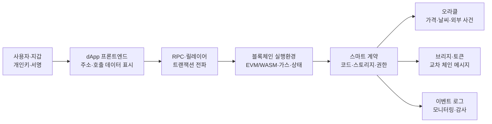
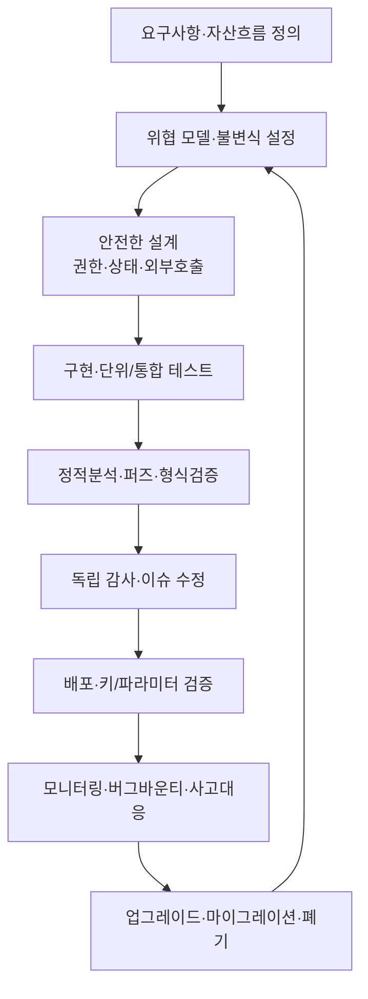

# 스마트 계약(Smart Contract) 보안과 감사 전략

## 1. 개요

> **스마트 계약(Smart Contract)**이란 블록체인 네트워크에 배포되어 정해진 조건과 상태 전이를 결정론적으로 실행하는 프로그램으로, 참여자의 중개 신뢰를 코드와 합의·암호 기술로 대체하는 디지털 계약 실행 장치이다.

스마트 계약은 단순히 블록체인에 저장된 코드를 뜻하지 않는다. 사용자가 서명한 트랜잭션이 호출 데이터와 함께 네트워크에 제출되고, 각 노드가 같은 입력과 같은 현재 상태에서 같은 실행 결과를 계산한 뒤 합의된 상태를 갱신하는 전체 실행 체계다. 따라서 소스 코드가 한 번 배포되면 변경이 어렵고, 작은 논리 오류가 수많은 사용자의 자산·권한·거래 기록에 동시에 영향을 줄 수 있다.

전통적인 웹 서비스는 서버 운영자가 오류를 발견하면 데이터베이스를 복구하거나 코드를 롤백할 수 있다. 반면 스마트 계약은 블록 확정과 복제 때문에 운영자의 임의 수정이 제한되며, 관리자 키·프록시 업그레이드·거버넌스 투표가 별도의 통제 지점이 된다. 즉 “코드가 곧 법”이라는 표현은 코드가 완벽하다는 뜻이 아니라, 코드의 실행 결과가 자동으로 자산과 권리를 이동시키므로 사전 검증의 책임이 훨씬 커진다는 의미로 이해해야 한다.

보안의 범위도 계약 코드에만 한정되지 않는다. 지갑과 키 관리, 오라클과 브리지 같은 외부 의존성, 프론트엔드와 서명 요청, 배포 파이프라인, 운영 모니터링, 긴급 중지와 복구 절차까지 포함해야 한다. 계약 함수가 안전해도 관리자 개인키가 탈취되거나 가격 오라클이 조작되면 경제적 손실이 발생하기 때문이다.

스마트 계약 보안은 기밀성보다 **무결성·자산 안전성·가용성·결정론성**의 비중이 큰 영역이다. 블록체인의 공개 원장 특성상 코드와 호출은 관찰될 수 있고, 공격자는 취약점을 반복적으로 실험한다. 따라서 접근통제, 상태 불변식, 입력 검증, 재진입 방지, 가격 데이터 신뢰성, 가스 상한, 업그레이드 권한을 하나의 위협 모델로 연결해야 한다.

시험 답안에서는 “취약점 목록”만 나열하면 부족하다. 자산이 어디에 보관되고 어떤 함수가 상태를 바꾸며, 외부 호출이 어느 시점에 발생하고, 실패 시 원자적으로 되돌아가는지 설명한 뒤, 설계·구현·검증·배포·운영 단계의 통제를 이어 써야 논술형 답안이 된다.

### 1.1 등장 배경과 필요성

스마트 계약은 중개기관 없이 결제·대출·거래·투표·자산 발행을 자동화하려는 요구에서 발전했다. 참여자가 서로를 신뢰하지 않아도 동일한 원장을 검증하고 동일한 규칙을 실행할 수 있다는 장점은 금융·공급망·디지털 자산 분야에서 매력적이다.

그러나 탈중앙화는 책임의 분산을 의미하지 않는다. 배포된 계약에 버그가 있으면 “관리자가 알아서 고쳐 줄 것”이라는 가정이 성립하지 않을 수 있다. 특히 자산을 보관하는 DeFi 계약은 단일 함수의 가격 계산 오류나 권한 검증 누락이 담보 인출·토큰 발행·거버넌스 장악으로 연쇄될 수 있다.

보안 투자를 비용이 아니라 손실의 비선형성을 줄이는 통제로 보아야 한다. 예를 들어 단위 테스트 몇 개를 추가하는 것만으로는 오라클 조작이나 업그레이드 키 탈취를 검증할 수 없다. 위협 모델과 불변식, 독립 감사, 테스트넷 운영, 제한된 초기 한도, 실시간 탐지를 조합해야 위험을 단계적으로 낮출 수 있다.

### 1.2 핵심 특징

- **결정론적 실행:** 동일한 블록 상태와 입력이면 모든 검증 노드가 같은 결과를 계산해야 하므로 외부 API의 비결정적 응답을 직접 신뢰해서는 안 된다.
- **자산과 코드의 결합:** 계약이 토큰·예치금·권한을 직접 보관할 수 있어 논리 오류가 곧 금전 손실로 이어진다.
- **공개 검증 가능성:** 바이트코드와 트랜잭션이 관찰되므로 공격자도 동일한 테스트와 역공학을 수행할 수 있다.
- **불변성과 제한된 수정:** 신규 버전 배포는 가능해도 기존 상태와 주소의 호환성, 관리자 권한, 마이그레이션을 함께 설계해야 한다.
- **가스와 자원 제약:** 모든 실행은 블록의 가스 한도와 비용 제약을 받으므로 무한 반복·대량 배열 처리·서비스 거부가 위험하다.

## 2. 스마트 계약 구조와 신뢰 경계

스마트 계약 시스템은 사용자 지갑, 애플리케이션 프론트엔드, RPC 노드, 블록체인 실행환경, 외부 오라클과 브리지의 결합으로 이해해야 한다. 각 구성요소가 서로 다른 신뢰 가정을 가지므로 경계를 구분하지 않으면 “체인 위 코드는 안전하지만 체인 밖 입력이 조작되는” 허점을 놓치게 된다.

### 2.1 사용자·지갑·서명 계층

사용자는 지갑에서 계약 호출의 대상 주소, 함수 선택자, 매개변수, 수수료를 확인하고 개인키로 서명한다. 개인키가 노출되면 계약이 안전해도 공격자는 정상 사용자의 권한으로 트랜잭션을 만들 수 있다. 그러므로 하드웨어 지갑, 다중서명, 거래 한도, 출금 주소 화이트리스트는 코드 감사와 별개의 통제다.

프론트엔드는 사용자가 읽기 쉬운 토큰 수량과 목적을 보여 줘야 한다. 악성 웹 페이지가 사용자가 인식하지 못한 무제한 승인이나 권한 위임 서명을 유도하면, 사용자는 정상 계약을 호출한다고 생각하면서 자산 탈취 권한을 넘길 수 있다. 지갑의 원시 calldata와 사람이 읽는 설명 사이의 불일치를 줄이는 것이 중요하다.

서명은 메시지의 의도·체인·계약·만료를 구분해야 한다. 도메인 분리와 nonce를 적용하지 않으면 한 체인에서 만든 서명이 다른 체인이나 다른 함수에서 재사용될 수 있다. EIP-712와 같은 구조화 서명은 사용자 표시와 검증 가능한 필드의 대응을 명확하게 하는 데 도움을 주지만, 적용 자체가 권한 모델을 대신하지는 않는다.

### 2.2 실행·상태·이벤트 계층

계약은 코드와 영속 스토리지를 가진 상태 머신이다. 함수 호출은 상태를 읽고 검증하고 변경하며, 필요하면 다른 계약을 호출한다. 모든 검증 노드가 동일한 결과를 얻어야 하므로 현재 블록 상태·호출자·입력·합의된 블록 정보만을 기반으로 계산해야 한다.

상태 변경은 원자적으로 커밋되거나 실패 시 되돌아가야 한다. 하지만 외부 호출 이후의 후속 코드가 실패하면 재진입이나 부분 상태 변경이 문제를 만들 수 있다. 따라서 상태 효과를 먼저 기록하고 외부 호출을 마지막에 두는 Checks-Effects-Interactions 순서가 기본 설계 원칙이 된다.

이벤트 로그는 사용자 인터페이스와 분석 시스템의 중요한 관찰 수단이지만, 계약 스토리지의 권위 있는 상태와 같지는 않다. 이벤트를 누락하거나 잘못된 인자를 기록하면 인덱서가 실제 상태와 다른 화면을 제공할 수 있다. 자산 이동·권한 변경·업그레이드·긴급 중지에는 의미가 분명한 이벤트를 남기고 모니터링 규칙과 연결해야 한다.

### 2.3 외부 의존성과 신뢰 경계

블록체인은 현실 세계의 가격·배송·신원 정보를 스스로 알 수 없으므로 오라클이 필요하다. 오라클이 단일 거래소 가격이나 단일 운영자에 의존하면 짧은 시간의 조작으로 담보 평가와 청산이 왜곡될 수 있다. 다중 소스, 시간가중가격, 이상치 필터, 가격 신선도 검증을 함께 설계해야 한다.

브리지는 한 체인의 잠금·소각과 다른 체인의 발행·해제를 연결한다. 이 과정에는 검증자 집합, 메시지 순서, 재전송 방지, 자산 공급량 불변식이 관여한다. 브리지 키나 검증자 임계값이 무너지면 단일 계약의 버그보다 훨씬 큰 규모의 손실이 발생할 수 있으므로 별도의 위협 모델이 필요하다.

RPC와 프론트엔드는 사용자가 직접 통제하지 않는 인프라다. 악의적 RPC가 잔액·가스·시뮬레이션 결과를 왜곡하거나, 프론트엔드가 다른 주소로 호출을 구성할 수 있다. TLS, 다중 RPC 비교, 배포 산출물 해시 검증, 프론트엔드 무결성 보호가 온체인 통제의 보완책이다.

## 3. 생명주기와 보안 검증 절차

스마트 계약은 요구사항 정의부터 폐기·마이그레이션까지 긴 생명주기를 가진다. 감사는 배포 직전의 일회성 산출물이 아니라, 설계 불변식과 테스트가 코드·배포·운영으로 이어지는 지속적인 통제 체계여야 한다.

### 3.1 요구사항과 위협 모델

첫 단계는 기능 목록이 아니라 자산 흐름을 그리는 것이다. 예치금, 담보, 보상 토큰, 관리자 권한, 가격 데이터, 교차 체인 메시지를 식별하고 각 자산이 어느 주소와 함수 사이를 이동하는지 표시한다. 그 결과 “누가 무엇을 언제 얼마까지 바꿀 수 있는가”라는 보안 질문을 명확히 할 수 있다.

위협 모델에는 외부 사용자, 악성 계약, 권한을 가진 운영자, 오라클 제공자, 검증자와 브리지 중계자를 포함한다. 공격자가 한 번의 트랜잭션에서 여러 함수를 호출하거나, 같은 블록 안에서 가격을 움직였다가 원상복구하거나, 실패가 발생하는 경계에서 가스와 반환값을 조작할 수 있다고 가정해야 한다.

불변식은 테스트와 모니터링의 공통 언어다. 예를 들어 “총 발행량은 소각과 발행의 순합과 일치한다”, “담보가치보다 대출액이 클 수 없다”, “pause 상태에서는 출금 외의 변경 함수가 실행되지 않는다”, “한 nonce는 한 번만 소비된다” 같은 명제를 수식·검사 코드·경보 규칙으로 연결한다.

### 3.2 안전한 구현과 테스트

구현에서는 입력 범위와 권한을 먼저 검증하고, 상태 변경과 외부 호출의 순서를 명시한다. `msg.sender`와 `tx.origin`을 혼동하지 않고, 주소가 계약인지 확인해야 하는 함수에는 코드 존재 여부와 인터페이스 검증을 둔다. 정수 타입의 범위, 단위(decimals), 반올림 방향, 0 나눗셈도 명시적으로 다룬다.

단위 테스트는 정상 시나리오만으로 충분하지 않다. 권한 없는 호출, 0·최대값·경계 시간, 실패한 토큰 반환, 재진입 콜백, 오라클 지연, 수수료 부족, 체인 재구성 가능성을 테스트해야 한다. 하나의 함수가 통과하는지보다 여러 호출을 조합한 상태 전이가 항상 불변식을 보존하는지가 중요하다.

퍼즈 테스트와 불변식 기반 테스트는 입력 공간을 넓힌다. 예를 들어 예치·대출·상환·청산을 임의 순서로 수천 번 조합하면서 총 자산과 부채의 보존 여부를 검사하면 수동으로 예상하기 어려운 순서 의존성 오류를 찾을 수 있다. 테스트가 실패하면 단순히 시드만 저장하지 말고, 재현 가능한 트랜잭션 시퀀스와 블록 상태를 보존해야 한다.

### 3.3 정적분석·형식검증·독립 감사

정적분석은 위험한 외부 호출, 재진입 가능성, 접근통제 누락, 사용되지 않는 반환값 같은 패턴을 빠르게 찾는다. 그러나 도구의 규칙을 통과했다고 경제적 설계가 안전해지는 것은 아니다. “담보비율 계산이 의도한 정책과 맞는가”는 단순한 구문 패턴보다 도메인 불변식의 문제다.

형식검증은 상태 전이와 불변식을 수학적 명제로 표현해 모든 허용 입력에 대한 성질을 증명하는 접근이다. 핵심 금고 모듈이나 토큰 발행량 보존처럼 범위를 제한할 수 있는 부분에 효과적이지만, 외부 오라클·거버넌스·경제적 행위자의 가정이 잘못되면 증명 결과의 적용 범위도 제한된다.

독립 감사는 개발팀이 놓친 가정과 공격 경로를 외부 시각으로 검토한다. 감사 보고서는 발견사항의 심각도만 나열하지 말고 영향 자산, 재현 절차, 수정 커밋, 회귀 테스트, 잔여 위험, 운영 권고를 포함해야 한다. 감사 후 코드가 변경되었다면 변경 범위를 다시 비교하고, 핵심 변경은 재감사를 받아야 한다.

## 4. 주요 취약점과 대응 원리

### 4.1 재진입 공격

재진입은 계약이 외부 주소를 호출한 동안 상대 계약이 원래 함수를 다시 호출해 상태가 아직 갱신되지 않은 틈을 이용하는 공격이다. 예치금 잔액을 차감하기 전에 출금을 보내면 악성 수신자 콜백이 같은 잔액을 다시 인출할 수 있다. 핵심 원인은 외부 코드가 실행되는 동안 내부 상태가 중간 상태에 머무는 것이다.

대응은 Checks-Effects-Interactions 순서, 재진입 잠금, 출금 한도와 인출 큐의 조합으로 설계한다. 잔액을 먼저 차감하고 외부 호출을 마지막에 배치하면 동일한 트랜잭션에서 재호출해도 인출 가능한 잔액이 줄어든다. 단, 잠금 하나만 추가하고 복잡한 상호 계약 호출을 방치하면 교차 함수 재진입이나 읽기 전용 재진입을 놓칠 수 있다.

토큰 표준과 수신자 구현에 따라 호출 방식이 다를 수 있으므로 반환값을 확인하고, 예상치 못한 토큰의 훅(hook) 호출을 신뢰하지 않아야 한다. 출금 함수가 토큰 전송과 이벤트 기록을 어떤 순서로 수행하는지, 실패 시 모두 되돌아가는지를 테스트해야 한다.

### 4.2 접근통제와 권한 집중

`onlyOwner` 같은 단순한 관리자 검사는 권한 주체가 명확할 때 유용하지만, 관리자 키 하나가 업그레이드·민팅·자금 이동을 모두 수행하면 단일 실패점이 된다. 초기화 함수가 한 번만 실행되는지, 프록시와 구현 계약의 관리자 주소가 같은지, 권한 변경 이벤트가 발생하는지 검토해야 한다.

고위험 작업은 다중서명과 시간 지연을 적용해 한 키의 탈취가 즉시 자산 이동으로 이어지지 않게 한다. 역할 기반 접근통제에서는 역할 부여·회수 권한을 별도로 분리하고, 운영자·업그레이더·긴급 중지자의 권한을 최소화한다. 권한을 분리하면 운영 복잡성은 늘지만 침해 범위와 내부 오남용 가능성을 줄일 수 있다.

긴급 중지 기능도 만능이 아니다. 모든 기능을 멈추면 정상 사용자의 출금까지 막힐 수 있으므로, pause 시 허용할 최소 기능과 해제 절차를 사전에 정의해야 한다. 중지 키가 탈취되면 서비스 거부가 될 수 있어 다중서명, 승인 임계값, 자동 만료를 함께 고려한다.

### 4.3 오라클·가격·경제적 공격

계약이 담보가치나 교환비율을 오라클에서 읽는다면 가격의 정확성뿐 아니라 신선도와 조작 비용을 검토해야 한다. 단일 풀의 순간 가격을 그대로 사용하면 공격자가 큰 거래로 가격을 움직인 직후 대출·청산을 수행하고, 다시 가격을 되돌리는 방식으로 이익을 얻을 수 있다.

다중 데이터 소스와 시간가중가격은 단일 시점 조작의 효과를 완화한다. 가격 변동 상한, 최대 대출 한도, 유동성 기준, stale price 차단, 비정상 가격 fallback을 함께 두면 오라클 장애와 조작의 영향을 제한할 수 있다. 다만 지연이 큰 가격을 사용하면 정상적인 급락에서도 청산이 늦어지는 트레이드오프가 생긴다.

플래시 론은 한 트랜잭션 안에서 대규모 자금을 빌리고 상환할 수 있게 하므로, 자본이 없던 공격자도 가격·거버넌스·담보 계산의 취약점을 증폭할 수 있다. 대응은 플래시 론 자체를 금지하는 것보다, 한 블록의 순간 상태만으로 중요한 의사결정을 하지 않고 시간 지연·평균 가격·투표권 스냅샷·유동성 한도를 적용하는 것이다.

### 4.4 정수·정밀도·단위 오류

토큰마다 소수점 자릿수와 금액 단위가 다르므로 `wei`, 토큰 최소 단위, 달러 가격, 이자율의 스케일을 혼동하면 자산이 과다 발행되거나 청산이 오작동한다. 두 값을 곱한 뒤 나누는 순서, 반올림 방향, 중간값의 오버플로 가능성을 분석해야 한다.

현대 언어의 산술 검사 기능이 있어도 논리적 정밀도 오류까지 막아 주지는 않는다. 예를 들어 100을 3으로 나눌 때 하향 반올림을 반복하면 소액이 시스템에 누적될 수 있고, 특정 이용자에게 유리한 방향으로 반올림하면 차익거래가 가능해진다. 금액·비율·시간의 단위를 타입 또는 라이브러리로 분리하는 것이 안전하다.

### 4.5 외부 호출·delegatecall·프록시

외부 계약의 반환값과 동작을 무조건 신뢰하면 악성 토큰이나 호환되지 않는 구현에 의해 상태가 깨질 수 있다. 호출 성공 여부, 반환 데이터 형식, 가스 전달, 재진입 가능성을 명시적으로 확인해야 한다. 저수준 `call`은 유연하지만 오류를 숨길 수 있어 래퍼와 검증 코드를 함께 둔다.

delegatecall은 호출자의 스토리지와 권한 문맥에서 다른 코드를 실행한다. 프록시 업그레이드에 유용하지만 스토리지 슬롯 충돌, 구현 주소 변경 권한, 초기화 누락, 잘못된 함수 선택자 때문에 치명적 사고가 발생할 수 있다. 구현 계약의 저장 레이아웃을 보존하고 업그레이드 전후 상태 마이그레이션을 테스트해야 한다.

프록시의 업그레이드 가능성은 버그 수정이라는 이점과 불변성 약화라는 위험을 동시에 가진다. 사용자는 계약이 영구적으로 고정되었는지, 누가 업그레이드할 수 있는지, 지연과 공지를 거치는지 확인할 수 있어야 한다. 업그레이드 권한을 숨기면 기술적 신뢰가 거버넌스 신뢰로 바뀌지 않는다.

### 4.6 가스·서비스 거부와 프런트러닝

배열의 길이를 외부 입력에 맡긴 반복문은 가스 한도를 초과해 함수가 영원히 실패하게 만들 수 있다. 사용자 수가 늘면서 보상 분배·청산·투표 집계가 한 트랜잭션에 들어가지 않는 상황이 대표적이다. 페이지네이션, pull 방식 청구, 작업 분할, 상한과 탈출 경로를 설계해야 한다.

공개 메모리풀의 트랜잭션은 채굴·검증 순서와 가격 조작에 노출될 수 있다. 공격자가 사용자의 거래 앞뒤에 거래를 끼워 넣어 가격 차익을 얻는 샌드위치 공격, 승인 거래와 실행 거래 사이의 front-running이 발생할 수 있다. 슬리피지 한도, deadline, 커밋-공개 방식, 개인 전파 경로, 최소 수령량 검증으로 피해를 제한한다.

서비스 거부는 단순히 함수가 느린 것만 뜻하지 않는다. 공격자가 저장소를 비정상적으로 크게 만들어 후속 처리 비용을 높이거나, 특정 조건에서만 실행 가능한 청산을 막을 수도 있다. 상태 크기·호출 비용·실패 시 복구 가능성을 운영 지표로 관리해야 한다.

### 4.7 서명·재생·피싱

오프체인 서명은 가스 비용을 줄이고 주문·허가를 편리하게 하지만, 메시지의 도메인·체인 ID·계약 주소·nonce·만료·행위 목적이 분명하지 않으면 재생 공격의 재료가 된다. 서명 검증 함수는 빈 서명·잘못된 길이·서명자 복구 실패를 명확히 거부해야 한다.

무제한 `approve`와 `permit`은 사용자의 편의를 높이지만, 악성 계약에 계속 자산을 이동할 권한을 줄 수 있다. 권한 만료와 최소 허용량, 사용 후 회수, 지갑 화면의 사람 중심 설명을 적용해야 한다. 소셜 엔지니어링을 코드만으로 해결할 수 없으므로 사용자가 서명하려는 효과를 검증하는 UI도 보안 통제다.

## 5. 비교와 적용 사례

### 5.1 스마트 계약과 전통적 서버 애플리케이션 비교

두 구조 모두 입력 검증·권한·테스트가 필요하지만, 장애와 변경의 통제 방식이 다르다. 서버는 운영자가 빠르게 패치할 수 있는 대신 운영자와 데이터베이스를 신뢰해야 한다. 스마트 계약은 실행 결과의 독립 검증과 투명성이 강한 대신 패치 창이 짧고 배포 후 상태 호환성이 어렵다.

| 구분 | 스마트 계약 | 전통적 서버·DB | 실무적 함의 |
|---|---|---|---|
| 실행 주체 | 다수 검증 노드 | 운영 조직의 서버 | 결정론성과 운영 신뢰를 구분 |
| 변경 | 불변 또는 통제된 업그레이드 | 패치·롤백 가능 | 사전 테스트와 업그레이드 거버넌스 강화 |
| 데이터 | 공개 원장·상태·로그 | 접근통제된 DB | 기밀성은 별도 암호화·오프체인 설계 필요 |
| 비용 | 트랜잭션 가스·블록 자원 | 서버·DB 자원 | 반복·대량 작업을 체인 밖으로 분리 |
| 장애 대응 | pause·마이그레이션·거버넌스 | 백업·복구·롤백 | 사전 정의된 복구 시나리오 필요 |

따라서 온체인에는 합의가 필요한 최소 상태와 규칙만 두고, 대용량 파일·개인정보·복잡한 분석은 오프체인에 두는 하이브리드 구조가 현실적이다. 오프체인 데이터를 쓸 때는 해시·Merkle proof·서명·오라클로 결과의 무결성을 연결해야 하며, 단순히 “DB에 저장하고 주소만 기록”하는 것은 검증 가능한 증거가 부족할 수 있다.

### 5.2 사례 1: 담보 대출 프로토콜

담보 대출 계약은 예치, 담보가치 산정, 대출, 상환, 청산의 상태를 관리한다. 예를 들어 담보가치 1,000만 원, 안전 담보비율 70%라면 이론상 대출 한도는 700만 원이지만, 가격 급락과 오라클 지연을 고려해 실제 한도를 600만 원으로 제한할 수 있다.

공격자는 가격 풀의 유동성이 얕은 순간 플래시 론으로 가격을 조작하고, 조작된 가격으로 과대 대출을 받은 뒤 가격을 되돌릴 수 있다. 따라서 단일 풀 가격 대신 여러 소스와 시간가중가격을 사용하고, 가격 편차가 임계치를 넘으면 신규 대출과 청산을 제한하는 회로차단기를 둔다.

청산 함수는 누구나 호출할 수 있어야 신속한 복구가 가능하지만, 청산 보상과 가스비가 부족하면 청산자가 참여하지 않을 수 있다. 청산을 한 트랜잭션에 모두 넣지 말고 포지션 단위로 분할하며, 악성 토큰의 콜백·재진입·반올림 손실을 포함한 불변식 테스트를 수행한다.

### 5.3 사례 2: NFT 거래소와 승인 권한

NFT 거래소는 판매자가 자산을 보유하고 있는지, 가격과 만료 시각이 유효한지, 구매자의 서명이 특정 체인과 계약에 묶였는지를 확인해야 한다. 판매 서명에 토큰 ID·수량·가격·수수료 수취인·nonce·deadline을 넣지 않으면 동일 서명이 다른 가격이나 다른 체인에서 재사용될 수 있다.

구매 거래가 공개 메모리풀에 오래 머무르면 공격자가 판매자와 구매자의 거래 순서를 바꾸거나, 동일 NFT를 더 높은 가스 가격으로 선점할 수 있다. 계약은 서명 nonce를 한 번만 소비하고, 체인 ID와 계약 주소를 EIP-712 도메인에 포함하며, 가격과 수수료의 상한을 검증해야 한다.

사용자 경험 측면에서는 “승인”과 “구매”를 분리해 무제한 권한을 남기지 않도록 하고, 거래 완료 후 승인 회수 또는 기간 제한을 제공한다. 프론트엔드가 표시하는 컬렉션 주소와 실제 호출 주소가 일치하는지 배포 파이프라인에서 자동 검증하는 것도 중요하다.

### 5.4 사례 3: 업그레이드 가능한 DAO

DAO가 투표로 구현 계약을 교체하는 구조라면, 업그레이드 권한과 투표권 산정이 핵심 위험이 된다. 공격자가 한 블록에서 대량의 투표권을 빌려 제안에 참여하거나, 투표 종료 직전에 토큰을 이동해 결과를 바꾸는 경우를 막기 위해 스냅샷 블록과 정족수, 투표 지연을 사용한다.

업그레이드 제안에는 대상 주소·함수 호출·변경 저장 레이아웃·권한 변경을 사람이 읽을 수 있게 공개하고, 투표 통과 후에도 timelock을 두어 사용자와 모니터링 시스템이 이탈하거나 대응할 시간을 확보한다. 긴급 중지와 정상 업그레이드의 권한을 분리하면 빠른 사고 대응과 장기 거버넌스의 독립성을 함께 확보할 수 있다.

프록시 구현을 교체할 때는 기존 저장소 슬롯의 의미가 보존되는지, 초기화 함수가 재실행되지 않는지, 새 구현이 관리자 권한을 우회하지 않는지 검증한다. 이를 소스 코드 diff만으로 판단하지 말고 테스트넷 상태 마이그레이션과 스토리지 레이아웃 검사로 확인해야 한다.

## 6. 심화 — 표준 기반 감사 체계와 답안 구성

스마트 계약 감사는 자동화 도구의 경고 수를 줄이는 작업이 아니라, 비즈니스 규칙·코드·배포 권한·운영 증적을 연결하는 보증 활동이다. OWASP Smart Contract Security Verification Standard(SCSVS)는 EVM 기반 계약을 대상으로 설계·코드·거버넌스·권한·통신·암호·오라클·블록 자원·브리지·DeFi 등 영역별 검증 관점을 제공하므로, 프로젝트의 통제 목록을 구조화하는 기준으로 활용할 수 있다.

실무에서는 먼저 자산 등급과 최대 손실을 정하고 감사 범위를 결정한다. 단순 포인트 계약과 수억 원 상당의 담보 금고를 동일한 깊이로 검토할 수 없으므로, 고위험 자산 보관·민팅·업그레이드·브리지 경로에 검증 자원을 집중한다. 범위를 축소할 때는 제외한 코드와 가정을 명시해 “감사 완료”라는 표현이 전체 시스템 안전을 의미하지 않도록 해야 한다.

자동화 파이프라인은 컴파일러 경고, 포맷·린트, 정적분석, 단위 테스트, 퍼즈·불변식 테스트, 가스 회귀, 의존성 고정, 소스 검증을 단계적으로 실행한다. CI에서 통과하더라도 배포 직전 주소·체인 ID·초기 파라미터·권한·프록시 구현 해시를 다시 확인해야 한다. 배포 스크립트가 다른 네트워크를 가리키는 단순한 실수도 금전 사고가 될 수 있다.

감사 결과는 심각도와 함께 공격 조건, 영향 범위, 재현 테스트, 수정 상태, 잔여 위험을 기록한다. 발견사항을 수정한 뒤 동일한 테스트를 회귀 실행하고, 코드가 아니라 설정·오라클·프론트엔드가 바뀐 경우에도 영향 분석을 갱신한다. 버그바운티와 온체인 모니터링은 감사가 끝난 뒤 새로 발생하는 취약한 상호작용을 보완한다.

기술사 답안은 다음 순서로 구성하면 논리성이 높다. 첫째, 스마트 계약의 정의와 불변성·공개성·가스 제약을 배경으로 제시한다. 둘째, 지갑-프론트엔드-RPC-실행환경-오라클의 구조도를 그려 신뢰 경계를 구분한다. 셋째, 재진입·권한·오라클·산술·가스·서명 취약점을 원인-공격-대응으로 서술한다.

넷째, 요구사항·위협 모델·불변식·테스트·감사·배포·모니터링의 생명주기와 비교 사례를 연결한다. 마지막으로 자산 한도, 다중서명·timelock, 암호·키 관리, pause·복구, 오프체인 개인정보 보호를 고려사항으로 정리하고 한 줄 결론으로 마무리한다. 이때 취약점 이름만 열거하기보다 “왜 이 구조에서 발생하고 어떤 통제로 잔여 위험을 줄이는가”를 설명해야 한다.

## 7. 고려사항 및 시사점

- **코드 불변성과 업그레이드 거버넌스:** 업그레이드 가능성은 패치와 기능 확장에 유리하지만, 관리자 키와 프록시가 새로운 신뢰 주체가 된다. 다중서명·timelock·변경 공지·롤백 또는 마이그레이션 계획을 적용하고, 사용자가 현재 구현 주소와 권한을 검증할 수 있게 공개해야 한다.

- **최소권한과 키 관리:** 소유자 하나에 민팅·출금·업그레이드 권한을 집중하지 말고 역할을 분리한다. 하드웨어 보관, 다중서명, 키 회전, 비상 폐기, 서명자 교대와 감사 로그를 운영정책으로 관리해야 하며, 계약 감사가 개인키 관리 실패를 보상해 주지 않는다는 점을 명확히 해야 한다.

- **경제적 안전성과 한도:** 기술적으로 재진입이 없어도 담보비율·수수료·토큰 공급·청산 인센티브의 경제 설계가 잘못되면 공격이 가능하다. 초기 TVL·민팅량·출금량·가격 편차·단일 거래 한도를 보수적으로 두고, 사용량과 유동성이 늘어날 때 단계적으로 상향해야 한다.

- **오라클·브리지의 독립 검증:** 외부 데이터와 교차 체인 메시지는 계약 내부에서 생성되지 않으므로 다중 서명자·다중 소스·신선도·재전송 방지·공급량 불변식을 검증한다. 브리지의 신뢰 가정이 서비스의 탈중앙화 수준과 일치하는지, 검증자 임계값이 현실적인 공격 비용을 제공하는지 평가한다.

- **운영 모니터링과 대응:** 관리자 권한 변경, 대량 인출, 비정상 가격, 반복 실패, 신규 구현 배포, 급격한 가스 사용을 실시간 감시한다. 경보만 만들지 말고 pause 승인자, 사용자 공지, 출금 제한, 포렌식, 증적 보존, 재개 기준을 포함한 사고 대응 훈련을 수행해야 한다.

- **개인정보와 규제 경계:** 공개 원장에 개인 식별정보를 직접 기록하면 삭제·정정·접근통제 요구와 충돌할 수 있다. 개인정보는 오프체인에 최소 보관하고 온체인에는 검증 가능한 해시·증명·참조만 두며, 키 분실·동의 철회·법적 보존 요청에 대한 운영 절차를 별도로 마련한다.

- **암호 민첩성과 공급망:** 컴파일러 버전, 라이브러리, 배포 플러그인, 오픈소스 의존성의 재현성을 확보하고 소스·바이트코드·배포 산출물의 해시를 기록한다. 암호 알고리즘과 지갑 서명 방식이 바뀌어도 단계적으로 전환할 수 있도록 키·도메인·nonce 체계를 설계한다.

- **잔여 위험의 투명성:** 감사 보고서가 존재한다는 사실이 무위험을 뜻하지 않는다. 감사 시점·커밋·범위·제외사항·미해결 항목·관리자 권한·오라클 가정을 사용자에게 공개하고, 시스템 변경 때마다 위험 수용 여부를 재평가해야 한다.

## 참고자료

- OWASP Smart Contract Security Verification Standard — https://scs.owasp.org/SCSVS/
- OWASP Smart Contract Security Testing Guide — https://owasp.org/www-project-smart-contract-security-testing-guide/
- OWASP Smart Contract Top 10 — https://owasp.org/www-project-smart-contract-top-10/
- Ethereum Foundation, Smart contract security — https://ethereum.org/en/developers/docs/smart-contracts/security/
- Solidity Documentation, Security Considerations — https://docs.soliditylang.org/en/latest/security-considerations.html
- Ethereum Improvement Proposal 712, Typed structured data hashing and signing — https://eips.ethereum.org/EIPS/eip-712

---

> **한 줄 요약**: 스마트 계약 보안은 코드 취약점만 고치는 일이 아니라 자산 흐름·권한·오라클·키·업그레이드·운영을 불변식과 감사 생명주기로 통제해 결정론적 실행의 신뢰를 지키는 종합 보안 설계이다.
