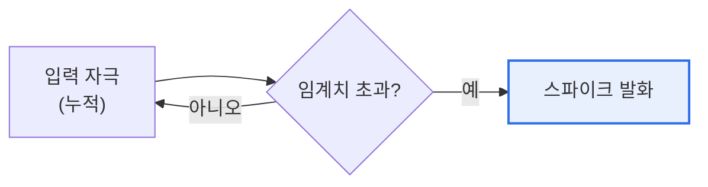

# 스파이킹 신경망(SNN, Spiking Neural Network)

## 1. 개요

### 가. 정의
> **SNN**은 생물학적 뉴런이 **전기 신호(스파이크, Spike)를 특정 시점에 발화(firing)해 정보를 전달**하는 방식을 모방한 3세대 신경망으로, 시간 정보를 반영하는 이벤트 기반 신경망이다.

SNN이 주목받는 근본 이유는 '**뇌를 더 사실적으로 닮아 저전력으로 동작한다**'는 데 있다. 기존 인공신경망(2세대, ANN/DNN)은 뉴런이 매 순간 연속적인 실수 값을 계산·전달한다. 정확하지만, 값이 없을 때도 계산이 돌아 전력을 많이 쓴다. 반면 실제 뇌의 뉴런은 평소엔 조용히 있다가 자극이 임계치를 넘을 때만 순간적으로 스파이크를 쏜다. SNN은 이 방식을 모방해, **필요할 때만(스파이크가 있을 때만) 계산**하는 이벤트 기반으로 동작한다. 그 결과 전력 소모가 극적으로 낮아진다. 또 스파이크가 '언제' 발생했는가라는 시간 정보 자체로 데이터를 표현하므로, 시계열·감각 신호 처리에 자연스럽다. 다만 스파이크는 불연속(0 아니면 1)이라 기존의 미분 기반 학습(역전파)을 그대로 쓰기 어려운 것이 최대 난제다. 뉴로모픽 하드웨어와 결합해 초저전력 AI를 실현하는 것이 SNN의 지향점이다.

### 나. 세대 비교
| 세대 | 신경망 |
|---|---|
| **1세대** | 퍼셉트론(이진 출력) |
| **2세대** | ANN/DNN(연속 활성값, 역전파) |
| **3세대** | **SNN**(스파이크·시간 기반, 저전력) |

## 2. 동작 원리

뉴런은 입력 신호를 막전위(membrane potential)에 누적하다가, 임계치를 넘으면 스파이크를 발화하고 전위를 초기화한다(Leaky Integrate-and-Fire 모델이 대표적). 정보는 스파이크의 **발생 시점·빈도(rate/temporal coding)** 로 부호화된다.

## 3. 특징

| 특징 | 내용 |
|---|---|
| **이벤트 기반** | 스파이크 발생 시에만 계산 → 저전력 |
| **시간 정보** | 발화 타이밍으로 정보 표현 |
| **생물학적 유사성** | 실제 뉴런 동작에 근접 |
| **학습 난제** | 불연속 스파이크로 역전파 적용 곤란 |

## 4. 고려사항 및 시사점

1. **뉴로모픽 하드웨어와 결합**해야 진가를 발휘한다. SNN의 저전력 이점은 인텔 Loihi·IBM TrueNorth 같은 뉴로모픽 칩 위에서 실현되므로, 알고리즘과 하드웨어를 함께 설계해야 한다. [[neuromorphic]]
2. **학습 방법이 핵심 과제**다. 스파이크의 불연속성 때문에 surrogate gradient, STDP(발화 시점 의존 가소성), ANN-to-SNN 변환 등 전용 학습 기법 연구가 활발하다.
3. **엣지·저전력 AI의 유망 기술**이다. 배터리로 구동되는 IoT·웨어러블·로봇 등 전력 제약이 큰 환경에서 실시간 저전력 추론을 가능하게 해, 온디바이스 AI의 한 축으로 기대된다. [[on-device-ai]]

---

> **한 줄 요약**: SNN은 *뉴런의 스파이크 발화를 모방한 3세대 이벤트 기반 신경망* 으로, 필요할 때만 계산해 초저전력이며 시간 정보를 표현하지만 불연속 특성상 학습이 어려워 뉴로모픽 하드웨어·전용 학습기법과 함께 발전한다.
