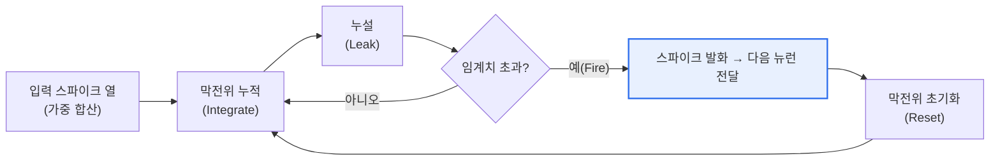
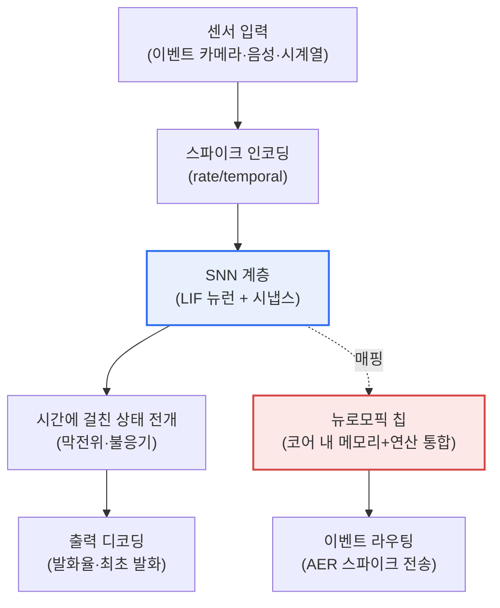

# 스파이킹 신경망(SNN, Spiking Neural Network)

## 1. 개요

### 가. 정의
> **SNN(Spiking Neural Network)** 은 생물학적 뉴런이 **전기 신호(스파이크, Spike)를 특정 시점에 발화(firing)해 정보를 전달**하는 방식을 모방한 3세대 신경망으로, 값의 크기가 아니라 스파이크가 **언제·얼마나 자주** 발생하는가라는 시간 정보로 데이터를 표현하는 이벤트 기반(event-driven) 신경망이다.

SNN이 주목받는 근본 이유는 '**뇌를 더 사실적으로 닮아 저전력으로 동작한다**'는 데 있다. 기존 인공신경망(2세대, ANN/DNN)은 뉴런이 매 순간 연속적인 실수 값을 계산·전달한다. 정확하지만, 입력이 0에 가까울 때도 곱셈-누산(MAC) 연산이 빠짐없이 돌아가므로 전력을 많이 쓴다. 대규모 언어모델의 학습·추론 비용이 데이터센터 전력 문제로까지 번진 지금, 이 '항상 켜져 있는 계산' 구조는 확장의 근본 한계로 지목된다.

반면 실제 사람의 뇌는 약 860억 개의 뉴런을 가지고도 20W 안팎, 즉 백열전구 하나보다 적은 전력으로 동작한다. 그 비결의 하나가 **희소성(sparsity)** 이다. 뉴런은 평소엔 조용히 있다가 자극이 임계치를 넘을 때만 순간적으로 스파이크를 쏘고, 나머지 시간에는 사실상 계산을 하지 않는다. SNN은 이 방식을 모방해, **스파이크가 있을 때만 계산**하는 이벤트 기반으로 동작한다. 그 결과, 입력의 대부분이 '무발화(no spike)'인 상황에서 전력 소모가 극적으로 낮아진다.

또한 스파이크가 '언제' 발생했는가라는 시간 자체가 정보이므로, 시계열·음성·이벤트 카메라 신호처럼 시간축이 본질인 데이터를 자연스럽게 다룰 수 있다. 다만 스파이크는 불연속(0 아니면 1)이라 기울기가 대부분 0이거나 정의되지 않아, 2세대 신경망을 떠받쳐 온 미분 기반 학습(역전파, Backpropagation)을 그대로 쓰기 어렵다는 것이 최대 난제다. 결국 SNN은 **뉴로모픽(neuromorphic) 하드웨어와 결합해 초저전력 AI를 실현**하는 것을 지향점으로 삼되, 그 잠재력을 실제 정확도로 바꾸는 학습 기법이 성패를 가르는 기술이다.

### 나. 등장 배경과 필요성
2세대 딥러닝이 이미지·언어에서 인간을 능가하는 성능을 내면서 모델과 데이터는 폭발적으로 커졌고, 그 대가로 전력·발열·비용이 함께 폭증했다. 클라우드에서는 냉각·전력이, 엣지(스마트폰·웨어러블·드론·로봇)에서는 배터리가 병목이 된다. '더 큰 모델'만으로는 감당할 수 없는 이 지점에서, 계산 패러다임 자체를 바꿔 **에너지 효율(연산당 소비 전력)** 을 끌어올리려는 시도가 SNN·뉴로모픽 연구의 배경이다. 자율주행·산업 IoT·항상 켜져 있는(always-on) 음성 감지처럼 **실시간·저지연·저전력**이 동시에 요구되는 응용이 늘면서, SNN은 학문적 호기심을 넘어 실용 기술로 재조명되고 있다.

### 다. 세대 비교
아래 표는 신경망의 세대를 요약하지만, 세대 구분의 핵심은 '무엇으로 정보를 표현하느냐'의 변화라는 점을 문장으로 짚어둘 필요가 있다. 1세대 퍼셉트론은 계단 함수로 0/1만 출력해 표현력이 제한적이었고, 2세대는 연속적인 활성값과 역전파로 표현력·학습성을 폭발적으로 끌어올렸지만 그 대가로 상시 계산의 부담을 안았다. 3세대 SNN은 다시 이산적인 스파이크로 돌아가되, 이번에는 '시간'이라는 축을 더해 표현력을 확보하려 한다는 점에서 단순한 회귀가 아니라 새로운 절충이다.

| 세대 | 신경망 | 정보 표현 | 학습 | 특징 |
|---|---|---|---|---|
| **1세대** | 퍼셉트론 | 이진 출력(계단) | 제한적 | 선형 분리만 가능 |
| **2세대** | ANN/DNN | 연속 활성값 | 역전파 | 고성능·상시 계산·고전력 |
| **3세대** | **SNN** | **스파이크·시간** | 대리기울기·STDP 등 | 이벤트 기반·저전력·학습 난제 |

## 2. 뉴런 모델과 동작 원리

```mermaid
flowchart LR
  IN["입력 스파이크 열<br/>(가중 합산)"] --> ACC["막전위 누적<br/>(Integrate)"]
  ACC --> LEAK["누설<br/>(Leak)"]
  LEAK --> T{"임계치 초과?"}
  T -->|"예(Fire)"| SPK["스파이크 발화 → 다음 뉴런 전달"]
  SPK --> RST["막전위 초기화<br/>(Reset)"]
  RST --> ACC
  T -->|아니오| ACC
  style SPK fill:#e8f0fe,stroke:#2f6fed,stroke-width:2px
```

SNN 뉴런의 동작은 '**모아서(Integrate), 새고(Leak), 쏘고(Fire), 되돌린다(Reset)**'는 네 단계로 요약된다. 가장 널리 쓰이는 것이 **LIF(Leaky Integrate-and-Fire)** 모델이다. 뉴런은 앞 뉴런에서 들어온 스파이크에 시냅스 가중치를 곱해 막전위(membrane potential)에 계속 더한다(Integrate). 이때 막전위는 시간이 지나면 조금씩 새어 나가 기준값으로 돌아가려 하는데(Leak), 이 누설항이 있어야 '오래전 입력'과 '방금 입력'을 구분하는 시간적 필터가 생긴다. 누설이 없다면 언젠가는 무조건 발화하게 되어 시간 정보가 사라진다.

막전위가 임계치(threshold)를 넘는 순간 뉴런은 스파이크 한 발을 쏘고(Fire) 막전위를 초기 값으로 되돌린다(Reset). 발화 직후 잠시 어떤 입력에도 반응하지 않는 불응기(refractory period)를 두기도 한다. 이 단순한 규칙이 반복되면서, 강한 입력이 몰릴수록 스파이크가 촘촘히, 약하면 드물게 발생한다. 즉 **입력의 세기가 발화의 빈도·타이밍으로 자연스럽게 부호화**된다.

정보를 스파이크로 표현하는 방식(부호화, coding)은 크게 둘로 나뉜다. **레이트 코딩(rate coding)** 은 일정 시간 창 안의 스파이크 개수(발화율)로 값을 표현한다. 구현이 쉽고 잡음에 강하지만, 충분한 개수를 세려면 시간이 걸려 지연·전력에서 손해를 본다. **템포럴 코딩(temporal coding)** 은 '첫 스파이크가 얼마나 빨리 왔는가'처럼 발화 시점 자체에 정보를 싣는다. 스파이크 몇 개로도 많은 정보를 담아 빠르고 효율적이지만, 타이밍 잡음에 민감하고 학습이 까다롭다. 실제 시스템은 두 방식을 문제 특성에 맞게 절충한다. LIF보다 생물학적으로 정교한 Izhikevich·Hodgkin-Huxley 모델도 있으나, 계산량이 커서 대규모 SNN에서는 단순한 LIF 계열이 주로 선택된다.

## 3. 전체 구조와 뉴로모픽 아키텍처

```mermaid
flowchart TD
  A["센서 입력<br/>(이벤트 카메라·음성·시계열)"] --> B["스파이크 인코딩<br/>(rate/temporal)"]
  B --> C["SNN 계층<br/>(LIF 뉴런 + 시냅스)"]
  C --> D["시간에 걸친 상태 전개<br/>(막전위·불응기)"]
  D --> E["출력 디코딩<br/>(발화율·최초 발화)"]
  C -. 매핑 .-> H["뉴로모픽 칩<br/>(코어 내 메모리+연산 통합)"]
  H --> I["이벤트 라우팅<br/>(AER 스파이크 전송)"]
  style C fill:#e8f0fe,stroke:#2f6fed,stroke-width:2px
  style H fill:#fde8e8,stroke:#d64545,stroke-width:2px
```

SNN 시스템은 **입력을 스파이크로 바꾸는 인코딩 → SNN 계층에서의 시간적 처리 → 결과를 값으로 되돌리는 디코딩**의 흐름을 갖는다. 앞단의 인코딩이 중요한 이유는, 세상의 데이터 대부분이 실수 값(픽셀 밝기, 오디오 진폭)이기 때문이다. 이를 레이트/템포럴 방식으로 스파이크 열로 변환해야 SNN이 처리할 수 있다. 예외적으로 **이벤트 카메라(DVS, Dynamic Vision Sensor)** 는 픽셀 밝기 변화가 일어난 순간에만 이벤트를 내보내므로, 별도 인코딩 없이 그 자체가 스파이크 스트림이라 SNN과 궁합이 좋다.

핵심은 SNN이 **시간에 걸쳐 상태가 전개되는 동적 시스템**이라는 점이다. 2세대 신경망이 입력 한 번에 출력 한 번을 내는 정적 함수라면, SNN은 여러 타임스텝 동안 막전위가 오르내리고 스파이크가 오가며 상태가 변한다. 그래서 같은 뉴런 수라도 순환신경망(RNN)처럼 시간 축을 따라 펼쳐서 이해해야 한다. 이 동특성이 시계열 처리에 강점을 주는 동시에, 학습 시 '시간을 거슬러 오차를 전파'해야 하는 복잡성을 만든다.

SNN의 저전력 이점은 하드웨어와 만날 때 비로소 실현된다. 폰 노이만 구조의 CPU/GPU는 연산기와 메모리가 분리돼 있어, 데이터를 오가는 데(메모리 벽, memory wall) 대부분의 전력이 쓰인다. **뉴로모픽 칩**은 이와 달리 **연산과 메모리를 뉴런·시냅스 단위로 한곳에 통합**하고, 스파이크가 발생한 뉴런만 비동기로 활성화한다. 스파이크는 AER(Address-Event Representation) 같은 방식으로 '어느 뉴런이 언제 쐈는지'라는 주소-이벤트로만 전송되어, 통신량과 전력을 함께 줄인다. 요컨대 SNN은 알고리즘이고 뉴로모픽은 그 알고리즘을 가장 효율적으로 돌리는 하드웨어로, 둘은 함께 설계될 때 의미가 있다. [[neuromorphic]]

## 4. 학습 방법 — 불연속의 벽을 넘는 세 갈래

SNN의 가장 큰 기술 장벽은 학습이다. 스파이크 발화는 계단 함수와 같아 대부분 구간에서 기울기가 0이고 임계점에서는 미분이 불가능하다. 역전파는 기울기를 곱해 가며 오차를 전파하는데, 기울기가 0이면 학습 신호가 사라진다. 이를 우회하는 접근이 크게 세 갈래로 발전해 왔다.

**첫째, 대리 기울기(Surrogate Gradient)** 방식이다. 순전파(forward)에서는 진짜 계단 함수로 스파이크를 발생시키되, 역전파(backward)에서만 계단 함수를 부드러운 곡선(예: 시그모이드의 미분 형태)으로 '대신' 미분한다. 시간축으로 펼친 뒤 역전파하는 BPTT(시간에 따른 역전파)와 결합해, 오늘날 SNN을 딥러닝 프레임워크 위에서 end-to-end로 학습시키는 사실상의 표준이 되었다. 정확도는 가장 높지만, 학습 자체는 GPU에서 이뤄져 학습 단계의 전력 절감 효과는 크지 않다는 한계가 있다.

**둘째, STDP(Spike-Timing-Dependent Plasticity, 발화 시점 의존 가소성)** 이다. '앞 뉴런이 먼저 쏘고 뒤 뉴런이 곧이어 쏘면 연결을 강화하고, 순서가 반대면 약화한다'는 생물학적 규칙을 그대로 학습에 쓴다. 라벨 없이(비지도) 지역 정보만으로 학습이 이뤄져 하드웨어 상 온칩(on-chip) 학습에 적합하지만, 전역 목표(정확한 분류)를 향해 수렴시키기 어려워 대규모 문제에서는 성능이 뒤진다.

**셋째, ANN-to-SNN 변환**이다. 먼저 잘 학습된 2세대 ANN을 만든 뒤, 그 가중치를 레이트 코딩 기반 SNN으로 옮긴다. ReLU 활성값을 발화율에 대응시키는 방식으로, 높은 정확도를 손쉽게 얻는 장점이 있다. 다만 정확도를 유지하려면 충분한 수의 타임스텝이 필요해 추론 지연과 전력이 늘고, 시간 정보를 적극 활용하지 못한다는 근본적 절충이 있다. 실무에서는 목표(정확도냐, 초저전력·초저지연이냐)에 따라 이 세 갈래를 선택하거나 조합한다.

## 5. ANN과의 비교 및 적용 사례

SNN과 2세대 ANN의 차이는 단순한 성능 우열이 아니라 **'무엇을 최적화하는가'의 차이**에서 나온다. ANN은 정확도와 학습 편의성에 최적화된 반면, SNN은 에너지 효율과 시간적 반응성에 최적화된다. 그래서 정확도 벤치마크 숫자만 비교하면 SNN이 대체로 불리하지만, '와트당 추론 횟수'나 '이벤트 반응 지연'으로 축을 바꾸면 이야기가 달라진다.

| 구분 | 2세대 ANN/DNN | 3세대 SNN |
|---|---|---|
| 정보 표현 | 연속 활성값 | 이산 스파이크·타이밍 |
| 계산 방식 | 상시 계산(dense) | 이벤트 기반(sparse) |
| 전력 | 높음 | 매우 낮음(하드웨어 결합 시) |
| 학습 | 역전파(성숙) | 대리기울기·STDP·변환(발전 중) |
| 강점 도메인 | 대규모 인식·생성 | 시계열·이벤트·엣지 저전력 |

구체적 사례로 세 가지를 들 수 있다. 첫째, 인텔의 뉴로모픽 칩 **Loihi 2**와 연구 프레임워크 Lava는 키워드 인식·제스처 인식 같은 작업에서 기존 GPU/CPU 대비 **연산당 에너지를 수십 배 이상 낮춘** 결과를 보고해 왔다(작업·측정 조건에 따라 편차가 크므로 절대치는 일반화하지 않는다). 둘째, IBM의 **TrueNorth**는 약 100만 개 뉴런·2.56억 시냅스를 담고도 실시간 패턴 인식을 수십 mW 수준의 전력으로 수행하도록 설계되어, 뉴로모픽의 저전력 가능성을 초기부터 상징적으로 보여 준 칩이다. 셋째, **이벤트 카메라(DVS) + SNN** 조합은 초당 수천~수만 이벤트를 마이크로초 단위 지연으로 처리해, 고속 물체 추적·드론 회피처럼 프레임 기반 카메라로는 지연·전력이 부담스러운 응용에서 실효를 낸다. 이처럼 SNN은 "모든 문제에서 ANN을 대체"하는 기술이 아니라, **전력·지연·시간성이 결정적인 틈새에서 압도적 효율을 내는** 기술로 자리매김하고 있다.

## 6. 심화 — 최신 동향과 표준·생태계

최근 흐름의 첫째는 **하드웨어-소프트웨어 공동 생태계의 성숙**이다. 인텔은 Loihi 2와 함께 오픈소스 프레임워크 Lava를 공개했고, 파이토치 기반의 snnTorch·SpikingJelly·Norse 같은 라이브러리가 대리기울기 학습을 대중화해, 연구자가 익숙한 딥러닝 도구로 SNN을 다룰 수 있게 되었다. 이는 SNN 연구의 진입 장벽을 크게 낮춘 변화다.

둘째, **대규모 뉴로모픽 시스템**의 등장이다. 인텔은 Loihi 2 칩을 다수 결합한 대규모 연구 시스템(Hala Point)을 통해 뉴런·시냅스 규모를 크게 확장했고, 이는 SNN이 소형 엣지 실험을 넘어 대규모 문제로 향할 수 있는지를 가늠하는 시험대가 되고 있다. 셋째, **트랜스포머·LLM과의 접목** 시도다. 어텐션 구조를 스파이크 기반으로 재해석한 Spiking Transformer 계열 연구가 등장하며, 저전력 대규모 모델의 가능성을 탐색하고 있다. 다만 아직 정확도·성숙도 면에서 2세대 대비 초기 단계이므로, 구체적 성능 수치는 발표·조건별로 편차가 크다는 점을 감안해 단정적으로 받아들이지 않는 것이 바람직하다.

넷째, **온디바이스·항상 켜짐 AI**와의 결합이다. 스마트워치의 상시 음성 감지, 보청기의 실시간 잡음 억제, 산업 센서의 이상 감지처럼 배터리로 상시 구동돼야 하는 응용에서 SNN·뉴로모픽이 유력한 대안으로 검토되고 있다. [[on-device-ai]]

### 예상 출제 방향과 답안 구성 전략
SNN은 AI·데이터 영역에서 뉴로모픽·저전력 AI와 함께, 또는 딥러닝 세대 변화의 맥락에서 출제될 수 있다. 답안은 다음 축으로 전개하면 깊이를 확보하기 쉽다.

- **정의·차별점**: 2세대 ANN과 대비해 '스파이크·시간·이벤트 기반'이라는 본질을 먼저 못 박는다.
- **동작 원리**: LIF(Integrate-Leak-Fire-Reset)와 레이트/템포럴 코딩을 다이어그램과 함께 서술한다.
- **핵심 난제**: 불연속성 → 역전파 곤란 → 대리기울기·STDP·ANN 변환의 세 갈래로 연결한다.
- **하드웨어 연계**: 뉴로모픽(Loihi·TrueNorth)·메모리 벽·AER로 저전력의 '실현 조건'을 설명한다.
- **적용·전망**: 엣지·이벤트 카메라·온디바이스 AI 등 적합 도메인과 트레이드오프로 마무리한다.
- **연계 주제**: 뉴로모픽 컴퓨팅, 온디바이스 AI, 그린 AI와 묶어 확장 답안을 구성한다.

## 7. 고려사항 및 시사점 (기술사 관점)

1. **알고리즘-하드웨어 공동 설계가 전제다.** SNN의 저전력 이점은 GPU 위에서는 오히려 손해일 수 있다(스파이크 처리 오버헤드). 저전력은 뉴로모픽 칩 위에서만 실현되므로, 도입 시 알고리즘과 타깃 하드웨어를 함께 정하는 공동 설계(co-design) 전략이 필수다. 하드웨어를 정하지 않은 SNN 도입은 이점의 대부분을 잃는다.

2. **정확도-지연-전력의 3자 트레이드오프를 명시적으로 관리해야 한다.** 타임스텝을 늘리면 정확도는 오르지만 지연·전력이 함께 오른다. 응용의 요구(예: 자율주행의 반응 지연 vs 웨어러블의 배터리)에 따라 이 균형점을 다르게 설정해야 하며, 하나의 정답은 없다.

3. **문제 적합성을 먼저 판단한다.** SNN은 만능이 아니다. 시간축이 본질이거나(이벤트·시계열) 전력이 극단적으로 제약된 문제에 강하고, 정적인 대규모 이미지 분류·생성에서는 성숙한 2세대가 여전히 유리하다. '기술 유행'이 아니라 **문제 특성과의 정합성**으로 채택 여부를 결정해야 한다.

4. **성숙도·생태계 리스크를 감안한 단계적 도입이 필요하다.** 학습 기법·도구·표준이 아직 발전 중이라, 인재 확보·디버깅·검증이 2세대보다 어렵다. PoC → 특정 저전력 엣지 응용 → 확대의 단계적 접근과, 2세대 ANN과의 하이브리드(핵심 저전력 경로만 SNN)로 위험을 분산하는 전략이 현실적이다.

5. **전망: 지속가능 AI의 한 축.** AI의 전력 소비가 사회적 비용으로 부각되는 상황에서, 에너지 효율을 근본적으로 끌어올리는 SNN·뉴로모픽은 '그린 AI'·엣지 지능의 핵심 후보다. 단기적으로는 틈새 저전력 응용에서, 장기적으로는 대규모 모델의 효율화 경로로 병행 발전할 가능성이 높다.

## 참고자료
- Intel Neuromorphic Computing / Loihi 2 · Lava: https://www.intel.com/content/www/us/en/research/neuromorphic-computing.html
- IBM TrueNorth (Science, 2014): https://www.science.org/doi/10.1126/science.1254642
- snnTorch (surrogate gradient tutorial): https://snntorch.readthedocs.io/
- Wikipedia — Spiking neural network: https://en.wikipedia.org/wiki/Spiking_neural_network

---

> **한 줄 요약**: SNN은 *뉴런의 스파이크 발화와 발화 시점(시간)을 모방한 3세대 이벤트 기반 신경망* 으로, 스파이크가 있을 때만 계산해 초저전력·저지연을 실현하지만 불연속 특성상 역전파를 그대로 쓸 수 없어 대리기울기·STDP·ANN 변환 같은 전용 학습기법과 뉴로모픽 하드웨어(Loihi·TrueNorth)와의 공동 설계로 발전하며, 시간성과 전력이 결정적인 엣지·이벤트 응용에서 진가를 발휘한다.
