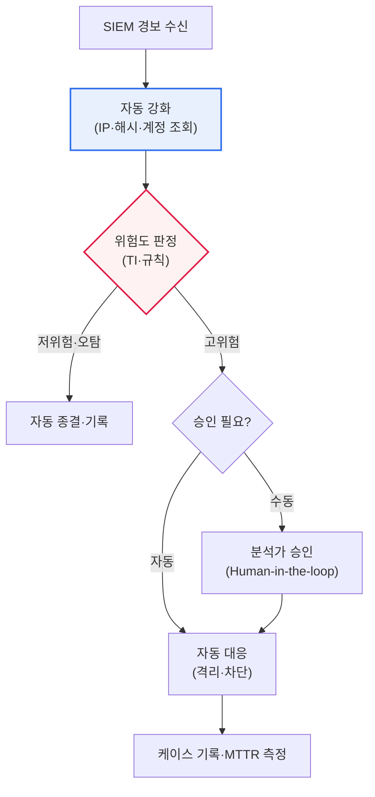

# SOAR(Security Orchestration, Automation and Response)

## 1. 개요

### 가. 정의

> **SOAR**은 보안 위협 탐지부터 대응까지의 과정을 **오케스트레이션(Orchestration)·자동화(Automation)·대응(Response)** 으로 통합해, 흩어진 보안 도구와 반복 업무를 하나의 워크플로로 묶어 보안 운영(SecOps)을 자동화·효율화하는 체계다.

SOAR의 정의를 뜯어보면 세 축이 각각 다른 문제를 겨냥한다. **오케스트레이션**은 '도구가 파편화되어 있다'는 문제를, **자동화**는 '반복 업무가 사람을 소진시킨다'는 문제를, **대응**은 '조치가 느리다'는 문제를 푼다. 즉 SOAR은 단일 제품이라기보다, SOC(보안관제센터)의 운영 방식을 사람 중심에서 워크플로 중심으로 재설계하는 '운영 프레임워크'에 가깝다. 이 점이 SOAR을 단순한 자동화 스크립트 모음과 구분 짓는다.

### 나. 등장 배경

SOAR이 등장한 근본 배경은 '**보안 경보는 폭증하는데 대응할 인력은 부족하다**'는 현실이다. 오늘날 SOC에는 방화벽·IPS·EDR·SIEM 등 수많은 보안 장비에서 하루에도 수천~수만 건의 경보가 쏟아진다. 분석가가 이를 일일이 확인하고, 여러 콘솔을 오가며 IP 평판을 조회하고, 로그를 교차 확인하고, 수동으로 차단을 거는 방식으로는 시간과 인력이 턱없이 부족하다. 그 결과 진짜 위협이 경보의 홍수에 묻히는 '**경보 피로(Alert Fatigue)**'가 발생하고, 대응이 지연되며, 숙련 분석가는 단순 반복 업무에 갈려 이탈한다.

SOAR은 이 악순환을 자동화로 끊는다. 흩어진 보안 도구들을 API로 연동해 하나의 창에서 다루고(오케스트레이션), 반복적인 조사·분류·대응 작업을 미리 정의한 절차(플레이북)에 따라 자동 수행하며(자동화), 위협을 신속히 차단·격리·조치한다(대응). 그러면 분석가는 단순 조회·복사·붙여넣기에서 벗어나 정말 중요한 판단과 위협 헌팅에 집중할 수 있고, 대응 속도(MTTR)가 극적으로 빨라진다.

### 다. 필요성

사이버 위협의 양적 폭증, 보안 인력의 구조적 부족, 그리고 여러 보안 도구의 파편화가 맞물리며 SOAR은 '있으면 좋은 것'에서 '없으면 운영이 무너지는 것'으로 위상이 바뀌었다. 특히 도구가 늘어날수록 분석가가 오가야 할 콘솔이 늘어 오히려 생산성이 떨어지는 '**도구 스프롤(Tool Sprawl)**' 문제가 심화되었는데, SOAR은 이들을 하나의 상위 계층에서 통합함으로써 이 문제를 정면으로 해소한다.

## 2. 구성요소와 주요 기능

SOAR의 동작을 한눈에 보면, 이기종 도구를 엮는 오케스트레이션이 토대가 되고, 그 위에서 플레이북 자동화가 돌며, 최종적으로 대응 조치가 실행되는 3층 구조를 이룬다.

| 구성요소 | 내용 |
|---|---|
| **오케스트레이션** | 이기종 보안 도구(SIEM·EDR·방화벽·TI) API 연동·통합 |
| **자동화(플레이북)** | 대응 절차를 플레이북으로 정의·자동 실행 |
| **사고 대응(IR)** | 위협 조사·격리·차단, 케이스(티켓) 관리 |
| **위협 인텔리전스(TI)** | 위협 정보 연계로 판단·분류 지원 |
| **대시보드·측정** | 대응 현황·지표(MTTR·MTTD) 관리 |

**오케스트레이션**은 SOAR의 토대다. SIEM·EDR·방화벽·티켓 시스템·위협 인텔리전스 플랫폼 등 서로 다른 벤더의 도구를 API·커넥터로 연결해, 한 도구의 출력을 다른 도구의 입력으로 자동 전달한다. 예컨대 SIEM이 올린 경보에서 악성 IP를 추출해 → TI 플랫폼에 평판을 질의하고 → 결과가 악성이면 방화벽 API로 차단 룰을 거는 일련의 흐름을, 사람이 콘솔을 오가지 않고도 자동으로 잇는다. 오케스트레이션이 없으면 자동화는 '각 도구 안에 갇힌 부분 자동화'에 그친다.

**자동화(플레이북)** 는 SOAR의 심장이다. 플레이북은 "이런 유형의 경보가 오면 → 이렇게 조사하고 → 조건에 따라 이렇게 분기하고 → 이렇게 대응하라"는 대응 절차를 코드·다이어그램으로 정의한 워크플로다. 표준화가 가능한 반복 작업(IP 평판 조회, 계정 잠금, 파일 해시 검사, 격리 등)을 사람 개입 없이(또는 최소 승인만으로) 자동 실행한다. 잘 설계된 플레이북 하나가 수십 분 걸리던 초동 조사를 수 초로 줄인다.

**사고 대응(IR)과 케이스 관리**는 자동화되지 않은 부분을 사람이 처리하도록 돕는다. SOAR은 관련 경보를 하나의 '케이스(사건)'로 묶고, 조사 이력·증거·타임라인을 한 곳에 축적해 협업과 감사(Audit)를 가능하게 한다. 이는 대응의 '기록화·표준화'라는 관점에서 중요하다.

**위협 인텔리전스 연계와 측정**은 판단의 품질과 운영의 성숙도를 뒷받침한다. 외부 위협 정보를 자동 대조해 오탐을 걸러내고, MTTD(평균 탐지 시간)·MTTR(평균 대응 시간) 같은 지표로 운영 효율을 정량 관리한다.

## 3. 플레이북 실행 구조 (프로세스 세부도)

SOAR의 실질적 가치는 플레이북이 경보를 받아 자동 분기·대응하는 과정에 있다. 아래는 전형적인 플레이북 실행 흐름을 나타낸 세부 프로세스도이다.

플레이북의 첫 단계인 **강화(Enrichment)** 는 경보에 맥락을 붙이는 과정이다. 경보에 담긴 IP·도메인·파일 해시·사용자 계정 등 지표(IoC)를 TI 플랫폼·자산 DB·디렉터리에 자동 조회해, '이 IP는 악성으로 알려졌는가', '이 계정은 어떤 권한을 가졌는가' 같은 판단 재료를 모은다. 이 단계가 자동화되면 분석가가 수동으로 여러 콘솔을 뒤지던 시간이 사라진다.

**분류(Triage)** 단계에서는 강화된 정보를 규칙·TI 점수로 종합해 위험도를 판정하고 분기한다. 저위험·명백한 오탐은 자동 종결하되 기록을 남겨 감사 추적성을 확보하고, 고위험은 대응 단계로 넘긴다. 이 자동 분기가 경보 피로의 핵심 원인인 '오탐 홍수'를 걸러 분석가의 인지 부하를 줄인다.

**대응(Response)** 단계에서는 조치의 파급력에 따라 자동/수동을 나눈다. 계정 임시 잠금·의심 파일 격리처럼 되돌리기 쉬운 조치는 자동 실행하되, 방화벽 전체 차단·서버 격리처럼 서비스 영향이 큰 조치는 **Human-in-the-loop** 승인 관문을 두는 것이 안전하다. 마지막으로 모든 조치는 케이스에 기록되고 MTTR이 측정되어, 운영 개선의 피드백 루프로 이어진다.

## 4. SIEM과의 관계 및 비교

SOAR을 이해할 때 가장 흔한 혼동이 SIEM과의 경계다. 표는 요약이며, 핵심은 둘이 경쟁 관계가 아니라 '탐지'와 '대응'을 분담하는 **상호 보완 관계**라는 점이다.

| 구분 | SIEM | SOAR |
|---|---|---|
| **초점** | 로그 수집·상관분석·탐지 | 대응 자동화·오케스트레이션 |
| **역할** | 위협 탐지·경보 생성 | 탐지 후 조사·분류·대응 |
| **관계** | SOAR의 입력(경보 제공) | SIEM 경보를 받아 자동 대응 |

SIEM은 방대한 로그를 수집·정규화·상관분석해 '무엇이 의심스러운가'를 찾아내는 **탐지의 눈**이다. 그러나 SIEM 자체는 조치 능력이 약해, 경보를 만들어 낼 뿐 그 뒤의 조사·대응은 사람에게 넘긴다. 바로 이 지점, '탐지 이후의 공백'을 SOAR이 메운다. SIEM이 위협을 '탐지'하면 SOAR이 그 경보를 받아 강화·분류·대응을 '자동화'한다. 그래서 실무에서는 SIEM(탐지)과 SOAR(대응)을 짝으로 구성하는 것이 일반적이다.

다만 최근에는 이 경계가 흐려지고 있다. SIEM 제품이 자체 SOAR 기능을 흡수하고, 클라우드 기반 통합 SecOps 플랫폼이 탐지·조사·대응을 한데 묶는 방향으로 시장이 재편되고 있다. 여기에 EDR을 다중 원천으로 확장한 **XDR**이 등장하면서, '탐지–대응' 스택 전체의 통합이 가속되는 흐름이다. 이러한 통합 흐름의 구체적 제품 지형은 빠르게 변하므로 도입 시 최신 시장 동향으로 확인하는 것이 바람직하다.

## 5. 기대효과와 도입 시 고려사항

| 구분 | 내용 |
|---|---|
| **기대효과** | 대응 시간(MTTR) 단축, 분석가 업무 경감, 일관된 대응, 24/365 자동 대응 |
| **도입 고려** | 플레이북 설계 품질, 오탐 시 자동 대응 위험(승인 절차), 도구 연동 표준화, 인력 역량 |

기대효과의 핵심은 단순한 '속도'가 아니라 '**일관성과 확장성**'이다. 사람은 컨디션·숙련도에 따라 대응 품질이 흔들리지만, 검증된 플레이북은 새벽 3시에도 동일한 절차로 대응한다. 또한 경보량이 늘어도 인력을 선형적으로 늘리지 않고 대응할 수 있어, 위협 증가에 대한 확장성을 확보한다. 실제로 초동 조사·강화를 자동화한 조직은 건당 처리 시간을 수십 분에서 수 초 수준으로 단축했다고 보고되며, 이는 분석가를 반복 업무에서 해방시켜 위협 헌팅 같은 고부가 활동으로 재배치할 여지를 만든다.

반면 도입에는 함정이 있다. 가장 큰 위험은 '**잘못된 자동화의 증폭 효과**'다. 오탐에 자동 대응을 걸면 정상 서비스를 차단해 스스로 장애를 유발할 수 있고, 이 실수가 자동화 속도로 대규모로 번진다. 그래서 파급력 큰 조치에는 승인 관문을 두어야 한다. 또한 도구별 커넥터·API가 표준화되어 있지 않으면 연동·유지보수 비용이 커지고, 플레이북을 설계·개선할 수 있는 인력 역량이 없으면 SOAR은 '비싼 껍데기'가 된다.

### 참고: 대표 적용 시나리오

SOAR의 효과는 추상적 개념보다 구체 시나리오에서 분명해진다. 대표적으로 '**피싱 메일 신고 처리**' 플레이북을 보자. 사용자가 의심 메일을 신고하면, SOAR이 자동으로 메일 헤더에서 발신 IP·URL·첨부 해시를 추출해 TI 플랫폼과 샌드박스에 질의하고, 악성으로 판정되면 메일 게이트웨이에서 동일 메일을 전 사용자 메일함에서 회수(Purge)하고, 해당 URL을 프록시 차단 목록에 등록한 뒤, 신고자에게 결과를 회신한다. 사람이 수동으로 하면 30분 이상 걸리던 절차가 자동화 시 수십 초로 줄어든다.

또 다른 예로 '**의심 로그인 대응**' 플레이북은 SIEM이 '불가능한 이동' 경보를 올리면, SOAR이 해당 계정의 최근 활동을 자동 조회하고, 위험이 높으면 세션을 강제 종료하고 계정을 임시 잠금한 뒤, 사용자에게 본인 확인을 요청한다. 이처럼 SOAR은 '탐지–조사–조치–통지'라는 반복 절차를 하나의 워크플로로 압축하며, 조직에 따라 초동 대응 건당 처리 시간을 수십 분에서 수 초 수준으로 단축한 것으로 보고된다(수치는 조직·플레이북 성숙도에 따라 크게 달라지므로 개략적 참고치로 이해해야 한다).

## 6. 심화: AI 결합과 자율 SOC로의 진화

SOAR의 최신 진화 방향은 **AI·생성형 AI와의 결합**이다. 전통적 플레이북은 사람이 모든 분기를 사전에 정의해야 했지만, 대형 언어모델(LLM)을 결합하면 자연어로 경보를 요약하고, 유사 과거 사건을 검색해 대응을 추천하며, 초동 조사 리포트를 자동 작성하는 수준으로 고도화된다. 이는 플레이북 작성의 진입장벽을 낮추고, 정형화하기 어려웠던 판단 영역까지 자동화 범위를 넓힌다.

더 나아가 업계는 **자율 SOC(Autonomous SOC)** 라는 개념을 향해 움직이고 있다. 사람이 예외만 처리하고 대부분의 반복 대응은 AI 에이전트가 자율적으로 수행하는 모델이다. 다만 이 방향에는 명확한 견제가 함께 논의된다. AI가 잘못 판단해 자동 대응하면 그 피해도 자동으로 확산되므로, '설명 가능성(Explainability)'과 '사람 최종 승인(Human oversight)'을 어떻게 유지할 것인가가 핵심 과제로 남는다. 관련하여 SecOps 플랫폼의 통합(SIEM+SOAR+XDR)과 클라우드 전환도 함께 진행 중이며, 이러한 최신 동향의 구체적 성숙도·채택률은 유동적이므로 단정보다는 방향성으로 이해하는 것이 적절하다.

## 7. 고려사항 및 시사점 (기술사 관점)

1. **플레이북 품질이 성패를 좌우한다.** 자동화의 효과는 전적으로 플레이북에 달렸으므로, 정확하고 검증된 대응 절차를 설계하고 지속적으로 개선(운영 후 회고 기반)해야 한다. 잘못된 플레이북은 대응을 돕는 것이 아니라 오히려 피해를 자동으로 키운다.

2. **완전 자동화와 사람 개입의 균형이 필요하다.** 오탐에 무조건 자동 대응하면 정상 서비스를 차단할 수 있으므로, 파급력이 큰 조치는 사람의 승인을 거치는 반자동(Human-in-the-loop) 설계가 안전하다. '무엇을 자동화하고 무엇을 사람에게 남길지'의 경계 설정이 전략의 핵심이다.

3. **도구 연동 표준화와 통합 전략이 중요하다.** SOAR의 가치는 연동된 도구 생태계의 폭에 비례한다. 커넥터·API 표준화, 그리고 SIEM·XDR·TI와의 통합 아키텍처를 함께 설계해야 파편화(Tool Sprawl) 문제를 실제로 해소할 수 있다.

4. **AI 결합으로 지능화·자율화가 진행된다.** 생성형 AI·머신러닝을 결합해 위협 분석·플레이북 추천·자동 조사를 고도화하는 방향으로 발전하며, 궁극적으로 자율 SOC를 지향한다. 다만 설명 가능성과 사람 감독을 함께 확보해야 자동화의 위험을 통제할 수 있다.

5. **성과 측정과 지속 개선 체계가 뒷받침되어야 한다.** MTTD·MTTR·자동 종결률·오탐률 같은 지표로 운영 성숙도를 정량화하고, 이를 근거로 플레이북과 자동화 범위를 반복 개선하는 피드백 루프를 갖추는 것이 SOAR을 '도입 프로젝트'가 아닌 '운영 역량'으로 정착시키는 관건이다.

## 참고자료

- Gartner, "Security Orchestration, Automation and Response (SOAR)" Glossary — https://www.gartner.com/en/information-technology/glossary/security-orchestration-automation-response-soar
- NIST SP 800-61 Rev.2, "Computer Security Incident Handling Guide" — https://csrc.nist.gov/pubs/sp/800/61/r2/final
- MITRE ATT&CK — https://attack.mitre.org/

---

> **한 줄 요약**: SOAR은 *오케스트레이션·자동화·대응* 으로 흩어진 보안 도구와 반복 업무를 통합 자동화하는 체계로, **플레이북**이 경보를 강화·분류·대응하는 워크플로를 자동 실행해 대응시간(MTTR)을 단축한다. SIEM(탐지)과 상호 보완하며, 성패는 **플레이북 품질과 사람 개입(Human-in-the-loop) 균형**에 달렸고, 최신 흐름은 AI 결합을 통한 자율 SOC로의 진화다.
