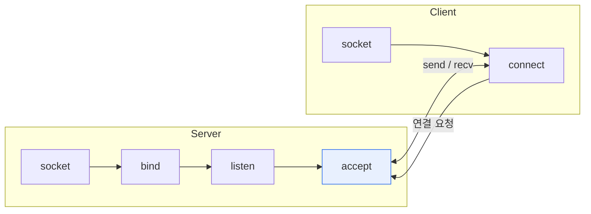

# 소켓(Socket) 통신

## 1. 개요

### 가. 정의
> **소켓**은 네트워크상에서 프로세스 간 통신을 위한 **양 끝점(Endpoint)** 으로, IP 주소와 포트 번호의 조합으로 식별된다. 소켓 통신은 이 소켓을 통해 데이터를 송수신하는 방식이다.

소켓을 이해하는 핵심은 '**응용 프로그램이 복잡한 네트워크를 다루기 위한 추상화된 창구**'라는 점이다. TCP/IP의 내부 동작(패킷 분할, 라우팅, 재전송)은 대단히 복잡하지만, 개발자는 소켓 API(socket, connect, send, recv)라는 표준 인터페이스만 알면 이 복잡성을 몰라도 통신할 수 있다. 소켓은 IP 주소로 '어느 컴퓨터인지'를, 포트 번호로 '그 컴퓨터의 어느 프로그램인지'를 특정한다. 예를 들어 웹 서버는 보통 80번(HTTP)·443번(HTTPS) 포트에서 소켓을 열어 클라이언트의 연결을 기다린다. IP:포트 = '건물 주소:호실'에 비유할 수 있다.

### 나. 필요성
서로 다른 기기의 프로그램이 통신하려면 상대를 특정하고 데이터를 안정적으로 주고받는 표준 방법이 필요하다. 소켓은 운영체제가 제공하는 이 표준 통신 메커니즘으로, 웹·메신저·게임 등 거의 모든 네트워크 애플리케이션의 기반이 된다.

## 2. 통신 방식 개념도 및 유형

TCP 소켓 통신에서 서버는 socket 생성 → bind(주소 결합) → listen(대기) → accept(연결 수락) 순서로 클라이언트를 기다리고, 클라이언트는 socket 생성 → connect로 연결을 요청한다. 연결이 수립되면 양쪽이 send/recv로 데이터를 주고받는다. 소켓은 사용하는 프로토콜에 따라 두 유형으로 나뉜다. **스트림 소켓(TCP)** 은 연결을 수립하고 데이터의 순서·신뢰성을 보장하며, **데이터그램 소켓(UDP)** 은 연결 없이 빠르게 보내지만 순서·도착을 보장하지 않는다.

| 유형 | 프로토콜 | 특징 |
|---|---|---|
| **스트림 소켓** | TCP | 연결지향, 신뢰성·순서 보장 |
| **데이터그램 소켓** | UDP | 비연결, 빠르나 비신뢰(영상·게임) |

## 3. TCP 소켓과 WebSocket 흐름

TCP 소켓이 전송 계층을 직접 다루는 저수준 통신이라면, **WebSocket** 은 웹 환경을 위한 상위 계층 기술이다. WebSocket은 처음에 일반 HTTP 요청으로 시작한 뒤, `Upgrade` 헤더로 프로토콜을 전환(핸드셰이크)하고, 이후에는 하나의 지속 연결로 서버와 클라이언트가 자유롭게(full-duplex) 메시지를 주고받는다. 이 덕분에 서버가 클라이언트에게 먼저 데이터를 보내는 '서버 푸시'가 가능해, 채팅·실시간 알림·주식 시세 같은 실시간 웹 서비스를 구현한다.

| 구분 | TCP 소켓 | WebSocket |
|---|---|---|
| **계층** | 전송 계층(TCP) 직접 | 응용 계층(HTTP 위 업그레이드) |
| **연결** | socket→connect→3-way handshake | HTTP 핸드셰이크 후 Upgrade |
| **통신** | 양방향 스트림 | 양방향 full-duplex(실시간) |
| **용도** | 일반 네트워크 앱 | 웹 실시간(채팅·알림) |

## 4. 소켓 통신과 HTTP 통신 비교

소켓 통신과 HTTP는 연결 유지 방식이 근본적으로 다르다. HTTP는 요청-응답 후 연결을 끊는 **무상태(Stateless)** 방식이라 서버가 먼저 말을 걸 수 없고, 실시간이 필요하면 클라이언트가 반복 요청하는 폴링에 의존해 비효율적이다. 소켓 통신(특히 WebSocket)은 연결을 유지해 양방향·실시간 통신이 가능하다.

| 구분 | 소켓 통신 | HTTP 통신 |
|---|---|---|
| **연결** | 지속 연결(상태 유지) | 요청-응답 후 종료(무상태) |
| **방향** | 양방향(서버 푸시 가능) | 단방향(클라이언트 시작) |
| **실시간성** | 높음 | 낮음(폴링 필요) |
| **용도** | 실시간·양방향 | 웹 문서·REST API |

## 5. 고려사항 및 시사점

1. **요구 특성에 맞는 선택**이 중요하다. 단순 요청-응답은 HTTP/REST가 간단하고, 실시간 양방향은 WebSocket이 적합하며, 서버 단방향 푸시만 필요하면 SSE(Server-Sent Events)가 경제적이다.
2. **대규모 실시간 서비스는 연결 관리가 관건**이다. 수많은 지속 연결을 유지하려면 서버 자원·확장(메시지 브로커, 스케일아웃) 설계가 필요하다.
3. 신뢰성 vs 속도의 트레이드오프에서, 영상·게임은 지연에 민감해 UDP를, 파일·거래는 정확성이 중요해 TCP를 택하는 등 데이터 특성이 프로토콜 선택을 좌우한다.

---

> **한 줄 요약**: 소켓은 IP·포트로 식별되는 통신 양 끝점으로 TCP(신뢰)·UDP(속도) 소켓과 실시간 양방향 WebSocket이 있으며, 지속·양방향인 소켓 통신은 요청-응답·무상태인 HTTP와 대비되어 실시간 서비스에 적합하다.
