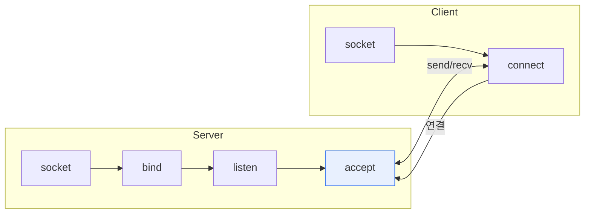

# 소켓(Socket) 통신

## 1. 개요

### 가. 정의
> **소켓**은 네트워크상에서 프로세스 간 통신의 **양 끝점(Endpoint)** 으로, IP 주소와 포트 번호로 식별된다. 소켓 통신은 이 소켓을 통해 데이터를 송수신하는 방식이다.

소켓은 응용 프로그램이 TCP/IP 네트워크를 사용하기 위한 **추상화된 통신 창구**다. 개발자는 복잡한 프로토콜 내부를 몰라도 소켓 API(connect·send·recv)로 통신할 수 있다. 소켓은 IP(호스트)와 포트(프로세스)의 조합으로 "어느 컴퓨터의 어느 프로그램"인지를 특정한다.

## 2. 통신 방식 개념도 및 유형

| 유형 | 프로토콜 | 특징 |
|---|---|---|
| **스트림 소켓** | TCP | 연결지향, 신뢰성·순서 보장 |
| **데이터그램 소켓** | UDP | 비연결, 빠르나 비신뢰 |

## 3. TCP 소켓 및 Web 소켓 흐름

| 구분 | TCP 소켓 | WebSocket |
|---|---|---|
| **계층** | 전송 계층(TCP) 직접 | 응용 계층(HTTP 위 업그레이드) |
| **연결** | socket→connect→3-way handshake | HTTP 핸드셰이크 후 Upgrade |
| **통신** | 양방향 스트림 | 양방향 full-duplex(실시간) |
| **용도** | 일반 네트워크 앱 | 웹 실시간(채팅·알림·주식) |

> WebSocket은 최초 HTTP로 핸드셰이크한 뒤 프로토콜을 업그레이드해, 이후 하나의 연결로 서버·클라이언트가 자유롭게 메시지를 주고받는다.

## 4. 소켓 통신과 HTTP 통신 비교

| 구분 | 소켓 통신 | HTTP 통신 |
|---|---|---|
| **연결** | 지속 연결(상태 유지) | 요청-응답 후 종료(Stateless) |
| **방향** | 양방향(서버 푸시 가능) | 단방향(클라이언트 요청 시작) |
| **실시간성** | 높음 | 낮음(폴링 필요) |
| **용도** | 실시간·양방향 | 웹 문서·REST API |

## 5. 시사점
- 실시간 양방향은 WebSocket, 단순 요청-응답은 HTTP/REST 선택
- 서버 푸시 대안: SSE(Server-Sent Events), 롱폴링
- 대규모 실시간은 연결 관리·확장(메시지 브로커) 고려

---

> **한 줄 요약**: 소켓은 IP·포트로 식별되는 통신 양 끝점이며, TCP(신뢰)·UDP(속도) 소켓과 실시간 양방향 WebSocket이 있고, 지속·양방향인 소켓 통신은 요청-응답·무상태인 HTTP와 대비된다.
