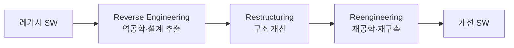

# 소프트웨어 유지보수 3R (Reverse Engineering · Restructuring · Reengineering)

## 1. 개요

### 가. 정의
> 노후·복잡 소프트웨어의 **유지보수성 향상과 비용 절감**을 위해 기존 시스템을 분석·개선·재구축하는 세 가지 기법(3R).

### 나. 필요성
- 레거시의 **문서 부재·복잡도 증가·기술부채** → 재활용으로 개발비 절감

## 2. 3R 구성

| 기법 | 내용 |
|---|---|
| **역공학(Reverse Engineering)** | 소스·산출물에서 설계·명세를 **추출**(상위 추상화 복원) |
| **재구조화(Restructuring)** | 기능 변경 없이 코드·구조를 **개선**(가독성·모듈화, 동일 추상화 수준) |
| **재공학(Reengineering)** | 역공학+개선+순공학으로 시스템을 **재구축**(기능·품질 향상) |

## 3. 관련 개념
- **Forward Engineering**(순공학): 명세→구현의 정방향 개발
- **Migration**: 플랫폼·언어 이식

## 4. 시사점
- 신규 개발 대비 **위험·비용 절감**, 기술부채 해소·현대화(Modernization) 수단

---

> **한 줄 요약**: 3R은 *역공학(설계 추출)·재구조화(구조 개선)·재공학(재구축)* 으로 레거시 SW의 유지보수성을 높이고 비용을 절감하는 기법이다.
