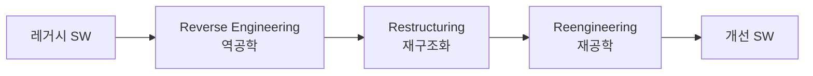
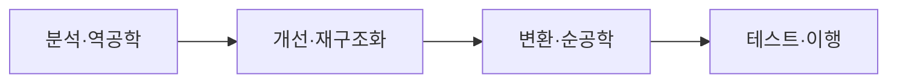

# 소프트웨어 유지보수 3R (Reverse Engineering · Restructuring · Reengineering)

## 1. 개요

### 가. 정의
> 노후·복잡 소프트웨어의 **유지보수성 향상과 비용 절감**을 위해 기존 시스템을 분석·개선·재구축하는 세 가지 기법(3R).

### 나. 필요성
- 레거시의 **문서 부재·복잡도 증가·기술부채**
- 신규 개발 대비 **위험·비용 절감**, 자산 재활용·현대화

## 2. 3R 구성

| 기법 | 내용 | 추상화 수준 |
|---|---|---|
| **역공학(Reverse Engineering)** | 소스·산출물에서 설계·명세를 **추출**(상위 복원) | 상향 |
| **재구조화(Restructuring)** | 기능 변경 없이 코드·구조 **개선**(가독성·모듈화) | 동일 |
| **재공학(Reengineering)** | 역공학+개선+순공학으로 **재구축**(기능·품질 향상) | 상향→하향 |

## 3. 관련 개념

| 개념 | 설명 |
|---|---|
| **Forward Engineering** | 명세→설계→구현의 정방향 개발 |
| **Migration** | 플랫폼·언어·DB 이식 |
| **Refactoring** | 외부 동작 유지하며 내부 구조 개선(재구조화의 코드 단위) |

## 4. 재공학 프로세스

## 5. 고려사항 및 시사점
- 대상 선정: **유지보수 비용·중요도** 기반 우선순위
- 재공학 중 **기존 기능 보존**(회귀 테스트) 필수
- 클라우드 전환·MSA 전환 등 **레거시 현대화(Modernization)** 의 핵심 수단
- AI 기반 코드 분석·자동 변환 도구로 효율화

---

> **한 줄 요약**: 3R은 *역공학(설계 추출)·재구조화(구조 개선)·재공학(재구축)* 으로 레거시 SW의 유지보수성을 높이고 비용을 절감하는 기법으로, 레거시 현대화의 핵심 수단이다.
