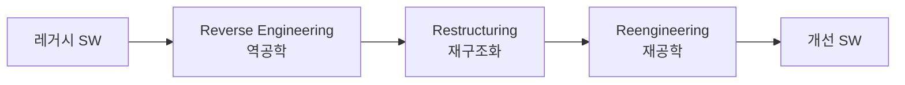

# 소프트웨어 유지보수 3R (Reverse Engineering · Restructuring · Reengineering)

## 1. 개요

### 가. 정의
> 노후·복잡해진 소프트웨어의 **유지보수성을 높이고 비용을 절감**하기 위해, 기존 시스템을 분석(역공학)·개선(재구조화)·재구축(재공학)하는 세 가지 대표 기법을 통칭하는 개념(3R).

3R은 서로 독립된 기법이 아니라 **분석 → 개선 → 재구축**으로 이어지는 연속선상에 있다. 역공학이 "무엇이 어떻게 만들어졌는지 이해"하는 단계라면, 재구조화는 "이해한 것을 같은 기능 안에서 더 낫게 정리"하는 단계이고, 재공학은 이 둘을 포함해 "새로 만들어내는" 단계다. 즉 재공학이 가장 포괄적이며 역공학·재구조화를 부분 공정으로 품는다.

### 나. 등장 배경 및 필요성
오래 운영된 레거시(legacy) 시스템은 담당자가 바뀌고 문서가 유실되면서 **구조를 아는 사람이 사라지고**, 잦은 수정이 쌓여 코드 복잡도와 **기술부채(technical debt)** 가 눈덩이처럼 커진다. 이 상태에서는 작은 변경도 예측 불가능한 부작용을 일으켜 유지보수 비용이 급증한다. 그렇다고 전면 신규 개발로 갈아엎으면 축적된 업무 규칙(도메인 지식)이 소실되고 위험·비용이 크다. 3R은 **기존 자산을 최대한 재활용하면서** 위험과 비용을 낮추는 절충안으로, 오늘날 클라우드 전환·MSA 전환 같은 **레거시 현대화(Modernization)** 의 핵심 수단이 되었다.

## 2. 3R 구성

세 기법은 **추상화 수준의 이동 방향**으로 구분하면 명확하다. 역공학은 구현(코드)에서 설계·명세라는 상위 개념으로 거슬러 올라가는 **상향(bottom-up)** 활동이다. 재구조화는 추상화 수준을 바꾸지 않고 **같은 층위 안에서** 표현만 개선한다(예: 스파게티 코드를 모듈화). 재공학은 역공학으로 상위 명세를 복원한 뒤, 개선을 거쳐 다시 순공학으로 구현으로 내려오는 **상향→하향의 왕복** 활동이다.

- **역공학(Reverse Engineering)**: 소스코드·실행파일·산출물로부터 설계·명세를 추출·복원한다. 문서가 없는 레거시의 구조를 파악하는 출발점이며, 기능은 그대로 두고 "이해"만 목적으로 한다.
- **재구조화(Restructuring)**: 외부에서 보는 기능·동작은 그대로 유지한 채 내부 코드·구조를 개선한다. 가독성·모듈화·복잡도를 낮춰 이후 변경을 쉽게 만든다.
- **재공학(Reengineering)**: 역공학 + 개선 + 순공학을 결합해 시스템을 재구축한다. 단순 정리를 넘어 기능·품질·플랫폼까지 향상시킬 수 있다.

| 기법 | 목적 | 기능 변화 | 추상화 방향 |
|---|---|---|---|
| **역공학** | 설계·명세 추출(이해) | 없음 | 상향(코드→설계) |
| **재구조화** | 구조·가독성 개선 | 없음 | 동일 수준 |
| **재공학** | 재구축·품질 향상 | 있을 수 있음 | 상향→하향 |

## 3. 관련 개념

3R을 정확히 쓰려면 인접 개념과의 관계를 구분해야 한다. 특히 재구조화와 리팩터링, 재공학과 마이그레이션이 자주 혼동된다.

| 개념 | 설명 | 3R과의 관계 |
|---|---|---|
| **Forward Engineering(순공학)** | 명세→설계→구현의 정방향 개발 | 재공학의 마지막 공정 |
| **Migration(이식)** | 플랫폼·언어·DB를 다른 환경으로 옮김 | 재공학의 한 형태·부분 |
| **Refactoring(리팩터링)** | 외부 동작을 유지하며 내부 구조 개선 | 재구조화를 코드 단위로 실천 |

리팩터링은 재구조화의 개념을 소스코드 수준에서 작은 단위로 반복 적용하는 실천 기법이고, 마이그레이션은 재공학 과정에서 대상 환경을 바꾸는 특수 사례로 볼 수 있다.

## 4. 재공학 프로세스

재공학은 먼저 **분석·역공학**으로 기존 시스템의 구조와 업무 규칙을 복원하고, **개선·재구조화**로 설계 결함과 중복을 제거하며, **변환·순공학**으로 새 플랫폼·구조에 맞게 재구현한 뒤, **테스트·이행**으로 기존 기능이 보존되었는지 검증하고 운영에 반영한다. 이 과정에서 가장 중요한 통제점은 마지막 테스트 단계로, 재구축 후에도 원래 기능이 동일하게 동작함을 **회귀 테스트(regression test)** 로 반드시 확인해야 한다.

## 5. 고려사항 및 시사점
기술사 관점에서 3R의 성패는 "무엇을, 왜, 어디까지 손댈지"의 판단에 달려 있다. 첫째, 모든 레거시를 재공학할 수는 없으므로 **유지보수 비용·비즈니스 중요도·기술부채 수준**을 기준으로 대상을 우선순위화해야 한다. 둘째, 재구축 과정에서 기존 기능이 훼손되지 않도록 **회귀 테스트와 병행 운영**을 통한 기능 보존이 필수다. 셋째, 3R은 온프레미스 레거시를 **클라우드·MSA로 전환**하는 현대화 전략(리팩터·리아키텍트)의 핵심 수단이며, 최근에는 **AI 기반 코드 분석·자동 변환 도구**로 역공학과 변환 공정의 효율을 크게 높이고 있다. 다만 자동화 결과도 사람의 검증을 거쳐야 품질을 담보할 수 있다.

---

> **한 줄 요약**: 3R은 *역공학(설계 추출)·재구조화(구조 개선)·재공학(재구축)* 으로 이어지는 레거시 개선 기법으로, 추상화 방향·기능 변화 여부로 구분되며 대상 우선순위화와 회귀 테스트 기반 기능 보존을 전제로 클라우드·MSA 현대화의 핵심 수단이 된다.
