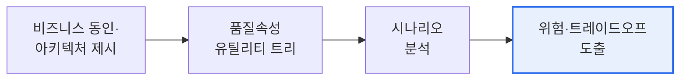

# 소프트웨어 아키텍처 분석과 ATAM

## 1. 개요

### 가. 필요성
> **소프트웨어 아키텍처 분석**은 시스템의 **구조(아키텍처)가 요구되는 품질속성(성능·보안·가용성·변경용이성 등)을 만족하는지 평가하고 개선점을 찾는 활동**이다. 대표 평가 기법이 ATAM이다.

아키텍처 분석이 필요한 근본 이유는 '**아키텍처의 결함은 나중에 고치기가 가장 비싸다**'는 데 있다. 아키텍처는 시스템의 뼈대로, 한번 정해지면 이후 모든 설계·구현이 그 위에 쌓인다. 그래서 아키텍처 단계에서 잘못된 결정(예: 확장성을 고려하지 않은 구조)은 개발이 진행될수록 바로잡기 어렵고, 완성 후에는 전면 재설계라는 막대한 비용을 부른다. 게다가 아키텍처는 여러 품질속성이 서로 충돌하는 지점이다. 성능을 높이면 보안·비용이 나빠지고, 유연성을 키우면 성능이 떨어지는 식의 **트레이드오프**가 곳곳에 있다. 아키텍처 분석은 이런 결정을 구현 전에 평가한다. 이해관계자가 요구하는 품질속성을 명확히 하고, 아키텍처가 이를 만족하는지, 어떤 트레이드오프와 위험이 있는지를 체계적으로 따진다. 그래서 값비싼 후반부 재작업을 예방하고, 근거 있는 아키텍처 결정을 내리게 한다.

### 나. 정방향·역방향 분석
| 구분 | 내용 |
|---|---|
| **정방향 분석(Forward)** | 요구사항·설계로부터 아키텍처를 도출·평가(설계 단계) |
| **역방향 분석(Reverse)** | 기존 코드·시스템에서 아키텍처를 복원·분석(레거시 이해) |

정방향은 새로 만드는 시스템의 아키텍처가 요구를 잘 반영하는지 보고, 역방향은 이미 있는 시스템(문서 부재·레거시)에서 실제 아키텍처를 추출해 개선점을 찾는다.

## 2. ATAM(Architecture Trade-off Analysis Method)

> **ATAM**은 여러 **품질속성 간 트레이드오프를 분석**해 아키텍처가 품질 요구를 얼마나 만족하는지, 어떤 위험이 있는지를 이해관계자와 함께 평가하는 방법이다.

ATAM의 핵심 산출은 **품질속성 시나리오**를 통한 평가다. 품질 요구를 유틸리티 트리(성능·가용성·보안 등)로 구조화하고, 구체적 시나리오(예: "부하 2배 시 응답 3초 이내")로 아키텍처를 시험해, 다음 네 가지를 도출한다.

| 산출물 | 내용 |
|---|---|
| **민감점(Sensitivity Point)** | 특정 품질에 큰 영향을 주는 아키텍처 결정 |
| **트레이드오프점(Trade-off Point)** | 여러 품질에 상반된 영향을 주는 결정 |
| **위험(Risk)** | 품질 목표 달성을 위협하는 요소 |
| **비위험(Non-risk)** | 안전하다고 판단된 결정 |

## 3. 다른 평가 기법과의 관계

ATAM은 여러 품질속성을 종합 평가하는 대표 기법이며, 이 외에도 아키텍처 평가 방법이 있다. SAAM(수정용이성 중심 초기 기법), CBAM(비용-편익까지 고려해 ATAM 확장)이 대표적이다. ATAM은 품질 간 트레이드오프에 초점을 둔다는 점에서 구별된다.

| 기법 | 초점 |
|---|---|
| **SAAM** | 수정용이성·시나리오 기반(초기 기법) |
| **ATAM** | 다수 품질속성 트레이드오프 |
| **CBAM** | 비용-편익 기반 경제적 평가 |

## 4. 고려사항 및 시사점

1. **이해관계자 참여가 성패를 좌우**한다. ATAM은 개발자만의 작업이 아니라, 비즈니스·운영·사용자 등 이해관계자가 함께 품질 요구와 우선순위를 합의해야 실효성이 있다.
2. **트레이드오프의 명시적 관리**가 핵심 가치다. 모든 품질을 동시에 최고로 만들 수 없으므로, 어떤 품질을 우선하고 무엇을 양보할지를 근거와 함께 문서화해 의사결정의 투명성을 높인다.
3. **조기·반복 적용**이 효과적이다. 아키텍처 결정 초기에 평가할수록 재작업 비용을 줄이며, 애자일 환경에서는 진화하는 아키텍처를 반복적으로 평가하는 경량 접근이 필요하다.

---

> **한 줄 요약**: 소프트웨어 아키텍처 분석은 *구조가 품질속성 요구를 만족하는지 평가* 하는 활동으로, ATAM은 품질속성 시나리오로 민감점·트레이드오프·위험을 도출해 값비싼 후반 재작업을 예방하며 이해관계자 참여와 트레이드오프 관리가 핵심이다.
