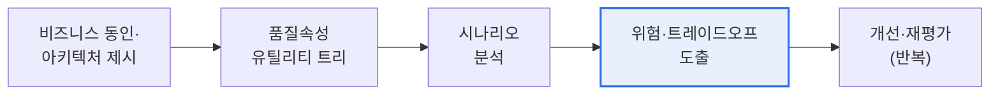
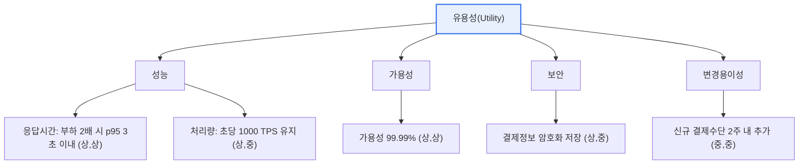

# 소프트웨어 아키텍처 분석과 ATAM

## 1. 개요

### 가. 소프트웨어 아키텍처 분석의 정의와 등장 배경

> **소프트웨어 아키텍처 분석(Software Architecture Analysis)**은 시스템의 **구조(아키텍처)가 요구되는 품질속성(성능·보안·가용성·변경용이성 등)을 만족하는지 구현 이전에 평가하고, 위험·트레이드오프·개선점을 도출하는 활동**이다. 대표 평가 기법이 SEI(카네기멜런 소프트웨어공학연구소)가 정립한 **ATAM(Architecture Trade-off Analysis Method)**이다.

아키텍처 분석이 필요한 근본 이유는 '**아키텍처의 결함은 나중에 고치기가 가장 비싸다**'는 데 있다. 아키텍처는 시스템의 뼈대로, 한번 정해지면 이후 모든 상세설계·구현이 그 위에 쌓인다. 그래서 아키텍처 단계에서 잘못된 결정(예: 확장성을 고려하지 않은 단일 모놀리식 구조, 동기 호출로만 엮인 서비스 간 결합)은 개발이 진행될수록 바로잡기 어렵고, 완성 후에는 전면 재설계라는 막대한 비용을 부른다. 소프트웨어 결함의 수정 비용이 개발 단계가 뒤로 갈수록 기하급수적으로 커진다는 것은 오래전부터 관측되어 온 경험칙으로, 요구·설계 단계에서 잡을 수 있었던 문제를 운영 단계에서 잡으면 수십 배의 비용이 든다는 보고가 반복적으로 제시되어 왔다. 아키텍처 결함은 이 곡선의 가장 왼쪽, 즉 가장 값싸게 고칠 수 있는 지점에서 잡아야 하는 대상이다.

또한 아키텍처는 여러 품질속성이 서로 **충돌하는 지점**이다. 성능을 높이려 캐시·비정규화를 도입하면 데이터 일관성과 보안 검증 비용이 나빠지고, 유연성을 키우려 추상화 계층을 늘리면 성능과 이해도가 떨어지는 식의 **트레이드오프(trade-off)**가 곳곳에 잠복한다. 이 충돌은 코드 한 줄로 드러나지 않고 구조 전체의 상호작용에서 발현되므로, 개별 컴포넌트를 아무리 잘 짜도 구조가 잘못되면 시스템 품질은 무너진다. 소프트웨어 아키텍처 분석은 바로 이런 구조적 결정을 **구현 전에** 평가한다. 이해관계자가 요구하는 품질속성을 명확히 하고, 아키텍처가 이를 만족하는지, 어떤 트레이드오프와 위험이 숨어 있는지를 체계적으로 따진다. 그럼으로써 값비싼 후반부 재작업을 예방하고, 감(感)이 아닌 **근거 있는 아키텍처 결정**을 내리게 한다.

아키텍처 분석이 본격적으로 방법론화된 배경에는 1990년대 후반 대형 시스템의 실패 경험이 있다. 기능은 다 구현했으나 성능·확장성·유지보수성 같은 비기능 요구(품질속성)를 충족하지 못해 폐기되는 시스템이 늘면서, "무엇을 만들 것인가(기능)"만큼 "어떤 품질로 만들 것인가(구조)"를 사전에 검증해야 한다는 문제의식이 커졌다. ATAM·SAAM·CBAM 같은 시나리오 기반 평가 기법군이 이 시기에 등장했다.

### 나. 정방향 분석과 역방향 분석

아키텍처 분석은 '어느 방향에서 구조를 다루는가'에 따라 정방향과 역방향으로 나뉜다. 정방향 분석은 아직 코드가 없는(또는 확정되지 않은) 상태에서 요구·설계로부터 아키텍처를 도출·평가하는 방식으로, 신규 시스템 설계 단계에서 쓰인다. 역방향 분석은 이미 동작하고 있으나 문서가 없거나 노후화된 레거시 시스템에서 실제 아키텍처를 추출·복원해 개선점을 찾는 방식이다.

| 구분 | 시점·대상 | 목적 | 대표 기법·산출 |
|---|---|---|---|
| **정방향 분석(Forward)** | 설계 단계, 요구·설계 산출물 | 아키텍처가 품질 요구를 반영하는지 평가 | ATAM·SAAM, 유틸리티 트리 |
| **역방향 분석(Reverse)** | 운영 중 레거시, 소스코드·바이너리 | 실제 구조 복원·기술부채 파악 | 아키텍처 복원 도구, 의존성 분석 |

정방향은 새로 만드는 시스템의 아키텍처가 요구를 잘 반영하는지 보는 데 초점이 있고, 역방향은 이미 있는 시스템에서 실제로 구현된 아키텍처를 끄집어내 설계 의도와의 괴리(아키텍처 침식, architectural erosion)를 찾는 데 초점이 있다. 실무에서는 이 둘이 순환한다. 레거시를 역방향으로 분석해 현재 구조를 파악하고, 그 위에서 목표 아키텍처를 정방향으로 재설계한 뒤, 다시 마이그레이션 결과를 역방향으로 검증하는 식이다. 예컨대 모놀리식을 마이크로서비스로 전환하는 프로젝트에서는 먼저 역방향 분석으로 도메인 간 실제 의존을 그려내고, 그 경계를 근거로 서비스 분할(정방향)을 설계한다.

## 2. ATAM(Architecture Trade-off Analysis Method)

> **ATAM**은 여러 **품질속성 간 트레이드오프를 분석**해 아키텍처가 품질 요구를 얼마나 만족하는지, 어떤 위험이 있는지를 **이해관계자와 함께** 평가하는 시나리오 기반 방법이다. 특정 품질 하나가 아니라 **다수 품질의 상호 영향**을 함께 본다는 점이 핵심이다.

ATAM은 크게 '준비→평가→종합' 흐름으로 진행되며, 비즈니스 동인을 확인하고 아키텍처를 제시받은 뒤, 품질 요구를 유틸리티 트리로 구조화하고 구체적 시나리오로 아키텍처를 시험해 위험과 트레이드오프를 도출한다. 아래는 그 전체 흐름을 나타낸 개념도다.

```mermaid
flowchart LR
  B["비즈니스 동인·<br/>아키텍처 제시"] --> U["품질속성<br/>유틸리티 트리"] --> S["시나리오<br/>분석"] --> R["위험·트레이드오프<br/>도출"]
  R --> P["개선·재평가<br/>(반복)"]
  style R fill:#e8f0fe,stroke:#2f6fed,stroke-width:2px
```

### 가. 유틸리티 트리 — 품질 요구의 구조화

ATAM의 출발점은 막연한 "성능이 좋아야 한다"를 **측정 가능한 품질 시나리오**로 바꾸는 것이다. 이를 위해 품질속성을 뿌리로 두고 하위 관심사로 가지를 뻗는 **유틸리티 트리(Utility Tree)**를 만든다. 예를 들어 뿌리 '유용성' 아래 '성능·가용성·보안·변경용이성' 가지를 두고, '성능' 아래 다시 '응답시간·처리량' 잎을 두며, 각 잎에 우선순위 (중요도, 난이도)를 붙인 구체 시나리오를 매단다. 아래는 그 세부 구조를 나타낸 개념도다.

```mermaid
flowchart TD
  U["유용성(Utility)"] --> P["성능"]
  U --> A["가용성"]
  U --> SEC["보안"]
  U --> M["변경용이성"]
  P --> P1["응답시간: 부하 2배 시 p95 3초 이내 (상,상)"]
  P --> P2["처리량: 초당 1000 TPS 유지 (상,중)"]
  A --> A1["가용성 99.99% (상,상)"]
  SEC --> S1["결제정보 암호화 저장 (상,중)"]
  M --> M1["신규 결제수단 2주 내 추가 (중,중)"]
  style U fill:#e8f0fe,stroke:#2f6fed,stroke-width:2px
```

각 잎에는 구체적 **품질속성 시나리오**를 매단다. 시나리오는 자극(stimulus)·환경·응답·응답측정으로 구성되는데, 예컨대 "**피크 시간대 동시 사용자가 평소의 2배로 늘어도(자극·환경) 조회 응답을 95퍼센타일 기준 3초 이내로 유지한다(응답·측정)**"처럼 쓴다. 이렇게 하면 "빠르다"는 주관적 요구가 검증 가능한 목표가 된다. 그다음 각 시나리오에 **(비즈니스 중요도, 아키텍처적 달성 난이도)**를 각각 상/중/하로 평가해 우선순위를 매긴다. 둘 다 '상'인 시나리오, 즉 비즈니스에 중요하면서 구조적으로 달성이 까다로운 것이 집중 분석 대상이 된다. 이 우선순위화가 없으면 평가가 산만해지고 시간이 부족한 워크숍에서 정작 중요한 시나리오를 놓친다.

### 나. 시나리오 분석과 네 가지 산출물

우선순위가 높은 시나리오를 골라, 그 시나리오를 만족시키기 위해 아키텍처가 채택한 **아키텍처 접근법(패턴·전술)**을 하나씩 검토한다. "가용성 99.99%를 위해 액티브-스탠바이 이중화를 썼다", "확장성을 위해 로드밸런서 뒤에 무상태 서버를 뒀다"처럼 결정과 근거를 드러내고, 그 결정이 다른 품질에 미치는 파급을 따진다. 이 분석에서 다음 네 가지가 산출된다.

| 산출물 | 정의 | 예시 |
|---|---|---|
| **민감점(Sensitivity Point)** | 특정 품질에 큰 영향을 주는 아키텍처 결정(파라미터) | 스레드풀 크기가 처리량을 좌우 |
| **트레이드오프점(Trade-off Point)** | 둘 이상 품질에 상반된 영향을 주는 결정 | 암호화 강도↑ → 보안↑·성능↓ |
| **위험(Risk)** | 품질 목표 달성을 위협하는 결정·미결 사항 | 단일 DB로 확장성 병목 우려 |
| **비위험(Non-risk)** | 근거상 안전하다고 판단된 결정 | 무상태 설계로 수평 확장 용이 |

여기서 **민감점**은 "이 값을 바꾸면 품질이 크게 변한다"는 지렛대 지점이고, 그 지렛대가 **여러 품질에 동시에, 서로 반대 방향으로** 작용하면 **트레이드오프점**이 된다. 트레이드오프점은 곧 의사결정이 필요한 핵심 지점이므로 ATAM이 가장 주목하는 산출물이다. 예컨대 데이터 이중화 수준을 높이면 가용성은 오르지만 쓰기 지연과 비용이 오른다 — 이 지점에서 "가용성 몇 %를 위해 지연 몇 ms와 비용을 감수할 것인가"를 이해관계자가 명시적으로 합의해야 한다. 위험과 비위험은 이후 위험을 **위험 테마(risk theme)**로 묶어 비즈니스 동인과 연결하고, 보완 과제로 전환한다.

### 다. ATAM 진행 단계와 두 번의 이해관계자 참여

ATAM은 통상 두 국면(phase)으로 나뉜다. 1단계는 아키텍트·핵심 의사결정자 중심의 소규모 세션으로, ATAM 방법을 소개하고 비즈니스 동인과 아키텍처를 발표한 뒤, 아키텍처 접근법을 식별하고 유틸리티 트리를 만들어 우선순위 높은 시나리오를 1차 분석한다. 2단계는 더 넓은 이해관계자 그룹이 합류해, **브레인스토밍으로 새 시나리오를 발굴·투표**하고 유틸리티 트리를 보강한 뒤, 확장된 시나리오로 아키텍처를 다시 분석하고 결과(위험 테마·트레이드오프)를 종합 발표한다.

이렇게 이해관계자 참여를 두 번에 나누는 데는 실무적 이유가 있다. 1단계에서 아키텍트가 미리 유틸리티 트리의 뼈대를 세워두면, 2단계에서 다수 이해관계자가 참여할 때 논의가 산으로 가지 않고 구조화된 틀 위에서 빠르게 수렴한다. 반대로 2단계에서 현업·운영·보안 등 다양한 관점이 합류해 아키텍트가 놓친 시나리오(예: "장애 시 야간 무인 운영 중 자동 복구가 되는가")를 끌어냄으로써, 소수의 시야에 갇힌 평가의 사각지대를 메운다. 즉 '구조화'와 '다양성'을 시간 순서로 배치해 둘 다 얻으려는 설계다.

각 시나리오 분석에서는 **아키텍처 접근법 → 품질속성 질문 → 민감점·트레이드오프·위험 식별**의 미시 절차가 반복된다. 예컨대 "무상태 서버 + 로드밸런서"라는 접근법에 대해 "세션 상태는 어디에 두는가, 서버 증설 시 선형 확장이 보장되는가"를 묻고, 그 답에서 '세션 저장소가 확장성의 민감점'임을, 나아가 '세션 저장소를 중앙 집중하면 확장성↑·단일장애점(SPOF) 위험↑'이라는 트레이드오프를 끄집어낸다. 이 미시 절차가 시나리오마다 쌓여 최종 위험 테마로 종합된다.

## 3. 다른 평가 기법과의 관계 및 비교

ATAM은 여러 품질속성을 종합 평가하는 대표 기법이지만, 유일한 방법은 아니다. 초기 시나리오 기반 기법인 **SAAM(Software Architecture Analysis Method)**은 주로 **수정용이성**을 시나리오로 평가하는 단순한 형태였고, ATAM은 여기에 **다수 품질 간 트레이드오프** 분석을 더해 확장한 것이다. **CBAM(Cost-Benefit Analysis Method)**은 ATAM이 도출한 아키텍처 전략에 **비용·편익(경제성)**이라는 축을 더해, "이 개선에 드는 비용 대비 기대 효용이 얼마인가"를 근거로 투자 우선순위를 정하도록 돕는다.

| 기법 | 초점 | 특징·한계 |
|---|---|---|
| **SAAM** | 수정용이성 중심 시나리오 | 최초 시나리오 기반 기법, 품질 간 상호작용은 약함 |
| **ATAM** | 다수 품질속성 트레이드오프 | 이해관계자 워크숍, 위험·민감점·트레이드오프 도출 |
| **CBAM** | 비용-편익 기반 경제적 평가 | ATAM 산출을 투자 의사결정으로 연결 |

이 셋의 차이는 단순한 기능 나열이 아니라 **평가가 답하려는 질문**이 다르다는 데서 생긴다. SAAM은 "이 구조는 바꾸기 쉬운가"를, ATAM은 "여러 품질 요구를 동시에 만족시키며 무엇을 양보해야 하는가"를, CBAM은 "그 양보와 개선에 돈을 쓸 가치가 있는가"를 묻는다. 실무에서는 ATAM으로 트레이드오프와 위험을 드러낸 뒤 CBAM으로 개선안의 경제성을 평가하는 식으로 **연계**해 쓰는 경우가 많다. 예컨대 어느 결제 시스템에서 ATAM이 "동기 결제 승인 경로가 성능·가용성의 트레이드오프점"이라는 결론을 냈다면, CBAM은 "비동기·큐 기반으로 바꾸는 데 드는 개발·운영 비용 대비 장애 시 손실 회피 효용"을 계산해 투자 여부를 판단한다.

## 4. 심화 — 애자일·DevOps 시대의 경량 아키텍처 평가와 실무 적용

전통적 ATAM은 수십 명의 이해관계자가 이틀에 걸쳐 진행하는 무거운 워크숍을 전제로 했다. 그러나 반복 개발·지속적 배포가 일상화된 오늘날에는 아키텍처가 스프린트마다 진화하므로, 매번 대규모 워크숍을 열 수 없다. 그래서 ATAM의 핵심 아이디어(시나리오·트레이드오프·위험 도출)를 **경량화**해 반복 적용하는 흐름이 자리 잡았다.

첫째, **품질속성 워크숍(QAW)이나 미니 ATAM**을 스프린트 경계에 배치해, 새로 추가된 시나리오만 빠르게 평가한다. 둘째, 아키텍처 결정을 **ADR(Architecture Decision Record)**로 남겨, 각 결정의 맥락·대안·트레이드오프·결과를 문서화한다. ADR은 곧 "이 결정이 어떤 품질을 위해, 무엇을 양보하고 내려졌는가"를 기록하므로 ATAM의 트레이드오프 분석과 자연스럽게 이어진다. 셋째, **적합성 함수(fitness function)**로 품질 시나리오를 자동 검증한다. 진화적 아키텍처(evolutionary architecture)에서는 "결합도가 임계치를 넘지 않는다", "p95 응답이 300ms 이내다" 같은 품질 목표를 테스트·모니터링으로 상시 측정해, 아키텍처가 목표에서 벗어나면 파이프라인이 이를 알린다. 이는 사람의 워크숍으로만 하던 품질 평가를 CI/CD에 녹여 상시화한 것으로 볼 수 있다.

실무 사례로, 대규모 마이크로서비스를 운영하는 조직들은 서비스별로 품질 시나리오(가용성 SLO, 지연 예산)를 정의하고, 이를 관측성 도구로 상시 측정하면서 SLO 위반이 잦은 서비스에 대해서만 집중 아키텍처 리뷰를 여는 방식으로 ATAM의 정신을 이어간다. 또 공공·금융처럼 안전성이 중요한 도메인에서는 여전히 정식 ATAM 워크숍으로 대형 시스템 구축 전에 아키텍처 위험을 공식 평가하고 감리 근거로 삼는다. 즉 도메인의 위험 수준에 따라 '정식 ATAM'과 '경량·자동화 평가'를 선택·병행하는 것이 현재의 실무 표준에 가깝다.

## 5. 고려사항 및 시사점 (기술사 관점)

1. **이해관계자 참여가 성패를 좌우한다.** ATAM은 아키텍트만의 작업이 아니라 비즈니스·운영·보안·사용자 등 다양한 이해관계자가 함께 품질 요구와 우선순위를 합의하는 자리다. 참여가 부실하면 유틸리티 트리의 우선순위가 왜곡되고, 정작 중요한 트레이드오프를 놓친다. 따라서 워크숍 설계 단계에서 **핵심 이해관계자 식별과 사전 준비(비즈니스 동인 정리)**에 공을 들여야 한다.

2. **트레이드오프의 명시적 관리가 핵심 가치다.** 모든 품질을 동시에 최고로 만들 수는 없다. 어떤 품질을 우선하고 무엇을 양보할지를 **근거와 함께 문서화(ADR)**해 의사결정의 투명성과 추적성을 확보해야 한다. 이렇게 기록된 트레이드오프는 이후 인력 교체·재설계 시 "왜 이렇게 만들었는가"를 설명하는 조직의 자산이 된다.

3. **조기·반복 적용으로 재작업 비용을 최소화한다.** 아키텍처 결정 초기에 평가할수록 결함 수정 비용이 낮다. 애자일 환경에서는 진화하는 아키텍처를 경량·반복적으로 평가(미니 ATAM·적합성 함수)해, 아키텍처 침식과 기술부채가 임계치를 넘기 전에 상시 교정하는 체계를 갖춰야 한다.

4. **정량 측정과 자동화로 평가를 상시화한다.** 품질 시나리오를 SLO·적합성 함수로 정의하고 관측성·CI에 연결하면, 사람의 판단에만 의존하던 평가를 데이터 기반으로 상시 수행할 수 있다. 이는 평가의 객관성·반복성을 높이고, 위반 발생 시 신속한 개입을 가능하게 한다.

5. **평가 결과의 실행 연계가 중요하다.** ATAM이 위험·트레이드오프를 도출해도 그것이 백로그·개선 과제로 전환되어 실제로 수정되지 않으면 문서로만 남는다. 도출된 위험 테마를 **개선 로드맵과 예산(CBAM 연계)**으로 연결해 실행력을 확보해야 아키텍처 분석이 조직의 품질 향상으로 이어진다.

## 참고자료
- SEI Carnegie Mellon, "Architecture Tradeoff Analysis Method (ATAM)": https://www.sei.cmu.edu/library/architecture-tradeoff-analysis-method-collection/
- SEI, "Evaluating Software Architectures: Methods and Case Studies" 개요: https://insights.sei.cmu.edu/library/
- Neal Ford et al., Evolutionary Architecture / fitness functions 개념: https://www.thoughtworks.com/insights/articles/fitness-function-driven-development
- ADR(Architecture Decision Records) 개요: https://adr.github.io/

---

> **한 줄 요약**: 소프트웨어 아키텍처 분석은 *구조가 품질속성 요구를 만족하는지 구현 전에 평가* 하는 활동으로, ATAM은 유틸리티 트리로 품질 시나리오를 구조화하고 시나리오 분석으로 민감점·트레이드오프·위험·비위험을 도출해 값비싼 후반 재작업을 예방하며, 이해관계자 참여·트레이드오프의 명시적 관리·조기 반복 적용이 성패를 좌우한다.
