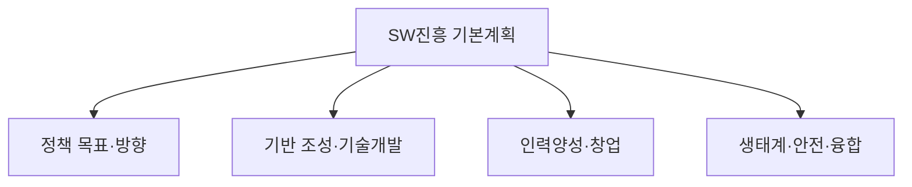

# 소프트웨어 진흥법 (시행 2023.10.19)

## 1. 개요

### 가. 정의·목적
> 소프트웨어 산업의 **기반 조성·진흥과 SW안전·생태계 육성**을 위한 법적 근거를 마련한 법률(구 소프트웨어산업진흥법 전부개정).

### 나. 필요성
- SW 중심 사회 대응, 공정 계약·SW안전·인력·생태계 기반 마련

## 2. 제5조 기본계획에 포함되어야 할 사항(2항)

| 구분 | 포함 사항(예) |
|---|---|
| **정책 방향** | SW진흥 정책 목표·추진방향 |
| **기반·기술** | 기술개발·표준화, 기반 조성 |
| **인력·창업** | 전문인력 양성, 창업·기업 육성 |
| **생태계** | SW 융합·이용 촉진, 유통·공정환경 |
| **안전·재원** | SW안전, 재원 조달·투자 |

## 3. 제30조 SW안전 확보 지침에 포함되어야 할 사항(2항)

| 구분 | 포함 사항 |
|---|---|
| **안전 기준·방법** | SW안전 확보 기준·절차 |
| **위험 분석·관리** | 위험 식별·평가·대응 |
| **점검·시험** | 안전성 점검·시험 방법 |
| **사고 대응** | 사고 예방·대응·복구 체계 |

> SW안전: SW 결함으로 인한 **사람의 생명·신체·재산 피해 방지**를 위한 안전 확보 활동.

## 4. 주요 제도(참고)

| 제도 | 내용 |
|---|---|
| **공정계약** | 과업 변경·적정 대가, 하도급 보호 |
| **SW영향평가** | 공공SW 사업의 민간시장 영향 평가 |
| **SW안전** | 안전 확보 지침·진단 |

## 5. 고려사항 및 시사점
- SW안전(자율주행·의료 등 임베디드) 중요성 증대
- 공정 계약·대가 산정(대가 가이드)과 연계
- SW 진흥·생태계 육성의 법적 기반

---

> **한 줄 요약**: 소프트웨어 진흥법은 SW 산업 진흥·안전의 법적 근거로, 제5조 기본계획에 정책방향·기반·인력·생태계·안전을, 제30조 SW안전 지침에 안전 기준·위험관리·점검·사고대응을 포함하도록 규정한다.
