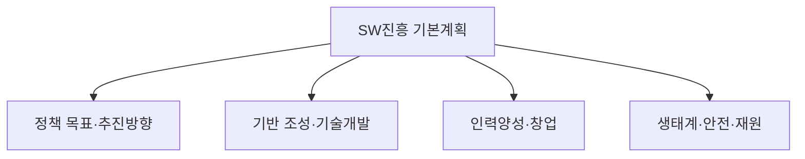

# 소프트웨어 진흥법 (시행 2023.10.19)

## 1. 개요

### 가. 정의·목적
> 소프트웨어 산업의 **기반 조성·진흥과 SW안전·생태계 육성**을 위한 법적 근거를 마련한 법률로, 구 소프트웨어산업진흥법을 전부개정(2020)하여 산업 진흥 중심에서 **가치·안전·생태계 중심**으로 패러다임을 전환했다.

소프트웨어 진흥법의 목적은 단순한 산업 육성을 넘어, SW가 사회 전 영역의 기반이 된 **SW 중심 사회**에서 SW의 가치를 정당하게 인정받고 안전하게 활용되는 환경을 만드는 데 있다. 과거 산업진흥법이 '산업의 양적 성장'에 초점을 맞췄다면, 개정법은 **공정한 계약·정당한 대가·SW안전·인력·생태계**라는 질적 기반을 법으로 못 박았다는 점에서 성격이 다르다.

### 나. 등장 배경 및 필요성
공공 SW 사업에서 과업 범위가 계약 후 무한정 늘어나고(과업 추가), 대가는 그대로여서 개발사가 부실화되는 관행이 오래 지속되었다. 또한 자율주행차·의료기기·스마트공장처럼 SW 결함이 곧 인명·재산 피해로 이어지는 영역이 급증하면서, SW를 '납품물'이 아니라 **안전이 보장되어야 할 사회 인프라**로 다룰 필요가 커졌다. 이런 배경에서 개정법은 대가 산정·과업 변경의 공정성 확보와 함께 **SW안전(SW Safety)** 이라는 개념을 처음으로 법제화했다.

## 2. 제5조 — 소프트웨어진흥 기본계획 포함사항

기본계획은 정부가 3년마다 수립하는 SW 진흥의 **최상위 로드맵**으로, 개별 시책이 흩어지지 않고 일관된 방향으로 정렬되도록 하는 장치다. 기본계획에 담기는 사항들은 크게 **방향 설정 → 기반 구축 → 사람 육성 → 생태계·안전 확보**의 흐름으로 이해할 수 있다. 먼저 정책 목표와 추진방향으로 큰 그림을 정하고, 이를 뒷받침할 기술개발·표준화 등 산업 기반을 조성한다. 그 위에서 SW를 실제로 만들 전문인력을 양성하고 창업·기업 성장을 지원하며, 마지막으로 SW의 이용·융합을 촉진하는 건강한 생태계와 SW안전, 그리고 이 모든 것을 실행할 재원 조달 계획을 담는다. 이 구조 덕분에 기본계획은 선언에 그치지 않고 실행·재정으로 연결된다.

| 구분 | 포함 사항(예) |
|---|---|
| **정책 방향** | SW진흥 정책 목표·추진방향 |
| **기반·기술** | 기술개발·표준화, 산업 기반 조성 |
| **인력·창업** | 전문인력 양성, 창업·기업 성장 지원 |
| **생태계** | SW 융합·이용 촉진, 유통·공정 환경 조성 |
| **안전·재원** | SW안전 확보, 재원 조달·투자 계획 |

## 3. 제30조 — SW안전 확보 지침 포함사항

SW안전은 정보보안(기밀성·무결성)과 구별되는 개념으로, **SW의 오작동·결함이 사람의 생명·신체·재산에 미치는 피해를 방지**하는 것을 목표로 한다. 예컨대 자율주행 제어 SW의 판단 오류나 의료기기 SW의 오작동은 해킹이 없어도 그 자체로 치명적이므로, 보안과 별개의 안전 관점 관리가 필요하다. 제30조는 정부가 이러한 SW안전 확보 지침을 마련하도록 하고, 그 지침이 **안전 기준 → 위험 관리 → 검증 → 사고 대응**의 안전공학 절차를 갖추도록 요구한다. 즉 무엇이 안전한지의 기준을 세우고(기준), 어떤 위험이 있는지 식별·평가하며(위험관리), 실제로 안전한지 시험·점검하고(검증), 그럼에도 사고가 나면 예방·복구할 체계(대응)를 두는 것이다.

| 구분 | 포함 사항 |
|---|---|
| **안전 기준·방법** | SW안전 확보의 기준·절차·방법 |
| **위험 분석·관리** | 안전 위험의 식별·평가·대응(경감) |
| **점검·시험** | 안전성 점검·시험·검증 방법 |
| **사고 대응** | 사고 예방·대응·복구 체계 |

> SW안전: SW 결함·오작동으로 인한 **사람의 생명·신체·재산 피해 방지**를 위한 안전 확보 활동으로, 정보보안과 구별된다.

## 4. 주요 제도(참고)

법의 진흥·안전 목표는 몇 가지 구체적 제도로 실현된다. **공정계약**은 과업 변경 시 적정 대가를 재산정하고 하도급 대금을 보호해 개발사의 부실화를 막고, **SW영향평가**는 공공이 직접 SW를 개발할 때 민간 시장을 침해하지 않는지 사전에 따져 민간 생태계를 보호한다. **SW안전 제도**는 앞서 본 확보 지침·진단을 통해 실제 현장에서 안전이 관리되도록 뒷받침한다. 이들은 각각 '개발사 보호–민간시장 보호–사회 안전'이라는 서로 다른 이해를 균형 있게 다룬다.

| 제도 | 내용 | 보호 대상 |
|---|---|---|
| **공정계약** | 과업 변경 시 적정 대가, 하도급 대금 보호 | 개발사·근로자 |
| **SW영향평가** | 공공 SW 사업의 민간시장 영향 사전 평가 | 민간 SW 시장 |
| **SW안전** | 안전 확보 지침·안전진단 | 이용자·사회 |

## 5. 고려사항 및 시사점(기술사 관점)
- **SW안전의 중요성 증대**: 자율주행·의료·스마트공장 등 임베디드·CPS 영역이 커질수록 SW안전은 선택이 아닌 필수가 되며, 기능안전(ISO 26262 등)과의 연계 설계가 요구된다.
- **정당한 대가 확보**: SW사업 대가산정 가이드와 연동해 과업심의위원회 운영으로 과업 변경의 공정성을 담보하는 것이 실효성의 관건이다.
- **생태계 관점**: 오픈소스·상용 SW의 이용 촉진과 공정 유통 환경 조성으로 산업 저변을 넓히며, 제도가 규제가 아닌 생태계 성장의 촉매가 되도록 운영해야 한다.
- **법·제도의 실행력**: 기본계획이 선언에 그치지 않으려면 재원·성과지표와 결합해 주기적으로 이행 점검하는 거버넌스가 필요하다.

---

> **한 줄 요약**: 소프트웨어 진흥법은 *SW 산업 진흥·안전·생태계의 법적 근거* 로, 제5조 기본계획에 정책방향·기반·인력·생태계·안전·재원을, 제30조 SW안전 지침에 안전 기준·위험관리·검증·사고대응을 담도록 하여 공정계약·영향평가와 함께 SW 중심 사회의 질적 기반을 세운다.
