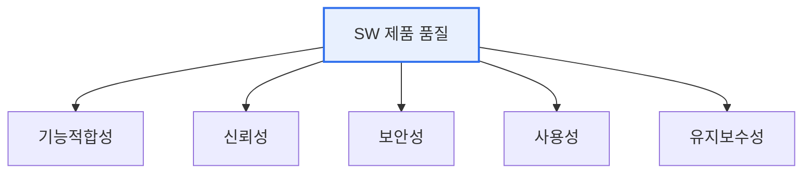

# 소프트웨어 품질인증(GS인증 등)

## 1. 개요

### 가. 정의
> **소프트웨어 품질인증**은 소프트웨어 제품의 품질을 **공인된 기준(ISO/IEC 25000 등)에 따라 시험·평가하여, 일정 수준 이상임을 제3자가 공식 인증**하는 제도다. 국내 대표 제도가 GS(Good Software) 인증이다.

품질인증이 필요한 근본 이유는 '**소프트웨어 품질은 눈에 안 보여, 객관적 신뢰의 근거가 필요하다**'는 데 있다. 하드웨어는 만져보고 성능을 확인할 수 있지만, 소프트웨어의 품질(기능 정확성·신뢰성·보안성)은 겉으로 드러나지 않는다. 구매자는 이 제품이 제대로 동작하는지, 안전한지 판단하기 어렵다. 품질인증은 이 정보 비대칭을 해소한다. 공인 시험기관(TTA 등)이 국제 표준 품질 모델에 따라 제품을 시험하고, 통과하면 인증 마크를 준다. 그러면 구매자는 인증을 신뢰의 근거로 삼아 안심하고 도입할 수 있고, 개발사는 품질을 객관적으로 입증해 경쟁력을 얻는다. 특히 국내 GS인증은 공공 조달 시 우대·수의계약 근거가 되어 실질적 시장 진입 효과가 크다. 즉 품질인증은 시장의 신뢰 기반이자 품질 향상의 유인이다.

### 나. 근거 표준
품질 평가의 기준은 국제표준 **ISO/IEC 25000(SQuaRE)** 계열의 제품 품질 모델이며, 기능적합성·성능효율성·호환성·사용성·신뢰성·보안성·유지보수성·이식성 등을 평가한다.

## 2. 품질 특성(ISO/IEC 25010)

| 품질 특성 | 내용 |
|---|---|
| **기능적합성** | 요구 기능의 완전·정확성 |
| **성능효율성** | 자원 대비 응답·처리 성능 |
| **호환성** | 타 시스템과 상호운용 |
| **사용성** | 학습·운용 용이성 |
| **신뢰성** | 결함·장애에 대한 안정성 |
| **보안성** | 데이터 보호·접근 통제 |
| **유지보수성** | 수정·확장 용이성 |
| **이식성** | 다른 환경 적응성 |

## 3. GS인증 절차와 등급

GS인증은 시험 신청 → 시험(기능·성능·보안 등 품질 특성 시험) → 결함 조치 → 인증 심의 → 인증서 발급 순으로 진행된다. 시험 결과에 따라 1등급·2등급을 부여한다. 인증받은 제품은 공공 조달에서 우대받는다.

| 절차 | 내용 |
|---|---|
| **시험 신청** | 제품·산출물 제출 |
| **품질 시험** | 표준 기준에 따른 시험·결함 도출 |
| **결함 조치** | 발견 결함 수정·재시험 |
| **인증 발급** | 심의 후 등급 부여·인증서 발급 |

## 4. 고려사항 및 시사점

1. **품질을 개발 초기부터 내재화**해야 한다. 인증은 최종 확인일 뿐, 통과하려면 요구공학·설계·테스트 전 과정에서 품질 특성을 고려해야 한다. 사후에 결함을 몰아 고치면 비용이 커진다.
2. **공공시장 진입의 실질적 열쇠**다. 국내에서 GS인증은 공공 조달 우대·수의계약 근거가 되어, 중소 SW기업의 시장 진입에 중요한 발판이 된다.
3. **품질과 보안·안전을 통합**하는 방향이다. 소프트웨어가 사회 전반에 쓰이며 SW안전·보안(SBOM·시큐어코딩)이 품질의 핵심 요소로 부상해, 품질인증도 이를 반영해 확대되고 있다. [[software-safety-analysis]]

---

> **한 줄 요약**: 소프트웨어 품질인증(GS인증)은 *ISO/IEC 25000 기준으로 제품 품질을 제3자가 시험·인증* 하는 제도로, 정보 비대칭을 해소해 시장 신뢰를 제공하고 공공 조달 우대의 근거가 되며, 품질을 개발 전 과정에 내재화하는 것이 관건이다.
