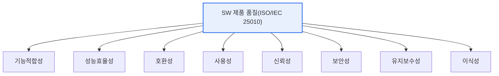
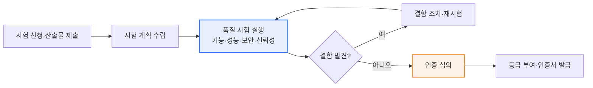

# 소프트웨어 품질인증(GS인증)

## 1. 개요

### 가. 정의
> **소프트웨어 품질인증**은 소프트웨어 제품의 품질을 **공인된 국제·국가 표준(ISO/IEC 25000 계열 등)에 따라 제3자 시험기관이 시험·평가하여, 일정 수준 이상임을 공식적으로 인증**하는 제도다. 국내 대표 제도가 **GS(Good Software) 인증**으로, 「소프트웨어 진흥법」에 근거해 공인 시험기관(TTA 등)이 시험하고 인증한다.

품질인증이 필요한 근본 이유는 '**소프트웨어 품질은 눈에 보이지 않아, 객관적 신뢰의 근거가 별도로 필요하다**'는 데 있다. 하드웨어는 손으로 만지고 규격서로 성능을 대조해 확인할 수 있지만, 소프트웨어의 품질—기능이 요구대로 정확히 동작하는지, 부하에서도 견디는지, 보안 취약점은 없는지—은 겉으로 드러나지 않는다. 구매자는 소스코드를 받아도 그것이 제대로 작동하는지, 안전한지를 판별하기 어렵다. 이 **정보 비대칭(information asymmetry)** 은 시장 실패로 이어진다. 품질을 입증할 방법이 없으면 구매자는 낮은 가격만 보고 고르게 되고, 품질에 투자한 좋은 제품이 오히려 도태되는 '레몬 시장' 문제가 생긴다.

품질인증은 이 정보 비대칭을 해소하는 **신호(signaling) 장치**다. 이해관계가 없는 제3자 시험기관이 국제 표준 품질 모델에 따라 제품을 객관적으로 시험하고, 통과하면 인증 마크를 부여한다. 그러면 구매자는 인증을 신뢰의 근거로 삼아 안심하고 도입할 수 있고, 개발사는 품질을 객관적으로 입증해 경쟁력을 얻는다. 특히 국내 GS인증은 **공공 조달 시 수의계약 근거·우선구매 대상**이 되어 실질적인 시장 진입 효과가 크다. 즉 품질인증은 시장의 신뢰 기반이자, 개발사가 품질에 투자하도록 만드는 유인 구조다.

### 나. 등장 배경과 필요성
품질인증 제도가 발전한 배경에는 세 흐름이 있다. 첫째, **소프트웨어의 사회적 파급력 확대**다. 금융·의료·교통·국방 등 실패가 곧 인명·재산 피해로 이어지는 영역까지 소프트웨어가 파고들면서, '만든 사람의 주장'이 아니라 '독립적 검증'을 요구하는 목소리가 커졌다. 둘째, **품질 평가의 국제 표준화**다. ISO/IEC 9126을 계승한 25000 시리즈(SQuaRE)가 품질을 재는 공통의 언어와 척도를 제공하면서, 나라와 기업을 넘어 통용되는 인증이 가능해졌다. 셋째, **공공 부문의 마중물 정책**이다. 국내에서는 GS인증을 공공 조달 우대와 연계해, 중소 SW기업이 품질에 투자할 실질적 동기를 제공했다.

### 다. 근거 표준
품질 평가의 기준은 국제표준 **ISO/IEC 25000(SQuaRE, Systems and software Quality Requirements and Evaluation)** 계열이다. 이 중 품질 모델을 정의한 **ISO/IEC 25010** 이 8개 품질 특성을, 평가 프로세스를 정의한 **ISO/IEC 25040** 이 시험 절차를 규정하며, GS인증의 시험은 이들을 국내 실정에 맞춰 적용한 시험 기준에 따라 수행된다.

## 2. 품질 모델 — ISO/IEC 25010의 8대 품질 특성

### 가. 품질 특성 전체 구조

```mermaid
flowchart TB
  Q["SW 제품 품질(ISO/IEC 25010)"] --> F["기능적합성"]
  Q --> P["성능효율성"]
  Q --> C["호환성"]
  Q --> U["사용성"]
  Q --> R["신뢰성"]
  Q --> S["보안성"]
  Q --> M["유지보수성"]
  Q --> T["이식성"]
  style Q fill:#e8f0fe,stroke:#2f6fed,stroke-width:2px
```

ISO/IEC 25010은 제품 품질을 위 8개의 상위 특성으로 나누고, 각 특성을 다시 하위 부특성(sub-characteristic)으로 세분한다. 예컨대 기능적합성은 완전성·정확성·적절성으로, 신뢰성은 성숙성·가용성·결함허용성·복구성으로, 보안성은 기밀성·무결성·부인방지·책임추적성·인증성으로 쪼개진다. 이렇게 계층화하는 이유는 '품질이 좋다'는 막연한 판단을 **측정 가능한 지표로 환원**하기 위해서다. 시험기관은 각 부특성마다 시험 항목과 합격 기준을 정의하고, 이를 통과해야 해당 특성을 만족한 것으로 본다.

여기서 유의할 점은 품질 특성 사이에 **상충(trade-off)** 이 존재한다는 것이다. 보안성을 높이려 암호화·인증 단계를 강화하면 성능효율성과 사용성이 떨어질 수 있고, 이식성을 높이려 추상화 계층을 두면 성능이 희생될 수 있다. 따라서 품질인증은 '모든 특성을 최대화'하는 것이 아니라, 제품의 용도에 맞춰 어떤 특성을 우선할지 요구사항 단계에서 정하고 그 기준의 달성을 검증하는 활동이다.

### 나. 품질 시험의 프로세스 아키텍처

```mermaid
flowchart LR
  A["시험 신청·산출물 제출"] --> B["시험 계획 수립"]
  B --> C["품질 시험 실행<br/>기능·성능·보안·신뢰성"]
  C --> D{"결함 발견?"}
  D -->|예| E["결함 조치·재시험"]
  E --> C
  D -->|아니오| F["인증 심의"]
  F --> G["등급 부여·인증서 발급"]
  style C fill:#e8f0fe,stroke:#2f6fed,stroke-width:2px
  style F fill:#fef3e8,stroke:#ed8f2f,stroke-width:2px
```

이 다이어그램은 GS인증이 단발성 검사가 아니라 **결함 조치를 반복하는 개선 루프**임을 보여준다. 핵심은 가운데의 '품질 시험 실행'과 '결함 조치·재시험'이 이루는 순환이다. 시험에서 결함이 나오면 개발사가 수정하고 다시 시험받는 과정을 결함이 기준 이하로 줄 때까지 반복한다. 즉 인증의 실질적 가치는 '통과 도장' 자체보다, 이 반복 과정에서 제품 품질이 실제로 향상된다는 데 있다. 오른쪽의 인증 심의 단계에서는 시험 결과의 타당성과 재현성을 심의위원회가 검토해 등급을 확정한다.

각 품질 특성별 시험은 서로 다른 기법을 쓴다. 기능적합성은 요구사항 기반 블랙박스 테스트로, 성능효율성은 부하·스트레스 테스트로 응답시간과 처리량을 측정하며, 보안성은 알려진 취약점 점검과 접근통제 시험으로, 사용성은 시나리오 기반 사용자 시험으로 평가한다. 이처럼 특성마다 검증 방법이 다르기 때문에, 품질인증 시험은 다양한 테스트 역량을 종합적으로 요구한다.

### 다. 품질 특성별 세부 내용
아래 표는 8대 특성을 요약한 것이며, 그 의미와 시험상의 함의는 앞 문단들에서 서술한 바를 보조한다.

| 품질 특성 | 내용 | 대표 시험 방법 |
|---|---|---|
| **기능적합성** | 요구 기능의 완전·정확·적절성 | 요구사항 기반 블랙박스 테스트 |
| **성능효율성** | 자원 대비 응답·처리·용량 성능 | 부하·스트레스 테스트 |
| **호환성** | 타 시스템과 공존·상호운용 | 상호운용 시험 |
| **사용성** | 학습·운용·접근 용이성 | 사용자 시나리오 시험 |
| **신뢰성** | 성숙성·가용성·결함허용·복구성 | 장기 가동·장애주입 시험 |
| **보안성** | 기밀성·무결성·인증·책임추적 | 취약점 점검·접근통제 시험 |
| **유지보수성** | 모듈성·재사용·분석·수정 용이 | 정적 분석·코드 품질 측정 |
| **이식성** | 다른 환경으로의 적응·설치·대체 | 다중 환경 설치·이식 시험 |

## 3. GS인증 등급과 실무 절차

GS인증은 시험 결과에 따라 **1등급과 2등급**을 부여한다. 통상 1등급은 국제 표준 기준을 충족하고 실사용에 적합한 완성도를 갖춘 제품에, 2등급은 기본 요건은 충족하나 완성도·적용 범위 면에서 상대적으로 낮은 수준에 부여된다(구체적 부여 기준·명칭은 제도 개정에 따라 달라질 수 있으므로 최신 시험기관 공고를 확인해야 한다). 인증받은 제품은 유효기간 동안 공공 조달에서 우대받으며, 기능이 크게 변경되면 변경 시험을 통해 인증을 유지한다.

절차 관점에서 중요한 실무 포인트는 **산출물 준비의 완결성**이다. 시험 신청 시 제품 실행 파일뿐 아니라 요구사항 명세, 설계서, 사용자 매뉴얼, 시험 케이스 등 개발 산출물을 함께 제출해야 하는데, 이 산출물이 부실하면 시험 자체가 지연된다. 따라서 인증을 목표로 한다면 개발 초기부터 산출물을 체계적으로 관리해야 한다.

| 절차 | 내용 | 실무 유의점 |
|---|---|---|
| **시험 신청** | 제품·개발 산출물 제출 | 산출물 정합성·완결성 확보 |
| **시험 계획·실행** | 표준 기준에 따른 특성별 시험 | 시험 환경 재현성 확보 |
| **결함 조치** | 발견 결함 수정·재시험 반복 | 결함 원인 근본 조치, 회귀 방지 |
| **인증 심의·발급** | 심의 후 등급 부여·인증서 발급 | 유효기간·변경 시험 관리 |

## 4. 유사 인증과의 비교

품질인증은 GS인증 하나가 아니라 여러 유형이 목적에 따라 공존한다. 이들을 구별하면 어떤 인증이 어떤 상황에 필요한지 판단할 수 있다.

| 구분 | 대상 | 핵심 관점 | 예 |
|---|---|---|---|
| **제품 품질인증** | 완성된 SW 제품 | 제품이 기준을 만족하는가 | GS인증(ISO/IEC 25000) |
| **프로세스 성숙도** | 개발 조직·프로세스 | 잘 만드는 역량이 있는가 | CMMI, ISO/IEC 15504(SPICE) |
| **정보보호 인증** | 보안 관리체계 | 보안을 체계적으로 관리하는가 | ISMS-P, ISO/IEC 27001 |

핵심 차이는 **'무엇을 보증하느냐'** 에 있다. GS인증 같은 제품 인증은 '이 제품이 지금 기준을 만족한다'는 결과를 보증하고, CMMI 같은 프로세스 인증은 '이 조직은 품질 좋은 제품을 반복해서 만들 역량이 있다'는 과정을 보증한다. 실무적 함의도 다르다. 발주처가 특정 납품 제품의 품질을 확인하려면 제품 인증을, 장기 위탁 개발 파트너의 신뢰도를 보려면 프로세스 인증을 요구하는 식이다. 성숙한 발주 조직은 이 둘을 결합해, 프로세스 성숙도로 파트너를 고르고 제품 인증으로 산출물을 검증한다.

구체적 사례로, 국내 공공 정보화 사업에서는 상용 SW 도입 시 GS인증 제품을 우대하고, 대규모 SI 사업 참여 자격에서는 조직의 프로세스 역량(품질경영·보안 인증)을 요구하는 이원적 접근이 흔하다. 이는 '제품의 품질'과 '조직의 역량'을 서로 다른 렌즈로 검증하려는 것이다.

## 5. 심화 — 품질인증의 확장 동향

전통적 품질인증은 완성된 제품을 사후에 시험하는 방식이었으나, 소프트웨어 개발·유통 방식이 바뀌며 인증의 대상과 방법도 진화하고 있다.

첫째, **보안·안전의 품질 특성 편입 강화**다. 소프트웨어가 사회 기반이 되면서 보안성과 SW안전이 기능만큼 중요한 품질 요소로 부상했다. 특히 오픈소스 활용이 보편화되면서 구성요소의 출처와 취약점을 추적하는 **SBOM(Software Bill of Materials)**, 개발 단계에서 취약점을 차단하는 **시큐어코딩**이 품질 검증의 핵심 항목으로 들어오고 있다. 미국의 행정명령·EU의 사이버복원력법(CRA) 등 규제가 SBOM을 의무화하는 흐름은, 앞으로 품질인증이 공급망 보안까지 아우르게 될 것임을 시사한다. [[software-safety-analysis]]

둘째, **개발 방식 변화에 대한 대응**이다. 애자일·DevOps로 릴리스 주기가 수 주에서 수 일로 짧아지면서, '한 시점의 제품'을 시험하는 전통 인증과 '끊임없이 변하는 제품'의 현실 사이에 간극이 생겼다. 이에 지속적 통합/배포 파이프라인에 품질 게이트를 심어 자동화된 품질 측정을 상시 수행하고, 그 결과를 인증과 연계하려는 논의가 이어진다. 정적 분석·자동 테스트 커버리지·취약점 스캔을 파이프라인에 내장하는 것이 대표적이다.

셋째, **AI·데이터 기반 SW로의 확장**이다. 학습 데이터에 따라 동작이 달라지는 AI 소프트웨어는 전통적 기능 시험만으로 품질을 보증하기 어렵다. 이에 ISO/IEC 25000 계열을 보완해 AI의 신뢰성·공정성·설명가능성을 다루는 표준(예: ISO/IEC TR 24028 등 AI 신뢰성 계열)이 정비되고 있으며, AI 관리체계 표준(ISO/IEC 42001)과 연계한 품질·거버넌스 인증이 새로운 축으로 떠오르고 있다. [[iso-42001-ai-management-system]]

## 6. 고려사항 및 시사점

기술사 관점에서 품질인증은 '통과 여부'가 아니라 '품질을 조직에 어떻게 내재화하는가'라는 관점에서 접근해야 한다.

1. **품질의 개발 초기 내재화(Shift-left).** 인증은 최종 확인일 뿐, 통과하려면 요구공학·설계·구현·테스트 전 과정에서 품질 특성을 고려해야 한다. 결함을 개발 후반이나 인증 직전에 몰아 고치면 조치 비용이 기하급수적으로 커진다(요구 단계 결함 조치 비용을 1로 볼 때 운영 단계는 수십~수백 배로 알려져 있다). 품질은 검사로 얻는 것이 아니라 만들어 넣는 것이다.
2. **공공시장 진입의 전략적 지렛대.** 국내에서 GS인증은 공공 조달 우대·수의계약 근거가 되어, 중소 SW기업에게는 시장 진입의 실질적 열쇠다. 따라서 인증은 기술 활동이자 사업 전략이며, 타깃 시장(공공/민간)과 조달 요건을 고려해 인증 획득 시점과 등급 목표를 사업 계획에 반영해야 한다.
3. **품질·보안·안전의 통합 관점.** 품질인증이 SBOM·시큐어코딩·SW안전으로 확장되는 만큼, 기능 품질과 보안·안전을 분리된 활동이 아니라 하나의 품질 체계로 통합 설계해야 한다. 보안을 나중에 덧붙이면 비용도 크고 효과도 낮다.
4. **트레이드오프의 명시적 관리.** 품질 특성은 서로 상충하므로(보안↔성능·사용성, 이식성↔성능), 제품 용도에 맞춰 우선순위를 정하고 그 근거를 문서화해야 한다. '모든 특성 최고 등급'을 목표로 삼는 것은 자원 낭비이자 실패의 지름길이다.
5. **인증의 지속성 확보.** 애자일·DevOps 환경에서는 한 번의 인증이 곧 낡는다. CI/CD 파이프라인에 품질 게이트(정적 분석·커버리지·취약점 스캔)를 내장해 품질을 상시 측정하고, 변경 시 재인증·변경 시험을 관리하는 지속적 품질 체계를 갖춰야 인증의 가치가 유지된다.

## 참고자료
- ISO/IEC 25010:2011(제품 품질 모델), ISO/IEC 25040(평가 프로세스) — SQuaRE 시리즈
- TTA 소프트웨어시험인증연구소 GS인증 안내: https://www.tta.or.kr/
- 「소프트웨어 진흥법」 — 품질인증·공공 조달 우대 근거
- ISO/IEC 42001:2023 — AI 관리시스템 표준

---

> **한 줄 요약**: 소프트웨어 품질인증(GS인증)은 *ISO/IEC 25000 기준으로 제품 품질을 제3자가 시험·인증* 해 정보 비대칭을 해소하고 공공 조달 우대의 근거를 제공하는 제도로, 품질을 개발 전 과정에 내재화하고 보안·SBOM·AI 신뢰성까지 아우르는 지속적 품질 체계로 확장하는 것이 관건이다.
