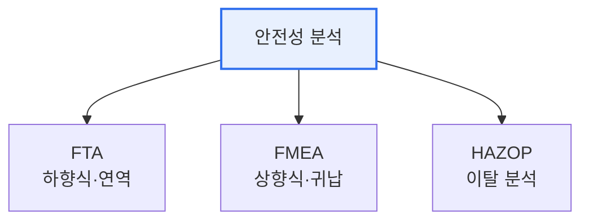

# 소프트웨어 안전성 분석(Software Safety Analysis)

## 1. 개요

### 가. 정의 및 필요성
> 소프트웨어의 **잠재적 위험(Hazard)을 식별·분석하여 사고를 예방**하는 활동. 자율주행·의료·항공·원전 등 안전필수(Safety-Critical) 시스템에서 필수적이다.

소프트웨어가 물리 세계를 제어하면서 그 오류가 **인명·재산 피해로 직결**되는 시대가 되었다. 자동차 제동, 의료기기, 항공 제어 소프트웨어의 결함은 곧 사고다. 따라서 결함을 사후에 찾는 테스트를 넘어, 개발 초기에 위험 요소를 체계적으로 예측·제거하는 안전성 분석이 필요하다. 분석은 접근 방향에 따라 하향식(결과→원인)과 상향식(원인→결과)으로 나뉜다.

## 2. 분석 기법

### 가. FTA(Fault Tree Analysis)
> 정상사건(Top Event, 사고)에서 출발해 그 원인을 **논리게이트(AND·OR)로 하향 전개**하는 연역적 분석. "이 사고가 나려면 무엇이 결합돼야 하는가"를 추적한다.
- 특징: 하향식(결과→원인), 정성·정량(발생확률) 분석, 위험 경로 파악

### 나. FMEA(Failure Mode and Effects Analysis)
> 각 구성요소의 **고장 유형(Failure Mode)을 나열하고 그 영향을 평가**하는 귀납적 분석. 위험 우선순위(RPN=심각도×발생도×검출도)로 대응 순위를 정한다.
- 특징: 상향식(원인→결과), 요소별 체계적 점검, 예방 중심

### 다. HAZOP(Hazard and Operability Analysis)
> **가이드워드(No·More·Less·Reverse 등)를 설계 의도에 대입**해 정상에서 벗어난 이탈(Deviation)과 그 위험을 도출하는 정성 분석. 공정·운용의 위험을 팀 워크숍으로 발굴한다.
- 특징: 이탈 기반, 다분야 전문가 협업, 운용성까지 점검

## 3. 기법 비교

| 구분 | FTA | FMEA | HAZOP |
|---|---|---|---|
| **방향** | 하향식(연역) | 상향식(귀납) | 이탈 분석 |
| **출발점** | 사고(Top Event) | 구성요소 고장 | 설계 의도 |
| **핵심** | 논리게이트 경로 | RPN 우선순위 | 가이드워드 |

## 4. 시사점
- 기법을 **상호 보완적으로 병행**(FTA로 경로, FMEA로 요소, HAZOP으로 운용)
- 안전 표준(ISO 26262·IEC 61508)과 연계, 개발 초기부터 적용
- 안전성과 보안(Security)의 융합(자율주행·IoT) 고려

---

> **한 줄 요약**: 소프트웨어 안전성 분석은 안전필수 시스템의 위험을 예방하며, *FTA(하향식 경로)·FMEA(상향식 요소·RPN)·HAZOP(가이드워드 이탈)* 를 상호 보완적으로 활용한다.
