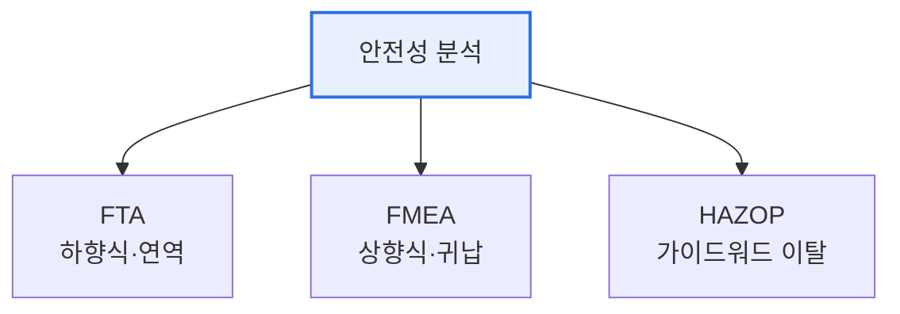

# 소프트웨어 안전성 분석(Software Safety Analysis)

## 1. 개요

### 가. 정의 및 필요성
> 소프트웨어에 내재한 **잠재적 위험(Hazard)을 사전에 식별·분석하여 사고를 예방**하는 활동으로, 자율주행·의료기기·항공·원전 등 오류가 곧 인명·재산 피해로 이어지는 안전필수(Safety-Critical) 시스템에서 필수적이다.

소프트웨어 안전성 분석이 중요해진 근본 배경은, 소프트웨어가 이제 화면 속 정보 처리를 넘어 **물리 세계를 직접 제어**한다는 데 있다. 자동차의 제동, 인공호흡기, 항공기 제어 소프트웨어의 결함은 화면 오류가 아니라 곧바로 사고와 인명 피해가 된다. 따라서 결함을 만든 뒤 테스트로 찾는 사후적 접근만으로는 부족하고, 설계 초기부터 "무엇이 잘못될 수 있는가"를 체계적으로 예측·제거하는 예방적 분석이 필요하다. 분석 기법은 접근 방향에 따라 결과에서 원인을 거슬러 찾는 **하향식(연역)** 과, 원인에서 결과를 따져가는 **상향식(귀납)** 으로 나뉜다.

### 나. 안전성과 보안의 융합
최근 자율주행·IoT처럼 물리 제어와 네트워크 연결이 결합되면서, 오작동(Safety)과 해킹(Security)이 함께 사고를 유발한다. 그래서 안전성 분석과 보안 분석을 통합적으로 수행하는 경향이 강해지고 있다.

## 2. 분석 기법 개관

### 가. FTA(Fault Tree Analysis)
> 정상사건(Top Event, 우려하는 사고)에서 출발해 그 원인을 **논리게이트(AND·OR)로 하향 전개**하는 연역적 분석이다. "이 사고가 일어나려면 어떤 하위 원인들이 어떻게 결합되어야 하는가"를 나무 형태로 추적한다.

FTA의 강점은 여러 원인이 복합적으로 얽혀 사고를 일으키는 경로를 명확히 드러내고, 각 원인의 발생확률을 넣으면 사고 확률을 정량적으로 계산할 수 있다는 점이다. 하나의 특정 사고(Top Event)에 집중해 분석한다.

### 나. FMEA(Failure Mode and Effects Analysis)
> 시스템을 구성하는 각 요소의 **고장 유형(Failure Mode)을 빠짐없이 나열하고 그 영향을 평가**하는 귀납적 분석이다. 각 고장의 심각도·발생도·검출도를 곱한 **위험 우선순위(RPN)** 로 대응 순서를 정한다.

FMEA는 부품 하나하나가 어떻게 고장 날 수 있고 그것이 시스템에 어떤 영향을 주는지 체계적으로 점검하므로, 예방 중심의 상향식 접근이다. RPN이 높은 고장부터 우선 대응한다.

### 다. HAZOP(Hazard and Operability Analysis)
> 설계 의도에 **가이드워드(No·More·Less·Reverse 등)를 대입**해 정상에서 벗어난 이탈(Deviation)과 그로 인한 위험을 도출하는 정성 분석이다. "유량이 없다면(No Flow), 많다면(More Flow) 무슨 일이 생기는가"를 다분야 전문가가 워크숍으로 발굴한다.

HAZOP은 원래 화학공정에서 출발했으나 소프트웨어·시스템 운용의 위험 분석에도 쓰인다. 운용성(Operability)까지 함께 점검하는 것이 특징이다.

## 3. 기법 비교

| 구분 | FTA | FMEA | HAZOP |
|---|---|---|---|
| **방향** | 하향식(연역) | 상향식(귀납) | 이탈 분석 |
| **출발점** | 사고(Top Event) | 구성요소 고장 | 설계 의도 |
| **핵심 도구** | 논리게이트·확률 | RPN 우선순위 | 가이드워드 |
| **강점** | 사고 경로·확률 | 요소별 예방 | 운용 이탈 발굴 |

## 4. 고려사항 및 시사점

1. **기법을 상호 보완적으로 병행**한다. FTA로 특정 사고의 경로를, FMEA로 요소별 고장을, HAZOP으로 운용 이탈을 분석하면 서로 다른 각도에서 위험을 포괄적으로 발굴할 수 있다.
2. **안전 표준과 연계**한다. 자동차의 ISO 26262, 산업 전반의 IEC 61508 등 기능안전 표준은 이런 분석 기법의 적용을 요구하며, 개발 초기부터 통합해야 한다.
3. **개발 초기 적용이 핵심**이다. 위험은 설계 단계에서 발견·제거할수록 비용이 적고 효과가 크므로, 요구·설계 단계부터 안전성 분석을 수행한다.

---

> **한 줄 요약**: 소프트웨어 안전성 분석은 안전필수 시스템의 위험을 사전 예방하며, *FTA(하향식 사고경로)·FMEA(상향식 요소고장·RPN)·HAZOP(가이드워드 이탈)* 를 상호 보완적으로 활용하고 기능안전 표준과 연계해 설계 초기부터 적용한다.
